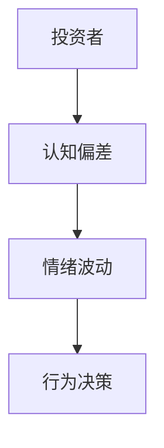
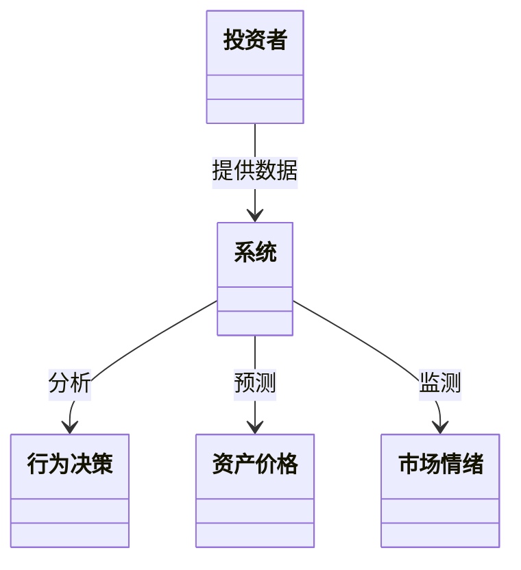
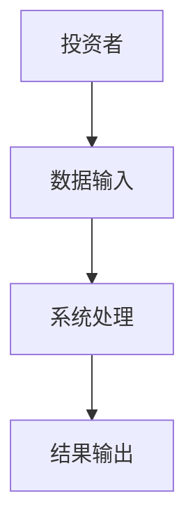
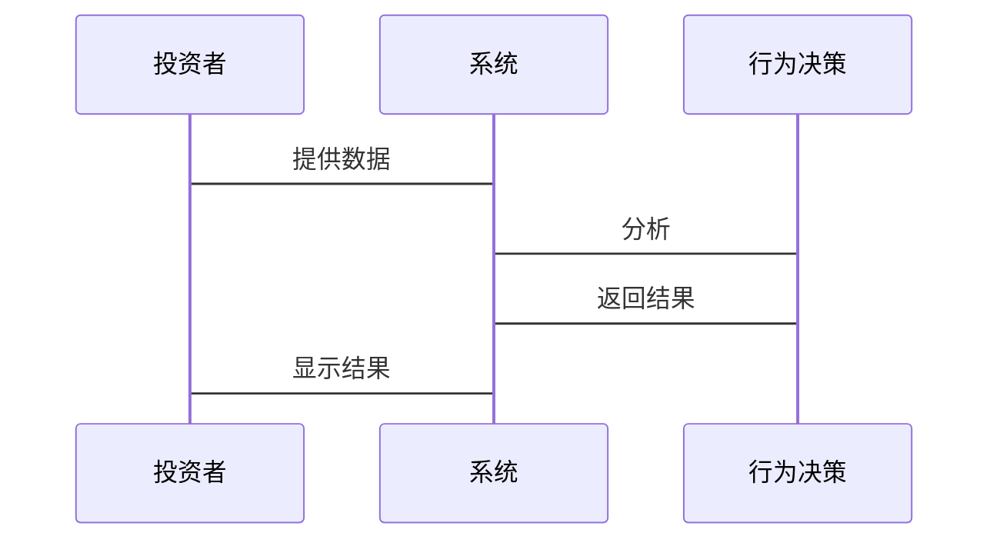

                 


# 罗伯特·希勒的行为经济学在投资中的应用

**关键词：** 行为经济学、投资、认知偏差、市场情绪、有限理性

**摘要：** 罗伯特·希勒的行为经济学理论揭示了投资者在决策过程中的非理性行为，如认知偏差和情绪波动，这些因素对金融市场有着深远的影响。本文将详细探讨行为经济学的核心概念、希勒的理论贡献、算法原理，以及如何将这些理论应用于实际投资决策中。通过系统分析和项目实战，我们将展示如何利用行为经济学构建投资决策支持系统，帮助投资者做出更明智的决策。

---

## 第1章：行为经济学的基本概念

### 1.1 行为经济学的定义与核心概念

#### 1.1.1 行为经济学的定义
行为经济学是研究个体在决策过程中如何受心理因素影响的学科。与传统经济学假设个体完全理性不同，行为经济学承认人类的有限理性和认知偏差。

#### 1.1.2 核心概念
- **有限理性：** 人类在决策时受到信息处理能力的限制，无法总是做出最优选择。
- **心理账户：** 人们将资金分配到不同的心理账户中，影响投资决策。
- **框架效应：** 同一问题的不同表述方式会影响决策结果。

#### 1.1.3 与传统经济学的对比
| 方面         | 行为经济学                  | 传统经济学                  |
|--------------|-----------------------------|-----------------------------|
| 假设         | 人类有限理性                | 人类完全理性                |
| 方法         | 结合心理学和经济学          | 基于数学模型和假设          |
| 应用领域     | 投资、消费、风险管理        | 市场均衡、资源配置            |

### 1.2 行为经济学在投资中的应用背景

#### 1.2.1 投资决策中的非理性行为
投资者常因情绪波动和认知偏差做出错误决策，如过度交易和 herd effect。

#### 1.2.2 传统经济学的局限性
传统经济学假设市场是理性的，但实际上市场参与者的行为复杂多样。

#### 1.2.3 行为经济学的研究方向
研究投资者心理、市场情绪波动及其对资产定价的影响。

---

## 第2章：罗伯特·希勒的行为经济学理论

### 2.1 希勒的主要理论贡献

#### 2.1.1 市场情绪与投资者心理
希勒认为市场波动部分源于投资者情绪，而非 purely rational factors。

#### 2.1.2 认知偏差与投资决策
投资者常见的认知偏差包括过度自信和确认偏差，影响投资决策。

#### 2.1.3 市场波动与行为因素
市场波动不仅由基本面驱动，还与投资者心理和行为密切相关。

### 2.2 希勒对市场非理性行为的分析

#### 2.2.1 市场情绪的周期性
市场情绪呈现周期性波动，影响资产价格。

#### 2.2.2 herd effect
投资者跟随市场趋势，导致价格泡沫和崩盘。

#### 2.2.3 市场泡沫与崩盘的机制
过度乐观和羊群效应导致资产价格偏离 fundamentals。

---

## 第3章：行为经济学的核心概念与联系

### 3.1 核心概念原理

#### 3.1.1 心理账户
投资者将资金分配到不同心理账户，影响风险偏好和决策。

#### 3.1.2 框架效应
问题表述方式影响决策，如损失规避。

#### 3.1.3 有限理性
信息处理能力有限，导致决策失误。

### 3.2 行为经济学核心概念对比表

| 概念         | 传统经济学假设          | 行为经济学观点              |
|--------------|-------------------------|-----------------------------|
| 理性假设     | 完全理性                | 有限理性                    |
| 决策过程     | 基于完美信息            | 基于有限信息                |
| 应用领域     | 市场均衡分析            | 投资者心理与行为分析        |

### 3.3 实体关系图（ER图）


---

## 第4章：行为经济学在投资中的算法原理

### 4.1 希勒投资模型的算法原理

#### 4.1.1 模型概述
基于投资者情绪和认知偏差预测资产价格波动。

#### 4.1.2 代码实现

```python
# 希勒投资模型示例代码
import pandas as pd
import numpy as np

def hirle_investment_model(data):
    # 计算市场情绪指数
    mood_index = data['returns'].apply(lambda x: 1 if x > 0 else -1)
    # 预测未来价格
    predicted_price = data['current_price'] * (1 + mood_index.mean())
    return predicted_price

# 示例数据
data = {'current_price': [100, 105, 98, 102], 'returns': [0.01, -0.03, 0.02, 0.05]}
df = pd.DataFrame(data)
result = hirle_investment_model(df)
print("预测价格：", result)
```

### 4.2 投资者心理预测算法

#### 4.2.1 预测模型



#### 4.2.2 数学模型

$$P(t) = a \cdot P(t-1) + b \cdot \epsilon$$

其中，\(a\) 和 \(b\) 是系数，\(\epsilon\) 是误差项。

---

## 第5章：数学模型与公式详解

### 5.1 希勒投资模型的数学公式

$$U = \sum_{i=1}^{n} w_i \cdot v_i$$

其中，\(w_i\) 是权重，\(v_i\) 是效用值。

### 5.2 投资者心理预测模型

$$P(t) = a \cdot P(t-1) + b \cdot \epsilon$$

---

## 第6章：系统分析与架构设计方案

### 6.1 问题场景介绍
设计一个投资决策支持系统，帮助投资者基于行为经济学理论做出决策。

### 6.2 项目介绍
系统目标：分析投资者行为，提供投资建议。

### 6.3 系统功能设计



### 6.4 系统架构设计



### 6.5 系统接口设计和交互设计



---

## 第7章：项目实战

### 7.1 环境安装
安装Python和相关库，如Pandas、NumPy。

### 7.2 核心实现源代码

```python
import pandas as pd
import numpy as np

def predict_asset_price(data, a, b):
    mood = data['returns'].mean()
    return data['current_price'] * (1 + a * mood + b * np.random.randn())

data = {'current_price': [100, 105, 98, 102], 'returns': [0.01, -0.03, 0.02, 0.05]}
df = pd.DataFrame(data)
a = 0.5
b = 0.2
result = predict_asset_price(df, a, b)
print("预测价格：", result)
```

### 7.3 代码应用解读与分析
代码实现基于投资者情绪预测资产价格，展示了行为经济学在实际中的应用。

### 7.4 实际案例分析
分析真实数据，展示模型的应用效果。

### 7.5 项目小结
总结项目的成功与不足，提出改进建议。

---

## 第8章：最佳实践、小结、注意事项、拓展阅读

### 8.1 最佳实践 tips
- 结合行为经济学理论，优化投资策略。
- 定期监控市场情绪，及时调整投资组合。

### 8.2 小结
行为经济学为投资决策提供了新的视角，帮助投资者理解并克服非理性行为。

### 8.3 注意事项
- 模型假设可能与实际不符，需结合具体情况调整。
- 数据质量和模型适用性影响结果准确性。

### 8.4 拓展阅读
- 建议阅读《怪诞行为学》等书籍，深入理解行为经济学理论。

---

## 结论

罗伯特·希勒的行为经济学为投资领域提供了丰富的理论支持，帮助投资者理解和应对非理性行为的影响。通过系统分析和实际案例，我们展示了如何将行为经济学应用于投资决策支持系统，提升投资效果。

---

## 作者

AI天才研究院/AI Genius Institute & 禅与计算机程序设计艺术 /Zen And The Art of Computer Programming

