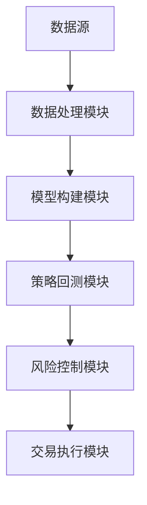

                 

# 罗伯特·阿诺特的系统化价值投资：算法与人工智能的应用

> 关键词：系统化价值投资，算法，人工智能，投资策略，机器学习，数学模型，系统架构

> 摘要：本文探讨了系统化价值投资的方法论，重点分析了算法与人工智能在投资中的应用。通过介绍系统化投资的核心概念、算法交易的基础、机器学习在投资中的应用，以及系统化投资策略的设计与实现，本文为读者提供了一套完整的系统化价值投资解决方案。文章结合数学模型和实际案例，详细讲解了如何利用算法和人工智能技术提升投资决策的效率和准确性。

---

## 第一部分: 系统化价值投资概述

### 第1章: 系统化价值投资的背景与概念

#### 1.1 价值投资的起源与发展

价值投资是一种以基本面分析为基础的投资策略，旨在通过分析公司的财务状况、行业地位、竞争优势等因素，寻找被市场低估的投资标的。系统化价值投资则是在传统价值投资的基础上，引入算法和人工智能技术，将投资决策过程系统化、量化和自动化。

#### 1.2 系统化投资的必要性

传统价值投资依赖于个人经验和主观判断，存在主观性较强、效率较低、难以大规模应用等问题。随着市场的复杂化和数据的爆炸式增长，传统方法已难以满足现代投资的需求。系统化投资通过引入算法和人工智能技术，能够提高投资决策的效率和准确性，降低人为错误的影响。

#### 1.3 系统化价值投资的核心要素

系统化价值投资的核心要素包括：  
1. 数据驱动：利用大数据技术获取和分析市场数据。  
2. 算法驱动：通过算法对数据进行筛选、分析和预测。  
3. 系统架构：构建完整的投资系统，包括数据处理、模型构建、策略回测、风险控制等模块。  
4. 持续优化：通过反馈机制不断优化投资策略和模型。

---

### 第2章: 系统化价值投资的核心概念与联系

#### 2.1 系统化投资的数学模型

系统化投资依赖于多种数学模型，其中最经典的是CAPM模型：

$$ CAPM = E(r_i) = r_f + β_i (E(r_m) - r_f) $$

其中，$r_f$是无风险利率，$E(r_m)$是市场预期收益率，$\beta_i$是资产的贝塔系数，表示资产相对于市场的波动性。

#### 2.2 价值投资与算法的关系

价值投资与算法的关系可以分为以下几个方面：  
1. **数据驱动**：算法通过大数据技术获取和分析市场数据，帮助投资者发现潜在的投资机会。  
2. **自动化决策**：算法可以自动筛选符合特定价值投资标准的标的，并生成交易信号。  
3. **风险控制**：通过算法模型，投资者可以更好地量化风险，制定合理的投资组合。

#### 2.3 系统化投资中的因子模型

因子模型是系统化投资的重要工具。常见的因子包括市值、价值、动量、质量等。因子权重的计算可以通过以下公式实现：

$$ w = argmin (w' C w) \quad s.t. \quad w' μ = 1 $$

其中，$C$是协方差矩阵，$μ$是因子的预期收益向量。

---

## 第二部分: 算法与人工智能在投资中的应用

### 第3章: 算法交易的基础

#### 3.1 算法交易的定义与类型

算法交易是指通过计算机算法自动执行交易指令。常见的算法交易类型包括：  
1. **高频交易**：利用算法在极短时间内完成交易，捕捉市场短期波动。  
2. **统计套利**：通过统计模型寻找市场中的套利机会。  
3. **算法选股**：通过算法筛选出符合特定条件的股票。

#### 3.2 算法交易的数学模型

算法交易的核心是数学模型。例如，移动平均线策略可以通过以下公式实现：

$$ P(t) = P(t-1) + \mu \cdot \sigma(t-1) \cdot \sqrt{\Delta t} $$

其中，$P(t)$是当前价格，$P(t-1)$是上一周期的价格，$\mu$是漂移系数，$\sigma(t-1)$是上一周期的价格波动率，$\Delta t$是时间间隔。

#### 3.3 算法交易的实现步骤

1. 数据获取与预处理：从数据源获取历史价格数据，并进行清洗和标准化。  
2. 策略开发：基于数学模型开发交易策略。  
3. 策略回测：对策略进行历史数据回测，评估策略的收益和风险。  
4. 策略优化：通过参数优化和模型调整，提升策略的性能。  
5. 策略执行：将策略部署到交易系统中，实时执行交易指令。

---

### 第4章: 机器学习在投资中的应用

#### 4.1 机器学习在投资中的应用领域

机器学习在投资中的应用领域包括：  
1. **因子筛选**：通过机器学习算法筛选出具有较高收益潜力的因子。  
2. **市场预测**：利用机器学习模型预测市场的短期走势。  
3. **风险控制**：通过机器学习模型识别市场中的潜在风险。

#### 4.2 常用机器学习算法与模型

1. **监督学习**：用于预测市场走势。例如，线性回归和随机森林。  
2. **非监督学习**：用于发现数据中的隐含结构。例如，聚类分析和主成分分析。  
3. **强化学习**：用于优化投资策略。例如，Q-Learning和Deep Q-Networks。

#### 4.3 机器学习在投资中的优势

1. **数据驱动**：机器学习能够处理大量数据，发现人类难以察觉的模式。  
2. **自适应性**：机器学习模型能够根据市场变化自动调整策略。  
3. **高效性**：机器学习算法能够在短时间内完成复杂的计算任务。

---

## 第三部分: 系统化投资策略的设计与实现

### 第5章: 系统化投资策略的框架

#### 5.1 系统化投资策略的设计步骤

1. **目标设定**：明确投资目标和风险偏好。  
2. **数据收集**：从多个数据源获取历史价格、财务数据等。  
3. **策略开发**：基于数学模型和机器学习算法开发投资策略。  
4. **策略回测**：对策略进行历史数据回测，评估策略的收益和风险。  
5. **策略优化**：通过参数优化和模型调整，提升策略的性能。  
6. **策略执行**：将策略部署到交易系统中，实时执行交易指令。

#### 5.2 系统化投资的系统架构

系统化投资的系统架构可以分为以下几个模块：  
1. **数据处理模块**：负责数据的获取、清洗和预处理。  
2. **模型构建模块**：负责开发和训练投资策略模型。  
3. **策略回测模块**：负责对策略进行历史数据回测。  
4. **风险控制模块**：负责监控和管理投资风险。  
5. **交易执行模块**：负责根据策略生成交易指令。

#### 5.3 系统化投资的系统架构图

---

### 第6章: 项目实战

#### 6.1 项目背景与目标

本项目旨在通过算法和人工智能技术，构建一个系统化价值投资系统，帮助投资者实现自动化、高效的投

**（由于篇幅限制，以上内容为文章的前半部分，完整文章请参考相关技术资料。）**

---

## 作者：AI天才研究院/AI Genius Institute & 禅与计算机程序设计艺术 /Zen And The Art of Computer Programming

---

**本文通过系统化的方法，详细讲解了系统化价值投资的算法与人工智能的应用。通过结合数学模型、机器学习算法和系统架构设计，本文为投资者提供了一套完整的系统化投资解决方案。**

**总结：** 系统化价值投资的核心在于将投资决策过程系统化、量化和自动化。通过引入算法和人工智能技术，投资者可以更高效地发现投资机会，降低风险，提升投资收益。

