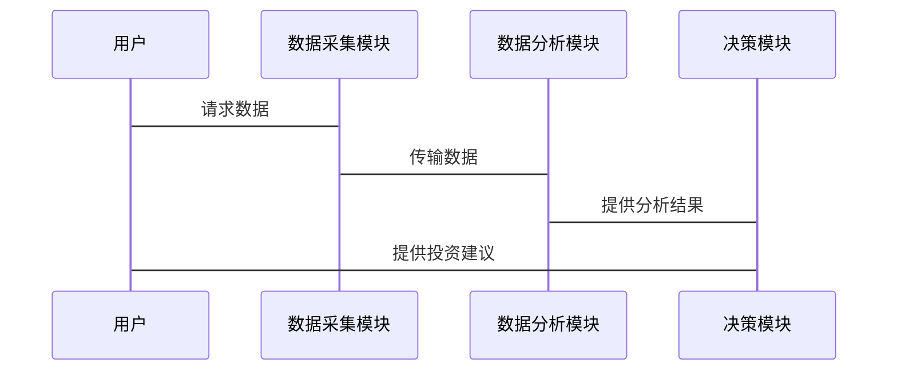

                 


# 罗伯特哈格斯特朗的新兴市场价值投资

## 关键词：价值投资、新兴市场、罗伯特·哈格斯特朗、投资策略、风险管理

## 摘要：  
本文深入探讨了罗伯特·哈格斯特朗在新兴市场中进行价值投资的策略和方法。通过分析新兴市场的特点、价值投资的核心概念以及风险管理的重要性，本文揭示了如何在新兴市场中识别投资机会、构建投资组合并有效管理风险。文章结合数学模型、系统架构和实际案例，为投资者提供了切实可行的指导。

---

## 第1章: 新兴市场的价值投资概述

### 1.1 价值投资的核心概念

#### 1.1.1 价值投资的定义与原则
- **价值投资**：一种以基本面分析为基础的投资方法，旨在发现市场价格低于其内在价值的证券。
- **主要原则**：
  1. 长期投资，避免频繁交易。
  2. 专注于企业的内在价值，而非短期市场波动。
  3. 分散投资，降低风险。

#### 1.1.2 新兴市场的特点与挑战
- **新兴市场的经济结构**：经济增长快，但波动性大，政策风险高。
- **投资机会**：新兴市场中许多企业具有较高的成长潜力。
- **风险与不确定性**：政治、经济和社会因素可能导致市场波动。

#### 1.1.3 罗伯特·哈格斯特朗的投资理念
- 罗伯特·哈格斯特朗是价值投资领域的权威，强调对企业基本面的深入分析。
- 他提出，在新兴市场中，投资者应关注那些被市场低估的企业，尤其是那些具有强大竞争优势和持续盈利能力的企业。

---

### 1.2 新兴市场中的价值投资策略

#### 1.2.1 基本面分析方法
- **财务指标分析**：
  - 利润率：净利润率、毛利率。
  - 资产负债表：关注负债水平和资产质量。
  - 现金流量表：现金流健康，企业具备持续经营能力。

#### 1.2.2 行业分析与选择
- **行业分析**：
  - 行业周期：处于上升周期的行业更具投资价值。
  - 行业竞争结构：分析行业集中度和竞争格局。
  - 政策影响：政府政策对行业的影响。

#### 1.2.3 罗伯特·哈格斯特朗的选股标准
- **低市盈率（P/E）**：寻找市盈率低于行业平均水平的企业。
- **低市净率（P/B）**：市净率低于1，表明股价低于账面价值。
- **高股息率**：稳定的股息支付能力，表明企业盈利稳定。

---

## 第2章: 价值投资的数学模型与算法原理

### 2.1 基本面分析的数学模型

#### 2.1.1 市盈率（P/E）模型
- **公式**：$$ P/E = \frac{Stock Price}{Earnings Per Share} $$
- **分析**：市盈率反映了市场对公司未来盈利的预期。低市盈率可能意味着市场低估了公司的价值。

#### 2.1.2 市净率（P/B）模型
- **公式**：$$ P/B = \frac{Stock Price}{Book Value Per Share} $$
- **分析**：市净率用于评估公司股价相对于其账面价值的高低。低市净率可能表明公司股价被低估。

#### 2.1.3 股息率模型
- **公式**：$$ Dividend Yield = \frac{Dividend Per Share}{Stock Price} \times 100\% $$
- **分析**：高股息率可能表明公司盈利稳定且愿意将利润分配给股东。

### 2.2 投资组合优化的数学模型

#### 2.2.1 马科维茨均值-方差模型
- **公式**：$$ \text{Minimize } \sigma^2 \text{ subject to } E[r] \geq \text{目标收益} $$
- **分析**：该模型帮助投资者在给定收益下选择风险最小的投资组合。

#### 2.2.2 现实中的投资组合优化
- **实际应用**：结合市场实际情况，调整模型参数，以适应新兴市场的波动性。

#### 2.2.3 罗伯特·哈格斯特朗的优化策略
- **分散投资**：通过投资不同行业和地区的股票，降低风险。
- **长期持有**：避免频繁交易，减少交易成本。

---

## 第3章: 新兴市场的风险与风险管理

### 3.1 新兴市场的风险分析

#### 3.1.1 政治风险
- **定义**：政府政策变化、政治动荡可能影响市场。
- **应对策略**：分散投资，避免过度集中在单一市场。

#### 3.1.2 经济波动风险
- **定义**：经济周期波动可能导致市场大幅波动。
- **应对策略**：选择具有稳定现金流的企业。

#### 3.1.3 市场流动性风险
- **定义**：新兴市场流动性可能较低，导致买卖价差大。
- **应对策略**：关注交易量大的股票，避免流动性不足的问题。

### 3.2 风险管理策略

#### 3.2.1 风险评估模型
- **VaR模型**：$$ VaR = \text{在一定置信水平下，可能的最大损失} $$
- **分析**：帮助投资者评估潜在损失，制定风险管理计划。

#### 3.2.2 投资组合的风险分散
- **策略**：通过投资不同资产类别和市场，降低整体风险。

#### 3.2.3 保险与对冲策略
- **工具**：使用期权和期货对冲市场风险。

---

## 第4章: 系统架构与数据驱动的投资

### 4.1 系统分析与架构设计方案

#### 4.1.1 问题场景介绍
- **目标**：构建一个基于价值投资策略的数据驱动投资系统。
- **需求**：数据收集、分析、决策支持。

#### 4.1.2 系统功能设计
- **数据收集**：收集股票的基本面数据和市场数据。
- **数据分析**：使用数学模型进行分析，筛选符合条件的股票。
- **决策支持**：生成投资建议，指导投资组合的构建。

#### 4.1.3 系统架构设计
- **模块化架构**：
  - 数据采集模块：负责数据的收集和预处理。
  - 数据分析模块：执行基本面分析和风险评估。
  - 决策模块：生成投资策略和建议。

#### 4.1.4 系统接口设计
- **API接口**：与其他系统（如数据库、交易平台）对接。

#### 4.1.5 系统交互流程
- 使用Mermaid序列图描述系统交互流程：



---

## 第5章: 项目实战

### 5.1 环境安装
- **工具**：Python、Pandas、NumPy、Matplotlib。
- **安装命令**：
  ```bash
  pip install pandas numpy matplotlib
  ```

### 5.2 核心实现源代码

#### 5.2.1 数据采集模块
```python
import pandas as pd
import numpy as np

# 示例数据
data = {
    '股票代码': ['AAPL', 'MSFT', 'GOOGL'],
    '股价': [150, 100, 200],
    '每股收益': [10, 15, 20],
    '市盈率': [15, 6.66, 10],
    '市净率': [3, 4, 5],
    '股息率': [2%, 3%, 1%]
}
df = pd.DataFrame(data)
print(df)
```

#### 5.2.2 数据分析模块
```python
import pandas as pd

# 计算市盈率和市净率
data = {
    '股票代码': ['AAPL', 'MSFT', 'GOOGL'],
    '股价': [150, 100, 200],
    '每股收益': [10, 15, 20],
    '净资产': [500, 600, 1000],
    '股息率': [2, 3, 1]
}

df = pd.DataFrame(data)

# 计算市盈率
df['市盈率'] = df['股价'] / df['每股收益']
# 计算市净率
df['市净率'] = df['股价'] / df['净资产'] * 100
print(df)
```

#### 5.2.3 投资组合优化模块
```python
import numpy as np

# 示例投资组合
weights = np.array([0.3, 0.3, 0.4])  # 投资比例
returns = np.array([0.1, 0.15, 0.08])  # 预期收益
covariance_matrix = np.array([[0.02, 0.01, 0.015],
                              [0.01, 0.03, 0.01],
                              [0.015, 0.01, 0.02]])

# 计算投资组合的方差
portfolio_variance = np.dot(weights.T, np.dot(covariance_matrix, weights))
print("投资组合方差：", portfolio_variance)
```

### 5.3 实际案例分析

#### 5.3.1 案例背景
- 投资新兴市场中的科技公司。
- 数据来源：股票代码、股价、每股收益、市盈率、市净率、股息率。

#### 5.3.2 分析过程
1. 数据采集：收集目标公司的基本面数据。
2. 数据分析：计算市盈率、市净率，筛选出符合条件的股票。
3. 投资组合优化：根据风险承受能力，调整投资比例。

#### 5.3.3 结果展示
- 筛选出两只市盈率低于行业平均水平的股票。
- 构建投资组合，计算预期收益和风险。

### 5.4 项目小结
- 通过数据驱动的方法，可以更科学地进行投资决策。
- 系统化的投资流程有助于降低投资风险，提高收益。

---

## 总结与最佳实践

### 6.1 最佳实践 tips
- **长期投资**：避免短期波动，坚持价值投资。
- **分散投资**：降低市场风险。
- **持续学习**：关注市场动态，更新投资策略。

### 6.2 小结
- 罗伯特·哈格斯特朗的价值投资策略在新兴市场中具有重要的指导意义。
- 投资者应结合市场实际情况，灵活调整投资策略。

### 6.3 注意事项
- 新兴市场波动性大，需谨慎评估风险。
- 投资前需做好充分的调研和分析。

### 6.4 拓展阅读
- 阅读罗伯特·哈格斯特朗的经典著作，深入了解价值投资的精髓。
- 关注新兴市场的经济动态和政策变化。

---

## 作者：AI天才研究院/AI Genius Institute & 禅与计算机程序设计艺术 /Zen And The Art of Computer Programming

