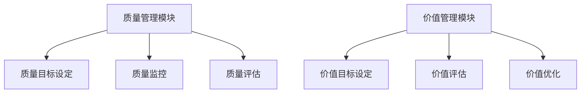

                 


# 罗伯特哈格斯特朗的质量价值结合

## 关键词：质量，价值，结合，系统架构，算法原理，项目实战

## 摘要：  
本文将深入探讨质量与价值结合的核心概念、算法原理、系统架构与项目实战。通过质量与价值的关系分析、算法模型的建立与优化、系统架构设计与实现，以及实际案例的分析，全面解析质量价值结合的方法与应用。本文将为读者提供从理论到实践的详细指导，帮助读者更好地理解和应用质量价值结合的理念。

---

# 第1章 质量价值结合的背景介绍

## 1.1 质量与价值的定义与背景

### 1.1.1 质量的定义与重要性  
质量是衡量一个产品或服务优劣的核心指标，它不仅包括产品的功能实现，还涉及用户体验、可靠性、安全性等多个方面。在现代信息技术领域，质量是确保系统稳定运行和用户满意度的关键因素。

### 1.1.2 价值的定义与衡量标准  
价值是指产品或服务为用户创造的实际收益或满足程度。价值的衡量标准包括功能实现、用户体验、成本效益、市场反馈等多个维度。高质量的产品通常能为用户带来更高的价值。

### 1.1.3 质量与价值结合的背景与趋势  
随着信息技术的快速发展，用户对产品和服务的要求越来越高。单纯追求质量或价值的单一化思维已无法满足市场需求，质量与价值的结合成为现代企业竞争的核心优势。

---

## 1.2 质量价值结合的核心问题

### 1.2.1 问题背景与问题描述  
在实际应用中，质量与价值的结合面临以下问题：  
1. 如何在保证质量的前提下，最大化价值？  
2. 如何通过价值的实现，提升系统的质量？  
3. 如何平衡质量和价值之间的矛盾与冲突？

### 1.2.2 质量与价值结合的目标与意义  
目标：  
- 提升产品的质量和价值，满足用户需求。  
- 实现质量与价值的双赢，增强企业的市场竞争力。  

意义：  
- 通过质量与价值的结合，优化资源配置，提高效率。  
- 为用户提供更优质的产品和服务，增强用户满意度和忠诚度。

### 1.2.3 质量与价值结合的边界与外延  
边界：  
- 仅限于产品或服务的质量与价值的结合。  
- 不涉及企业的其他业务或外部因素。  

外延：  
- 包括从设计、开发、测试到交付的全生命周期。  
- 涵盖技术、管理、用户等多个维度。

---

## 1.3 质量与价值结合的概念结构与核心要素

### 1.3.1 质量与价值结合的概念模型  
质量与价值结合的概念模型包括以下三个核心要素：  
1. **质量属性**：包括功能性、可靠性、可维护性等。  
2. **价值属性**：包括用户满意度、收益、成本效益等。  
3. **结合机制**：通过优化质量与价值的协同关系，实现二者共赢。

### 1.3.2 质量与价值结合的核心要素组成  
- **质量目标**：明确产品的质量要求。  
- **价值目标**：明确产品的价值目标。  
- **结合策略**：制定质量与价值结合的策略和方法。  

### 1.3.3 质量与价值结合的系统架构  
通过构建质量与价值结合的系统架构，实现质量与价值的协同优化。  
- **输入**：用户需求、市场反馈、技术约束。  
- **输出**：高质量且高价值的产品或服务。  

---

# 第2章 质量与价值的核心概念原理

## 2.1 质量与价值的关系分析

### 2.1.1 质量与价值的相互作用  
质量是价值实现的基础，而价值是质量优化的方向。二者相互依存，共同推动产品和服务的改进。

### 2.1.2 质量对价值的影响机制  
- 高质量的产品能够提升用户的信任度和满意度，从而增加产品的价值。  
- 通过提升质量，可以降低售后维护成本，间接提升企业的经济效益。

### 2.1.3 价值对质量的反向影响  
- 过高的价值需求可能导致质量要求超出现有技术水平，增加实现难度。  
- 过低的价值需求可能导致质量标准不足，影响用户体验。

---

## 2.2 质量与价值的属性特征对比

### 2.2.1 质量属性特征分析  
| 质量属性 | 特征描述 |  
|-----------|-----------|  
| 功能性    | 产品是否满足用户需求。 |  
| 可靠性    | 产品在使用过程中的稳定性。 |  
| 可维护性  | 产品是否易于维护和升级。 |  

### 2.2.2 价值属性特征分析  
| 价值属性 | 特征描述 |  
|-----------|-----------|  
| 用户满意度 | 用户对产品的满意程度。 |  
| 收益      | 产品为企业带来的经济效益。 |  
| 成本效益  | 产品成本与收益的对比。 |  

### 2.2.3 质量与价值的对比分析表  
| 属性 | 质量 | 价值 |  
|-------|------|------|  
| 关注点 | 产品功能与稳定性 | 用户满意度与收益 |  
| 实现方式 | 技术实现 | 市场策略 |  

---

## 2.3 质量价值结合的ER实体关系图

```mermaid
erDiagram
    actor 用户
    actor 企业
    actor 市场
    actor 开发团队

    用户 --> 质量：要求高质量
    用户 --> 价值：追求高价值
    企业 --> 质量：提供高质量
    企业 --> 价值：创造高价值
    开发团队 --> 质量：实现高质量
    开发团队 --> 价值：实现高价值
    市场 <-- 用户：反馈价值
    企业 <-- 开发团队：提供产品
```

---

# 第3章 质量价值结合的算法原理

## 3.1 算法原理概述

### 3.1.1 算法的目标与核心思想  
目标：  
- 通过算法优化，实现质量与价值的协同提升。  
核心思想：  
- 建立质量与价值的数学模型，通过优化算法找到两者结合的最佳平衡点。

### 3.1.2 算法的输入与输出  
输入：  
- 质量目标与价值目标。  
- 系统约束条件（如资源、时间等）。  

输出：  
- 优化后的质量与价值结合方案。  
- 系统性能评估结果。

---

## 3.2 算法的数学模型与公式

### 3.2.1 数学模型的建立  
假设质量与价值的关系可以用线性回归模型表示：  
$$ V = \beta Q + \epsilon $$  
其中，V 表示价值，Q 表示质量，$\beta$ 是回归系数，$\epsilon$ 是误差项。

### 3.2.2 关键公式推导  
为了最大化质量与价值的结合，可以使用以下优化公式：  
$$ \max \alpha Q + \beta V $$  
其中，$\alpha$ 和 $\beta$ 是权重系数，Q 和 V 分别是质量与价值的指标。

---

## 3.3 算法的实现与优化

### 3.3.1 算法实现流程  
1. 收集质量与价值相关数据。  
2. 建立数学模型并进行参数优化。  
3. 验证算法的可行性与效果。  
4. 根据结果调整策略，优化质量与价值的结合。

### 3.3.2 算法的Python实现示例  
```python
import numpy as np
from sklearn.linear_model import LinearRegression

# 示例数据
X = np.array([[1], [2], [3], [4], [5]])
y = np.array([2, 4, 5, 4, 6])

# 建立线性回归模型
model = LinearRegression()
model.fit(X, y)

# 预测结果
y_pred = model.predict(X)
print("预测值：", y_pred)
print("回归系数：", model.coef_)
```

---

# 第4章 系统分析与架构设计

## 4.1 系统分析

### 4.1.1 问题场景介绍  
在实际应用中，质量与价值结合的系统需要解决以下问题：  
- 如何确保系统的高质量？  
- 如何通过系统架构设计实现高价值？

### 4.1.2 系统功能设计  
- 质量管理模块：包括质量目标设定、质量监控、质量评估等功能。  
- 价值管理模块：包括价值目标设定、价值评估、价值优化等功能。

---

## 4.2 系统架构设计

### 4.2.1 系统架构图  


### 4.2.2 接口设计与交互图  
```mermaid
sequenceDiagram
    用户 ->> 质量管理模块：设定质量目标
    质量管理模块 ->> 价值管理模块：通知质量目标
    价值管理模块 ->> 价值优化模块：优化价值目标
    价值优化模块 ->> 质量管理模块：反馈优化结果
    用户 <- 报告结果
```

---

## 4.3 系统实现与优化

### 4.3.1 系统实现步骤  
1. 确定系统需求与功能模块。  
2. 设计系统架构并进行模块开发。  
3. 进行系统测试与优化。  
4. 部署系统并进行后续维护。

### 4.3.2 系统优化策略  
- 通过模块化设计提高系统的可维护性。  
- 使用自动化测试工具提高测试效率。  
- 定期更新系统架构，适应新的需求变化。

---

# 第5章 项目实战

## 5.1 项目环境与安装

### 5.1.1 环境要求  
- 操作系统：Linux/Windows/MacOS  
- 开发工具：Python、Jupyter Notebook、Git  
- 依赖库：numpy、pandas、scikit-learn  

### 5.1.2 安装步骤  
1. 安装Python：下载并安装Python 3.x。  
2. 安装依赖库：  
   ```bash
   pip install numpy pandas scikit-learn
   ```

---

## 5.2 核心代码实现

### 5.2.1 质量预测模型  
```python
from sklearn.datasets import make_regression
from sklearn.model_selection import train_test_split
from sklearn.metrics import mean_squared_error

# 生成数据集
X, y = make_regression(n_samples=100, n_features=1, noise=0.5)
X_train, X_test, y_train, y_test = train_test_split(X, y, test_size=0.2)

# 训练模型
model = LinearRegression()
model.fit(X_train, y_train)

# 预测与评估
y_pred = model.predict(X_test)
mse = mean_squared_error(y_test, y_pred)
print("均方误差：", mse)
```

### 5.2.2 价值评估模块  
```python
import pandas as pd

# 示例数据
data = {
    '质量': [1, 2, 3, 4, 5],
    '价值': [2, 4, 5, 4, 6]
}
df = pd.DataFrame(data)

# 计算价值与质量的相关性
correlation = df['价值'].corr(df['质量'])
print("相关性系数：", correlation)
```

---

## 5.3 项目案例分析

### 5.3.1 案例背景  
假设我们正在开发一个在线教育平台，目标是在保证系统稳定性和用户体验的前提下，实现高质量的在线课程和高价值的用户反馈。

### 5.3.2 数据分析与优化  
通过数据分析，我们发现系统性能的优化能够显著提升用户体验，从而增加用户满意度和平台价值。因此，我们将重点放在系统的可扩展性和容错性优化上。

---

# 第6章 总结与展望

## 6.1 总结

### 6.1.1 质量与价值结合的核心思想  
质量与价值的结合是通过优化系统的质量和价值的协同关系，实现两者共赢。  
- 质量是价值实现的基础，价值是质量优化的方向。  

### 6.1.2 系统架构与算法优化的关键点  
- 系统架构设计：模块化设计与高可维护性。  
- 算法优化：建立数学模型，通过优化算法找到质量与价值的平衡点。  

---

## 6.2 展望

### 6.2.1 质量与价值结合的未来发展趋势  
- 随着人工智能和大数据技术的进一步发展，质量与价值结合的算法将更加智能化和精准化。  
- 系统架构设计将更加注重模块化和可扩展性，以适应快速变化的市场需求。  

### 6.2.2 质量与价值结合的潜在挑战  
- 如何在复杂的系统环境中实现质量与价值的协同优化？  
- 如何应对用户需求的快速变化，保持系统的高质量与高价值？

---

## 6.3 注意事项与最佳实践

### 6.3.1 开发中的注意事项  
- 在开发过程中，始终关注系统的质量和价值的平衡。  
- 定期进行系统测试与优化，确保系统的稳定性和高效性。  

### 6.3.2 最佳实践  
- 制定明确的质量与价值目标，并与团队成员充分沟通。  
- 使用自动化工具提高开发效率，降低人为错误。  
- 定期回顾项目进展，及时调整策略。

---

## 6.4 拓展阅读

### 6.4.1 推荐书籍与论文  
- 《软件工程：实践者的研究方法》  
- 《高质量的Python编程：从新手到专家》  
- 《基于机器学习的质量预测模型研究》  

### 6.4.2 网站与资源  
- [GitHub](https://github.com)：开源项目与技术交流。  
- [Stack Overflow](https://stackoverflow.com)：技术问题解答与讨论。  
- [Kaggle](https://www.kaggle.com)：数据科学与机器学习资源。

---

## 作者  
作者：AI天才研究院 & 禅与计算机程序设计艺术

