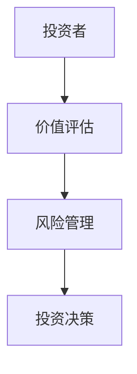
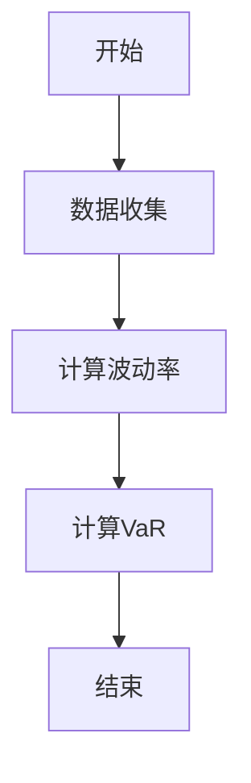
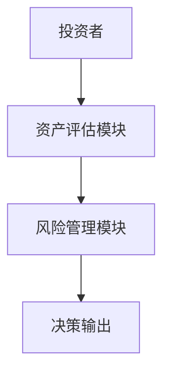

                 


# 罗杰·洛温斯坦的价值投资风险管理

## 关键词：价值投资、风险管理、投资策略、金融分析、系统架构

## 摘要：
本文深入探讨了罗杰·洛温斯坦的价值投资与风险管理的结合，分析了其核心概念、算法原理及系统架构。通过背景介绍、核心概念对比、算法流程图、系统设计和项目实战，详细阐述了如何在实际投资中应用这些方法，并提供了具体的代码示例和案例分析。

---

## 第一部分: 价值投资与风险管理概述

### 第1章: 价值投资与风险管理的背景介绍

#### 1.1 价值投资的核心概念
##### 1.1.1 价值投资的定义与起源
价值投资是一种投资策略，起源于20世纪初，由本杰明·格雷厄姆和戴维·多德提出。其核心是寻找市场价值低于内在价值的股票，长期持有以获得收益。

##### 1.1.2 价值投资的基本原理
价值投资者认为市场价格常常偏离内在价值，通过分析公司财务状况和未来现金流，寻找被低估的投资标的。

##### 1.1.3 价值投资与成长投资的区别
- **价值投资**：注重低估值，追求安全边际。
- **成长投资**：注重高成长性，愿意支付溢价。

#### 1.2 风险管理的核心概念
##### 1.2.1 风险管理的定义与重要性
风险管理是指识别、评估和控制可能影响投资收益的风险因素，是投资决策的重要组成部分。

##### 1.2.2 风险的分类与特征
- **系统性风险**：影响整个市场的风险，如经济衰退。
- **非系统性风险**：特定于个别资产的风险，如公司违约。

##### 1.2.3 风险管理在投资中的作用
通过分散投资、止损设置和风险调整后的收益评估，降低投资组合的整体风险。

---

### 第2章: 价值投资与风险管理的核心概念与联系

#### 2.1 核心概念原理
##### 2.1.1 价值投资的内在价值计算
内在价值是基于公司未来现金流的现值，公式为：
$$ \text{内在价值} = \sum_{t=1}^{n} \frac{CF_t}{(1 + r)^t} $$
其中，$CF_t$ 是第t年的现金流，$r$ 是折现率。

##### 2.1.2 风险管理的量化方法
风险价值（VaR）计算公式为：
$$ VaR = \mu + z \cdot \sigma $$
其中，$\mu$ 是平均回报率，$z$ 是标准正态分布的分位数，$\sigma$ 是标准差。

##### 2.1.3 两者结合的理论基础
价值投资关注低估资产，风险管理则通过量化工具评估和控制投资组合风险，两者结合可优化投资回报并降低风险。

#### 2.2 核心概念属性对比表格
| 比较维度 | 价值投资 | 风险管理 |
|----------|----------|----------|
| 核心目标 | 寻找被低估资产 | 控制投资风险 |
| 实施方法 | 财务分析、估值 | 风险指标、分散投资 |
| 适用场景 | 稳定市场 | 不确定性市场 |

#### 2.3 ER实体关系图（Mermaid流程图）


---

### 第3章: 价值投资与风险管理的算法原理

#### 3.1 风险评估算法流程图（Mermaid）


#### 3.2 风险价值VaR计算公式
$$ VaR = \mu + z \cdot \sigma $$

#### 3.3 价值投资中的数学模型
$$ \text{内在价值} = \sum_{t=1}^{n} \frac{CF_t}{(1 + r)^t} $$

---

## 第4章: 价值投资与风险管理的系统分析与架构设计

### 4.1 项目背景与目标
#### 4.1.1 项目背景介绍
在金融市场的不确定性中，结合价值投资和风险管理可优化投资组合。

#### 4.1.2 项目目标与范围
开发一个系统，帮助投资者识别低估资产并控制风险。

### 4.2 系统功能设计（Mermaid类图）
```mermaid
classDiagram
    class 投资者 {
        帐户余额
        投资组合
    }
    class 资产评估模块 {
        财务报表分析
        估值指标计算
    }
    class 风险管理模块 {
        风险指标计算
        风险评估报告
    }
    投资者 -->
    资产评估模块 -->
    风险管理模块
```

---

## 第5章: 价值投资与风险管理的系统架构设计

### 5.1 系统架构图（Mermaid）


### 5.2 系统接口设计
- 投资者输入：资产信息、市场数据。
- 输出：风险评估报告、投资建议。

---

## 第6章: 价值投资与风险管理的项目实战

### 6.1 环境安装
安装Python和相关库：
```bash
pip install numpy pandas matplotlib
```

### 6.2 核心代码实现
```python
import numpy as np
import pandas as pd

def calculate_intrinsic_value(cash_flows, discount_rate):
    return np.sum(cash_flows / (1 + discount_rate)**np.arange(len(cash_flows)))

def calculate VaR(returns, confidence_level):
    returns_sorted = np.sort(returns)
    z_score = np.abs(np.norm.ppf(1 - confidence_level/2))
    VaR = np.mean(returns) + z_score * np.std(returns)
    return VaR
```

### 6.3 实际案例分析
假设某公司未来5年的现金流分别为100, 120, 130, 140, 150万元，折现率为10%。计算内在价值：
$$ \text{内在价值} = \frac{100}{1.1} + \frac{120}{1.1^2} + \cdots + \frac{150}{1.1^5} \approx 469.83 \text{万元} $$

---

## 第7章: 总结与最佳实践

### 7.1 小结
价值投资与风险管理的结合可有效优化投资组合，降低风险并提高收益。

### 7.2 注意事项
- 定期重新评估投资组合。
- 风险管理需动态调整。

### 7.3 拓展阅读
推荐阅读《投资学》和《风险管理与VaR》。

---

## 作者：AI天才研究院/AI Genius Institute & 禅与计算机程序设计艺术 /Zen And The Art of Computer Programming

