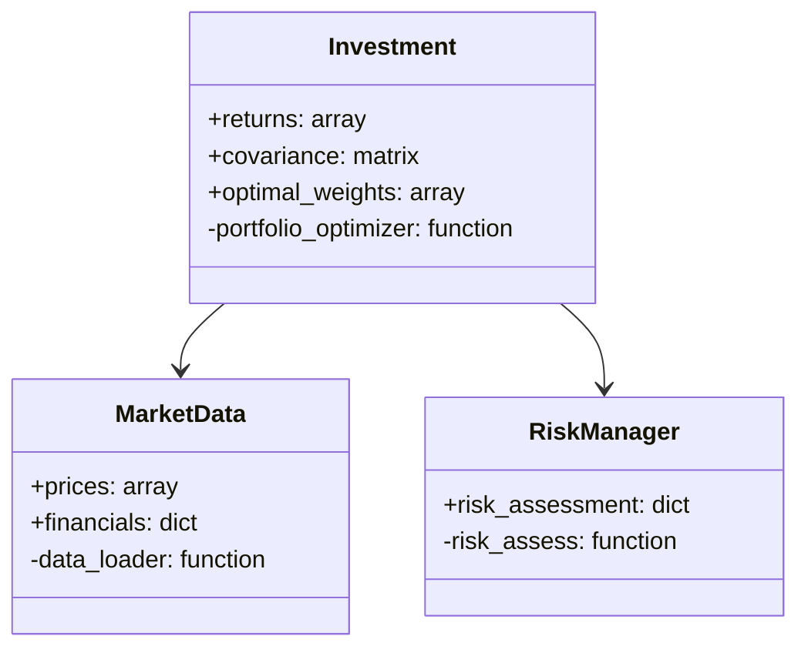

                 


# 罗杰·洛温斯坦的智慧型价值投资：避免价值陷阱

> **关键词**：价值投资、智慧型投资、价值陷阱、财务分析、投资策略、风险管理、系统化投资

> **摘要**：本文深入探讨了智慧型价值投资的核心概念、分析框架及实战策略，重点解析了如何识别和避免价值陷阱。通过系统的分析和实际案例，结合数学模型和算法原理，为读者提供了一套完整的智慧型投资方法论，帮助投资者在复杂市场中做出明智决策。

---

## 引言

### 1. 价值投资的定义与重要性

#### 1.1 价值投资的定义
价值投资是一种以基本面分析为基础的投资策略，旨在通过识别市场价格低于其内在价值的证券，实现长期稳定的收益。其核心在于寻找市场先生的错误定价，从而在低估值资产中获利。

#### 1.2 智慧型投资的重要性
智慧型投资强调多维度的分析与系统的决策过程，通过深入研究企业的财务状况、行业地位和管理层质量，避免仅依赖市场情绪或短期趋势做出投资决策。这种方法能够有效降低投资风险，提高投资回报率。

### 1.3 价值陷阱的概念
价值陷阱是指那些看似估值低廉，实则存在严重问题或风险的资产。投资者若未能识别这些陷阱，可能会遭受重大损失。识别价值陷阱是智慧型投资的核心任务之一。

---

## 第二章：智慧型价值投资的核心概念

### 2.1 智慧型价值投资的定义

智慧型价值投资是一种结合定量分析与定性判断的投资方法，强调在全面评估企业内在价值的基础上，避免因市场短期波动或企业基本面问题导致的价值陷阱。

### 2.2 价值陷阱的特征

- **低估值**：市场价格显著低于账面价值或其他估值指标。
- **高负债**：企业存在较大的财务杠杆，易受经济波动影响。
- **管理层问题**：管理层存在道德风险或决策失误。
- **行业风险**：行业处于衰退期或政策变化对企业影响较大。

---

## 第三章：智慧型价值投资的分析框架

### 3.1 财务指标分析

#### 3.1.1 常用财务指标

- **市盈率（P/E）**：$$ P/E = \frac{Price}{Earnings} $$
- **市净率（P/B）**：$$ P/B = \frac{Price}{Book\ Value} $$
- **股息率**：$$ Dividend\ Yield = \frac{Dividend}{Price} $$

#### 3.1.2 财务指标的局限性
仅依赖财务指标可能导致误判，需结合行业特性与企业实际进行调整。

### 3.2 行业分析

#### 3.2.1 行业周期分析
识别行业所处周期（如增长期、成熟期、衰退期），评估企业盈利能力的可持续性。

#### 3.2.2 行业竞争结构
分析行业集中度、进入壁垒和竞争格局，判断企业的竞争优势。

---

## 第四章：智慧型价值投资的系统化方法

### 4.1 系统化投资框架

#### 4.1.1 投资目标设定
明确投资目标，如长期资本增值或稳定股息收入。

#### 4.1.2 数据收集与处理
收集企业的财务报表、行业数据和市场信息，进行清洗和整理。

#### 4.1.3 模型构建与验证
基于历史数据，构建估值模型，验证其有效性和稳定性。

### 4.2 系统化投资的步骤

1. **确定投资目标**
2. **数据收集与处理**
3. **模型构建与验证**
4. **投资组合管理**

---

## 第五章：价值陷阱的识别与规避

### 5.1 识别价值陷阱的策略

#### 5.1.1 财务指标异常分析
检查企业的盈利能力、偿债能力和发展能力，识别潜在风险。

#### 5.1.2 公司治理问题识别
评估管理层的诚信和决策能力，避免因治理问题导致的价值陷阱。

### 5.2 典型案例分析

#### 5.2.1 案例1：公司A的财务困境分析
公司A的市盈率显著低于行业平均水平，但其净利润持续下滑，负债率高企，存在较大的财务风险。

#### 5.2.2 案例2：行业B的周期性风险分析
行业B处于衰退期，市场需求下降，企业盈利能力减弱，投资者需谨慎评估行业风险。

---

## 第六章：智慧型价值投资的数学模型与算法

### 6.1 财务指标计算公式

#### 6.1.1 市盈率计算公式
$$ P/E = \frac{Price}{Earnings} $$

#### 6.1.2 市净率计算公式
$$ P/B = \frac{Price}{Book\ Value} $$

### 6.2 投资组合优化模型

#### 6.2.1 最小化风险的投资组合
使用均值-方差模型，优化投资组合的风险和收益。

#### 6.2.2 代码实现
```python
import numpy as np
from scipy.optimize import minimize

# 假设收益和协方差矩阵已计算
def portfolio_optimization(returns, covariance):
    n = len(returns)
    # 定义目标函数
    def objective(weights):
        return np.dot(weights.T, covariance).dot(weights)
    # 约束条件：权重之和为1
    constraints = [{'type': 'eq', 'fun': lambda w: sum(w) - 1}]
    # 初始权重
    initial_weights = np.array([1.0/n]*n)
    # 优化
    result = minimize(objective, initial_weights, constraints=constraints)
    return result.x

# 示例数据
returns = np.array([0.1, 0.2, 0.15])
covariance = np.array([[0.02, 0.01, 0.01],
                       [0.01, 0.03, 0.02],
                       [0.01, 0.02, 0.03]])
optimal_weights = portfolio_optimization(returns, covariance)
print("最优权重:", optimal_weights)
```

---

## 第七章：智慧型价值投资的系统分析与架构设计

### 7.1 问题场景介绍
投资者需要在复杂市场中识别价值陷阱，避免投资损失，同时实现长期资本增值。

### 7.2 系统功能设计

#### 7.2.1 领域模型


### 7.3 系统架构设计


---

## 第八章：项目实战

### 8.1 环境安装

安装必要的库：
```bash
pip install numpy pandas matplotlib
```

### 8.2 核心代码实现

```python
import pandas as pd
import numpy as np

# 示例数据加载
data = pd.read_csv('market_data.csv')
data.head()

# 计算市盈率和市净率
data['PE'] = data['Price'] / data['Earnings']
data['PB'] = data['Price'] / data['Book Value']
data.head()
```

### 8.3 实际案例分析

分析某企业的财务数据，识别潜在的价值陷阱，并提出投资建议。

---

## 第九章：智慧型价值投资的最佳实践

### 9.1 小结
智慧型价值投资强调系统化分析与风险控制，通过深入研究企业的财务状况和行业环境，避免价值陷阱，实现稳健投资。

### 9.2 注意事项
- 定期复盘投资组合，及时调整。
- 保持对市场变化的敏感性，灵活应对。

### 9.3 拓展阅读
推荐书籍：《价值》、《投资最重要的事》。

---

## 结语

智慧型价值投资是一种科学且艺术性的投资方法，需要投资者具备扎实的分析能力和敏锐的市场洞察力。通过系统的分析框架和实战策略，投资者可以有效识别价值陷阱，避免投资风险，实现长期稳健的投资回报。

---

## 作者：AI天才研究院/AI Genius Institute & 禅与计算机程序设计艺术 /Zen And The Art of Computer Programming

