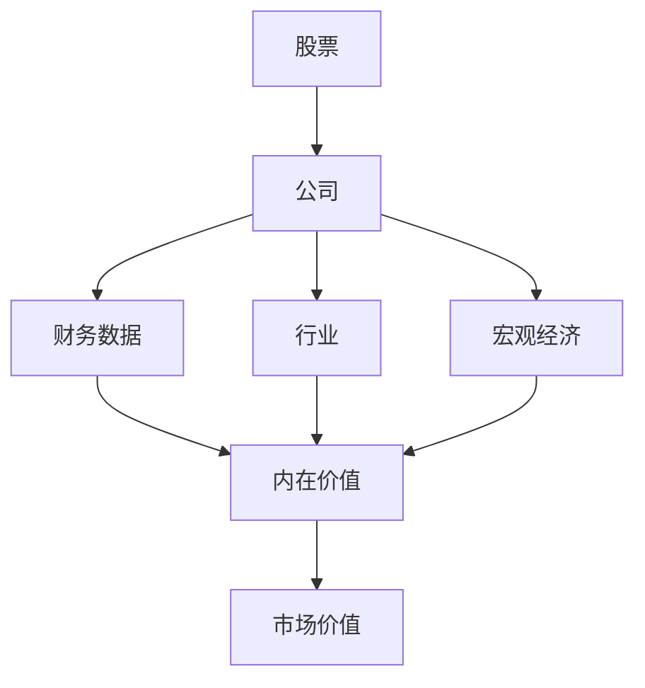

                 


```markdown
# 美国股市估值:多角度评估方法

> 关键词：美国股市估值，股票评估，基本面分析，技术分析，宏观经济分析，风险管理

> 摘要：本文将从多个角度详细探讨美国股市的估值方法，包括基本面分析、技术分析、宏观经济分析以及行业分析，通过具体的案例分析和数学模型，帮助读者全面理解股市估值的核心概念和实际应用。

---

## 第1章: 股市估值的背景与基础

### 1.1 股市估值的定义与重要性

#### 1.1.1 什么是股市估值
股市估值是通过对公司财务数据、市场趋势和宏观经济因素的分析，来确定股票内在价值的过程。它是投资者做出投资决策的重要依据。

#### 1.1.2 股市估值的重要性
股市估值帮助投资者判断股票是否被高估或低估，从而做出买入、卖出或持有股票的决策。准确的估值可以降低投资风险，提高投资收益。

#### 1.1.3 股市估值与其他金融概念的区别
与其他金融概念如资产估值和项目估值不同，股市估值更关注股票的市场表现和公司的盈利能力。

### 1.2 美国股市的特点

#### 1.2.1 美国股市的市场规模
美国股市是全球最大的股市之一，涵盖了广泛的行业和公司规模，提供了丰富的投资选择。

#### 1.2.2 美国股市的主要指数
- 标准普尔500指数（S&P 500）
- 纳斯达克综合指数（NASDAQ Composite）
- 道琼斯工业平均指数（Dow Jones Industrial Average）

#### 1.2.3 美国股市的监管体系
美国股市受到严格的监管，主要机构包括美国证券交易委员会（SEC）和各交易所，确保市场的公平和透明。

---

## 第2章: 股市估值的核心概念与联系

### 2.1 核心概念原理

#### 2.1.1 市场价值与内在价值的定义
- 市场价值：市场参与者对股票的定价，受市场情绪和供需关系影响。
- 内在价值：基于公司基本面的理论价值，反映其未来现金流的现值。

#### 2.1.2 影响股票价格的主要因素
- 公司财务状况
- 行业竞争格局
- 宏观经济环境
- 市场情绪

#### 2.1.3 市场情绪与股票估值的关系
市场情绪可以通过投资者的行为影响股票价格，但长期来看，股票价格会回归其内在价值。

### 2.2 核心概念属性特征对比表格

| 属性           | 市场价值         | 内在价值         |
|----------------|------------------|------------------|
| 时间跨度       | 短期波动         | 长期稳定性       |
| 影响因素       | 市场情绪、供需     | 财务数据、现金流   |
| 反映的信息     | 当前市场状况     | 公司长期潜力     |

### 2.3 ER实体关系图架构



---

## 第3章: 基本面分析法

### 3.1 基本面分析的定义与特点

#### 3.1.1 基本面分析的核心要素
- 财务报表分析：利润表、资产负债表、现金流量表
- 行业分析：行业地位、竞争情况
- 经营效率：ROE、ROA等指标

#### 3.1.2 基本面分析的优点与缺点
- 优点：提供长期投资依据
- 缺点：受管理层决策和外部环境影响较大

### 3.2 常用的基本面指标

#### 3.2.1 市盈率（P/E）

公式：$$ P/E = \frac{股票价格}{每股收益} $$

#### 3.2.2 市净率（P/B）

公式：$$ P/B = \frac{股票价格}{每股净资产} $$

#### 3.2.3 股息率

公式：$$ 股息率 = \frac{每股股息}{股票价格} $$

### 3.3 行业分析与竞争优势

#### 3.3.1 行业分析的基本方法
- 行业生命周期分析
- 行业集中度分析

#### 3.3.2 企业竞争优势的评估
- 核心竞争力
- 技术创新

---

## 第4章: 技术分析法

### 4.1 技术分析的定义与原理

#### 4.1.1 技术分析的核心假设
- 价格反映所有信息
- 市场行为遵循模式
- 历史趋势会重复

### 4.2 常用的技术指标

#### 4.2.1 移动平均线（MA）

```python
import pandas as pd

def calculate_ma(prices, window):
    return prices.rolling(window).mean()
```

#### 4.2.2 相对强弱指数（RSI）

公式：$$ RSI = \frac{100 - \frac{S}{K} + 1}{1 + \frac{S}{K}} $$

其中，S为n天内上涨幅度，K为n天的平均波动幅度。

#### 4.2.3 麦克劳林指标（MACD）

```python
import pandas as pd
import numpy as np

def calculate_macd(close_prices):
    ema12 = close_prices.ewm(span=12).mean()
    ema26 = close_prices.ewm(span=26).mean()
    macd = ema12 - ema26
    signal = macd.ewm(span=9).mean()
    return macd, signal
```

---

## 第5章: 宏观经济分析

### 5.1 宏观经济分析的核心要素

#### 5.1.1 GDP增长率
- 影响企业盈利能力和股票需求

#### 5.1.2 失业率
- 低失业率通常意味着经济强劲，推动股市上涨

#### 5.1.3 通货膨胀率
- 过高的通胀可能导致央行加息，抑制股市表现

### 5.2 常用的宏观经济模型

#### 5.2.1 消费者价格指数（CPI）

公式：$$ CPI = \frac{\text{当前物价总和}}{\text{基期物价总和}} \times 100 $$

#### 5.2.2 利率政策
- 利率下降通常刺激股市上涨

---

## 第6章: 风险管理与投资策略

### 6.1 风险管理的核心原则

#### 6.1.1 分散投资
- 通过投资不同行业和资产类别降低风险

#### 6.1.2 设置止损点
- 在股票价格达到某个阈值时卖出，避免重大损失

### 6.2 投资策略的选择

#### 6.2.1 价值投资
- 买入被低估的股票，长期持有

#### 6.2.2 股票筛选策略
- 基于基本面和技术面指标筛选股票

---

## 第7章: 项目实战

### 7.1 环境配置

```python
import pandas as pd
import numpy as np
import matplotlib.pyplot as plt
import yfinance as yf
```

### 7.2 核心实现

#### 7.2.1 下载数据
```python
data = yf.download('AAPL', start='2020-01-01', end='2023-01-01')
```

#### 7.2.2 计算指标
```python
data['SMA_20'] = data['Close'].rolling(20).mean()
data['RSI'] = (100 - (data['Close'].diff().fillna(0).where(data['Close'].diff() > 0).count() / len(data)) * 100)
```

#### 7.2.3 可视化
```python
plt.plot(data['Close'])
plt.title('Apple Stock Price')
plt.show()
```

### 7.3 案例分析

#### 7.3.1 苹果公司（AAPL）
- 基本面分析：高ROE，稳定现金流
- 技术分析：长期上升趋势，支撑位明确

### 7.4 结果解读

#### 7.4.1 基本面结论
- 苹果公司的内在价值被低估，适合长期投资

#### 7.4.2 技术面结论
- 股票价格可能继续上涨，建议买入并持有

---

## 第8章: 总结与展望

### 8.1 核心内容回顾

- 理解股市估值的核心概念
- 掌握基本面、技术面和宏观经济分析方法
- 学会风险管理与投资策略

### 8.2 最佳实践 tips

- 结合多种方法进行综合分析
- 定期评估投资组合，及时调整策略
- 保持对市场动态的关注和学习

### 8.3 拓展阅读

- 《The Intelligent Investor》
- 《Technical Analysis of the Stock Market》

---

作者：AI天才研究院/AI Genius Institute & 禅与计算机程序设计艺术 /Zen And The Art of Computer Programming
```

