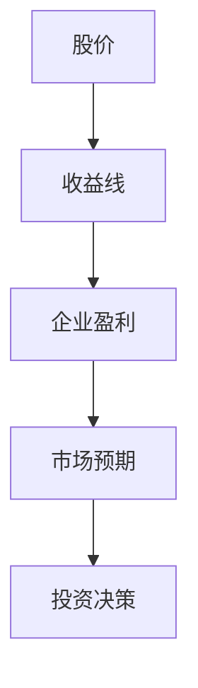
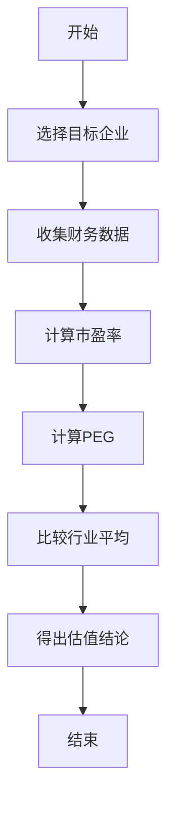
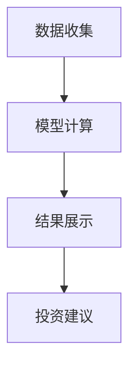
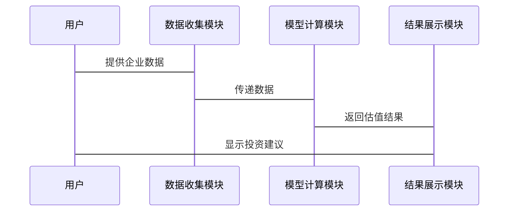

                 


# 股价与收益线的比较：彼得林奇的估值方法

---

## 关键词：
- 彼得林奇
- 股价
- 收益线
- 估值方法
- 相对市盈率
- PEG指标

---

## 摘要：
本文深入探讨了彼得林奇的估值方法，重点分析了股价与收益线的比较及其在企业估值中的应用。通过详细讲解相对市盈率法和PEG指标，结合数学模型和系统架构设计，为读者提供一套科学的企业估值方法论。文章从理论到实践，结合实际案例，帮助投资者更好地理解和应用彼得林奇的估值策略。

---

## 第一部分: 股价与收益线的比较概述

### 第1章: 股价与收益线的定义与背景

#### 1.1 股价与收益线的基本概念

##### 1.1.1 股价的定义与作用
股价是指股票在市场上的交易价格，反映了市场对企业的价值预期。股价具有波动性，受市场情绪、宏观经济环境等多种因素影响。其作用是为企业提供融资渠道，为投资者提供收益机会。

##### 1.1.2 收益线的定义与意义
收益线是指企业未来预期收益的折现值之和，反映了企业的内在价值。收益线与股价密切相关，但更注重企业的长期盈利能力。收益线的意义在于帮助投资者识别低估或高估的股票。

##### 1.1.3 股价与收益线的联系与区别
- **联系**：股价围绕收益线波动，收益线是股价的长期均衡值。
- **区别**：股价短期波动大，收益线长期稳定；股价受市场情绪影响，收益线反映企业基本面。

#### 1.2 彼得·林奇投资理念的背景

##### 1.2.1 彼得·林奇的生平简介
彼得·林奇是美国著名投资家，曾管理富达麦哲伦基金，创造了卓越的投资业绩。他的投资理念以深入研究企业和市场为基础，强调长期投资和价值发现。

##### 1.2.2 彼得·林奇的投资哲学
林奇认为，投资的关键在于选择具有持续增长潜力的企业，关注企业的基本面和管理层能力。他强调分散投资，避免过度依赖单一行业或股票。

##### 1.2.3 彼得·林奇估值方法的核心思想
林奇的估值方法基于企业的盈利能力和市场预期，通过比较股价与收益线的关系，判断股票是否被高估或低估。

#### 1.3 股价与收益线比较的现实意义

##### 1.3.1 企业估值的重要性
正确的企业估值是投资决策的基础，帮助投资者识别潜在收益和风险。

##### 1.3.2 股价与收益线比较的实践价值
通过比较股价与收益线，投资者可以发现市场定价偏差，制定合理的买卖策略。

##### 1.3.3 彼得·林奇方法在现代投资中的应用
尽管投资环境变化，林奇的估值方法依然有效，尤其适用于价值投资策略。

---

### 第2章: 股价与收益线的核心概念与联系

#### 2.1 股价与收益线的属性对比

##### 2.1.1 股价的波动性与收益线的稳定性
股价受短期因素影响，收益线基于长期盈利预测。

##### 2.1.2 股价的市场情绪影响与收益线的内在价值反映
股价反映市场情绪，收益线反映企业内在价值。

##### 2.1.3 股价与收益线的时间维度差异
股价短期波动，收益线长期稳定。

#### 2.2 股价与收益线的实体关系图


#### 2.3 股价与收益线的数学模型对比

##### 2.3.1 股价波动模型
$$P(t) = P(t-1) + \epsilon$$

##### 2.3.2 收益线模型
$$R(t) = \alpha + \beta t$$

---

## 第3章: 彼得·林奇估值方法的数学模型与算法

### 3.1 彼得·林奇相对市盈率法

#### 3.1.1 相对市盈率的定义
$$\text{相对市盈率} = \frac{P/E}{\text{行业平均} P/E}$$

#### 3.1.2 相对市盈率的计算步骤
1. 计算目标企业的市盈率。
2. 计算行业平均市盈率。
3. 计算相对市盈率。

#### 3.1.3 相对市盈率的优缺点分析
优点：简单易用，反映市场估值水平。缺点：受行业周期影响较大。

### 3.2 彼得·林奇PEG指标

#### 3.2.1 PEG指标的定义
$$\text{PEG} = \frac{P/E}{\text{盈利增长率}}$$

#### 3.2.2 PEG指标的计算流程
1. 计算目标企业的市盈率。
2. 计算企业的盈利增长率。
3. 计算PEG指标。

#### 3.2.3 PEG指标在估值中的应用
适用于成长型企业，PEG < 1表示低估，PEG > 1表示高估。

### 3.3 彼得·林奇估值算法的流程图


---

## 第4章: 系统分析与架构设计方案

### 4.1 估值系统项目介绍

#### 4.1.1 系统目标
开发一个基于彼得林奇估值方法的股票估值系统。

#### 4.1.2 系统功能设计
- 数据收集模块：收集企业财务数据和市场数据。
- 模型计算模块：计算市盈率和PEG指标。
- 结果展示模块：显示估值结果和投资建议。

#### 4.1.3 系统架构图


#### 4.1.4 系统接口设计
- 输入接口：企业财务数据和市场数据。
- 输出接口：估值结果和投资建议。

#### 4.1.5 系统交互序列图


---

## 第5章: 项目实战

### 5.1 环境安装

#### 5.1.1 安装Python环境
使用Anaconda安装Python 3.8及以上版本。

#### 5.1.2 安装依赖库
安装pandas、numpy、matplotlib等库。

### 5.2 系统核心实现源代码

#### 5.2.1 数据收集模块
```python
import pandas as pd

def collect_data(ticker):
    # 模拟数据收集
    data = pd.DataFrame({
        'Revenue': [100, 120, 150],
        'Net Income': [20, 30, 40],
        'Shares Outstanding': [10, 20, 30]
    })
    return data
```

#### 5.2.2 模型计算模块
```python
def calculate_pe(ticker, net_income, shares_outstanding, price):
    pe = price / (net_income / shares_outstanding)
    return pe

def calculate_growth(net_income):
    growth = (net_income[-1] - net_income[-2]) / net_income[-2]
    return growth

def calculate_peg(pe, growth):
    peg = pe / growth
    return peg
```

#### 5.2.3 结果展示模块
```python
import matplotlib.pyplot as plt

def plot_peg(peg, industry_peg):
    plt.figure(figsize=(10, 6))
    plt.plot(peg, label='Stock PEG')
    plt.plot(industry_peg, label='Industry PEG')
    plt.xlabel('Time')
    plt.ylabel('PEG')
    plt.legend()
    plt.show()
```

### 5.3 代码应用解读与分析

#### 5.3.1 数据收集模块解读
收集企业的收入、净利润和流通股数，用于后续计算。

#### 5.3.2 模型计算模块解读
计算市盈率和盈利增长率，最终得到PEG指标。

#### 5.3.3 结果展示模块解读
通过图表展示股票PEG与行业PEG的对比，帮助投资者判断估值水平。

### 5.4 实际案例分析

#### 5.4.1 案例背景
假设目标企业为XYZ公司，行业平均PEG为1.2。

#### 5.4.2 数据收集
XYZ公司过去三年的收入和利润数据。

#### 5.4.3 计算过程
1. 计算XYZ公司的市盈率。
2. 计算XYZ公司的盈利增长率。
3. 计算XYZ公司的PEG。

#### 5.4.4 分析结果
如果XYZ公司的PEG < 1，说明股票被低估，值得买入。

### 5.5 项目小结
通过代码实现彼得林奇的估值方法，帮助投资者快速判断股票估值水平。

---

## 第6章: 最佳实践、小结、注意事项与拓展阅读

### 6.1 最佳实践
- 定期更新企业数据，保持估值准确性。
- 结合多种估值方法，提高判断的准确性。

### 6.2 小结
本文详细介绍了彼得林奇的估值方法，从理论到实践，帮助投资者掌握股价与收益线的比较技巧。

### 6.3 注意事项
- 估值结果仅供参考，需结合市场环境和其他因素综合判断。
- 避免过度依赖单一估值方法。

### 6.4 拓展阅读
推荐阅读彼得·林奇的书籍，深入了解其投资哲学和具体案例。

---

## 作者：
作者：AI天才研究院/AI Genius Institute  
作者：禅与计算机程序设计艺术/Zen And The Art of Computer Programming

