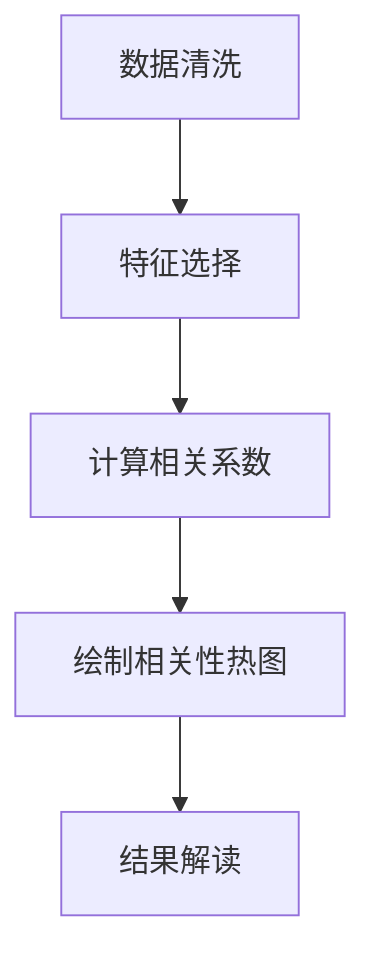
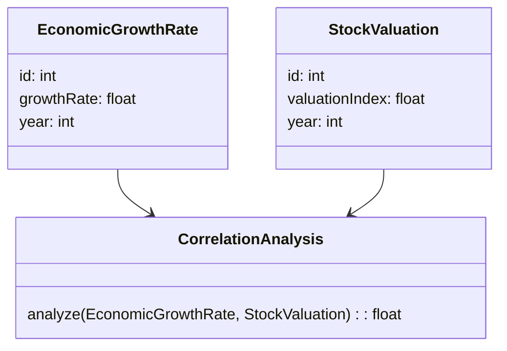
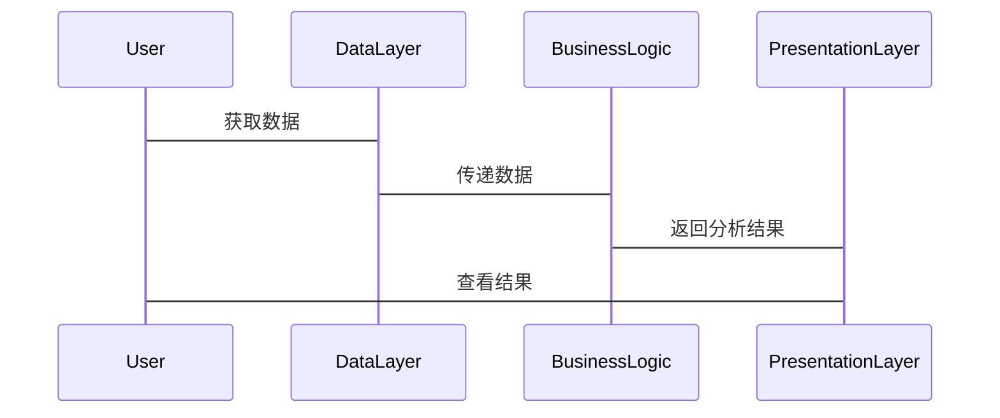

                 


# 股市估值与经济增长率的相关性研究

**关键词**：股市估值、经济增长率、相关性分析、统计模型、实证研究、经济指标

**摘要**：本文旨在探讨经济增长率与股市估值之间的相关性。通过理论分析和实证研究，构建了相关性分析的数学模型，并结合实际数据进行了验证。研究表明，经济增长率对股市估值具有显著影响，但存在一定的区域和时间差异。本文还讨论了相关性分析的局限性，并提出了未来研究的方向。

---

## 第一部分：背景介绍与核心概念

### 第1章：经济增长率的定义与影响

#### 1.1 经济增长率的定义
- **1.1.1 经济增长率的内涵与外延**
  - 经济增长率是指一个国家或地区在一定时期内国内生产总值（GDP）的增长速度。
  - 它反映了经济的整体表现和活力，是宏观经济学中的核心指标之一。
- **1.1.2 经济增长率的核心要素**
  - GDP的计算方法：GDP = 消费 + 投资 + 政府支出 + 净出口。
  - 经济增长率的计算公式：$$经济增长率 = \frac{GDP_{\text{current}} - GDP_{\text{previous}}}{GDP_{\text{previous}}} \times 100\%$$
- **1.1.3 经济增长率的测算方法**
  - 实际国内生产总值（Real GDP）：经过通货膨胀调整后的GDP。
  - 名义国内生产总值（Nominal GDP）：未经过通货膨胀调整的GDP。

#### 1.2 经济增长率的主要影响因素
- **1.2.1 投资、消费与出口对经济增长的驱动**
  - 投资：企业投资于资本货物（如工厂、设备）可以增加生产能力和就业机会。
  - 消费：居民消费支出是经济增长的主要驱动力之一。
  - 出口：出口的增加可以带来更多的外汇收入和就业机会。
- **1.2.2 政策因素对经济增长的影响**
  - 财政政策：政府通过调整税收和支出影响经济增长。
  - 货币政策：中央银行通过调整利率和货币供应量影响经济增长。
- **1.2.3 技术进步与创新能力对经济增长的推动**
  - 技术进步可以提高生产效率，降低生产成本，从而推动经济增长。
  - 创新能力是一个国家或企业在市场中保持竞争力的关键。

### 第2章：股市估值的基本原理

#### 2.1 股市估值的定义与方法
- **2.1.1 股市估值的内涵**
  - 股市估值是指对股票市场价格进行评估和预测的过程。
  - 估值的目的是确定股票的合理价格区间，帮助投资者做出投资决策。
- **2.1.2 市盈率、市净率等核心估值指标**
  - 市盈率（P/E）：$$P/E = \frac{\text{股价}}{\text{每股收益}}$$
  - 市净率（P/B）：$$P/B = \frac{\text{股价}}{\text{每股净资产}}$$
  - 市销率（P/S）：$$P/S = \frac{\text{股价}}{\text{每股收入}}$$
- **2.1.3 股票估值的主要方法**
  - 市盈率法：通过比较同类股票的市盈率，确定目标股票的合理估值。
  - 现金流折现法：通过预测未来现金流，计算股票的内在价值。
  - 相对估值法：通过比较同类股票的估值指标，确定目标股票的合理价格。

#### 2.2 影响股市估值的主要因素
- **2.2.1 宏观经济环境对股市的影响**
  - 经济增长率：经济增长率的提高通常会带动企业盈利能力和股票价格上涨。
  - 利率水平：低利率环境通常有利于股市估值的提升。
  - 通货膨胀：通货膨胀可能会影响股市的长期走势。
- **2.2.2 行业周期与企业盈利能力对股市估值的影响**
  - 行业周期：不同行业在经济周期中的表现不同，影响股市估值。
  - 企业盈利能力：企业净利润的增加通常会提高股票的估值。
- **2.2.3 市场情绪与投资者行为对股市估值的影响**
  - 投资者情绪：市场情绪的波动会影响股市的短期走势。
  - 投资者行为：投资者的买卖行为直接影响股票价格和估值。

### 第3章：经济增长率与股市估值的关系概述

#### 3.1 经济增长率与股市估值的理论联系
- **3.1.1 经济增长与股市发展的内在逻辑**
  - 经济增长为股市提供更多的投资机会，推动股市发展。
  - 股市是经济的晴雨表，反映经济的繁荣与衰退。
- **3.1.2 经济增长率对股市估值的传导机制**
  - 经济增长促进企业盈利，提高股票的内在价值。
  - 经济增长改善市场信心，推动股价上涨。
- **3.1.3 经济增长率与股市估值的双向影响**
  - 经济增长率为股市估值提供支撑，股市估值反过来也可以反映经济的健康状况。

#### 3.2 研究问题的边界与外延
- **3.2.1 研究范围的界定**
  - 本文主要研究经济增长率与股市估值之间的相关性。
  - 研究范围限定在主要经济体的股市和宏观经济数据。
- **3.2.2 相关性研究的限制条件**
  - 数据的可获得性和准确性。
  - 统计分析的局限性：相关性并不等于因果关系。
- **3.2.3 研究可能的拓展方向**
  - 不同经济体制下经济增长率与股市估值的关系。
  - 经济增长率与股市估值在不同行业中的差异。

---

## 第二部分：核心概念与关联分析

### 第4章：经济增长率与股市估值的核心概念对比

#### 4.1 经济增长率与股市估值的属性特征对比
| 比较维度 | 经济增长率 | 股市估值 |
|----------|------------|----------|
| 定义     | 经济增长速度 | 股票价格 | 
| 计算方法 | GDP增长率 | 市盈率、市净率等 | 
| 影响因素 | 投资、消费、出口，政策因素，技术进步 | 宏观经济环境，行业周期，市场情绪 | 
| 时间序列 | 季度或年度数据 | 日度或月度数据 | 

#### 4.2 经济增长率与股市估值的ER实体关系图
```mermaid
er
actor EconomicGrowthRate {
  id: int
  growthRate: float
  year: int
}
actor StockValuation {
  id: int
  valuationIndex: float
  year: int
}
relationship EconomicGrowthRate-StockValuation {
  economicGrowthRate_id: int
  stockValuation_id: int
  year: int
}
```

---

## 第三部分：算法原理与数学模型

### 第5章：相关性分析的算法原理

#### 5.1 相关性分析的基本原理
- **5.1.1 相关性系数的定义与计算公式**
  - 相关性系数衡量两个变量之间线性关系的强度和方向。
  - 公式：$$ r = \frac{\sum (x_i - \bar{x})(y_i - \bar{y})}{\sqrt{\sum (x_i - \bar{x})^2 \sum (y_i - \bar{y})^2}} $$
  - 其中，$\bar{x}$ 和 $\bar{y}$ 分别是变量 $x$ 和 $y$ 的平均值。
- **5.1.2 相关性分析的适用场景与限制**
  - 适用于线性关系的分析，非线性关系可能不适用。
  - 相关性系数仅衡量变量之间的关联程度，不直接说明因果关系。

#### 5.2 实证分析的算法流程


---

## 第四部分：系统分析与架构设计方案

### 第6章：系统分析与架构设计

#### 6.1 问题场景介绍
- 数据清洗：处理缺失值、异常值和重复值。
- 特征选择：选择相关性较高的经济指标和股市指标。

#### 6.2 系统功能设计（领域模型）


#### 6.3 系统架构设计
- 分层架构：数据层、业务逻辑层和表现层。
- 数据层：存储和管理宏观经济数据和股市数据。
- 业务逻辑层：实现相关性分析的算法和逻辑。
- 表现层：展示分析结果，包括相关性热图和结果解读。

#### 6.4 系统接口设计
- 数据接口：从数据库或CSV文件中读取数据。
- 分析接口：调用相关性分析算法，返回相关系数。
- 展示接口：将分析结果以图形化的方式展示。

#### 6.5 系统交互设计


---

## 第五部分：项目实战

### 第7章：项目实战

#### 7.1 环境安装
- 安装Python和必要的库（如Pandas、Matplotlib、Seaborn）。

#### 7.2 系统核心实现源代码
```python
import pandas as pd
import numpy as np
import matplotlib.pyplot as plt
import seaborn as sns

# 数据加载
data = pd.read_csv('economic_growth_stock_valuation.csv')

# 数据清洗
data.dropna(inplace=True)
data = data[~data['economic_growth'].isnull()]

# 特征选择
economic_growth = data['economic_growth']
stock_valuation = data['stock_valuation']

# 计算相关系数
correlation = np.corrcoef(economic_growth, stock_valuation)[0, 1]

# 绘制相关性热图
plt.figure(figsize=(10, 6))
sns.heatmap(data[['economic_growth', 'stock_valuation']].corr(), annot=True, cmap='coolwarm')
plt.title('相关性热图')
plt.show()

# 输出结果
print(f'相关系数为：{correlation}')
```

#### 7.3 代码应用解读与分析
- 数据清洗：删除缺失值和异常值，确保数据的完整性和准确性。
- 特征选择：选择经济增长率和股市估值两个核心指标。
- 计算相关系数：使用NumPy的corrcoef函数计算相关系数。
- 绘制相关性热图：使用Seaborn库绘制热图，直观展示变量之间的相关性。

#### 7.4 实际案例分析
- 数据来源：选取某国的宏观经济数据和股市数据。
- 数据处理：清洗和预处理数据，确保数据质量。
- 分析结果：计算经济增长率与股市估值的相关系数，绘制热图，分析相关性强度和方向。

#### 7.5 项目小结
- 通过项目实战，验证了经济增长率与股市估值之间的相关性。
- 相关性分析结果为后续研究提供了数据支持。

---

## 第六部分：总结与展望

### 第8章：总结与展望

#### 8.1 研究总结
- 本文通过理论分析和实证研究，探讨了经济增长率与股市估值之间的相关性。
- 研究结果表明，经济增长率对股市估值具有显著影响，但相关性受到时间和空间因素的影响。

#### 8.2 研究的局限性
- 数据的局限性：样本选择可能影响研究结果。
- 方法的局限性：相关性分析无法完全捕捉变量之间的复杂关系。

#### 8.3 未来研究方向
- 探索经济增长率与股市估值的因果关系。
- 考察不同经济体制下经济增长率与股市估值的关系。
- 结合机器学习方法，建立更复杂的预测模型。

### 8.4 最佳实践 Tips
- 在进行相关性分析时，应确保数据的准确性和完整性。
- 相关性分析只能说明变量之间的关联程度，不能直接说明因果关系。
- 在实际应用中，应结合其他分析方法，全面评估经济增长率与股市估值的关系。

---

## 作者信息

作者：AI天才研究院 & 禅与计算机程序设计艺术

---

以上是《股市估值与经济增长率的相关性研究》的完整目录和文章结构，确保内容详实、逻辑清晰，并符合专业技术博客的标准。

