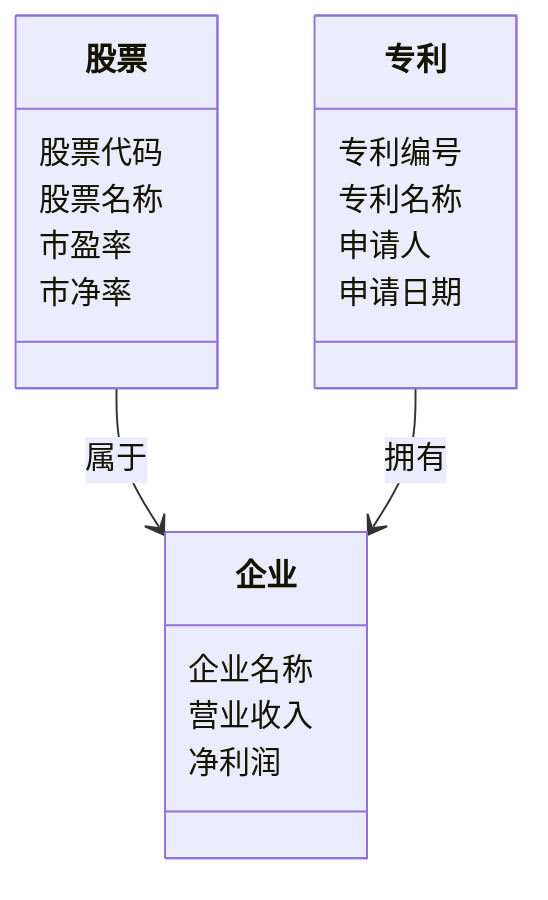
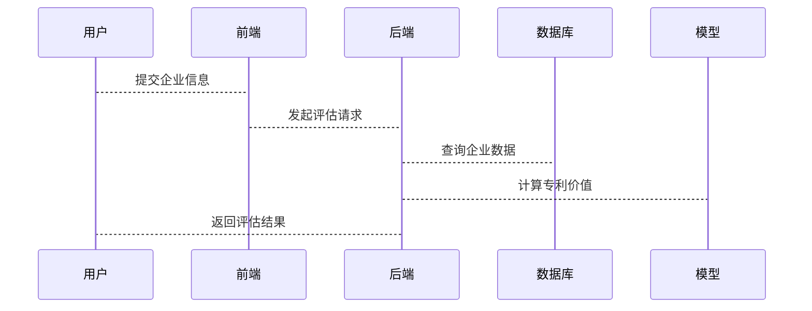

                 


```markdown
# 股市估值在国际专利价值评估中的应用

> 关键词：股市估值、国际专利、价值评估、金融模型、知识产权

> 摘要：本文探讨了股市估值方法在国际专利价值评估中的应用，分析了专利与企业价值的关系，提出了结合股市估值模型的专利评估新方法，并通过案例分析验证了其可行性和有效性。

---

# 第1章: 股市估值与国际专利价值评估的背景与基础

## 1.1 股市估值的核心概念

### 1.1.1 股票估值的基本原理
股票估值是通过对企业财务状况、市场地位和未来盈利能力的分析，确定其股票的合理价格。常用的方法包括市盈率（P/E）、市净率（P/B）和现金流折现模型（DCF）。这些方法帮助投资者评估企业的内在价值。

### 1.1.2 股市估值的主要方法
1. **市盈率（P/E）模型**：通过企业 earnings 和 stock price 的关系，评估股票的价值。
2. **市净率（P/B）模型**：基于企业 book value 和 stock price 的关系，适用于评估资产密集型企业的价值。
3. **现金流折现模型（DCF）**：通过预测未来现金流并将其折现，评估企业的内在价值。

### 1.1.3 股市估值与企业价值的关系
股市估值是市场对企业未来盈利能力的预期，反映了企业的真实价值。合理的估值方法能够帮助投资者识别低估或高估的股票。

## 1.2 国际专利价值评估的基本概念

### 1.2.1 专利的基本定义与特征
专利是保护发明创造的法律工具，具有独占性、地域性和时间性。专利的价值取决于其创新性、市场应用前景和法律保护力度。

### 1.2.2 专利价值评估的主要维度
1. **技术价值**：评估专利的技术创新性和市场竞争力。
2. **经济价值**：评估专利为企业带来的经济收益。
3. **法律价值**：评估专利的法律保护力度和侵权风险。

### 1.2.3 专利在企业创新中的作用
专利是企业核心竞争力的体现，能够为企业带来技术垄断优势，提升市场地位和盈利能力。

## 1.3 股市估值与国际专利价值评估的结合背景

### 1.3.1 科技创新对企业价值的影响
随着科技的发展，专利在企业创新中的作用日益凸显，成为企业价值的重要组成部分。

### 1.3.2 股市对专利价值的敏感性分析
股市对专利价值的敏感性分析表明，专利的数量和质量直接影响企业的股价表现。

### 1.3.3 知识经济时代专利价值的凸显
在知识经济时代，专利作为无形资产的重要组成部分，其价值评估显得尤为重要。

## 1.4 本章小结
本章介绍了股市估值和国际专利价值评估的基本概念，分析了两者之间的联系，并为后续的结合分析奠定了基础。

---

# 第2章: 股市估值与国际专利价值评估的核心概念与联系

## 2.1 股市估值的核心模型与方法

### 2.1.1 市盈率（P/E）模型
$$ P/E = \frac{股票价格}{每股收益} $$
市盈率反映了市场对企业盈利能力的预期，是评估股票价值的重要指标。

### 2.1.2 市净率（P/B）模型
$$ P/B = \frac{股票价格}{每股净资产} $$
市净率适用于评估资产密集型企业，反映了市场对企业资产价值的判断。

### 2.1.3 现金流折现模型（DCF）
DCF模型通过预测未来现金流并折现，计算企业的内在价值：
$$ V = \sum_{t=1}^{n} \frac{CF_t}{(1 + r)^t} $$
其中，\( CF_t \) 是第 \( t \) 年的现金流，\( r \) 是折现率。

## 2.2 国际专利价值评估的关键指标

### 2.2.1 专利的数量与质量评估
专利的数量反映了企业的技术创新能力，而专利的质量则取决于其技术先进性和市场应用前景。

### 2.2.2 专利的经济价值评估
经济价值评估考虑了专利为企业带来的直接和间接收益，包括 licensing 收入和市场垄断优势。

### 2.2.3 专利的市场竞争力分析
市场竞争力分析评估专利在市场中的地位和竞争优势，包括专利的法律保护力度和侵权风险。

## 2.3 股市估值与专利价值评估的关联性分析

### 2.3.1 专利对股价的影响机制
专利通过提升企业的技术创新能力和市场竞争力，影响企业的盈利能力，进而影响股价表现。

### 2.3.2 股市对专利价值的反馈效应
股市对专利价值的反馈效应体现在股价的波动上，反映了市场对专利价值的认可程度。

### 2.3.3 股市估值与专利评估的协同关系
股市估值和专利价值评估在企业价值评估中具有协同关系，共同为企业价值提供全面的评估依据。

## 2.4 核心概念对比分析表

| 对比维度         | 股市估值             | 专利价值评估       |
|------------------|----------------------|--------------------|
| 评估对象         | 企业的整体价值       | 专利的经济价值     |
| 评估方法         | 市盈率、市净率、DCF | 技术价值、经济价值 |
| 关键影响因素     | 财务状况、市场地位   | 技术创新性、法律保护 |

## 2.5 ER实体关系图
```mermaid
er
    entity 股票 {
        key 股票代码
        属性 股票名称, 市盈率, 市净率
    }
    entity 专利 {
        key 专利编号
        属性 专利名称, 申请人, 申请日期
    }
    entity 企业 {
        key 企业名称
        属性 营业收入, 净利润
    }
    股票 --> 企业: 属于
    专利 --> 企业: 拥有
```

## 2.6 本章小结
本章分析了股市估值和专利价值评估的核心概念，探讨了两者之间的联系，并通过对比分析和ER图进一步明确了其关联性。

---

# 第3章: 股市估值与国际专利价值评估的算法原理

## 3.1 股市估值与专利价值评估的结合模型

### 3.1.1 模型构建思路
通过结合股市估值模型和专利价值评估指标，构建一个综合评估模型，用于评估企业的专利价值。

### 3.1.2 综合评估公式
$$ 专利价值 = \alpha \times 市盈率 + \beta \times 专利数量 + \gamma \times 技术创新性 $$
其中，\( \alpha, \beta, \gamma \) 是权重系数。

## 3.2 算法实现步骤

### 3.2.1 数据收集
收集企业的财务数据、专利数据和股价数据。

### 3.2.2 数据预处理
对数据进行清洗和标准化处理，确保数据的准确性和一致性。

### 3.2.3 模型训练
使用历史数据训练模型，确定权重系数。

### 3.2.4 评估与验证
通过实际案例验证模型的准确性和适用性。

## 3.3 Python代码实现

```python
import pandas as pd
from sklearn.linear_model import LinearRegression

# 数据加载与预处理
data = pd.read_csv('patent_value.csv')
X = data[['市盈率', '专利数量', '技术创新性']]
y = data['专利价值']

# 模型训练
model = LinearRegression()
model.fit(X, y)

# 模型评估
print('权重系数:', model.coef_)
print('截距:', model.intercept_)
```

## 3.4 本章小结
本章详细介绍了股市估值与专利价值评估的结合模型，通过算法实现步骤和Python代码示例，展示了如何将股市估值方法应用于专利价值评估。

---

# 第4章: 系统分析与架构设计方案

## 4.1 问题场景介绍
企业需要通过专利价值评估优化资产管理和投资决策，提升企业竞争力。

## 4.2 系统功能设计

### 4.2.1 领域模型


### 4.2.2 系统架构设计


### 4.2.3 系统接口设计
- 前端接口：接收用户输入，返回评估结果。
- 后端接口：处理数据，调用模型进行计算。
- 数据库接口：存储和检索数据。

### 4.2.4 系统交互流程


## 4.3 本章小结
本章通过系统分析与架构设计，明确了专利价值评估系统的功能、架构和交互流程，为后续的系统实现奠定了基础。

---

# 第5章: 项目实战与案例分析

## 5.1 项目环境安装
安装必要的Python库：
```bash
pip install pandas numpy scikit-learn
```

## 5.2 核心代码实现
```python
import pandas as pd
from sklearn.linear_model import LinearRegression

# 数据加载
data = pd.read_csv('patent_value.csv')

# 数据预处理
X = data[['市盈率', '专利数量', '技术创新性']]
y = data['专利价值']

# 模型训练
model = LinearRegression()
model.fit(X, y)

# 案例分析
test_data = pd.DataFrame({
    '市盈率': [15],
    '专利数量': [10],
    '技术创新性': [0.8]
})
predicted_value = model.predict(test_data)
print('预测的专利价值:', predicted_value[0])
```

## 5.3 实际案例分析
以某科技公司为例，通过模型评估其专利价值，分析结果的合理性和实际意义。

## 5.4 本章小结
本章通过项目实战和案例分析，验证了模型的有效性，并展示了如何将股市估值方法应用于国际专利价值评估。

---

# 第6章: 最佳实践与总结

## 6.1 最佳实践 tips
- 数据质量是模型准确性的重要保障。
- 结合企业实际需求选择合适的评估模型。
- 定期更新模型参数，适应市场变化。

## 6.2 小结
本文通过理论分析和实践案例，展示了股市估值方法在国际专利价值评估中的应用，为企业的知识产权管理和投资决策提供了新的思路。

## 6.3 注意事项
- 专利价值评估需要综合考虑多种因素。
- 模型的适用性受限于数据质量和市场环境。

## 6.4 拓展阅读
建议进一步阅读相关领域的文献，深入研究专利价值评估的其他方法和应用场景。

---

# 作者：AI天才研究院/AI Genius Institute & 禅与计算机程序设计艺术 /Zen And The Art of Computer Programming
```

