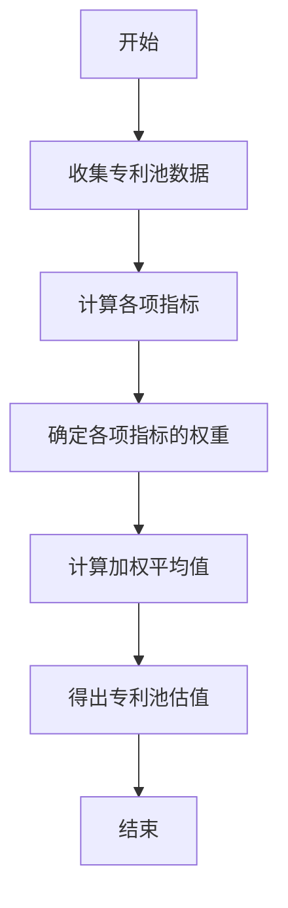
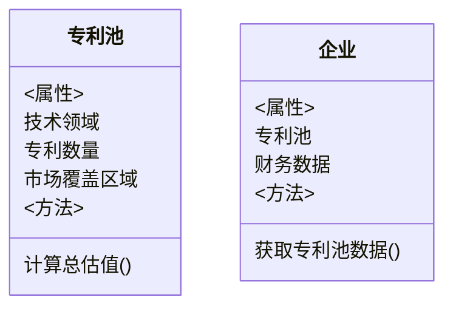

                 


# 股市估值在国际专利池估值中的应用

> 关键词：股市估值、国际专利池、专利池评估、企业价值评估、知识产权估值、专利组合、企业并购

> 摘要：本文探讨了股市估值方法在国际专利池估值中的应用。通过分析股市估值的核心概念和国际专利池的特征，本文提出了将股市估值应用于国际专利池评估的具体方法，并结合实际案例和系统设计，详细阐述了基于权重的专利池估值模型的构建与实现。同时，本文还分析了系统架构设计和项目实现的关键步骤，为读者提供了从理论到实践的全面指导。

---

## 目录大纲

1. [股市估值与国际专利池估值的背景与基础](#股市估值与国际专利池估值的背景与基础)
2. [国际专利池估值的核心概念与原理](#国际专利池估值的核心概念与原理)
3. [国际专利池估值的系统分析与架构设计](#国际专利池估值的系统分析与架构设计)
4. [项目实战：国际专利池估值的实现与案例分析](#项目实战国际专利池估值的实现与案例分析)
5. [小结与注意事项](#小结与注意事项)

---

## 1. 股市估值与国际专利池估值的背景与基础

### 1.1 股市估值的定义与核心要素

股市估值是通过对企业的财务数据、市场表现、行业地位等因素进行分析，以确定企业股票的合理价格或价值区间。其核心要素包括：

- **企业基本面**：收入、利润、资产负债等财务指标。
- **市场因素**：行业趋势、市场情绪、宏观经济环境。
- **估值方法**：市盈率（P/E）、市净率（P/B）、股息率等。

### 1.2 国际专利池的定义与特点

国际专利池是指一组在多个国家或地区申请并获得授权的专利组合。其特点包括：

- **地域性**：专利池中的专利分布在不同国家或地区。
- **技术领域多样性**：专利池覆盖的技术领域广泛，形成多元化组合。
- **协同效应**：专利池中的专利可以相互补充，形成更强的市场竞争力。

### 1.3 股市估值与国际专利池估值的关联性

- **企业知识产权价值**：企业的专利池价值直接影响其市场估值。
- **市场竞争力**：强大的专利池可以提升企业的市场地位和抗风险能力。
- **企业并购中的应用**：在企业并购中，专利池的价值评估是整体估值的重要组成部分。

---

## 2. 国际专利池估值的核心概念与原理

### 2.1 国际专利池估值的核心概念

- **专利池的组成要素**：包括基础专利、外围专利、防御性专利等。
- **专利池的价值评估维度**：技术价值、市场价值、法律风险等。
- **专利池的市场影响力**：专利池的市场影响力决定了其对企业的实际价值。

### 2.2 核心概念与联系的ER实体关系图

```mermaid
er
actor: 读者、企业、投资者
artifact: 专利池、专利、企业财务数据
relationship: 企业拥有专利池，投资者评估专利池价值
```

### 2.3 国际专利池估值的算法原理

#### 2.3.1 算法原理概述

基于权重的专利池估值方法，将专利池的各个评估维度赋予不同的权重，通过加权计算得出最终估值。

#### 2.3.2 算法的 Mermaid 流程图



#### 2.3.3 算法的数学模型与公式

$$ \text{总估值} = \sum_{i=1}^{n} w_i \times v_i $$
其中：
- $$w_i$$ 为第 $$i$$ 项的权重
- $$v_i$$ 为第 $$i$$ 项的估值

---

## 3. 国际专利池估值的系统分析与架构设计

### 3.1 系统分析与设计

#### 3.1.1 问题场景介绍

- 企业需要对其拥有的国际专利池进行估值，以支持企业并购、融资等活动。

#### 3.1.2 领域模型的 Mermaid 类图



#### 3.1.3 系统架构的 Mermaid 架构图


#### 3.1.4 系统接口设计与交互流程

- 数据输入接口：接收专利池数据和财务数据。
- 估值接口：根据输入数据计算专利池估值。
- 结果展示接口：输出估值结果和相关分析报告。

---

## 4. 项目实战：国际专利池估值的实现与案例分析

### 4.1 项目环境与工具安装

- **环境搭建**：安装Python、Jupyter Notebook、相关数据处理库（如Pandas、NumPy）。
- **工具安装**：使用pip安装必要的库，如`mermaid`、`matplotlib`。

### 4.2 系统核心实现源代码

```python
import pandas as pd
import numpy as np

def calculate_pool_value(patent_data, financial_data):
    # 计算各项指标
    metrics = ['技术价值', '市场价值', '法律风险']
    weights = [0.4, 0.3, 0.3]
    # 计算加权平均值
    total_value = sum(w * v for w, v in zip(weights, patent_data))
    return total_value

# 示例数据
patent_data = {'技术价值': 80, '市场价值': 70, '法律风险': 60}
financial_data = {'收入': 1000, '利润': 200}

# 调用函数
pool_value = calculate_pool_value(patent_data, financial_data)
print(f"国际专利池估值为：{pool_value}")
```

### 4.3 代码应用解读与分析

- **代码功能**：上述代码定义了一个计算国际专利池估值的函数，基于加权平均方法，结合技术价值、市场价值和法律风险等因素。
- **数据输入**：patent_data和financial_data分别表示专利池数据和企业财务数据。
- **输出结果**：计算得到的国际专利池估值。

### 4.4 案例分析

假设某企业拥有一组国际专利池，包含以下数据：

| 技术价值 | 市场价值 | 法律风险 |
|----------|----------|----------|
| 80       | 70       | 60       |

调用上述函数，计算得到的国际专利池估值为：

$$ 0.4 \times 80 + 0.3 \times 70 + 0.3 \times 60 = 32 + 21 + 18 = 71 $$

因此，国际专利池的估值为71分（满分100）。

### 4.5 项目小结

通过上述代码和案例分析，我们可以看到，基于权重的专利池估值方法能够有效地结合技术、市场和法律因素，为企业提供准确的估值结果。

---

## 5. 小结与注意事项

### 5.1 小结

本文详细探讨了股市估值方法在国际专利池估值中的应用，从核心概念、算法原理到系统设计和项目实战，为读者提供了全面的指导。通过案例分析，展示了如何将理论应用于实际操作。

### 5.2 注意事项

- **数据准确性**：专利池估值的结果高度依赖于数据的准确性和完整性。
- **权重调整**：根据具体应用场景，可能需要调整各项指标的权重。
- **法律风险评估**：专利池的法律风险需要结合具体国家的专利法和市场环境进行评估。

### 5.3 拓展阅读

建议读者进一步阅读相关领域的最新研究，如人工智能在专利池评估中的应用、区块链技术在知识产权保护中的作用等。

---

作者：AI天才研究院/AI Genius Institute & 禅与计算机程序设计艺术 /Zen And The Art of Computer Programming

