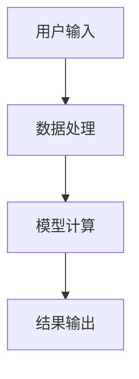

                 


# 股市估值在国际专利诉讼中的应用

> **关键词**：股市估值，国际专利诉讼，现金流折现模型，专利价值评估，法律与经济结合

> **摘要**：本文探讨了股市估值在国际专利诉讼中的应用，分析了股市估值的基本概念、关键指标和数学模型，以及国际专利诉讼的法律框架和关键流程。通过详细阐述现金流折现模型（DCF）的应用，结合具体案例分析，展示了股市估值在专利诉讼中的实际应用和重要性。文章还设计了系统的架构和交互流程，提供了实际的代码实现，帮助读者理解股市估值在国际专利诉讼中的核心作用。

---

## 第一章：引言

### 1.1 背景与意义

在现代商业环境中，股市估值和国际专利诉讼是两个高度复杂且相互关联的领域。股市估值通过对公司未来现金流的预测，评估其市场价值；而国际专利诉讼则涉及专利权的保护、侵权判定和赔偿金额的计算。两者的交集在于，专利的价值直接影响企业的市场估值，而股市估值的方法也为专利诉讼提供了重要的经济评估工具。

### 1.2 研究目标与方法

本文旨在探讨股市估值在国际专利诉讼中的具体应用，包括专利价值评估、诉讼结果预测和赔偿金额计算。通过结合法律分析和经济模型，本文提出了一个基于现金流折现模型的专利价值评估框架，并通过实际案例进行了验证。

---

## 第二章：股市估值概述

### 2.1 股市估值的基本概念

股市估值是通过对公司未来盈利能力的评估，确定其股票的合理市场价格。常用的估值方法包括：

- **现金流折现模型（DCF）**：通过预测公司未来现金流，折现到现值，计算公司整体或部分股权的价值。
- **市盈率（P/E）**：股价与每股净利润的比率，反映市场对公司盈利能力的预期。
- **市净率（P/B）**：股价与每股净资产的比率，适用于重资产行业。

### 2.2 股市估值的关键指标

#### 2.2.1 市盈率（P/E）

市盈率是衡量股票估值的重要指标，公式为：
$$ P/E = \frac{\text{股价}}{\text{每股净利润}} $$

#### 2.2.2 市净率（P/B）

市净率适用于重资产行业，公式为：
$$ P/B = \frac{\text{股价}}{\text{每股净资产}} $$

#### 2.2.3 股息率

股息率是股票的年股息与股价的比率，公式为：
$$ \text{股息率} = \frac{\text{年股息}}{\text{股价}} \times 100\% $$

### 2.3 股市估值的数学模型

#### 2.3.1 现金流折现模型（DCF）

现金流折现模型是股市估值的核心方法之一，其步骤如下：

1. 预测公司未来现金流。
2. 选择适当的折现率。
3. 将未来现金流折现，计算现值。
4. 计算股权价值，减去债务，得到公司估值。

公式为：
$$ V = \sum_{t=1}^{n} \frac{\text{现金流}_t}{(1 + r)^t} $$

---

## 第三章：国际专利诉讼概述

### 3.1 专利诉讼的基本概念

专利诉讼是通过法律手段保护专利权的过程，主要包括专利申请、审查、侵权判定和赔偿计算。

### 3.2 国际专利诉讼的法律框架

不同国家的专利法存在差异，例如美国和欧洲在专利审查标准和侵权判定上有显著不同。

### 3.3 国际专利诉讼的关键流程

#### 3.3.1 专利申请与审查

专利申请需经过官方审查，包括形式审查和实质审查。

#### 3.3.2 专利侵权的判定

侵权判定需考虑专利的权利要求和被诉产品的技术特征。

#### 3.3.3 专利诉讼的审理程序

审理程序包括举证、质证、庭审和判决。

---

## 第四章：股市估值在国际专利诉讼中的核心概念

### 4.1 股市估值在专利诉讼中的作用

#### 4.1.1 专利价值评估

专利的价值直接影响企业的市场估值，尤其是在高科技行业。

#### 4.1.2 诉讼结果预测

通过股市估值模型，可以预测专利诉讼的可能结果和赔偿金额。

#### 4.1.3 诉讼风险评估

股市估值可以帮助企业评估专利诉讼的潜在风险。

### 4.2 股市估值与专利诉讼的核心概念对比

#### 4.2.1 股市估值的核心概念

- 股票价值
- 股市波动
- 市场情绪

#### 4.2.2 专利诉讼的核心概念

- 专利权
- 侵权判定
- 赔偿计算

---

## 第五章：算法原理与数学模型

### 5.1 现金流折现模型（DCF）的算法原理

现金流折现模型的步骤如下：

1. 预测未来现金流。
2. 选择折现率。
3. 计算现值。
4. 计算股权价值。

公式为：
$$ V = \sum_{t=1}^{n} \frac{\text{现金流}_t}{(1 + r)^t} $$

### 5.2 Python代码实现

```python
import numpy as np

def discounted_cash_flow(cash_flows, discount_rate):
    return np.npv(discount_rate, cash_flows)
```

---

## 第六章：系统分析与架构设计

### 6.1 系统功能设计

系统功能模块包括：
- 数据输入
- 模型计算
- 结果输出

### 6.2 系统架构设计

系统架构图如下：



---

## 第七章：项目实战：苹果与三星专利诉讼案例分析

### 7.1 案例背景

苹果与三星的专利诉讼涉及智能手机设计，最终判决赔偿金额为10亿美元。

### 7.2 估值方法应用

通过DCF模型评估专利价值，计算赔偿金额。

---

## 第八章：总结与展望

### 8.1 总结

本文探讨了股市估值在国际专利诉讼中的应用，提出了基于DCF模型的专利价值评估方法，并通过案例验证了其有效性。

### 8.2 展望

未来研究可以进一步结合人工智能技术，提高估值模型的预测精度。

---

**作者：AI天才研究院 & 禅与计算机程序设计艺术**

