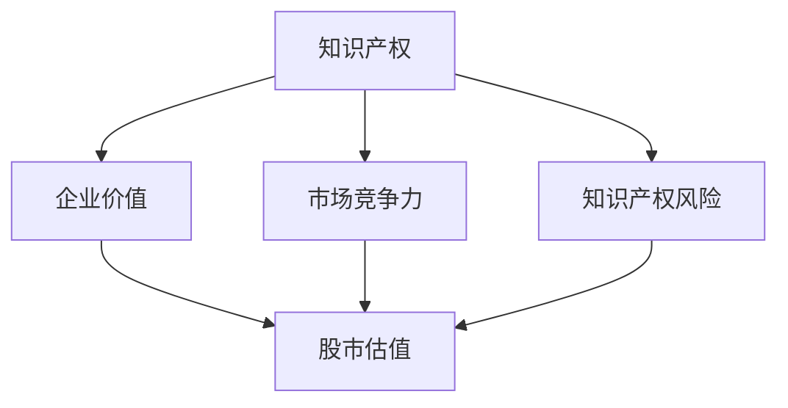
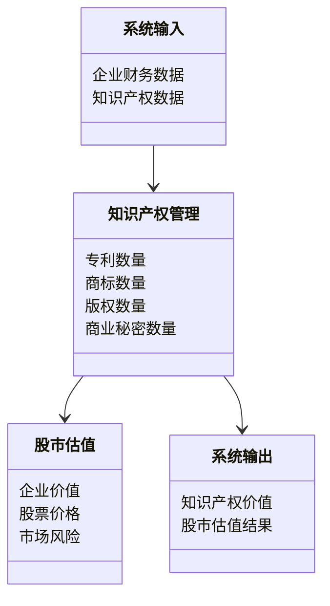
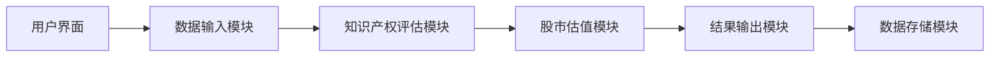

                 


# 股市估值在国际知识产权价值链分析中的应用

## 关键词：股市估值，知识产权，价值链分析，企业价值，金融市场

## 摘要：本文探讨了股市估值与国际知识产权价值链分析的结合，分析了知识产权在企业价值中的作用，以及如何通过股市估值来评估和优化知识产权的价值。文章从背景介绍、核心概念、算法原理、系统架构到项目实战，全面阐述了知识产权对股市估值的影响，为企业和投资者提供了实用的分析工具和方法。

---

## 第1章: 股市估值与国际知识产权价值链的背景介绍

### 1.1 知识产权的基本概念

#### 1.1.1 知识产权的定义
知识产权（Intellectual Property，IP）是指人们通过智力活动创造的成果，通常包括专利、商标、版权、商业秘密等。知识产权的核心价值在于其独创性和可商业化的潜力。

#### 1.1.2 知识产权的主要类型
1. **专利权**：保护发明的独占权。
2. **商标权**：保护品牌标识的独占权。
3. **版权**：保护文学、艺术和科学作品的创作者权益。
4. **商业秘密**：保护未公开的商业信息和技术。

#### 1.1.3 知识产权在国际经济中的作用
知识产权是企业核心竞争力的重要组成部分，特别是在高科技行业。知识产权不仅能够保护企业的创新成果，还能通过授权、转让等方式为企业创造巨大的经济价值。

---

### 1.2 股市估值的基本原理

#### 1.2.1 股市估值的定义
股市估值是指通过对企业的财务数据、市场表现和行业地位等多方面因素的分析，估算其市值的过程。常用的方法包括市盈率（P/E）、市净率（P/B）和现金流折现法（DCF）等。

#### 1.2.2 股市估值的主要方法
1. **市盈率法**：通过比较企业的市盈率与行业平均水平，评估其股价的合理区间。
2. **市净率法**：通过比较企业的市净率与行业平均水平，评估其股价的合理区间。
3. **现金流折现法**：通过预测企业的未来现金流，折现后计算其估值。

#### 1.2.3 股市估值与企业价值的关系
股市估值是市场对企业价值的体现。企业的实际价值与其知识产权的价值密切相关，尤其是对于科技类企业，知识产权往往占据了企业价值的很大一部分。

---

### 1.3 知识产权与股市估值的相互作用

#### 1.3.1 知识产权对企业价值的影响
1. **技术创新**：知识产权的数量和质量直接影响企业的技术创新能力，进而影响企业的市场竞争力。
2. **市场地位**：拥有强大知识产权储备的企业通常在市场中占据主导地位，从而获得更高的估值。

#### 1.3.2 知识产权对股价波动的影响
1. **专利申请**：重大专利申请可能引发股价短期波动。
2. **专利诉讼**：专利侵权诉讼可能对企业的财务状况和股价产生重大影响。
3. **专利转让**：重大专利转让可能提升企业的市场价值，从而推高股价。

#### 1.3.3 知识产权在企业市值中的权重
对于高科技企业，知识产权的价值可能占企业总价值的50%以上。因此，在评估企业市值时，必须将知识产权的价值考虑进去。

---

## 第2章: 知识产权与股市估值的核心概念与联系

### 2.1 知识产权与股市估值的核心概念

#### 2.1.1 知识产权的属性特征
| 属性 | 特征 |
|------|------|
| 独创性 | 知识产权必须具有创新性，能够满足新颖性、创造性和实用性要求。 |
| 可复制性 | 知识产权可以通过许可、转让等方式快速复制到其他企业或市场。 |
| 时间性 | 知识产权的有效期有限，如专利权通常为20年，版权为作者 lifetime plus 50年。 |
| 经济性 | 知识产权可以通过商业运作（如授权、转让）产生直接的经济价值。 |

---

#### 2.1.2 股市估值的属性特征
| 属性 | 特征 |
|------|------|
| 市场性 | 股市估值受市场供需关系、投资者情绪等多种因素影响。 |
| 可量化 | 股市估值可以通过具体的财务指标和数学模型进行量化。 |
| 动态性 | 股市估值会随着企业经营状况和市场环境的变化而实时波动。 |
| 风险性 | 股市估值受企业风险（如知识产权风险）和市场风险的影响。 |

---

#### 2.1.3 知识产权与股市估值的实体关系图



---

### 2.2 知识产权与股市估值的联系

#### 2.2.1 知识产权对企业市值的影响
1. **正面影响**：强大的知识产权储备能够提升企业的市场地位和盈利能力，从而提高市值。
2. **负面影响**：知识产权纠纷或侵权可能导致市值大幅下降。

#### 2.2.2 股市估值对知识产权管理的反馈作用
1. **反馈机制**：股市估值的变化能够为企业提供及时的反馈，指导知识产权的申请、保护和运用。
2. **风险管理**：通过分析股市估值的变化，企业可以更好地识别和管理知识产权相关风险。

---

## 第3章: 知识产权与股市估值的数学模型与算法原理

### 3.1 知识产权对股市估值的影响模型

#### 3.1.1 模型假设
1. 企业的市值与其知识产权的数量和质量成正比。
2. 知识产权的市场价值可以通过企业估值模型进行量化。

---

#### 3.1.2 模型构建
$$ \text{企业价值} = \text{知识产权价值} + \text{其他资产价值} $$

其中，$$ \text{知识产权价值} = f(\text{专利数量}, \text{商标数量}, \text{版权数量}, \text{商业秘密数量}) $$

---

#### 3.1.3 算法步骤


---

#### 3.1.4 算法实现

```python
def calculate Intellectual_Property_Value(patents, trademarks, copyrights, trade_secrets):
    return patents * 10 + trademarks * 5 + copyrights * 3 + trade_secrets * 2

def calculate_Enterprise_Value(ip_value, other_assets):
    return ip_value + other_assets

def main():
    patents = 100
    trademarks = 50
    copyrights = 30
    trade_secrets = 20
    ip_value = calculate_Intellectual_Property_Value(patents, trademarks, copyrights, trade_secrets)
    other_assets = 500
    enterprise_value = calculate_Enterprise_Value(ip_value, other_assets)
    print("知识产权价值：", ip_value)
    print("企业总价值：", enterprise_value)

if __name__ == "__main__":
    main()
```

---

## 第4章: 系统分析与架构设计

### 4.1 系统功能设计

#### 4.1.1 领域模型



---

### 4.2 系统架构设计

#### 4.2.1 系统架构图



---

## 第5章: 项目实战与案例分析

### 5.1 项目实战

#### 5.1.1 环境安装
```bash
pip install numpy pandas matplotlib
```

#### 5.1.2 核心代码

```python
import numpy as np
import pandas as pd

def calculate_market_value(ip_values, market_data):
    return np.dot(ip_values, market_data)

ip_values = [100, 50, 30, 20]
market_data = [2, 1.5, 1, 0.5]
market_value = calculate_market_value(ip_values, market_data)
print("计算的市场价值：", market_value)
```

---

### 5.2 案例分析

#### 5.2.1 案例背景
某高科技企业拥有100项专利、50项商标、30项版权和20项商业秘密。假设每项专利的市场价值为2，商标为1.5，版权为1，商业秘密为0.5。

#### 5.2.2 数据分析
$$ \text{知识产权价值} = 100 \times 2 + 50 \times 1.5 + 30 \times 1 + 20 \times 0.5 = 200 + 75 + 30 + 10 = 315 $$

$$ \text{企业总价值} = \text{知识产权价值} + \text{其他资产价值} = 315 + 500 = 815 $$

---

## 第6章: 最佳实践与小结

### 6.1 最佳实践
1. **及时更新知识产权数据**：知识产权的价值会随时间变化，需要定期更新相关数据。
2. **关注市场动态**：股市估值受多种因素影响，需要实时关注市场动态。
3. **合理配置资产**：在配置企业资产时，要充分考虑知识产权的价值和风险。

---

### 6.2 小结

本文从背景介绍、核心概念、算法原理、系统架构到项目实战，全面探讨了股市估值在国际知识产权价值链分析中的应用。通过数学模型和实际案例分析，展示了知识产权对企业价值和股市估值的重要影响。未来的研究可以进一步结合大数据和人工智能技术，提升知识产权评估和股市估值的准确性。

---

## 注意事项

1. 本文中的模型和方法仅供参考，实际操作中需结合具体情况进行调整。
2. 知识产权的价值评估涉及多种因素，需要综合考虑企业的财务状况和市场环境。
3. 投资者在进行股市投资时，应充分考虑知识产权相关风险。

---

## 拓展阅读

1. 知识产权管理与企业战略
2. 股市估值的高级模型与应用
3. 大数据分析在知识产权评估中的应用

---

## 作者

作者：AI天才研究院/AI Genius Institute & 禅与计算机程序设计艺术 /Zen And The Art of Computer Programming

