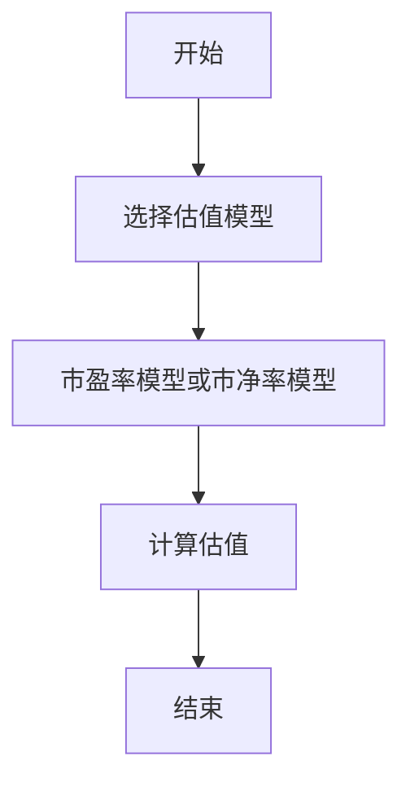
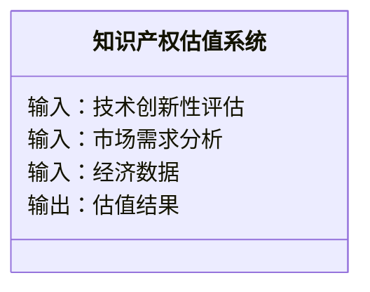
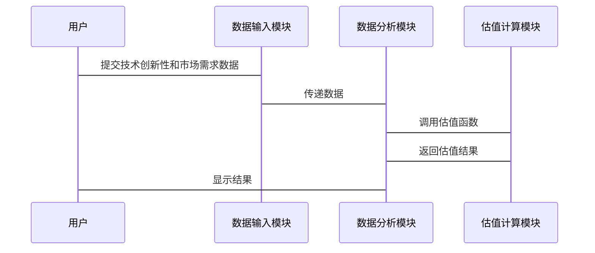

                 


# 股市估值在国际知识产权估值中的应用

**关键词：** 股市估值、知识产权估值、知识产权评估、市盈率模型、市净率模型

**摘要：** 本文探讨了如何将股市估值方法应用于国际知识产权评估，分析了知识产权的核心要素及其估值的理论基础，结合实际案例详细讲解了基于市盈率和市净率模型的估值方法，并提出了系统的架构设计与实现方案。

---

# 第1章 知识产权估值概述

## 1.1 知识产权的基本概念与特征

### 1.1.1 知识产权的定义

知识产权是指个人或企业在创新成果（如专利、商标、版权等）上所拥有的法律权利，其价值取决于其技术创新性、市场潜力和法律保护力度。

### 1.1.2 知识产权的特征

- **独占性**：知识产权具有排他性，未经授权他人不得使用。
- **时间性**：知识产权的有效期有限，如专利通常为20年。
- **地域性**：知识产权的保护具有地域性，需在不同国家申请。

## 1.2 知识产权估值的核心要素

### 1.2.1 技术创新性评估

技术创新性是决定知识产权价值的关键因素，包括技术的先进性、实用性以及市场替代性。

### 1.2.2 市场需求分析

市场需求是知识产权经济价值的重要影响因素，包括市场规模、竞争程度和产品生命周期。

## 1.3 知识产权估值与股市估值的关联性

### 1.3.1 股市估值方法的借鉴

股市估值中的市盈率（PE）和市净率（PB）模型可为知识产权估值提供参考。

### 1.3.2 知识产权在企业价值中的地位

知识产权是企业核心竞争力的重要组成部分，其价值在企业整体估值中占据重要地位。

---

# 第2章 知识产权估值的理论基础

## 2.1 知识产权估值的基本模型

### 2.1.1 成本法模型

成本法通过估算知识产权的开发成本来评估其价值，公式为：

$$ \text{价值} = \text{开发成本} \times (1 + \text{利润率}) $$

### 2.1.2 市场法模型

市场法通过比较同类知识产权的交易价格来评估价值，公式为：

$$ \text{价值} = \text{可比交易的平均价格} \times \text{修正系数} $$

### 2.1.3 收益法模型

收益法通过预测知识产权带来的未来收益折现至当前价值，公式为：

$$ \text{价值} = \frac{\text{未来收益}}{\text{折现率}} $$

## 2.2 股市估值方法的借鉴与改进

### 2.2.1 市盈率模型的适用性分析

市盈率模型适用于高增长行业，公式为：

$$ PE = \frac{\text{股价}}{\text{每股收益}} $$

### 2.2.2 市净率模型的适用性分析

市净率模型适用于资产密集型行业，公式为：

$$ PB = \frac{\text{股价}}{\text{每股净资产}} $$

---

# 第3章 知识产权估值的数学模型与算法

## 3.1 基于市盈率的知识产权估值模型

### 3.1.1 模型假设

假设知识产权的未来收益可预测，公式为：

$$ \text{估值} = \text{市盈率} \times \text{每股收益} $$

### 3.1.2 案例分析

某科技公司专利的市盈率为20，每股收益为1元，估值为20元。

## 3.2 基于市净率的知识产权估值模型

### 3.2.1 模型假设

假设知识产权的资产价值可量化，公式为：

$$ \text{估值} = \text{市净率} \times \text{每股净资产} $$

### 3.2.2 案例分析

某公司的市净率为3，每股净资产为5元，估值为15元。

## 3.3 算法流程图（Mermaid）



---

# 第4章 知识产权估值系统分析

## 4.1 系统功能设计

### 4.1.1 功能模块

- 数据输入模块：接收技术创新性和市场需求数据。
- 估值计算模块：应用市盈率或市净率模型计算估值。
- 结果输出模块：展示估值结果。

### 4.1.2 领域模型设计（Mermaid 类图）



## 4.2 系统架构设计

### 4.2.1 系统架构图（Mermaid 架构图）


## 4.3 系统接口设计

### 4.3.1 接口定义

- 输入接口：技术创新性评估、市场需求分析、经济数据。
- 输出接口：估值结果。

---

# 第5章 项目实战：知识产权估值系统实现

## 5.1 环境配置

### 5.1.1 技术选型

- 开发语言：Python
- 数据库：MySQL
- 开发框架：Django

## 5.2 核心代码实现

### 5.2.1 估值计算模块

```python
def calculate_pe_value(pe_ratio, eps):
    return pe_ratio * eps

def calculate_pb_value(pb_ratio, bvps):
    return pb_ratio * bvps
```

### 5.2.2 数据分析模块

```python
import pandas as pd

data = pd.DataFrame({
    '技术创新性': [0.8, 0.9, 0.7],
    '市场需求': [0.6, 0.8, 0.5]
})
```

## 5.3 系统交互流程图（Mermaid 序列图）



## 5.4 实际案例分析

### 5.4.1 案例背景

某科技公司拥有一项关键专利，技术创新性评分为0.9，市场需求评分为0.8，市盈率为25，每股收益为1.2元。

### 5.4.2 估值计算

使用市盈率模型计算：

$$ \text{估值} = 25 \times 1.2 = 30 \text{元} $$

---

# 第6章 总结与展望

## 6.1 本章小结

本文详细探讨了股市估值方法在知识产权评估中的应用，通过数学模型和系统设计展示了其实现过程。

## 6.2 注意事项

- 数据的准确性和完整性对估值结果影响重大。
- 需根据具体行业特点选择合适的估值模型。

## 6.3 未来研究方向

- 研究多因素模型在知识产权估值中的应用。
- 探讨人工智能技术对估值过程的优化。

---

**作者：AI天才研究院/AI Genius Institute & 禅与计算机程序设计艺术/Zen And The Art of Computer Programming**

