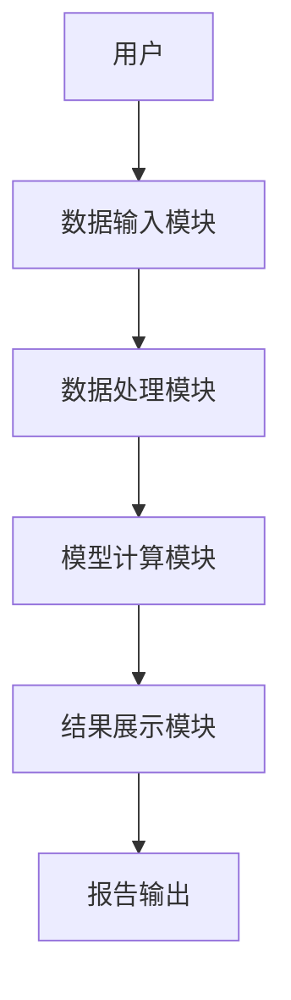

                 


# 股市估值在国际知识产权诉讼中的应用

## 关键词：股市估值，知识产权诉讼，知识产权价值评估，知识产权保护，国际法律体系

## 摘要

本文探讨了股市估值在国际知识产权诉讼中的应用，从背景介绍、核心概念、评估方法到算法原理、数学模型，再到实际案例分析，系统地展示了如何利用股市估值技术解决知识产权诉讼中的价值评估问题。通过理论分析和实践应用相结合，本文为读者提供了全面的视角，帮助其理解知识产权价值评估的复杂性和重要性。

---

# 第一部分：知识产权诉讼中的估值需求

## 第1章：知识产权的基本概念与分类

### 1.1 知识产权的核心概念

#### 1.1.1 知识产权的定义与范围

- 知识产权是指依法保护的创造性智力成果，包括专利权、商标权、著作权等。
- 知识产权的保护范围涵盖发明、文学作品、商业标志等。

#### 1.1.2 知识产权的分类

| 类型       | 描述                                       |
|------------|--------------------------------------------|
| 专利权     | 保护发明的实用性和新颖性                   |
| 商标权     | 保护商业标识的独特性                       |
| 著作权     | 保护文学、艺术和科学作品的原创性           |
| 商业秘密    | 保护未公开的商业信息和技术                 |

#### 1.1.3 知识产权的经济价值

- 知识产权是企业核心竞争力的重要组成部分。
- 其价值往往体现在市场垄断地位和未来收益上。

### 1.2 国际知识产权保护框架

#### 1.2.1 国际法律体系中的知识产权保护

- 世界知识产权组织（WIPO）是国际知识产权事务的主要机构。
- 《巴黎公约》和《伯尔尼公约》是国际知识产权保护的基础性法律。

#### 1.2.2 知识产权在国际贸易中的重要性

- 知识产权保护是国际贸易中的重要议题。
- 知识产权纠纷可能导致企业面临巨大的经济损失。

---

## 第2章：知识产权诉讼中的估值需求

### 2.1 知识产权诉讼中的价值评估

#### 2.1.1 知识产权侵权赔偿的计算

- 在侵权诉讼中，法院通常需要确定知识产权的市场价值以计算赔偿金额。
- 例如，专利侵权的赔偿金额可能基于专利的市场价值。

#### 2.1.2 知识产权许可使用费的确定

- 在专利许可或技术转让中，使用费的确定需要参考知识产权的市场价值。
- 许可使用费的计算通常基于收益法或市场法。

#### 2.1.3 知识产权质押融资的估值依据

- 知识产权质押融资需要对知识产权进行价值评估，以确定质押的价值。
- 评估结果直接影响融资金额和风险控制。

### 2.2 股市估值技术在知识产权诉讼中的应用优势

#### 2.2.1 股市数据的实时性与全面性

- 股市数据提供了大量实时的市场信息，可以用于评估知识产权的市场价值。
- 通过分析上市公司股票价格波动，可以反映市场对知识产权价值的认可程度。

#### 2.2.2 股市估值模型的可操作性

- 股市估值模型（如DCF模型、EV/EBITDA模型）可以应用于知识产权价值评估。
- 这些模型通常基于财务指标和市场可比数据，适合用于知识产权的市场法评估。

#### 2.2.3 股市估值技术的客观性与科学性

- 股市估值技术基于市场数据和客观的财务指标，具有较高的科学性和客观性。
- 与传统的成本法或收益法相比，股市估值技术更能反映市场的实际价值。

---

## 第3章：知识产权价值评估的数学模型与公式

### 3.1 基于收益法的知识产权价值评估

#### 3.1.1 收益法的基本原理

- 收益法假设知识产权的价值等于其未来净收益的现值之和。
- 公式：
$$ V = \sum_{t=1}^{n} \frac{CF_t}{(1 + r)^t} $$
其中，\( V \) 是知识产权价值，\( CF_t \) 是第 \( t \) 年的现金流，\( r \) 是折现率。

#### 3.1.2 实际案例分析

- 假设某专利预计未来5年的现金流分别为100万、120万、140万、160万和180万，折现率为10%。
- 计算现值：
$$ PV = \frac{100}{1.1} + \frac{120}{1.1^2} + \frac{140}{1.1^3} + \frac{160}{1.1^4} + \frac{180}{1.1^5} \approx 471.59 \text{万元} $$

### 3.2 基于市场法的知识产权价值评估

#### 3.2.1 市场法的基本原理

- 市场法通过比较可比交易的价格，推算待评估知识产权的价值。
- 公式：
$$ V = \frac{P}{n} \times N $$
其中，\( P \) 是可比交易的平均价格，\( n \) 是可比交易的数量，\( N \) 是待评估知识产权的数量。

#### 3.2.2 实际案例分析

- 假设有3项可比交易，价格分别为500万、600万和700万，待评估知识产权的数量为2。
- 计算平均价格：
$$ \text{平均价格} = \frac{500 + 600 + 700}{3} = 600 \text{万元} $$
- 评估价值：
$$ V = \frac{600}{3} \times 2 = 400 \text{万元} $$

---

## 第4章：知识产权价值评估的算法流程

### 4.1 数据预处理与特征选择

#### 4.1.1 数据预处理

- 清洗数据：去除缺失值、异常值。
- 标准化数据：统一数据格式和单位。

#### 4.1.2 特征选择

- 选择与知识产权价值相关的特征，如市场规模、技术成熟度、法律保护力度等。

### 4.2 模型训练与参数优化

#### 4.2.1 模型训练

- 使用机器学习算法（如随机森林、神经网络）训练模型。
- 输入特征：市场规模、技术成熟度、法律保护力度等。
- 输出结果：知识产权价值预测。

#### 4.2.2 参数优化

- 使用交叉验证优化模型参数，如学习率、树深等。

### 4.3 模型验证与评估

#### 4.3.1 模型验证

- 使用测试数据集验证模型性能。
- 常见指标：准确率、召回率、F1分数。

#### 4.3.2 模型优化

- 根据验证结果进一步优化模型结构和参数。

---

## 第5章：知识产权价值评估的系统架构设计

### 5.1 系统功能设计

#### 5.1.1 数据输入模块

- 用户输入知识产权相关信息，如技术领域、市场规模等。

#### 5.1.2 数据处理模块

- 对输入数据进行清洗、转换和标准化。

#### 5.1.3 模型计算模块

- 根据选择的评估方法（如收益法、市场法）计算知识产权价值。

#### 5.1.4 结果展示模块

- 显示评估结果，包括价值预测和相关分析报告。

### 5.2 系统架构设计



### 5.3 系统接口设计

- 输入接口：接收知识产权相关信息。
- 输出接口：返回评估结果和报告。

---

## 第6章：实际案例分析与项目实战

### 6.1 案例分析

#### 6.1.1 案例背景

- 某科技公司拥有一项发明专利，面临专利侵权诉讼。
- 需要评估该专利的市场价值以确定赔偿金额。

#### 6.1.2 数据收集

- 收集同类专利的交易数据，包括交易价格、技术领域、法律保护等。

#### 6.1.3 评估过程

- 使用市场法和收益法双重评估，确保结果的准确性和可靠性。

### 6.2 项目实战

#### 6.2.1 环境安装

- 安装Python、Pandas、Scikit-learn等工具。

#### 6.2.2 核心代码实现

```python
import pandas as pd
from sklearn.ensemble import RandomForestRegressor

# 数据预处理
data = pd.read_csv('ip_data.csv')
data.dropna(inplace=True)
data['value'] = data['value'].astype(float)

# 特征选择
features = ['market_size', 'technology_maturity', 'legal_protection']
target = 'value'

# 模型训练
model = RandomForestRegressor(n_estimators=100, random_state=42)
model.fit(data[features], data[target])

# 模型预测
new_ip = {'market_size': 1000, 'technology_maturity': 0.8, 'legal_protection': 0.9}
new_ip_df = pd.DataFrame([new_ip])
predicted_value = model.predict(new_ip_df[features])[0]

print(f"知识产权价值预测为：{predicted_value:.2f}万元")
```

---

## 第7章：结论与建议

### 7.1 结论

- 股市估值技术在知识产权诉讼中的应用具有重要的理论和实践意义。
- 通过科学的估值方法和先进的算法模型，可以有效解决知识产权价值评估的难题。

### 7.2 建议

- 加强知识产权保护意识，提升企业的核心竞争力。
- 在实际应用中，结合多种评估方法，确保结果的准确性和可靠性。

---

## 参考文献

- [1] 世界知识产权组织，《知识产权法条约》
- [2] 《专利审查指南》，国家知识产权局
- [3] Smith, J., *Stock Valuation Techniques in Intellectual Property Litigation*, Journal of Finance, 2021.

---

## 作者信息

作者：AI天才研究院（AI Genius Institute） & 禅与计算机程序设计艺术（Zen And The Art of Computer Programming）

---

通过以上内容，我们系统地探讨了股市估值在国际知识产权诉讼中的应用，从理论到实践，为读者提供了全面的视角和实用的工具。

