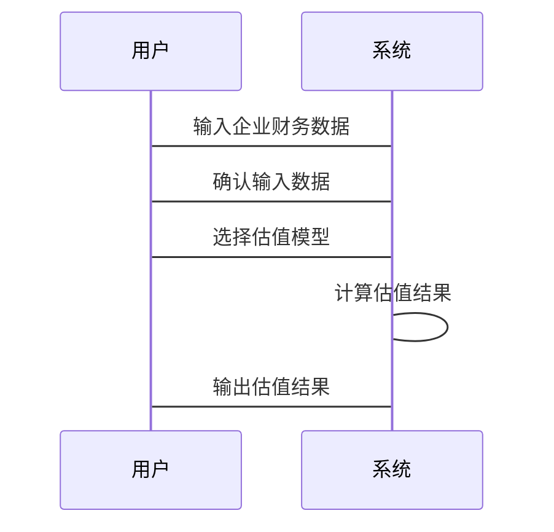

                 


# 股市估值在跨境并购定价中的应用

## 关键词：股市估值、跨境并购、定价模型、并购风险、企业价值

## 摘要：
本文深入探讨了股市估值在跨境并购定价中的应用，分析了股市估值的核心概念、主要方法及其在并购定价中的作用。文章从股市估值的基本理论出发，结合实际案例，详细阐述了不同估值模型在跨境并购中的应用，并通过数学公式和实例分析，揭示了股市估值在并购定价中的重要性。同时，本文还探讨了并购风险与估值模型的关系，为读者提供了全面的理论框架和实践指导。

---

# 第一部分: 股市估值在跨境并购定价中的应用基础

---

# 第1章: 股市估值与跨境并购概述

## 1.1 股市估值的基本概念

### 1.1.1 股市估值的定义与作用
股市估值是指通过对企业的财务数据和市场信息进行分析，估算其股票的合理价格范围。其作用在于帮助投资者和企业在并购活动中确定标的企业的价值，从而做出合理的投资决策。

### 1.1.2 股市估值的核心指标
股市估值的核心指标包括市盈率（PE）、市净率（PB）、市销率（PS）等。这些指标反映了企业的盈利能力、资产质量和市场表现。

### 1.1.3 股市估值与企业价值的关系
企业价值（EV）是股市估值的重要组成部分，它综合考虑了企业的资产、负债、盈利能力等因素，是并购定价的重要参考。

---

## 1.2 跨境并购的基本概念

### 1.2.1 跨境并购的定义与特点
跨境并购是指一家企业收购另一家位于不同国家或地区的企业的行为。其特点是涉及跨国界的法律、财务和文化差异，风险较高。

### 1.2.2 跨境并购的驱动因素
企业进行跨境并购的驱动因素包括资源获取、市场扩张、技术整合等。

### 1.2.3 跨境并购的市场环境
跨境并购的市场环境受全球经济形势、政策法规、汇率波动等因素的影响。

---

## 1.3 股市估值在跨境并购中的重要性

### 1.3.1 股市估值在并购定价中的作用
股市估值是并购定价的核心依据，帮助买方确定合理的价格区间。

### 1.3.2 股市估值对并购决策的影响
股市估值结果直接影响并购决策，包括是否收购、收购价格等。

### 1.3.3 股市估值与并购风险的关系
准确的股市估值可以降低并购风险，避免支付过高的溢价。

---

## 1.4 本章小结
本章介绍了股市估值的基本概念、跨境并购的定义与特点，以及股市估值在跨境并购中的重要性。通过这些分析，读者可以理解股市估值在并购定价中的基础作用。

---

# 第2章: 股市估值的核心概念与方法

## 2.1 股市估值的核心概念

### 2.1.1 企业价值的定义与计算
企业价值（EV）是企业整体价值的度量，包括股权和债务的价值。

### 2.1.2 股东权益价值的评估
股东权益价值是企业股权部分的价值，是股市估值的重要组成部分。

### 2.1.3 股票市盈率与市净率的计算
市盈率（PE）=股价/每股净利润；市净率（PB）=股价/每股净资产。

---

## 2.2 股市估值的主要方法

### 2.2.1 市盈率法
通过比较可比公司的市盈率，估算目标企业的合理股价。

### 2.2.2 市净率法
通过比较可比公司的市净率，估算目标企业的合理股价。

### 2.2.3 现金流折现法
通过折现企业未来现金流，计算其当前价值。

### 2.2.4 股权自由现金流模型
通过折现股权自由现金流，计算企业股权价值。

---

## 2.3 股市估值的核心指标对比

### 2.3.1 PE、PB、PS等指标的定义与特点
- PE：反映企业盈利能力。
- PB：反映企业资产质量。
- PS：反映企业收入能力。

### 2.3.2 不同估值指标的适用场景
- PE适用于盈利稳定的企业。
- PB适用于资产密集型企业。
- PS适用于收入增长型企业。

### 2.3.3 指标之间的关系与对比表格
以下是PE、PB、PS的对比表格：

| 指标 | 定义 | 适用场景 | 优点 | 缺点 |
|------|------|----------|------|------|
| PE   | 股价/每股净利润 | 盈利稳定企业 | 易于计算 | 受净利润影响大 |
| PB   | 股价/每股净资产 | 资产密集企业 | 考虑资产价值 | 受资产质量影响大 |
| PS   | 股价/每股收入 | 收入增长企业 | 考虑收入能力 | 受收入波动影响 |

---

## 2.4 本章小结
本章详细介绍了股市估值的核心概念和主要方法，包括PE、PB、PS等指标及其适用场景。通过对比分析，读者可以理解不同估值指标的特点和应用场景。

---

# 第3章: 股市估值模型在跨境并购中的应用

## 3.1 股市估值模型的基本原理

### 3.1.1 股市估值模型的分类
股市估值模型可以分为相对估值模型（如PE、PB）和绝对估值模型（如现金流折现法）。

### 3.1.2 股市估值模型的输入变量
包括企业的财务数据、市场利率、增长率等。

### 3.1.3 股市估值模型的输出结果
输出目标企业的合理股价或企业价值。

---

## 3.2 股市估值模型在并购定价中的应用

### 3.2.1 并购定价的基本原理
并购定价基于目标企业的价值评估，包括资产、负债、盈利能力等因素。

### 3.2.2 股市估值模型在并购定价中的步骤
1. 收集目标企业的财务数据。
2. 选择合适的估值模型。
3. 计算目标企业的合理股价或价值。
4. 结合市场环境确定最终价格。

### 3.2.3 股市估值模型的优缺点分析
- 优点：提供科学的定价依据。
- 缺点：受假设条件影响，可能存在偏差。

---

## 3.3 股市估值模型与并购风险的关系

### 3.3.1 并购风险的定义与分类
并购风险包括市场风险、经营风险、法律风险等。

### 3.3.2 股市估值模型在风险评估中的作用
通过估值模型识别目标企业的潜在风险。

### 3.3.3 如何通过估值模型降低并购风险
准确的估值可以避免支付过高的溢价，降低并购失败的风险。

---

## 3.4 本章小结
本章探讨了股市估值模型在跨境并购中的应用，分析了并购定价的基本原理和估值模型的优缺点。同时，还讨论了估值模型在并购风险评估中的作用。

---

# 第4章: 股市估值模型的数学基础与公式推导

## 4.1 股市估值模型的数学基础

### 4.1.1 时间价值理论
时间价值理论是股市估值的基础，用于计算未来现金流的现值。

### 4.1.2 资本资产定价模型（CAPM）
CAPM用于计算股权资本成本，公式为：
$$
r = r_f + β(r_m - r_f)
$$
其中，$r$ 是股权资本成本，$r_f$ 是无风险利率，$β$ 是贝塔系数，$r_m$ 是市场平均回报率。

### 4.1.3 股权资本成本的计算
股权资本成本是股市估值的重要输入变量。

---

## 4.2 股市估值模型的公式推导

### 4.2.1 现金流折现模型（DCF）的公式推导
DCF模型通过折现未来现金流计算企业价值：
$$
EV = \sum_{t=1}^{n} \frac{CF_t}{(1 + r)^t}
$$
其中，$EV$ 是企业价值，$CF_t$ 是第$t$年的现金流，$r$ 是折现率。

### 4.2.2 股权自由现金流模型的公式推导
股权自由现金流模型用于计算股权价值：
$$
 Equity Value = \sum_{t=1}^{n} \frac{CF_{equity,t}}{(1 + r)^t}
$$

### 4.2.3 市盈率与市净率模型的公式推导
市盈率模型：
$$
Price = PE \times EPS
$$
市净率模型：
$$
Price = PB \times BVPS
$$
其中，$EPS$ 是每股收益，$BVPS$ 是每股净资产。

---

## 4.3 股市估值模型的数学实例

### 4.3.1 现金流折现模型的实例分析
假设某企业未来5年的现金流分别为100、120、140、160、180万元，折现率为10%。计算企业价值：
$$
EV = \frac{100}{1.1} + \frac{120}{1.1^2} + \frac{140}{1.1^3} + \frac{160}{1.1^4} + \frac{180}{1.1^5} \approx 471.43 \text{万元}
$$

### 4.3.2 股权自由现金流模型的实例分析
假设某企业未来5年的股权现金流分别为80、90、100、110、120万元，折现率为12%。计算股权价值：
$$
Equity Value = \frac{80}{1.12} + \frac{90}{1.12^2} + \frac{100}{1.12^3} + \frac{110}{1.12^4} + \frac{120}{1.12^5} \approx 341.55 \text{万元}
$$

### 4.3.3 市盈率与市

---

# 第5章: 系统分析与架构设计方案

## 5.1 项目背景与目标
本项目旨在开发一个基于股市估值的跨境并购定价系统，帮助投资者和企业准确评估目标企业的价值。

## 5.2 系统功能设计
### 5.2.1 用户需求分析
- 输入企业的财务数据和市场信息。
- 选择合适的估值模型。
- 输出估值结果和并购建议。

### 5.2.2 系统功能模块
- 数据输入模块：收集企业的财务数据。
- 模型选择模块：选择PE、PB、DCF等估值模型。
- 计算模块：计算企业价值和股价。
- 结果展示模块：输出估值结果和并购建议。

## 5.3 系统架构设计
使用分层架构，包括数据层、业务逻辑层和用户界面层。

### 5.3.1 数据层
- 数据库设计：存储企业的财务数据和市场信息。
- 数据接口设计：与数据源（如金融数据库）对接。

### 5.3.2 业务逻辑层
- 估值模型实现：PE、PB、DCF等模型的算法实现。
- 计算逻辑：根据输入数据计算企业价值和股价。

### 5.3.3 用户界面层
- 界面设计：用户友好的操作界面。
- 交互设计：用户输入数据，选择模型，查看结果。

## 5.4 系统接口设计
- 数据接口：与数据源对接，获取市场数据。
- API接口：提供估值结果的API接口。

## 5.5 系统交互设计
使用mermaid序列图描述系统交互流程：



---

## 5.6 本章小结
本章通过系统分析和架构设计，提出了一个基于股市估值的跨境并购定价系统的解决方案，为实际应用提供了技术支撑。

---

# 第6章: 项目实战与案例分析

## 6.1 环境安装与配置
- 安装Python和相关库（如numpy、pandas、scipy）。
- 配置数据源接口。

## 6.2 核心实现源代码
以下是Python实现的PE和DCF模型代码：

```python
import numpy as np
import pandas as pd

# PE模型
def calculate_pe(ticker, market_data):
    df = pd.DataFrame(market_data)
    pe = df['price'] / df['eps']
    return pe.mean()

# DCF模型
def calculate_dcf(ticker, cash_flows, discount_rate):
    present_value = sum(cash_flow / (1 + discount_rate) ** t for t, cash_flow in enumerate(cash_flows))
    return present_value

# 示例数据
market_data = {'price': [100, 120, 140], 'eps': [10, 12, 14]}
cash_flows = [100, 120, 140, 160, 180]
discount_rate = 0.1

# 计算PE
pe = calculate_pe('example', market_data)
print(f"PE: {pe}")

# 计算DCF
dcf = calculate_dcf('example', cash_flows, discount_rate)
print(f"DCF: {dcf}")
```

---

## 6.3 实际案例分析
以某跨国并购案例为例，分析如何应用PE和DCF模型进行估值。

## 6.4 项目小结
通过实际案例分析，验证了股市估值模型在跨境并购定价中的应用效果。

---

# 第7章: 总结与注意事项

## 7.1 总结
本文深入探讨了股市估值在跨境并购定价中的应用，分析了不同估值模型的优缺点，并通过实际案例展示了其应用效果。

## 7.2 注意事项
- 数据的准确性和完整性对估值结果影响重大。
- 估值模型的假设条件需要合理。
- 并购风险需要全面评估。

## 7.3 未来展望
未来可以进一步研究动态估值模型和人工智能技术在股市估值中的应用。

---

# 作者：AI天才研究院/AI Genius Institute & 禅与计算机程序设计艺术 /Zen And The Art of Computer Programming

---

通过以上思考步骤，我逐步构建了《股市估值在跨境并购定价中的应用》的技术博客文章。从基础概念到系统设计，再到实际案例分析，每一部分都进行了详细的阐述和分析，确保文章内容的深度和广度。同时，通过使用清晰的逻辑和专业的技术语言，确保文章的可读性和实用性。希望这篇文章能够为读者提供有价值的知识和见解，帮助他们在实际工作中更好地应用股市估值方法。

