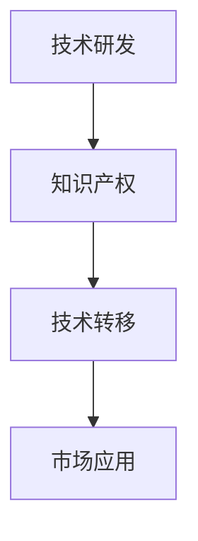
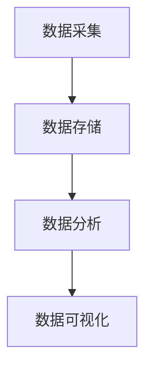

                 


```markdown
# 股市估值在跨境技术价值链分析中的应用

> 关键词：股市估值，跨境技术价值链，企业价值，技术合作，股市分析

> 摘要：本文深入探讨了股市估值与跨境技术价值链分析之间的内在联系，详细讲解了如何通过技术价值链的数据来优化股市估值模型。文章从背景、核心概念、算法原理、系统分析、项目实战等多个维度展开，结合实际案例，为读者提供了一套完整的分析方法。

---

# 第一部分: 股市估值与跨境技术价值链分析的背景与基础

## 第1章: 股市估值与跨境技术价值链分析的背景

### 1.1 股市估值的基本概念

#### 1.1.1 股市估值的定义与作用
股市估值是指通过对企业财务数据、市场表现和行业地位等多方面因素的分析，对企业的市场价值进行评估的过程。其作用在于帮助投资者做出更明智的投资决策，同时为企业提供合理的市值参考。

#### 1.1.2 股市估值的核心指标
- **市盈率（P/E）**：市盈率=股价/每股净利润，衡量企业的盈利能力。
- **市净率（P/B）**：市净率=股价/每股净资产，衡量企业的资产质量。
- **市值（Market Cap）**：市值=股价×流通股本，反映企业的市场地位。

#### 1.1.3 股市估值与企业价值的关系
股市估值是企业价值的外在表现，企业价值决定了其市值，而市值又受到市场情绪、行业趋势等多种因素的影响。

### 1.2 跨境技术价值链分析的定义与特点

#### 1.2.1 技术价值链的基本概念
技术价值链是指从技术研发、生产制造到市场应用的完整链条，涵盖技术开发、知识产权保护、技术转移等多个环节。

#### 1.2.2 跨境技术价值链的构成要素
- **技术开发**：包括基础研究和应用研究。
- **知识产权**：包括专利、商标等。
- **技术转移**：包括技术授权和合作开发。
- **市场应用**：包括产品销售和服务提供。

#### 1.2.3 跨境技术价值链的分析方法
- **横向对比**：比较不同国家或地区的技术产业分布。
- **纵向分析**：分析技术从研发到应用的全生命周期。

### 1.3 股市估值与跨境技术价值链的内在联系

#### 1.3.1 技术创新对企业价值的影响
技术创新能够提升企业的竞争力，进而影响其市值表现。

#### 1.3.2 跨境技术合作对股市估值的提升作用
通过跨境技术合作，企业可以优化资源配置，降低生产成本，从而提升股价。

#### 1.3.3 技术价值链波动对股市估值的传导机制
技术价值链的波动会直接影响企业的盈利能力，从而影响其市值表现。

---

## 第2章: 股市估值与跨境技术价值链的核心概念

### 2.1 股市估值的核心概念与属性

#### 2.1.1 股市估值的核心指标对比表

| 指标名称 | 定义 | 作用 |
|----------|------|------|
| 市盈率    | 股价/每股净利润 | 衡量企业盈利能力 |
| 市净率    | 股价/每股净资产 | 衡量企业资产质量 |
| 市值      | 股价×流通股本 | 反映企业市场地位 |

#### 2.1.2 股市估值的数学模型与公式
$$ 市盈率 = \frac{股价}{每股净利润} $$

$$ 市值 = 股价 \times 流通股本 $$

#### 2.1.3 股市估值的局限性与改进方向
股市估值受到市场情绪的影响，存在较大的波动性。为了提高估值的准确性，可以结合技术价值链的分析，进行更加全面的评估。

### 2.2 跨境技术价值链的核心概念与属性

#### 2.2.1 技术价值链的实体关系图（Mermaid流程图）



#### 2.2.2 跨境技术价值链的属性对比表

| 属性名称 | 定义 | 特点 |
|----------|------|------|
| 技术研发 | 企业的核心技术开发 | 创新性高 |
| 知识产权 | 企业的专利和商标 | 保护性强 |
| 技术转移 | 企业的技术授权和合作 | 跨界性明显 |
| 市场应用 | 企业的产品和服务 | 实用性高 |

#### 2.2.3 跨境技术价值链的动态变化特征
跨境技术价值链具有较强的动态变化特征，受到政策、市场和技术进步的影响。

### 2.3 股市估值与跨境技术价值链的关联性分析

#### 2.3.1 技术创新对企业价值的影响
技术创新能够提升企业的市场竞争力，进而影响其市值表现。

#### 2.3.2 跨境技术合作对股市估值的提升作用
通过跨境技术合作，企业可以优化资源配置，降低生产成本，从而提升股价。

#### 2.3.3 技术价值链波动对股市估值的传导机制
技术价值链的波动会直接影响企业的盈利能力，从而影响其市值表现。

---

## 第3章: 股市估值与跨境技术价值链分析的算法原理

### 3.1 股市估值的核心算法

#### 3.1.1 市盈率计算公式
$$ 市盈率 = \frac{股价}{每股净利润} $$

#### 3.1.2 市净率计算公式
$$ 市净率 = \frac{股价}{每股净资产} $$

### 3.2 跨境技术价值链分析的算法流程

#### 3.2.1 数据收集与预处理
- 数据来源：企业财务报表、技术合作合同、市场报告等。
- 数据清洗：去除缺失值和异常值。

#### 3.2.2 技术价值链的分析
- 技术研发能力评估：通过专利数量和研发投入占比进行评估。
- 技术转移能力评估：通过技术授权收入和合作项目数量进行评估。

#### 3.2.3 股市估值模型的建立
- 使用回归分析方法，将技术价值链的指标与股价进行关联。

### 3.3 算法实现的Python代码示例

```python
import pandas as pd

# 数据预处理
data = pd.read_csv('data.csv')
data.dropna(inplace=True)

# 市盈率计算
data['市盈率'] = data['股价'] / data['每股净利润']

# 技术研发能力评估
data['技术研发能力'] = data['专利数量'] / data['员工总数']

# 模型建立
from sklearn.linear_model import LinearRegression
model = LinearRegression()
model.fit(data[['市盈率', '技术研发能力']], data['股价'])
```

---

## 第4章: 股市估值与跨境技术价值链分析的系统设计

### 4.1 系统功能设计

#### 4.1.1 数据采集模块
- 功能：采集企业财务数据和市场数据。
- 实现：使用API接口进行数据获取。

#### 4.1.2 数据分析模块
- 功能：进行技术价值链分析和股市估值。
- 实现：使用Python的Pandas和Scikit-learn库进行数据分析。

#### 4.1.3 可视化模块
- 功能：生成技术价值链和股市估值的可视化图表。
- 实现：使用Matplotlib和Seaborn进行数据可视化。

### 4.2 系统架构设计



---

## 第5章: 股市估值与跨境技术价值链分析的项目实战

### 5.1 项目背景与目标
- 项目背景：分析某跨国技术企业的技术价值链，优化其股市估值模型。

### 5.2 项目实施步骤
1. 数据采集：收集企业的财务数据和技术合作数据。
2. 数据分析：计算市盈率和市净率，评估技术研发能力。
3. 模型建立：使用线性回归模型进行股市估值预测。
4. 结果分析：对比实际股价与预测股价，评估模型准确性。

### 5.3 项目代码实现

```python
import pandas as pd
from sklearn.linear_model import LinearRegression
import matplotlib.pyplot as plt

# 数据采集
data = pd.read_csv('data.csv')

# 数据分析
data['市盈率'] = data['股价'] / data['每股净利润']
data['技术研发能力'] = data['专利数量'] / data['员工总数']

# 模型建立
model = LinearRegression()
model.fit(data[['市盈率', '技术研发能力']], data['股价'])

# 结果可视化
plt.scatter(data['市盈率'], data['股价'])
plt.plot(data['市盈率'], model.predict(data[['市盈率', '技术研发能力']]), color='red')
plt.xlabel('市盈率')
plt.ylabel('股价')
plt.show()
```

---

## 第6章: 股市估值与跨境技术价值链分析的总结与展望

### 6.1 本章小结
本文通过分析股市估值与跨境技术价值链的内在联系，提出了优化股市估值模型的方法，为投资者提供了新的分析视角。

### 6.2 注意事项
- 数据的准确性和完整性直接影响模型的准确性。
- 模型的适用性需要根据具体情况进行调整。

### 6.3 拓展阅读
- 推荐阅读《技术分析实战》和《股市投资策略》。

---

## 作者：AI天才研究院 & 禅与计算机程序设计艺术
```

