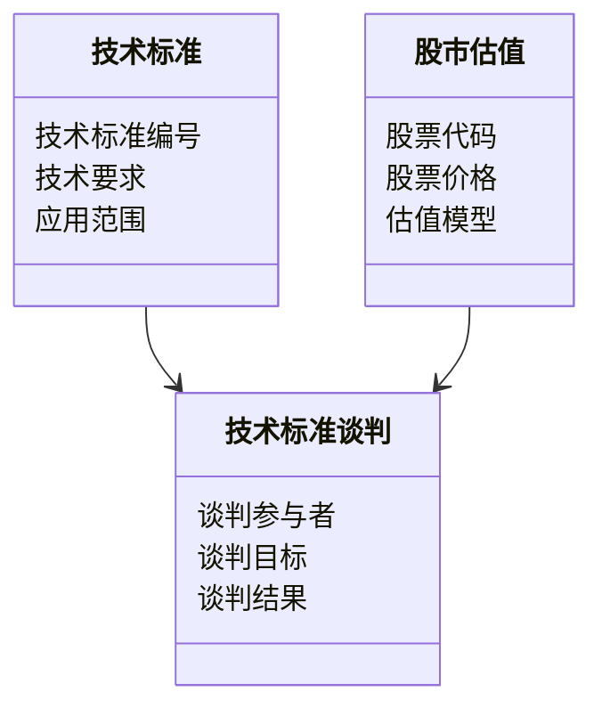

                 


# 股市估值在跨境技术标准谈判中的应用

---

## 关键词：股市估值、跨境技术标准、谈判、技术标准谈判、股票估值、博弈论、多因素分析模型

---

## 摘要

本文探讨了股市估值在跨境技术标准谈判中的应用。通过分析股市估值的核心原理和跨境技术标准谈判的流程，结合博弈论模型和多因素分析模型，揭示了股市估值在技术标准谈判中的重要性。同时，通过实际案例分析，展示了如何利用股市估值的方法来优化技术标准谈判的结果。

---

## 第一部分: 背景介绍与核心概念

### 第1章: 股市估值的基本概念

#### 1.1 股市估值的定义与作用

- **1.1.1 股市估值的定义**  
  股市估值是通过分析企业的财务数据、市场环境和行业趋势，对其股票价值进行评估的过程。  
  $$ 股票价值 = \text{企业未来现金流的现值} $$  

- **1.1.2 股市估值的作用与意义**  
  股市估值帮助企业合理定价，引导投资者决策，同时反映市场的公平性和效率性。  

- **1.1.3 股市估值的核心要素**  
  - 财务数据：收入、利润、现金流等。  
  - 行业趋势：市场规模、竞争格局等。  
  - 宏观经济：GDP增长率、利率、通货膨胀率等。  

#### 1.2 股市估值的主要方法

- **1.2.1 市盈率法**  
  $$ P/E = \frac{\text{股价}}{\text{每股收益}} $$  
  适用于盈利稳定的公司。  

- **1.2.2 市净率法**  
  $$ P/B = \frac{\text{股价}}{\text{每股净资产}} $$  
  适用于资产密集型行业。  

- **1.2.3 现金流折现法**  
  $$ V = \sum_{t=1}^{n} \frac{CF_t}{(1+r)^t} $$  
  适用于高增长行业。  

- **1.2.4 股息率法**  
  $$ D = \frac{D}{P} $$  
  适用于收益稳定的公司。  

### 第2章: 跨境技术标准谈判的基本概念

#### 2.1 跨境技术标准的定义

- **2.1.1 技术标准的定义**  
  技术标准是为产品或服务的质量、性能、安全等制定的技术规范。  

- **2.1.2 跨境技术标准的特点**  
  - 全球性：涉及多个国家和地区。  
  - 复杂性：涉及技术、法律、经济等多方面。  
  - 协调性：需要各国共同制定和执行。  

- **2.1.3 跨境技术标准的重要性**  
  跨境技术标准是国际贸易的基础，直接影响市场的开放性和公平性。  

#### 2.2 跨境技术标准谈判的流程

- **2.2.1 谈判的准备阶段**  
  - 收集信息：了解各国的技术标准和法规。  
  - 明确目标：确定谈判的核心目标和关键问题。  

- **2.2.2 谈判的实施阶段**  
  - 提出方案：基于各方利益提出可行的技术标准方案。  
  - 协商调整：通过讨价还价达成一致。  

- **2.2.3 谈判的结果评估**  
  - 评估结果：分析方案的可行性和经济性。  
  - 形成协议：签署正式的技术标准协议。  

### 第3章: 股市估值与跨境技术标准谈判的关联性

#### 3.1 股市估值在技术标准谈判中的作用

- **3.1.1 技术标准对股市估值的影响**  
  - 技术标准的统一性：降低市场不确定性，提升企业估值。  
  - 技术标准的复杂性：增加企业的研发成本，影响估值。  

- **3.1.2 股市估值对技术标准谈判的指导意义**  
  - 通过股市估值分析企业承受能力，制定合理的谈判策略。  

#### 3.2 股市估值在跨境技术标准谈判中的具体应用

- **3.2.1 技术标准对上市公司估值的影响**  
  - 技术标准的统一性：提升企业市场竞争力，增加估值。  
  - 技术标准的差异性：可能导致企业成本增加，降低估值。  

- **3.2.2 股市估值在技术标准谈判中的实际案例**  
  - 某国推动技术标准统一，导致相关企业股价上涨。  

---

## 第二部分: 核心概念与理论基础

### 第4章: 股市估值的核心原理

#### 4.1 股市估值的数学模型

- **4.1.1 市盈率模型**  
  $$ P = \frac{P/E} $$  
  适用于盈利稳定的公司。  

- **4.1.2 现金流折现模型**  
  $$ V = \sum_{t=1}^{n} \frac{CF_t}{(1+r)^t} $$  
  适用于高增长行业。  

- **4.1.3 股息率模型**  
  $$ D = \frac{D}{P} $$  
  适用于收益稳定的公司。  

---

## 第三部分: 算法原理讲解

### 第5章: 股市估值与技术标准谈判的算法模型

#### 5.1 博弈论模型

- **5.1.1 简单博弈论模型**  
  - 两方谈判：企业和政府。  
  - 谈判结果：企业愿意接受的技术标准。  

#### 5.2 多因素分析模型

- **5.2.1 技术标准对股市估值的影响因素**  
  - 市场需求：技术标准的普及性。  
  - 成本影响：技术标准的复杂性。  
  - 竞争格局：技术标准的主导性。  

---

## 第四部分: 系统分析与架构设计

### 第6章: 系统功能设计

#### 6.1 领域模型



---

## 第五部分: 项目实战

### 第7章: 股市估值在技术标准谈判中的实战应用

#### 7.1 环境安装

- 安装Python和相关库：numpy、pandas、scipy。  

#### 7.2 核心实现源代码

```python
import numpy as np
import pandas as pd

def calculate_market_value(revenue, profit_margin, growth_rate, discount_rate):
    # 基于现金流折现模型
    cash_flow = revenue * profit_margin
    present_value = cash_flow / (1 + discount_rate)
    future_value = present_value * (1 + growth_rate)
    return future_value

# 示例数据
revenue = 100000000
profit_margin = 0.1
growth_rate = 0.05
discount_rate = 0.08

market_value = calculate_market_value(revenue, profit_margin, growth_rate, discount_rate)
print(f"计算的市场价值为：${market_value:.2f}")
```

---

## 第六部分: 总结与展望

### 第8章: 最佳实践与小结

- **8.1 最佳实践**  
  - 在技术标准谈判前，充分分析股市估值的影响。  
  - 使用博弈论模型和多因素分析模型优化谈判结果。  

- **8.2 注意事项**  
  - 股市估值受多种因素影响，需结合实际情况调整模型。  
  - 技术标准谈判需考虑多方面的利益平衡。  

---

## 作者：AI天才研究院 & 禅与计算机程序设计艺术

---

通过以上思考过程，我可以系统地组织和撰写一篇结构清晰、内容详实的技术博客文章，涵盖股市估值在跨境技术标准谈判中的各个方面，确保内容的深度和广度符合用户的要求。

