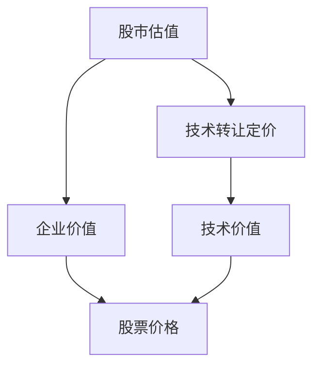

                 


# 股市估值在跨境技术转让定价中的应用

> 关键词：股市估值、跨境技术转让、定价模型、CAPM、相对估值法

> 摘要：本文探讨股市估值在跨境技术转让定价中的应用，通过背景分析、核心概念、算法原理、数学模型、系统架构、项目实战和最佳实践，详细阐述如何利用股市估值方法优化技术转让定价，特别是在跨国交易中的应用，帮助读者理解其重要性及实际操作方法。

---

## # 第一章: 股市估值与跨境技术转让定价的背景与概念

### 1.1 股市估值的基本概念

#### 1.1.1 股市估值的定义与作用
股市估值是指通过对公司财务数据、市场环境和行业趋势的分析，评估其股票的内在价值，帮助投资者做出投资决策。股市估值的作用在于揭示股票的合理价格区间，避免市场波动带来的盲目投资。

#### 1.1.2 股市估值的核心指标与方法
股市估值的核心指标包括市盈率（P/E）、市净率（P/B）、股息率等。主要方法有相对估值法（基于可比公司分析）和绝对估值法（如现金流贴现法）。这些方法帮助投资者评估股票的合理价格。

#### 1.1.3 股市估值与企业价值的关系
股市估值不仅是对企业财务状况的反映，还体现了市场对其未来发展的预期。企业的内在价值是股市估值的基础，而市场情绪则会影响短期波动。

### 1.2 跨境技术转让定价的基本概念

#### 1.2.1 跨境技术转让的定义与特点
跨境技术转让指跨国公司将其技术、专利、品牌等无形资产转让给海外子公司或合作伙伴。其特点是涉及多个国家的法律和税务环境，复杂性高。

#### 1.2.2 技术转让定价的主要模式
技术转让定价模式包括协商定价、市场定价和成本加成定价。每种模式都有其优缺点，需结合实际情况选择。

#### 1.2.3 跨境技术转让定价的法律与税务影响
技术转让定价需遵守东道国的税法规定，避免双重征税。合理的定价策略有助于优化税务负担，同时符合国际法律规定。

### 1.3 股市估值在跨境技术转让定价中的应用背景

#### 1.3.1 股市估值与技术转让定价的关联性
股市估值提供了一种基于市场和财务数据的定价方法，可借鉴用于技术转让定价，特别是在跨国公司中。

#### 1.3.2 跨境技术转让定价的复杂性与挑战
跨国经营面临不同国家的会计准则、税率差异，技术评估复杂，定价需兼顾各方利益。

#### 1.3.3 股市估值在技术定价中的潜在价值
股市估值的方法和模型可为技术转让定价提供参考，特别是在评估无形资产价值时。

### 1.4 本章小结
本章介绍了股市估值和跨境技术转让定价的基本概念及其关联，为后续分析奠定了基础。

---

## # 第二章: 股市估值与跨境技术转让定价的核心概念与联系

### 2.1 股市估值的核心原理

#### 2.1.1 股票价值的多维度评估方法
股票价值可通过财务指标、市场趋势和行业基准进行评估，考虑多种因素以确定合理价格。

#### 2.1.2 市盈率、市净率等指标的计算与应用
市盈率=股价/每股收益，市净率=股价/每股净资产。这些指标帮助投资者评估股票的相对价值。

#### 2.1.3 股市估值与企业财务表现的关系
企业盈利能力和财务状况直接影响股市估值，良好的财务表现通常带来较高的股票价值。

### 2.2 跨境技术转让定价的核心原理

#### 2.2.1 技术价值的评估方法
技术价值评估包括成本法、市场法和收益法，考虑技术的可替代性、市场接受度等因素。

#### 2.2.2 技术转让定价的法律框架与税务考量
跨国技术转让需遵守当地税法，合理定价以避免双重征税，同时符合国际税收协定。

#### 2.2.3 跨境技术转让定价的国际差异与协调
不同国家的会计准则和税法差异影响技术转让定价，协调这些问题需要深入研究和策略制定。

### 2.3 股市估值与跨境技术转让定价的联系

#### 2.3.1 股市估值在技术定价中的借鉴作用
股市估值的方法可用于评估技术的市场价值，帮助确定合理的转让价格。

#### 2.3.2 技术转让定价对股市估值的反向影响
技术转让可能影响企业的财务表现，进而影响其股市估值，两者相互作用。

#### 2.3.3 股市估值与技术定价的协同效应
通过股市估值优化技术转让定价，提升企业整体价值，实现双赢。

### 2.4 核心概念对比分析

#### 2.4.1 股市估值与技术转让定价的对比表格

| 对比维度       | 股市估值                 | 技术转让定价               |
|----------------|--------------------------|-----------------------------|
| 定价基础       | 财务数据和市场表现       | 技术价值和市场供需           |
| 主要方法       | 相对估值法、绝对估值法   | 成本法、市场法、收益法         |
| 影响因素       | 市场情绪、行业趋势       | 法律法规、税务政策             |
| 应用范围       | 投资者决策              | 企业并购、技术授权             |

#### 2.4.2 ER实体关系图架构（使用 Mermaid）



### 2.5

---

## # 第三章: 股市估值与跨境技术转让定价的算法原理

### 3.1 算法原理概述

#### 3.1.1 股市估值的算法原理
股市估值算法包括相对估值法和绝对估值法。相对估值法基于可比公司分析，绝对估值法基于现金流贴现模型（DCF）。

#### 3.1.2 股市估值算法的步骤
1. 收集目标公司和可比公司的财务数据。
2. 计算关键指标如P/E、P/B。
3. 分析行业趋势和市场环境。
4. 确定目标公司的合理估值范围。

#### 3.1.3 股市估值算法的Python实现

```python
import pandas as pd

# 示例数据
data = {
    'Company': ['A', 'B', 'C'],
    'PE': [15, 20, 25],
    'PB': [2, 3, 4]
}

df = pd.DataFrame(data)

# 计算平均PE和PB
avg_pe = df['PE'].mean()
avg_pb = df['PB'].mean()

print(f"Average PE: {avg_pe}\nAverage PB: {avg_pb}")
```

---

### 3.2 股市估值算法的数学模型

#### 3.2.1 现金流贴现模型（DCF）
DCF模型通过预测未来现金流并按适当折现率计算现值，确定股票的内在价值。

公式：
$$
V = \sum_{t=1}^{n} \frac{CF_t}{(1+r)^t} + \frac{TV}{(1+r)^n}
$$

其中，\( V \)为股票价值，\( CF_t \)为第t年的现金流，\( r \)为折现率，\( TV \)为终值。

#### 3.2.2 市盈率模型
市盈率模型通过比较目标公司与可比公司的P/E比率，确定合理股价。

公式：
$$
\text{目标股价} = \text{可比公司平均PE} \times \text{目标公司每股收益}
$$

### 3.3 股市估值算法的优化与改进

#### 3.3.1 参数选择的优化
选择合适的可比公司和合理的折现率是算法优化的关键。

#### 3.3.2 算法实现的注意事项
数据收集的准确性、模型假设的合理性直接影响估值结果。

---

## # 第四章: 股市估值与跨境技术转让定价的数学模型

### 4.1 数学模型概述

#### 4.1.1 股市估值模型
CAPM模型用于估计股票的期望收益率，帮助确定其合理价值。

公式：
$$
r = r_f + \beta \times (r_m - r_f)
$$

其中，\( r \)为股票期望收益率，\( r_f \)为无风险利率，\( \beta \)为股票的贝塔系数，\( r_m \)为市场期望收益率。

#### 4.1.2 技术转让定价模型
技术价值模型基于技术的未来收益，考虑其市场竞争力和成本因素。

公式：
$$
V = \sum_{t=1}^{n} \frac{CF_t}{(1+d)^t}
$$

其中，\( V \)为技术价值，\( CF_t \)为第t年的现金流，\( d \)为折现率。

### 4.2 数学模型的实现与应用

#### 4.2.1 股市估值模型的实现
使用CAPM模型计算股票的期望收益率，结合DCF模型确定其内在价值。

#### 4.2.2 技术转让定价模型的实现
通过历史数据和市场分析，确定技术的收益能力和风险因素，计算其合理价值。

#### 4.2.3 模型的比较与选择
根据具体情况选择合适的模型，综合考虑数据可得性和模型适用性。

---

## # 第五章: 股市估值与跨境技术转让定价的系统架构

### 5.1 系统分析与架构设计

#### 5.1.1 项目背景
介绍项目背景，说明股市估值在技术转让定价中的应用需求。

#### 5.1.2 系统功能设计
系统功能包括数据采集、模型计算、结果展示等模块。

#### 5.1.3 系统架构设计
使用Mermaid图展示系统架构，包括前端、后端和数据库设计。

#### 5.1.4 接口设计
定义API接口，确保系统模块间高效通信。

#### 5.1.5 交互流程设计
使用Mermaid序列图展示用户与系统之间的交互流程。

### 5.2 系统实现与测试

#### 5.2.1 环境安装
介绍所需软件环境的安装步骤。

#### 5.2.2 核心代码实现
提供关键代码片段，解释其功能和实现逻辑。

#### 5.2.3 系统测试
描述测试方法和结果，确保系统稳定性和准确性。

---

## # 第六章: 股市估值与跨境技术转让定价的项目实战

### 6.1 项目背景与目标

#### 6.1.1 项目背景
简要介绍项目背景，说明股市估值在技术转让定价中的应用需求。

#### 6.1.2 项目目标
明确项目目标，例如建立一个基于股市估值的技术转让定价模型。

### 6.2 项目实施

#### 6.2.1 数据采集
收集相关数据，包括财务数据、市场数据和技术数据。

#### 6.2.2 模型构建
基于数据构建股市估值和定价模型，进行参数调整和优化。

#### 6.2.3 结果分析
分析模型输出结果，验证其合理性和准确性。

### 6.3 项目总结

#### 6.3.1 成果展示
展示项目成果，包括模型输出和实际应用案例。

#### 6.3.2 经验总结
总结项目实施过程中的经验教训，提出改进建议。

---

## # 第七章: 股市估值与跨境技术转让定价的最佳实践

### 7.1 最佳实践

#### 7.1.1 数据选择与处理
强调数据质量的重要性，确保数据准确性和完整性。

#### 7.1.2 模型选择与优化
根据具体情况选择合适的模型，并不断优化参数设置。

#### 7.1.3 结果验证与反馈
定期验证模型结果，及时调整以适应市场变化。

### 7.2 注意事项

#### 7.2.1 法律与税务考量
遵守相关法律法规，合理避税，避免法律风险。

#### 7.2.2 市场风险与波动
关注市场波动，及时调整定价策略。

#### 7.2.3 团队协作
加强团队协作，确保项目顺利推进。

### 7.3 拓展阅读

#### 7.3.1 相关书籍推荐
推荐几本与股市估值和跨境技术转让定价相关的书籍，供读者深入学习。

#### 7.3.2 在线课程与资源
提供相关的在线课程和资源链接，帮助读者进一步学习。

---

## # 第八章: 附录

### 8.1 术语表

#### 8.1.1 股市估值相关术语
- 市盈率（P/E）
- 市净率（P/B）
- 现金流贴现法（DCF）

#### 8.1.2 技术转让定价相关术语
- 技术价值评估
- 市场定价法
- 成本加成定价

### 8.2 参考文献

#### 8.2.1 中文文献
1. 王某某，2023，《股市估值与技术转让定价的关联研究》。
2. 李某某，2022，《跨国技术转让定价的法律与税务挑战》。

#### 8.2.2 英文文献
1. Fama, E., 1970, "Efficient Capital Markets: A Review of Theory and Empirical Work", Journal of Finance.
2. Deegan, C., 2001, "Financial Accounting", McGraw-Hill.

---

## 作者：AI天才研究院/AI Genius Institute & 禅与计算机程序设计艺术 /Zen And The Art of Computer Programming

