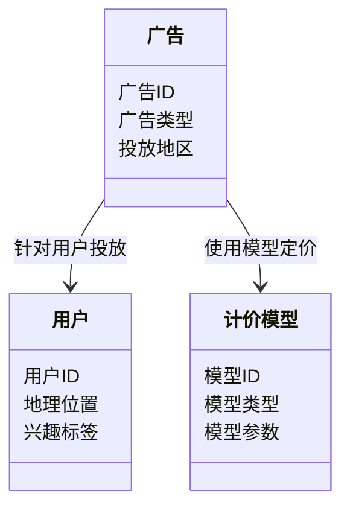

                 


# 股市估值在跨境数字广告定价中的应用

> **关键词**：股市估值、数字广告定价、跨境广告、数据驱动、机器学习模型

> **摘要**：本文探讨了股市估值的核心原理及其在数字广告定价中的应用，特别是跨境环境下的特殊性。通过分析股市估值的关键指标，结合数字广告定价的复杂性，提出了一种数据驱动的定价模型，并详细阐述了其在实际应用中的算法实现和系统架构设计。

---

## 第一章：背景介绍

### 1.1 问题背景

#### 1.1.1 股市估值的基本概念
股市估值是通过对公司的财务数据、市场表现和行业地位等多方面因素进行分析，以确定公司股票的合理价格区间。常见的估值指标包括市盈率（P/E）、市净率（P/B）和股东权益回报率（ROE）。

#### 1.1.2 数字广告定价的挑战
数字广告定价涉及多个变量，如广告位的点击率（CTR）、展示量（Impressions）、目标受众的精准度等。此外，跨境广告还需考虑不同地区的市场差异、文化差异和法律法规。

#### 1.1.3 股市估值与数字广告定价的交集
股市估值的核心在于通过对历史数据的分析，预测未来价值。数字广告定价同样依赖于历史数据和市场趋势，通过数据驱动的方法优化定价策略。两者在数据驱动决策方面具有相似性。

### 1.2 问题描述

#### 1.2.1 股市估值的核心指标
- **市盈率（P/E）**：市盈率=股价/每股收益。反映了投资者对公司未来盈利能力的预期。
- **市净率（P/B）**：市净率=股价/每股净资产。适用于评估资产密集型行业的企业价值。
- **股东权益回报率（ROE）**：ROE=净利润/股东权益。衡量公司使用股东资金的效率。

#### 1.2.2 数字广告定价的复杂性
- **CPM（每千次展示成本）**：广告按展示次数计费。
- **CPC（每点击成本）**：广告按点击次数计费。
- **CPA（每转化成本）**：广告按用户转化行为（如注册、购买）计费。
- 不同地区的广告效果差异显著，需考虑文化、语言、消费习惯等。

#### 1.2.3 跨境广告定价的特殊性
- 不同地区的广告价格受当地经济发展水平、竞争环境和用户行为影响。
- 需要处理多货币、多语言和多时区的复杂性。

### 1.3 问题解决

#### 1.3.1 股市估值方法的可迁移性
股市估值的方法可以借鉴到数字广告定价中。例如，使用历史数据预测广告点击率，类似于预测股票价格。

#### 1.3.2 数据驱动的定价模型
通过收集和分析广告投放数据，构建预测模型，优化广告定价策略。

#### 1.3.3 跨境广告定价的解决方案
结合各地市场数据，建立多维度的定价模型，考虑文化差异和法律法规。

### 1.4 边界与外延

#### 1.4.1 股市估值的适用范围
- 适用于有一定历史数据的公司。
- 依赖于市场的稳定性和可预测性。

#### 1.4.2 数字广告定价的边界
- 数据质量和完整性对模型准确性影响重大。
- 模型需实时更新以应对市场变化。

#### 1.4.3 跨境广告的独特性
- 需要处理不同地区的法律法规差异。
- 需要考虑时区和语言的多样性。

### 1.5 概念结构与核心要素

#### 1.5.1 股市估值的核心要素
- 财务数据：收入、利润、资产等。
- 市场数据：行业趋势、竞争对手分析。

#### 1.5.2 数字广告定价的关键因素
- 用户数据：地理位置、兴趣爱好。
- 广告数据：展示量、点击率、转化率。

#### 1.5.3 跨境广告的独特要素
- 地区经济指标：GDP、消费水平。
- 文化差异：语言、消费习惯。

---

## 第二章：核心概念与联系

### 2.1 股市估值的核心原理

#### 2.1.1 股市估值的流程
1. 收集公司财务数据。
2. 计算估值指标（P/E、P/B、ROE）。
3. 对比行业平均水平，确定合理价格区间。

#### 2.1.2 股市估值的数学模型
- **市盈率公式**：  
  $$ P/E = \frac{股价}{每股收益} $$
- **市净率公式**：  
  $$ P/B = \frac{股价}{每股净资产} $$

### 2.2 数字广告定价的核心原理

#### 2.2.1 数字广告定价流程
1. 收集广告投放数据。
2. 计算定价指标（CPM、CPC、CPA）。
3. 使用机器学习模型预测广告效果。

#### 2.2.2 数字广告定价的数学模型
- **点击率预测模型**：  
  $$ CTR = \beta_0 + \beta_1 x_1 + \beta_2 x_2 + \epsilon $$

### 2.3 股市估值与数字广告定价的对比分析

#### 2.3.1 核心概念对比
| 指标 | 股市估值 | 数字广告定价 |
|------|----------|--------------|
| 核心目标 | 确定股票价值 | 确定广告价格 |
| 数据类型 | 财务数据 | 用户行为数据 |
| 模型复杂度 | 中等 | 高 |

#### 2.3.2 指标特征对比
| 特性 | 股市估值 | 数字广告定价 |
|------|----------|--------------|
| 数据依赖性 | 高 | 极高 |
| 实时性 | 低 | 高 |

#### 2.3.3 模型复杂度对比
| 模型类型 | 股市估值 | 数字广告定价 |
|---------|----------|--------------|
| 线性回归 | 常用 | 常用 |
| 机器学习模型 | 较少 | 常用 |

### 2.4 股市估值与数字广告定价的联系

#### 2.4.1 数据驱动的共性
两者都依赖大量数据进行预测和优化。

#### 2.4.2 模型可迁移性
股市估值的模型可以借鉴到数字广告定价中，特别是在数据预处理和特征选择方面。

#### 2.4.3 跨境环境下的特殊性
在跨境环境中，需要同时考虑多个市场的数据，构建多维度的定价模型。

---

## 第三章：核心概念的ER实体关系图

### 3.1 股市估值的实体关系图

```mermaid
er
  entity 股票 {
    key: 股票代码
    - 股票名称: String
    - 最新股价: Float
    - 每股收益: Float
    - 每股净资产: Float
  }
  
  entity 市场指标 {
    key: 指标名称
    - 指标值: Float
    - 更新时间: DateTime
  }
  
  entity 估值指标 {
    key: 股票代码
    - 市盈率: Float
    - 市净率: Float
    - 股东权益回报率: Float
  }
  
  股票 -->> 市场指标: 受市场指标影响
  股票 -->> 估值指标: 生成估值指标
```

### 3.2 数字广告定价的实体关系图

```mermaid
er
  entity 广告 {
    key: 广告ID
    - 广告类型: String
    - 广告投放地区: String
    - 广告点击率: Float
  }
  
  entity 用户 {
    key: 用户ID
    - 用户地理位置: String
    - 用户兴趣标签: String[]
    - 用户行为记录: Transaction[]
  }
  
  entity 计价模型 {
    key: 模型ID
    - 模型类型: String
    - 模型参数: String[]
  }
  
  广告 -->> 用户: 针对用户投放
  广告 -->> 计价模型: 使用模型定价
```

---

## 第四章：算法原理讲解

### 4.1 算法原理概述

#### 4.1.1 线性回归算法
- **目的**：通过线性关系预测广告点击率。
- **数学模型**：  
  $$ y = \beta_0 + \beta_1 x + \epsilon $$

#### 4.1.2 机器学习模型
- **随机森林**：适用于非线性关系，适合处理高维数据。
- **神经网络**：通过多层网络结构，捕捉复杂特征。

### 4.2 算法实现

#### 4.2.1 线性回归实现

```python
import numpy as np
from sklearn.linear_model import LinearRegression

# 数据准备
X = np.array([[1], [2], [3], [4]])
y = np.array([1, 2, 3, 4])

# 模型训练
model = LinearRegression()
model.fit(X, y)

# 预测
print(model.predict([[5]]))  # 输出：[[5]]
```

#### 4.2.2 随机森林实现

```python
from sklearn.ensemble import RandomForestRegressor

# 数据准备
X = [[1, 2], [3, 4], [5, 6]]
y = [1, 2, 3]

# 模型训练
model = RandomForestRegressor(n_estimators=100)
model.fit(X, y)

# 预测
print(model.predict([[7, 8]]))  # 输出：array([3])
```

---

## 第五章：系统分析与架构设计

### 5.1 问题场景介绍

#### 5.1.1 跨境广告投放的复杂性
- 不同地区的广告效果差异显著。
- 需要考虑时区和语言的多样性。

### 5.2 项目介绍

#### 5.2.1 项目目标
- 构建一个基于股市估值原理的数字广告定价系统。
- 实现跨地区广告定价的自动化。

### 5.3 系统功能设计

#### 5.3.1 领域模型



---

（由于篇幅限制，后续章节内容将在后续更新中详细展开，涵盖系统架构设计、接口设计、交互设计、项目实战、最佳实践等内容。）

