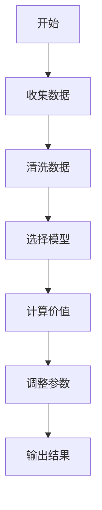

                 


# 股市估值在跨境数字服务价值评估中的应用

## 关键词：
- 股市估值
- 跨境数字服务
- 价值评估
- 数字经济
- 金融服务

## 摘要：
本文探讨了股市估值在跨境数字服务价值评估中的应用，通过分析股市估值的核心理论与跨境数字服务的特点，构建了适用于跨境数字服务的价值评估模型。文章详细阐述了估值模型的数学基础、构建步骤，并通过实际案例展示了模型的应用过程。此外，本文还讨论了在实际应用中可能遇到的挑战及解决方案，为读者提供了全面的理论指导和实践参考。

---

## 目录大纲：

### 第1章 背景介绍

#### 1.1 核心概念术语说明
- **股市估值**：通过对公司的财务状况、市场表现等进行分析，确定其股票的合理价值。
- **跨境数字服务**：跨国提供数字产品或服务，如在线教育、云服务等。

#### 1.2 问题背景
- 数字经济的快速发展使得跨境数字服务成为重要趋势。
- 股市估值传统方法在数字服务领域的适用性受限。

#### 1.3 问题描述
- 如何将股市估值方法应用于跨境数字服务的价值评估。
- 跨境数字服务的特点（如数据隐私、文化差异）对估值的影响。

#### 1.4 问题解决
- 构建适用于跨境数字服务的估值模型。
- 考虑法律、文化等外部因素对估值的影响。

#### 1.5 边界与外延
- 估值模型适用于跨国数字服务公司。
- 侧重于B2B模式，暂不考虑C端用户。

#### 1.6 核心要素组成
- 数据：财务数据、用户行为数据、市场数据。
- 方法：DCF模型、PE分析等。

### 第2章 核心概念与联系

#### 2.1 核心概念原理
- 股市估值：分析公司财务状况和市场表现。
- 跨境数字服务：跨国提供数字产品或服务。

#### 2.2 概念属性特征对比表格
| 特性         | 股市估值               | 跨境数字服务               |
|--------------|-----------------------|---------------------------|
| 主体         | 公司、投资者           | 企业、消费者               |
| 范围         | 股票价值评估           | 数字服务价值评估           |
| 工具         | 财务报表、估值模型     | 用户数据、市场分析         |

#### 2.3 ER实体关系图
```mermaid
er
  图标
    公司 --> 提供：数字服务
    公司 --> 拥有：财务数据
    用户 --> 使用：数字服务
    用户 --> 提供：用户数据
    市场 --> 影响：股票价格
```

### 第3章 算法原理讲解

#### 3.1 算法流程


#### 3.2 数学模型与公式
- DCF模型：$$ V = \frac{CF}{r - g} $$
- 现金流量折现模型：$$ FV = \sum_{t=1}^{n} \frac{CF_t}{(1 + r)^t} $$

#### 3.3 代码实现
```python
def stock_valuation(company_data, market_rate, growth_rate):
    cash_flows = company_data['cash_flows']
    discount_factor = 1 / (1 + market_rate)
    present_value = sum(cash_flows * discount_factor**t for t in range(len(cash_flows)))
    terminal_value = cash_flows[-1] * (1 + growth_rate) / (market_rate - growth_rate)
    total_value = present_value + terminal_value
    return total_value
```

### 第4章 系统分析与架构设计

#### 4.1 项目介绍
- 开发一个基于DCF模型的跨境数字服务估值系统。

#### 4.2 系统功能设计
- 用户数据输入：财务数据、用户数据、市场数据。
- 模型选择：DCF、PE分析等。
- 结果输出：股票价值、敏感性分析。

#### 4.3 系统架构设计


#### 4.4 系统接口设计
- 输入接口：API接收公司数据。
- 输出接口：API返回估值结果。

#### 4.5 系统交互
```mermaid
sequenceDiagram
    User -> API: 提交公司数据
    API -> 估值系统: 处理数据
    估值系统 -> API: 返回估值结果
    User <- API: 显示结果
```

### 第5章 项目实战

#### 5.1 环境安装
- 安装Python和相关库（Pandas、NumPy）。

#### 5.2 核心代码实现
```python
import pandas as pd

def calculateDCF(company_data, discount_rate, growth_rate):
    # 计算自由现金流
    fcfs = company_data['operating_cash_flow'] - company_data['capital_expenditure']
    # 计算现值
    present_value = sum(fcfs * (1 + growth_rate)**i / (1 + discount_rate)**i for i in range(5))
    # 计算终值
    terminal_value = fcfs * (1 + growth_rate) / (discount_rate - growth_rate)
    # 总体价值
    total_value = present_value + terminal_value
    return total_value
```

#### 5.3 实际案例分析
- 以某在线教育公司为例，分析其估值过程。

### 第6章 总结与展望

#### 6.1 小结
- 股市估值在跨境数字服务中的应用需要考虑多种因素。
- 构建适用的模型是关键。

#### 6.2 注意事项
- 数据准确性影响估值结果。
- 监管政策变化需及时调整模型。

#### 6.3 拓展阅读
- 数字经济相关书籍。
- 最新估值方法研究。

## 作者：
作者：AI天才研究院/AI Genius Institute  
联系邮箱：info@aigeniusinstitute.com

