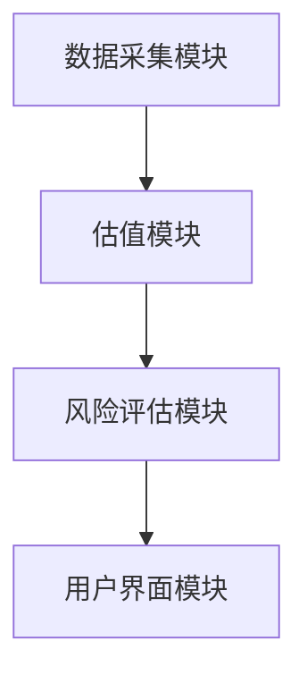
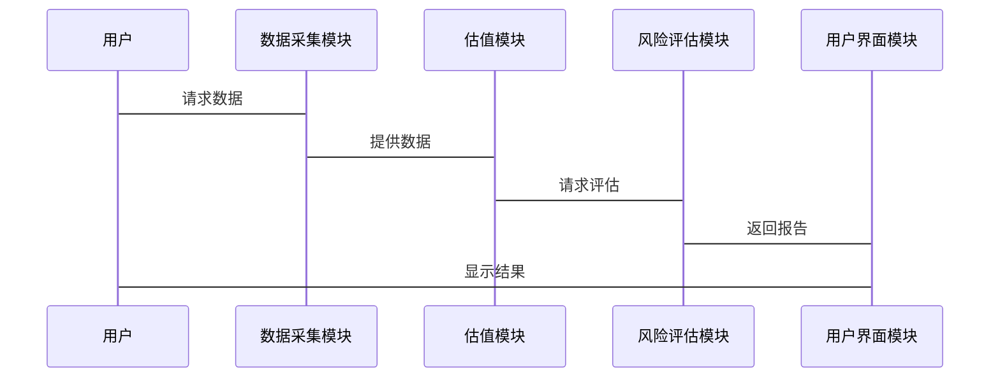

                 


# 股市估值在跨境数字资产评估中的应用

> **关键词**：股市估值、跨境数字资产、资产评估、投资策略、风险管理、数字金融、技术分析  
> **摘要**：本文探讨了股市估值在跨境数字资产评估中的应用，分析了股市估值的核心概念、数学模型和算法原理，并结合实际案例，详细讲解了如何将股市估值方法应用于跨境数字资产的评估。文章还讨论了系统架构设计、项目实战和最佳实践，为读者提供了全面的指导。

---

## 第1章: 股市估值与跨境数字资产概述

### 1.1 股市估值的基本概念
#### 1.1.1 股市估值的定义与核心要素
股市估值是通过对公司财务数据、市场环境和行业趋势等多方面因素的分析，确定股票的内在价值和市场价值的过程。其核心要素包括：
- **公司基本面**：收入、利润、资产、负债等。
- **市场环境**：宏观经济、行业趋势、市场情绪等。
- **估值指标**：市盈率（P/E）、市净率（P/B）、股息率等。

#### 1.1.2 股市估值的主要方法
常见的股市估值方法包括：
1. **相对估值法**：通过比较同类股票的估值指标来确定目标股票的价值。
2. **绝对估值法**：通过现金流折现模型（DCF）等方法计算股票的内在价值。
3. **技术分析法**：通过分析股票价格和成交量的历史数据预测未来走势。

#### 1.1.3 股市估值在投资决策中的作用
股市估值是投资者制定投资策略的重要依据，能够帮助投资者识别低估或高估的股票，优化投资组合，降低投资风险。

---

### 1.2 跨境数字资产的概念与特点
#### 1.2.1 跨境数字资产的定义
跨境数字资产是指在全球范围内流通的数字资产，如比特币、以太坊等加密货币，以及一些数字代币。

#### 1.2.2 跨境数字资产的主要类型
- **加密货币**：如比特币、以太坊。
- **数字代币**：如ERC-20代币、TRC-20代币。
- **稳定币**：如USDT、USDC。

#### 1.2.3 跨境数字资产与传统金融资产的区别
- **去中心化**：跨境数字资产通常基于区块链技术，去中心化程度高。
- **全球流通**：不受地域限制，可以在全球范围内自由交易。
- **波动性大**：价格波动较大，风险较高。

---

### 1.3 股市估值在跨境数字资产评估中的重要性
#### 1.3.1 股市估值与跨境数字资产的结合背景
随着数字资产的全球化发展，投资者需要一种科学的估值方法来评估其价值，从而做出合理的投资决策。

#### 1.3.2 股市估值在跨境数字资产评估中的应用前景
通过将股市估值方法应用于跨境数字资产评估，可以提高评估的科学性和准确性，帮助投资者规避风险。

#### 1.3.3 股市估值与跨境数字资产结合的必要性
跨境数字资产的市场波动性和复杂性要求投资者具备更加精准的估值方法，而股市估值的理论和方法可以为这一需求提供支持。

---

## 第2章: 股市估值的核心概念与数学模型

### 2.1 股市估值的核心概念
#### 2.1.1 股票的内在价值与市场价值
- **内在价值**：基于公司基本面的理论价值。
- **市场价值**：实际市场中的交易价格。

#### 2.1.2 股票价格的波动性与预测性
股票价格受多种因素影响，包括宏观经济、市场情绪等，具有较高的波动性和预测性。

#### 2.1.3 股市估值的边界与外延
股市估值需要考虑市场的流动性、信息不对称等因素，具有一定的边界和外延。

---

### 2.2 股市估值的关键指标与公式
#### 2.2.1 市盈率（P/E）的定义与计算公式
市盈率 = 股票价格 / 每股净利润（EPS）

#### 2.2.2 市净率（P/B）的定义与计算公式
市净率 = 股票价格 / 每股净资产（BPS）

#### 2.2.3 股息率的定义与计算公式
股息率 = 每股股息 / 股票价格

#### 2.2.4 净值收益率（ROE）的定义与计算公式
净值收益率 = 净利润 / 平均净资产

---

### 2.3 股市估值的数学模型
#### 2.3.1 单变量线性回归模型
$$ y = a + bx + \epsilon $$
其中，$y$ 是目标变量，$x$ 是自变量，$a$ 是截距，$b$ 是回归系数，$\epsilon$ 是误差项。

#### 2.3.2 多变量线性回归模型
$$ y = a + b_1x_1 + b_2x_2 + \cdots + b_nx_n + \epsilon $$

#### 2.3.3 非线性回归模型
$$ y = a \cdot e^{bx} $$

---

### 2.4 股市估值的算法原理
#### 2.4.1 基于历史数据的估值方法
通过分析历史价格数据，利用统计方法预测未来价格走势。

#### 2.4.2 基于市场情绪的估值方法
通过分析市场情绪指标（如恐慌指数）来调整估值结果。

#### 2.4.3 基于机器学习的估值方法
利用机器学习算法（如支持向量机、随机森林）进行特征提取和预测。

---

## 第3章: 跨境数字资产的核心概念与评估指标

### 3.1 跨境数字资产的核心概念
#### 3.1.1 数字资产的定义与分类
数字资产包括加密货币、数字代币和稳定币等。

#### 3.1.2 跨境数字资产的特点与优势
- **去中心化**：基于区块链技术，无需依赖传统金融体系。
- **全球流通**：可以在全球范围内自由交易。
- **透明性**：交易记录公开透明，可追溯。

#### 3.1.3 跨境数字资产的风险与挑战
- **价格波动大**：市场波动性高，投资风险大。
- **监管不确定性**：不同国家对数字资产的监管政策不同。
- **技术风险**：区块链技术可能存在漏洞，导致安全问题。

---

### 3.2 跨境数字资产的主要评估指标
#### 3.2.1 市场流动性指标
- **交易量**：反映资产的流动性。
- **换手率**：反映资产的活跃程度。

#### 3.2.2 项目技术指标
- **区块链技术**：如共识机制、智能合约等。
- **开发团队**：项目团队的技术能力和背景。

#### 3.2.3 项目团队与背景指标
- **团队经验**：开发团队的经验和背景。
- **项目白皮书**：项目的详细规划和 roadmap。

#### 3.2.4 市场接受度指标
- **市场认可度**：资产在市场上的接受度。
- **社区活跃度**：社区的活跃程度和参与度。

---

### 3.3 跨境数字资产的评估模型
#### 3.3.1 基于技术分析的评估模型
通过分析价格走势、成交量等技术指标预测资产价格走势。

#### 3.3.2 基于基本面分析的评估模型
通过分析项目团队、技术实现、市场接受度等基本面因素评估资产价值。

#### 3.3.3 基于市场情绪分析的评估模型
通过分析社交媒体、新闻等市场情绪指标调整估值结果。

---

## 第4章: 股市估值与跨境数字资产评估的结合

### 4.1 股市估值与跨境数字资产评估的联系
#### 4.1.1 股市估值方法在跨境数字资产评估中的应用
将传统的股市估值方法（如市盈率、市净率）应用于数字资产的评估。

#### 4.1.2 股市估值指标对跨境数字资产的影响
股市估值指标可以帮助投资者识别低估或高估的数字资产。

#### 4.1.3 股市估值与数字资产评估的差异
数字资产的波动性和去中心化特点要求评估方法更具灵活性和创新性。

---

### 4.2 股市估值与跨境数字资产评估的结合方法
#### 4.2.1 综合使用多种估值方法
结合相对估值法、绝对估值法和技术分析法进行综合评估。

#### 4.2.2 结合市场环境进行调整
根据宏观经济、行业趋势和市场情绪等因素调整估值结果。

#### 4.2.3 利用大数据和机器学习技术
通过大数据分析和机器学习算法提高估值的准确性和效率。

---

## 第5章: 股市估值算法在跨境数字资产评估中的实现

### 5.1 回归分析的应用
#### 5.1.1 简单线性回归
使用Python代码实现简单线性回归模型，预测数字资产价格。

```python
import numpy as np
from sklearn.linear_model import LinearRegression

# 示例数据
X = np.array([[1], [2], [3], [4], [5]])
y = np.array([2, 3, 5, 4, 6])

# 创建回归模型
model = LinearRegression()
model.fit(X, y)

# 预测结果
print(model.predict([[6]]))
```

#### 5.1.2 多变量回归
使用多变量回归模型分析多个因素对数字资产价格的影响。

```python
from sklearn.datasets import make_regression
from sklearn.linear_model import LinearRegression

X, y = make_regression(n_samples=100, n_features=2, noise=0.3)
model = LinearRegression()
model.fit(X, y)
print(model.coef_)
```

---

### 5.2 机器学习算法的应用
#### 5.2.1 支持向量机（SVM）
使用SVM进行数字资产价格预测。

```python
from sklearn.svm import SVC
from sklearn.datasets import make_classification

X, y = make_classification(n_samples=100, n_features=2, n_classes=2)
model = SVC()
model.fit(X, y)
print(model.predict(X[:5]))
```

#### 5.2.2 随机森林
使用随机森林进行特征重要性分析和价格预测。

```python
from sklearn.ensemble import RandomForestClassifier

model = RandomForestClassifier()
model.fit(X, y)
print(model.feature_importances_)
```

---

## 第6章: 跨境数字资产评估系统的架构与实现

### 6.1 系统架构设计
#### 6.1.1 系统功能模块
- **数据采集模块**：采集数字资产的市场数据。
- **估值模块**：基于估值模型计算资产价值。
- **风险评估模块**：评估投资风险。
- **用户界面模块**：提供直观的用户界面。

#### 6.1.2 系统架构图


---

### 6.2 系统接口设计
#### 6.2.1 数据接口
- **输入接口**：接收数字资产的市场数据。
- **输出接口**：返回估值结果和风险评估报告。

#### 6.2.2 用户接口
- **输入接口**：接收用户的查询请求。
- **输出接口**：显示估值结果和投资建议。

---

### 6.3 系统交互流程


---

## 第7章: 项目实战与最佳实践

### 7.1 项目实战
#### 7.1.1 环境安装
- **Python**：安装Python 3.8及以上版本。
- **库**：安装numpy、pandas、scikit-learn等库。

#### 7.1.2 核心实现
使用Python代码实现一个简单的数字资产评估系统。

```python
import pandas as pd
from sklearn.linear_model import LinearRegression

# 示例数据
data = pd.DataFrame({
    '价格': [10, 15, 20, 25, 30],
    '交易量': [100, 200, 300, 400, 500]
})

# 创建回归模型
model = LinearRegression()
model.fit(data[['交易量']], data['价格'])

# 预测价格
print(model.predict([[600]]))
```

---

### 7.2 最佳实践
#### 7.2.1 数据来源可靠性
确保数据来源可靠，避免因数据质量问题影响估值结果。

#### 7.2.2 模型选择与优化
根据实际情况选择合适的模型，并进行参数调优。

#### 7.2.3 风险管理
合理配置资产，分散投资风险，避免过度集中。

---

## 作者信息

**作者**：AI天才研究院（AI Genius Institute） & 禅与计算机程序设计艺术（Zen And The Art of Computer Programming）

---

以上是文章的完整大纲和部分内容的展开。根据用户的指示，我将继续按照这个大纲撰写完整的文章，确保每一部分都详细展开，符合用户的字数和格式要求。

