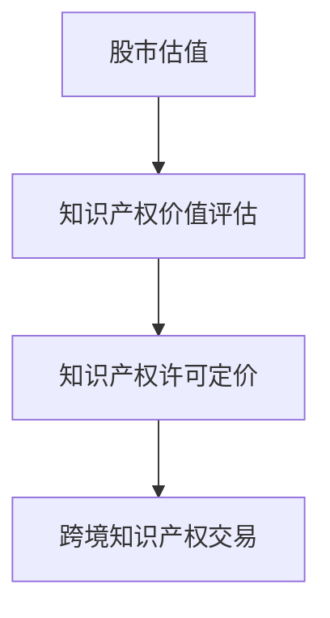
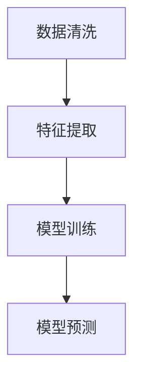
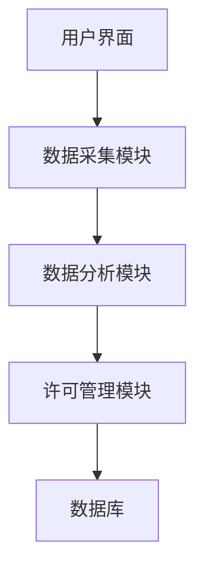
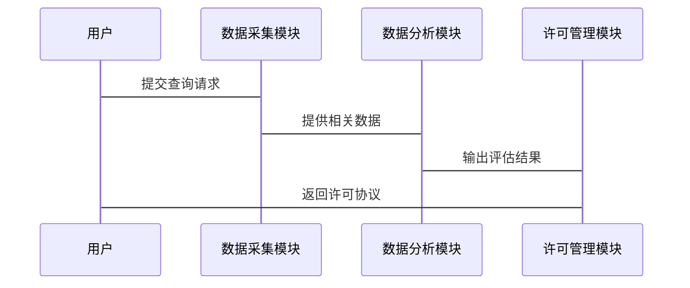

                 


---

# 股市估值在跨境知识产权许可中的应用

## 关键词
股市估值, 知识产权许可, 跨境交易, 股市数据, 知识产权评估, 机器学习模型, 经济价值分析

## 摘要
本文系统地探讨了股市估值在跨境知识产权许可中的应用，从基础概念、核心联系、算法原理、数学模型、系统架构到实际案例分析，层层深入地分析了如何利用股市数据来评估知识产权的经济价值。通过对比分析、实体关系图、算法流程图等工具，结合具体的Python代码实现和实际案例，本文为读者提供了全面的理解和实践指导。最后，本文提出了未来的研究方向和最佳实践建议，为相关领域的研究和应用提供了重要的参考。

---

# 第一部分: 背景介绍与核心概念

## 第1章: 股市估值与知识产权许可概述

### 1.1 股市估值的基本概念
#### 1.1.1 股市估值的定义
股市估值是指通过对上市公司的财务数据、市场表现和行业趋势等多方面因素进行分析，估算其股票的内在价值或市场价格的过程。股市估值的核心在于揭示公司的真实价值，为投资者提供决策依据。

#### 1.1.2 股市估值的核心要素
股市估值的核心要素包括：
- 公司的财务状况（收入、利润、资产等）；
- 行业地位和竞争优势；
- 市场供需关系和投资者情绪；
- 宏观经济环境和政策因素。

#### 1.1.3 股市估值与企业价值的关系
股市估值不仅是对公司未来盈利能力的预测，更是企业价值的直接体现。通过合理的股市估值，可以为企业的融资、并购和投资决策提供重要的参考依据。

### 1.2 知识产权许可的基本概念
#### 1.2.1 知识产权的定义
知识产权是指依法保护的创造性成果，包括专利权、商标权、版权、商业秘密等。知识产权的核心价值在于其独占性和可商业化应用的潜力。

#### 1.2.2 知识产权许可的类型
知识产权许可的主要类型包括：
- 专利许可：授权他人使用特定专利技术；
- 商标许可：授权他人使用特定商标；
- 著作权许可：授权他人使用文学、艺术或科学作品。

#### 1.2.3 知识产权许可的核心要素
知识产权许可的核心要素包括：
- 许可范围和期限；
- 许可使用费的计算方式；
- 许可双方的权利义务。

### 1.3 股市估值在知识产权许可中的应用背景
#### 1.3.1 知识产权经济价值的评估需求
知识产权作为无形资产，其价值往往难以直接量化。特别是在跨境交易中，由于不同国家的市场环境和法律制度差异，知识产权的价值评估显得尤为重要。

#### 1.3.2 股市估值在知识产权交易中的作用
股市估值通过分析上市公司的市场表现和财务数据，可以为知识产权的价值评估提供参考。特别是在知识产权密集型行业，股市估值可以帮助确定知识产权的合理价格。

#### 1.3.3 跨境知识产权许可的特殊性
跨境知识产权许可涉及不同国家的法律、税制和市场环境，增加了交易的复杂性和不确定性。因此，如何利用股市估值克服这些挑战，是本文的核心问题之一。

## 第2章: 股市估值与知识产权许可的核心联系

### 2.1 知识产权价值评估的关键问题
#### 2.1.1 知识产权价值的影响因素
知识产权的价值受到技术先进性、市场需求、法律保护等多种因素的影响。特别是在跨境交易中，还需要考虑目标市场的竞争环境和法律风险。

#### 2.1.2 知识产权的市场定价难题
知识产权的市场定价缺乏统一标准，容易受到主观因素的影响。通过股市估值的方法，可以为知识产权的定价提供更客观的依据。

#### 2.1.3 知识产权交易中的信息不对称问题
信息不对称是知识产权交易中的主要障碍之一。股市估值可以通过公开的市场数据，减少交易双方的信息不对称，提高交易效率。

### 2.2 股市估值在知识产权价值评估中的作用
#### 2.2.1 股市估值的基本原理
股市估值的基本原理是通过分析公司的财务数据和市场表现，估算其股票的内在价值。这一方法可以应用于知识产权的价值评估，特别是在上市公司中。

#### 2.2.2 股市估值与知识产权价值的关联
知识产权作为公司的重要资产，其价值直接影响公司的市场估值。通过分析公司的市场估值变化，可以间接反映知识产权的价值变化。

#### 2.2.3 股市数据在知识产权评估中的应用
股市数据，如市盈率、市净率等指标，可以作为知识产权价值评估的重要参考。特别是在技术类上市公司中，技术专利的价值可以通过市盈率等指标进行估算。

### 2.3 跨境知识产权许可的特殊挑战
#### 2.3.1 跨境知识产权交易的复杂性
跨境知识产权交易涉及不同国家的法律、税制和市场环境，增加了交易的复杂性和不确定性。

#### 2.3.2 不同国家市场的估值差异
不同国家的市场环境和投资者行为不同，导致知识产权的估值存在差异。如何在跨境交易中统一估值标准，是一个亟待解决的问题。

#### 2.3.3 跨境交易中的法律与经济因素
跨境知识产权交易需要考虑东道国的法律风险和经济政策。股市估值可以通过分析东道国的市场环境，为交易提供参考。

## 第3章: 股市估值与知识产权许可的核心概念体系

### 3.1 核心概念的属性对比
#### 3.1.1 股市估值与知识产权许可的对比分析
| 比较维度       | 股市估值                | 知识产权许可            |
|----------------|-------------------------|--------------------------|
| 核心目标       | 揭示股票的内在价值      | 确定知识产权的使用权限和价格 |
| 评估对象       | 上市公司                | 知识产权                |
| 影响因素       | 公司财务、市场环境      | 技术先进性、市场需求    |

#### 3.1.2 知识产权许可与专利许可的对比
| 比较维度       | 专利许可                | 商标许可                |
|----------------|-------------------------|--------------------------|
| 许可内容       | 技术授权                | 商标使用权              |
| 评估重点       | 技术的市场价值          | 商标的品牌价值          |
| 许可费用       | 通常基于技术使用费      | 通常基于品牌使用费      |

### 3.2 实体关系图
#### 3.2.1 知识产权许可的ER实体关系图
```mermaid
er
    actor(投资者)
    company(公司)
    patent(专利)
    license(许可协议)
    actor --> company: 申请许可
    company --> patent: 拥有
    company --> license: 签订
    patent --> license: 包含
```

#### 3.2.2 股市估值与知识产权许可的关系图


---

# 第二部分: 算法原理与数学模型

## 第4章: 股市估值算法原理

### 4.1 股市估值的核心算法
#### 4.1.1 市盈率法（P/E）
市盈率法通过将公司的市盈率与行业平均水平进行比较，估算公司的股票价值。公式如下：
$$ P/E = \frac{\text{股价}}{\text{每股收益}} $$

#### 4.1.2 市净率法（P/B）
市净率法通过将公司的市净率与行业平均水平进行比较，估算公司的股票价值。公式如下：
$$ P/B = \frac{\text{股价}}{\text{每股净资产}} $$

#### 4.1.3 现金流折现法（DCF）
现金流折现法通过将公司未来现金流的现值加总，估算公司的股票价值。公式如下：
$$ V = \sum_{t=1}^{n} \frac{CF_t}{(1 + r)^t} $$

### 4.2 基于机器学习的股市估值模型
#### 4.2.1 算法流程图（Mermaid）


#### 4.2.2 模型训练与优化
以下是基于机器学习的股市估值模型的Python代码示例：
```python
import pandas as pd
import numpy as np
from sklearn.model_selection import train_test_split
from sklearn.ensemble import RandomForestRegressor
from sklearn.metrics import mean_absolute_error

# 数据加载
data = pd.read_csv('stock_data.csv')

# 特征工程
features = data[['PE', 'PB', 'ROE']]
target = data['Stock Price']

# 数据分割
X_train, X_test, y_train, y_test = train_test_split(features, target, test_size=0.2, random_state=42)

# 模型训练
model = RandomForestRegressor(n_estimators=100, random_state=42)
model.fit(X_train, y_train)

# 模型预测
y_pred = model.predict(X_test)

# 模型评估
mae = mean_absolute_error(y_test, y_pred)
print(f"模型平均绝对误差: {mae}")
```

#### 4.2.3 算法原理的数学模型
基于机器学习的股市估值模型可以表示为：
$$ y = f(X) $$
其中，$X$ 是输入特征，$y$ 是输出目标变量，$f$ 是模型的预测函数。

---

## 第5章: 知识产权评估的数学模型

### 5.1 知识产权价值评估模型
#### 5.1.1 基于市盈率的知识产权价值评估
$$ V = P \times E $$
其中，$V$ 是知识产权价值，$P$ 是市盈率，$E$ 是每股收益。

#### 5.1.2 基于现金流的知识产权价值评估
$$ V = \sum_{t=1}^{n} \frac{CF_t}{(1 + r)^t} $$
其中，$CF_t$ 是未来第$t$年的现金流，$r$ 是折现率。

### 5.2 股市数据驱动的知识产权评估模型
#### 5.2.1 股市数据与知识产权价值的关系
$$ \text{知识产权价值} = \beta \times \text{股市指数} + \epsilon $$
其中，$\beta$ 是回归系数，$\epsilon$ 是误差项。

#### 5.2.2 基于回归分析的知识产权价值评估
以下是基于回归分析的Python代码示例：
```python
import pandas as pd
import statsmodels.api as sm

# 数据加载
data = pd.read_csv('ipo_data.csv')

# 回归分析
X = data['Market Index']
y = data['IP Value']

# 模型训练
model = sm.OLS(y, sm.add_constant(X)).fit()

# 模型结果
print(model.summary())
```

---

# 第三部分: 系统分析与架构设计

## 第6章: 知识产权许可系统的架构设计

### 6.1 系统功能设计
#### 6.1.1 系统功能模块
- 数据采集模块：采集上市公司和知识产权的相关数据；
- 数据分析模块：基于机器学习算法进行价值评估；
- 许可管理模块：管理知识产权许可协议。

### 6.2 系统架构设计


### 6.3 系统接口设计
- 数据接口：与上市公司数据库和知识产权数据库对接；
- 用户接口：供用户查询和管理知识产权许可协议。

### 6.4 系统交互流程图


---

## 第7章: 知识产权许可系统的实现

### 7.1 环境安装
- 安装Python和必要的库（如Pandas、Scikit-learn等）；
- 安装Jupyter Notebook用于数据可视化和算法实现。

### 7.2 核心代码实现
```python
import pandas as pd
from sklearn.linear_model import LinearRegression

# 数据加载
data = pd.read_csv('ipo.csv')

# 数据预处理
data.dropna(inplace=True)

# 模型训练
model = LinearRegression()
model.fit(data[['PE', 'PB']], data['IP Value'])

# 模型预测
predictions = model.predict(data[['PE', 'PB']])
print('模型预测值:', predictions)
```

---

## 第8章: 项目实战

### 8.1 跨境知识产权许可评估案例
以某跨国技术公司为例，分析其在海外市场的专利许可评估过程。

#### 8.1.1 数据收集与处理
从公开的股市数据和知识产权数据库中收集相关数据，进行清洗和预处理。

#### 8.1.2 模型实现与验证
基于机器学习算法，构建知识产权价值评估模型，并通过实际数据进行验证。

#### 8.1.3 实际案例分析
通过具体案例，展示如何利用股市估值方法确定知识产权的许可价格。

---

## 第9章: 总结与展望

### 9.1 总结
本文系统地探讨了股市估值在跨境知识产权许可中的应用，从理论分析到实际案例，全面展示了如何利用股市数据进行知识产权价值评估。

### 9.2 未来研究方向
- 开发更加复杂的算法，提高知识产权价值评估的准确性；
- 研究不同国家市场的差异，优化跨境知识产权许可的估值模型；
- 探索区块链技术在知识产权许可中的应用，提高交易的透明度和安全性。

### 9.3 最佳实践 tips
- 在进行知识产权评估时，应综合考虑技术、市场和法律等多种因素；
- 使用多种估值方法进行交叉验证，确保评估结果的准确性；
- 定期更新估值模型，以适应市场的变化。

---

## 作者：AI天才研究院/AI Genius Institute & 禅与计算机程序设计艺术/Zen And The Art of Computer Programming

---

以上就是《股市估值在跨境知识产权许可中的应用》的完整目录大纲和文章内容。

