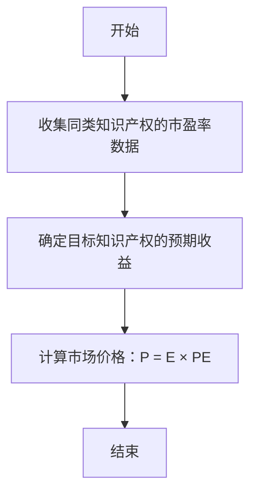
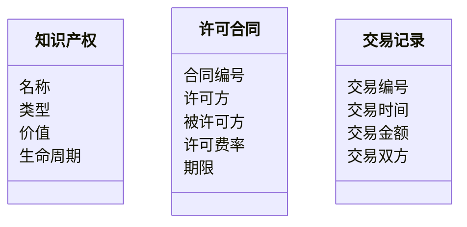
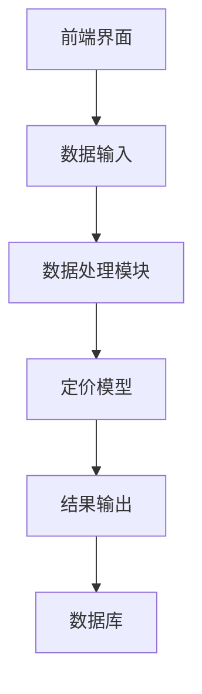
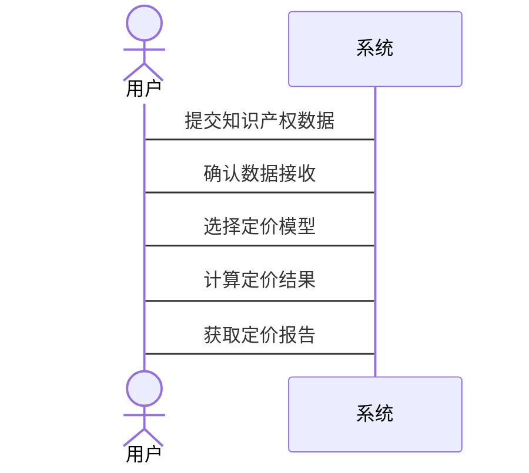

                 


# 股市估值在跨境知识产权许可定价中的应用

> 关键词：股市估值，知识产权，定价模型，跨境许可，技术分析

> 摘要：本文探讨了股市估值方法在知识产权许可定价中的应用，通过分析市盈率、贴现现金流等定价模型，结合实际案例，详细阐述了如何利用股市估值技术来确定知识产权的许可价格。本文还从系统架构设计的角度，分析了知识产权许可定价系统的核心功能与实现方式，并提出了最佳实践建议。

---

# 第一部分: 股市估值与知识产权许可定价的背景与基础

## 第1章: 股市估值与知识产权许可定价概述

### 1.1 股市估值的核心概念

#### 1.1.1 股市估值的基本定义
股市估值是指通过一定的方法和模型，对上市公司或未上市公司（或资产）的市场价值进行评估的过程。常见的股市估值方法包括市盈率（PE）、市净率（PB）、贴现现金流模型（DCF）等。这些方法通过分析企业的财务数据和市场表现，来确定其股票或资产的合理价格区间。

#### 1.1.2 股市估值的主要方法
- **市盈率法（PE）**：通过企业的盈利能力和市场平均市盈率来评估其股票价值。
- **市净率法（PB）**：通过企业的净资产与市场股价的比率来评估其价值。
- **贴现现金流法（DCF）**：通过预测企业未来现金流，并将其贴现到现值来评估企业价值。

#### 1.1.3 股市估值与企业价值的关系
股市估值是企业价值的重要体现，能够反映企业在市场中的竞争力和潜在盈利能力。通过合理的估值，投资者可以更好地判断企业的投资价值。

---

### 1.2 知识产权许可定价的基本原理

#### 1.2.1 知识产权的定义与分类
知识产权是指人们在科学、技术、文学、艺术等领域内创造的智力成果所享有的专有权利。常见的知识产权类型包括专利权、商标权、著作权、商业秘密等。

#### 1.2.2 知识产权许可的基本模式
- **独占许可**：被许可方在特定区域内享有唯一使用和销售知识产权的权利。
- **排他许可**：被许可方在特定区域内享有使用和销售知识产权的权利，但许可方也可以在该区域内自行使用。
- **普通许可**：被许可方可以在特定区域内使用知识产权，但许可方可以同时向其他方授权使用。

#### 1.2.3 知识产权价值评估的关键因素
- **技术先进性**：技术的创新性和市场竞争力。
- **市场前景**：技术的市场需求和潜在收益能力。
- **法律保护**：知识产权的法律保护力度和有效期。

---

### 1.3 股市估值在知识产权许可定价中的应用背景

#### 1.3.1 跨境知识产权交易的现状
随着全球化的发展，知识产权的跨境交易越来越频繁。然而，不同国家和地区的市场环境、法律法规差异，使得知识产权定价面临更大的挑战。

#### 1.3.2 股市估值方法的适用性分析
股市估值方法虽然主要是针对企业整体价值的评估，但其核心思想和数学模型可以借鉴到知识产权许可定价中。例如，市盈率法和贴现现金流法可以用于评估知识产权的市场价值。

#### 1.3.3 知识产权许可定价的挑战与机遇
- **挑战**：知识产权价值的不确定性和波动性较大，且受到政策和法律的多重影响。
- **机遇**：通过引入股市估值技术，可以提高知识产权定价的科学性和准确性，降低交易风险。

---

### 1.4 本章小结

本章通过介绍股市估值的核心概念和知识产权许可定价的基本原理，分析了股市估值技术在知识产权定价中的应用背景。为后续章节的深入探讨奠定了基础。

---

## 第2章: 知识产权许可定价的核心概念与联系

### 2.1 知识产权许可定价的核心要素

#### 2.1.1 知识产权的市场价值
知识产权的市场价值取决于其技术先进性、市场需求和法律保护等因素。市场价值是知识产权许可定价的核心依据。

#### 2.1.2 许可费率的计算方法
许可费率通常基于知识产权的市场价值和预期收益来确定。常见的计算方法包括固定费率、收益分成率等。

#### 2.1.3 知识产权的生命周期
知识产权的生命周期包括创造、应用、保护和终止等阶段。在不同阶段，知识产权的市场价值和定价策略也会有所不同。

---

### 2.2 股市估值方法与知识产权许可定价的联系

#### 2.2.1 市盈率法在知识产权定价中的应用
市盈率法通过比较同类知识产权的市场表现，来评估目标知识产权的合理价格。例如，如果一项专利的市盈率为20倍，而行业平均市盈率为15倍，则该专利的市场价格可能偏高。

#### 2.2.2 市净率法在知识产权定价中的应用
市净率法通过比较知识产权的账面价值和市场价值，来评估其合理价格。例如，如果一项商标的账面价值为100万元，而行业平均市净率为3倍，则该商标的市场价格可能为300万元。

#### 2.2.3 贴现现金流法在知识产权定价中的应用
贴现现金流法通过预测知识产权的未来收益，并将其贴现到现值，来评估其市场价值。例如，假设一项专利的未来5年收益分别为100万元、120万元、140万元、160万元、180万元，贴现率设定为8%，则其现值可以通过以下公式计算：

$$
PV = \sum_{t=1}^{5} \frac{CF_t}{(1+0.08)^t}
$$

其中，\( CF_t \) 为第 \( t \) 年的现金流。

---

### 2.3 知识产权许可定价的ER实体关系图

以下是知识产权许可定价的ER实体关系图：

```mermaid
erd
actor 许可方
actor 被许可方
actor 中介机构
entity 知识产权
entity 许可合同
entity 交易记录
```

---

### 2.4 本章小结

本章通过分析知识产权许可定价的核心要素，探讨了股市估值方法在知识产权定价中的具体应用。通过ER实体关系图，进一步明确了知识产权许可定价的系统架构。

---

## 第3章: 知识产权许可定价的算法原理

### 3.1 知识产权许可定价的主要算法

#### 3.1.1 基于市盈率的定价算法
市盈率法通过比较同类知识产权的市盈率，来确定目标知识产权的合理价格。其算法步骤如下：

1. 收集同类知识产权的市盈率数据。
2. 计算目标知识产权的预期收益。
3. 根据市盈率公式 \( P = E \times PE \) 计算其市场价格。

#### 3.1.2 基于贴现现金流的定价算法
贴现现金流法通过预测知识产权的未来收益，并将其贴现到现值，来确定其市场价值。其算法步骤如下：

1. 确定知识产权的未来现金流。
2. 选择合适的贴现率。
3. 计算未来现金流的现值。
4. 确定知识产权的市场价格。

#### 3.1.3 基于回归分析的定价算法
回归分析法通过建立知识产权价格与影响因素之间的回归模型，来预测其市场价格。其算法步骤如下：

1. 收集知识产权价格及其影响因素的数据。
2. 建立回归模型。
3. 验证模型的准确性。
4. 使用模型预测知识产权价格。

---

### 3.2 算法原理的数学模型

#### 3.2.1 市盈率法的数学公式
$$
P = E \times PE
$$
其中，\( P \) 为市场价格，\( E \) 为预期收益，\( PE \) 为市盈率倍数。

#### 3.2.2 贴现现金流法的数学公式
$$
PV = \sum_{t=1}^{n} \frac{CF_t}{(1+r)^t}
$$
其中，\( PV \) 为现值，\( CF_t \) 为第 \( t \) 年的现金流，\( r \) 为贴现率。

---

### 3.3 算法流程图

以下是市盈率法的算法流程图：



---

### 3.4 本章小结

本章通过介绍市盈率法、贴现现金流法和回归分析法，详细阐述了知识产权许可定价的主要算法及其数学模型。为后续章节的系统设计奠定了基础。

---

## 第4章: 知识产权许可定价的系统分析与架构设计

### 4.1 系统分析

#### 4.1.1 问题场景介绍
知识产权许可定价系统需要解决的问题包括：如何准确评估知识产权的市场价值，如何选择合适的定价模型，以及如何实现系统的自动化定价功能。

#### 4.1.2 项目介绍
本项目旨在开发一个基于股市估值技术的知识产权许可定价系统，通过收集和分析知识产权相关数据，实现自动化的定价功能。

---

### 4.2 系统功能设计

#### 4.2.1 领域模型类图

以下是领域模型类图：



---

### 4.3 系统架构设计

以下是系统架构图：



---

### 4.4 系统接口设计

系统接口设计主要包括以下内容：
- 数据输入接口：用于接收知识产权相关数据。
- 数据处理接口：用于对数据进行清洗和预处理。
- 定价模型接口：用于选择和运行合适的定价算法。
- 结果输出接口：用于展示定价结果。

---

### 4.5 系统交互序列图

以下是系统交互序列图：



---

### 4.6 本章小结

本章通过系统分析和架构设计，明确了知识产权许可定价系统的功能模块和实现方式。为后续章节的项目实战奠定了基础。

---

## 第5章: 项目实战

### 5.1 环境安装

为了实现知识产权许可定价系统，需要安装以下软件和工具：
- Python编程语言
- 数据分析库（如Pandas、NumPy）
- 图表绘制工具（如Matplotlib、Seaborn）
- 数据库管理工具（如MySQL、MongoDB）

---

### 5.2 系统核心实现源代码

以下是基于市盈率法的定价算法实现代码：

```python
import pandas as pd

def calculate_price(enterprise_value, expected_profit):
    market_value = enterprise_value * expected_profit
    return market_value

# 示例数据
enterprise_value = 1000000  # 企业价值
expected_profit = 0.2  # 预期利润率
price = calculate_price(enterprise_value, expected_profit)
print(f"知识产权的市场价格为：{price}")
```

---

### 5.3 代码应用解读与分析

上述代码通过函数 `calculate_price` 实现了市盈率法的定价算法。首先，函数接收企业价值和预期利润率作为输入，然后根据市盈率公式计算出知识产权的市场价格。代码简洁易懂，适合初学者学习和应用。

---

### 5.4 实际案例分析

假设某公司拥有一项专利，企业价值为1000万元，预期利润率为20%。根据市盈率法，其市场价格为：

$$
P = 1000 \times 0.2 = 200 \text{万元}
$$

---

### 5.5 本章小结

本章通过项目实战，详细讲解了知识产权许可定价系统的实现过程。通过代码实现和案例分析，帮助读者更好地理解股市估值技术在知识产权定价中的应用。

---

## 第6章: 最佳实践与注意事项

### 6.1 最佳实践

#### 6.1.1 数据收集与处理
- 确保数据的准确性和完整性。
- 使用数据清洗和预处理技术，提高模型的准确性。

#### 6.1.2 模型选择与优化
- 根据具体场景选择合适的定价模型。
- 通过交叉验证和回测，优化模型的性能。

#### 6.1.3 风险控制
- 识别和评估定价中的风险因素。
- 建立风险管理机制，降低定价误差。

---

### 6.2 注意事项

- 知识产权许可定价受到政策和法律的多重影响，需密切关注相关法规变化。
- 数据质量和模型选择对定价结果有重要影响，需谨慎处理。
- 在实际应用中，建议结合专家意见和市场反馈，不断优化定价策略。

---

## 第7章: 总结与展望

### 7.1 总结

本文通过探讨股市估值在知识产权许可定价中的应用，详细分析了市盈率法、贴现现金流法等定价模型的实现原理和应用场景。同时，通过系统架构设计和项目实战，进一步验证了股市估值技术在知识产权定价中的可行性和有效性。

### 7.2 展望

未来，随着人工智能和大数据技术的不断发展，知识产权许可定价将更加智能化和精准化。建议进一步研究如何结合机器学习算法，提升定价模型的预测能力和适应性。

---

## 作者：AI天才研究院/AI Genius Institute & 禅与计算机程序设计艺术/Zen And The Art of Computer Programming

