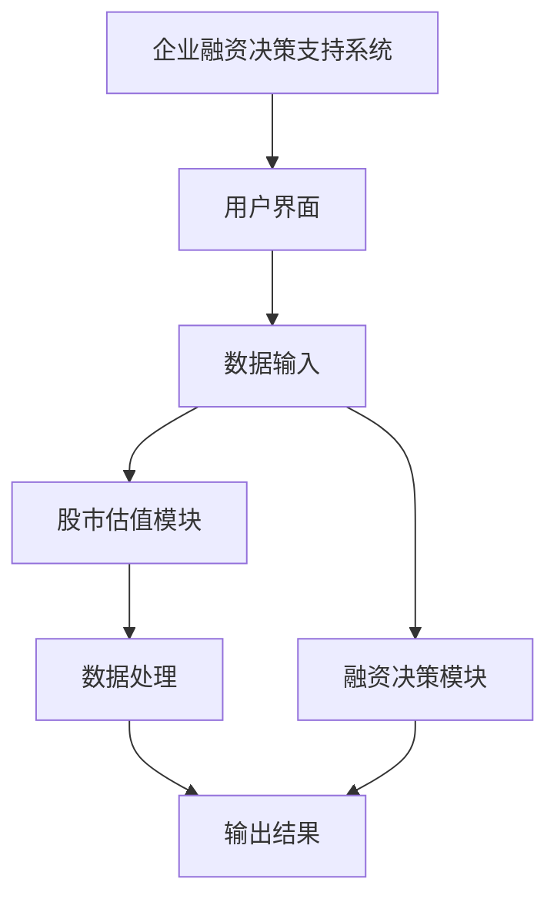
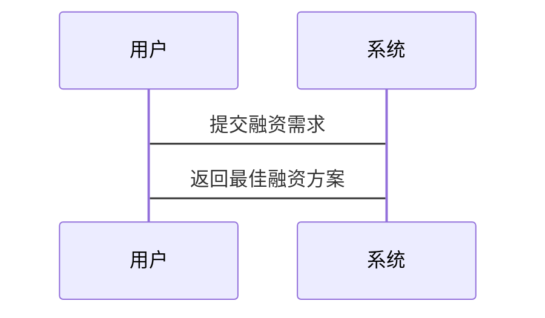

                 


# 股市估值对企业融资决策的影响

> 关键词：股市估值、企业融资决策、股票定价、市场价值、融资成本

> 摘要：股市估值是企业融资决策的重要参考指标，通过对股市估值的分析，可以帮助企业制定更科学的融资策略，降低融资成本，优化资本结构。本文从股市估值的基本概念出发，结合具体的数学模型和实际案例，深入分析股市估值对企业融资决策的影响，探讨如何通过合理的估值方法选择最佳融资时机，从而提升企业的资本运作效率。

---

## 第一部分：股市估值与企业融资决策的背景

### 第1章：股市估值与企业融资决策的概述

#### 1.1 股市估值的基本概念
- 股票市场与股市估值的定义
- 股票价值的决定因素：盈利能力、行业地位、宏观经济环境
- 股市估值的核心指标：市盈率（P/E）、市净率（P/B）、股息率
- 股市估值与企业融资的关系：股市估值影响融资成本和融资方式的选择

#### 1.2 企业融资决策的类型
- 内部融资与外部融资的定义与特点
- 股权融资与债务融资的对比
- 混合融资的优劣势分析

#### 1.3 股市估值对企业融资决策的影响
- 股市估值与融资成本的关系
- 股价波动对企业融资决策的影响
- 股市估值对企业融资策略的指导作用

#### 1.4 本章小结
- 股市估值与企业融资决策的核心联系
- 本书研究的目的与意义

---

## 第二部分：股市估值的核心概念与分析方法

### 第2章：股市估值的理论基础

#### 2.1 股票价值的决定因素
- 股票的内在价值与市场价值
- 影响股票价格的主要因素：盈利能力、行业地位、宏观经济环境

#### 2.2 常见的股市估值方法
- 市盈率（P/E）模型
- 市净率（P/B）模型
- 现金流折现模型（DCF）

#### 2.3 股市估值模型的对比分析
- 各种估值模型的优缺点对比
- 不同行业适用的估值模型选择

---

### 第3章：企业融资决策的核心要素

#### 3.1 融资成本的计算与影响
- 融资成本的构成与计算方法
- 股票融资与债券融资的成本差异

#### 3.2 股权稀释与企业控制权的影响
- 股权融资对企业控制权的影响
- 股权稀释对股东利益的影响

#### 3.3 融资时机的选择与股市估值的关系
- 股市估值对企业融资时机的影响
- 如何选择最佳融资时机

---

## 第三部分：股市估值与企业融资决策的数学模型与算法

### 第4章：股市估值的数学模型与算法

#### 4.1 市盈率（P/E）模型
- 市盈率的计算公式：$P/E = \frac{股价}{每股净利润}$
- 市盈率与企业融资成本的关系
- 市盈率模型的优缺点

#### 4.2 市净率（P/B）模型
- 市净率的计算公式：$P/B = \frac{股价}{每股净资产}$
- 市净率与企业融资策略的关联
- 市净率模型的适用场景与局限性

#### 4.3 现金流折现模型（DCF）
- 现金流折现模型的原理与步骤
- 终值的计算公式：$$ TV = \frac{CF_{n+1}}{r} $$
- 净现值（NPV）的计算公式：$$ NPV = \sum_{t=1}^{n} \frac{CF_t}{(1+r)^t} $$
- DCF模型在企业融资决策中的应用

---

### 第5章：企业融资决策的数学模型与算法

#### 5.1 融资成本的优化模型
- 融资成本的最小化问题：$$ \min \text{融资成本} $$
- 债权融资与股权融资的组合优化

#### 5.2 股权稀释模型
- 股权稀释对控制权的影响：$$ \text{稀释比例} = \frac{\text{新发行股数}}{\text{总股数}} $$
- 股权稀释对股东利益的影响

#### 5.3 融资时机的选择模型
- 股市估值与融资成本的关系：$$ \text{融资成本} = f(\text{股市估值}) $$
- 融资时机的选择算法：基于股市估值的动态调整模型

---

## 第四部分：股市估值与企业融资决策的系统分析与架构设计

### 第6章：系统分析与架构设计方案

#### 6.1 问题场景介绍
- 股市估值对企业融资决策的影响
- 企业融资决策的系统架构设计

#### 6.2 系统功能设计
- 领域模型：企业融资决策的实体关系图（ER图）
- 系统架构设计：基于云架构的企业融资决策支持系统

#### 6.3 系统架构图（Mermaid）


#### 6.4 系统接口设计
- 股市估值接口：RESTful API
- 融资决策接口：基于实时数据的动态调整接口

#### 6.5 系统交互图（Mermaid）


---

## 第五部分：项目实战

### 第7章：项目实战与案例分析

#### 7.1 环境安装
- 安装Python与相关金融分析库（如pandas、numpy、scipy）
- 安装Mermaid图表工具

#### 7.2 核心代码实现
- 股市估值模型的实现：
  ```python
  def calculate_pe(stock_price, earnings_per_share):
      return stock_price / earnings_per_share
  ```
- 融资成本优化算法：
  ```python
  def optimize_financing_cost(debt_cost, equity_cost):
      return min(debt_cost, equity_cost)
  ```

#### 7.3 案例分析
- 某公司融资决策的案例分析
- 如何通过股市估值模型选择最佳融资时机
- 案例结果与分析

#### 7.4 项目小结
- 项目实现的关键点总结
- 项目中的问题与解决方法

---

## 第六部分：总结与展望

### 第8章：总结与展望

#### 8.1 本章总结
- 股市估值与企业融资决策的核心联系
- 数学模型与算法在融资决策中的应用

#### 8.2 未来展望
- 股市估值与企业融资决策的未来发展趋势
- 人工智能在融资决策中的应用潜力

---

## 作者

作者：AI天才研究院/AI Genius Institute & 禅与计算机程序设计艺术 /Zen And The Art of Computer Programming

