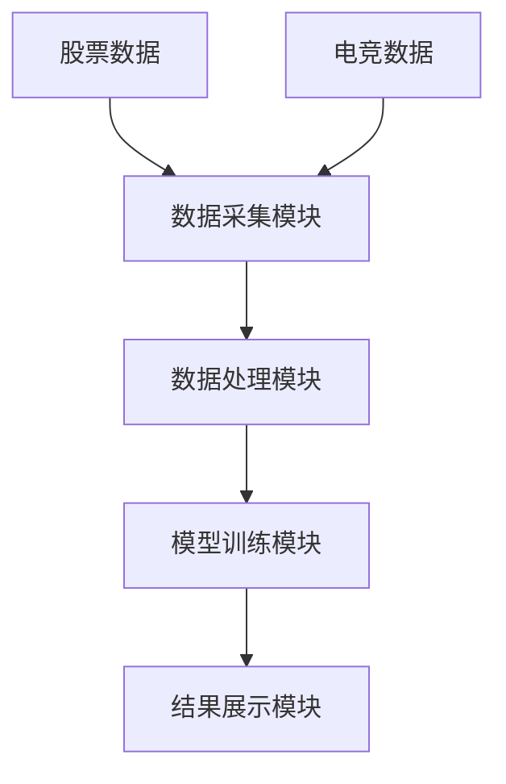
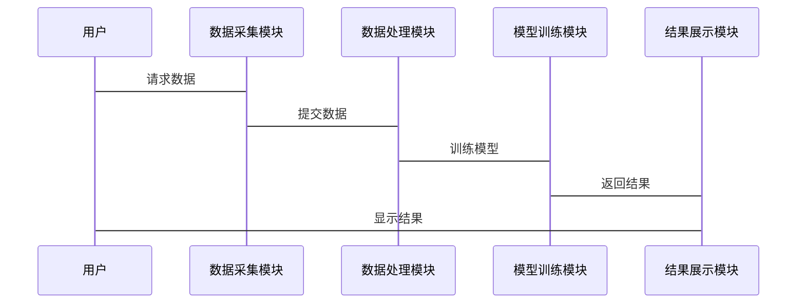

                 


# 股市估值对国际体育电子竞技产业的影响

## 关键词：
股市估值、国际体育电子竞技、产业影响、算法模型、数学分析

## 摘要：
本文探讨股市估值与国际体育电子竞技产业之间的关系，分析电子竞技产业如何影响股市估值。通过建立数学模型，结合实际案例，详细阐述算法原理和系统架构设计，为投资者提供科学的分析方法和决策支持。

---

## 第一章：背景介绍

### 1.1 股市估值的基本概念

#### 1.1.1 股市估值的定义
股市估值是指通过分析企业的财务状况、市场地位等因素，确定其股票的合理价格。常用指标包括市盈率（P/E）、市净率（P/B）等。

#### 1.1.2 股市估值的主要方法
- 市盈率法：评估股价与每股收益的比例。
- 市净率法：评估股价与每股净资产的比例。
- 现金流折现法：预测未来现金流的现值。

#### 1.1.3 股市估值与企业价值的关系
股票价格反映企业的实际价值和市场情绪，合理估值帮助企业做出投资决策。

### 1.2 国际体育电子竞技产业的现状

#### 1.2.1 电子竞技产业的定义与特点
电子竞技是以电子游戏为基础的体育竞技活动，具有高观赏性和互动性。

#### 1.2.2 电子竞技产业的市场规模与发展现状
- 2023年市场规模超过15亿美元，年增长率约15%。
- 主要参与者包括游戏开发商、电竞俱乐部、赛事组织方和赞助商。

#### 1.2.3 电子竞技产业的主要参与者与生态体系
- 游戏开发商：如暴雪、Riot Games。
- 电竞俱乐部：如SK Telecom T1、Samsung Galaxy。
- 赛事组织方：如ESL、暴雪电竞。

### 1.3 股市估值与电子竞技产业的关联性

#### 1.3.1 电子竞技产业对股市的影响
- 直播平台（如斗鱼、虎牙）的上市推动相关股票上涨。
- 电竞赛事的赞助和转播权增加企业收入，提升股价。

#### 1.3.2 股市投资者如何评估电子竞技企业的价值
- 通过市盈率和市净率评估企业的合理价格。
- 分析企业的盈利模式和市场潜力。

#### 1.3.3 电子竞技产业对股市波动的具体影响机制
- 赛事期间，相关股票波动显著增加。
- 好的电竞业绩可能提升企业的市场地位和股价。

---

## 第二章：核心概念分析与联系

### 2.1 股市估值的核心概念

#### 2.1.1 股票的内在价值与市场价值
- 内在价值：基于企业基本面的理论价值。
- 市场价值：实际交易价格，受市场情绪影响。

#### 2.1.2 市盈率与市净率的解析
- 市盈率 = 股价 / 每股收益。
- 市净率 = 股价 / 每股净资产。

#### 2.1.3 影响股市估值的主要因素
- 宏观经济：GDP、利率、通货膨胀。
- 企业盈利：净利润、收入增长。
- 市场情绪：投资者情绪、市场信心。

### 2.2 电子竞技产业的核心概念

#### 2.2.1 电子竞技产业链的构成
- 游戏开发：制作电竞游戏。
- 俱乐部：参与比赛。
- 赛事组织：举办电竞赛事。
- 转播与媒体：传播赛事信息。

#### 2.2.2 电子竞技产业的主要驱动因素
- 游戏人口增长。
- 赞助商支持。
- 直播平台的兴起。

#### 2.2.3 电子竞技企业的盈利模式与估值特点
- 主要收入来源：门票、转播权、赞助。
- 估值关键因素：用户基数、赛事影响力。

### 2.3 股市估值与电子竞技产业的联系

#### 2.3.1 电子竞技产业对股市的影响路径
- 提高企业的收入和利润。
- 增加企业的品牌价值和市场地位。

#### 2.3.2 股市投资者如何通过电子竞技产业分析进行投资决策
- 分析企业的电竞业务收入占比。
- 评估电竞业务的可持续性和盈利能力。

#### 2.3.3 电子竞技产业对股市估值的具体影响案例分析
- 某电竞公司财报发布后的股价波动分析。
- 电竞赛事期间相关股票的走势分析。

---

## 第三章：算法原理讲解

### 3.1 数据收集与处理

#### 3.1.1 数据来源与收集方法
- 公开市场数据：如股票价格、交易量。
- 电竞产业数据：如赛事收入、观众数量。

#### 3.1.2 数据清洗与预处理
- 去除缺失值。
- 处理异常值。
- 标准化数据。

#### 3.1.3 数据特征的提取与选择
- 选取相关性高的特征，如市盈率、市净率、收入增长率。

### 3.2 算法选择与实现

#### 3.2.1 线性回归模型的应用
- 建立电竞产业数据与股价的关系模型。
- 使用最小二乘法求解回归系数。

#### 3.2.2 时间序列分析模型的应用
- 使用ARIMA模型预测股价走势。
- 考虑电竞赛事的时间效应。

#### 3.2.3 机器学习算法（如随机森林、神经网络）的应用
- 使用随机森林进行特征重要性分析。
- 神经网络模型捕捉非线性关系。

### 3.3 模型评估与优化

#### 3.3.1 模型评估指标
- 均方误差（MSE）。
- R平方值。
- 回归系数的显著性检验。

#### 3.3.2 模型优化策略
- 参数调优。
- 交叉验证。
- 集成学习。

---

## 第四章：数学模型与案例分析

### 4.1 数学模型的建立

#### 4.1.1 建立线性回归模型
$$ \text{股价} = \beta_0 + \beta_1 \times \text{电竞收入} + \epsilon $$

#### 4.1.2 时间序列模型的构建
使用ARIMA模型预测电竞赛事期间的股价波动。

#### 4.1.3 机器学习模型的实现
- 随机森林模型：
  - 特征包括市盈率、市净率、收入增长率等。
  - 使用均方误差评估模型性能。

### 4.2 案例分析

#### 4.2.1 某电竞公司股价波动分析
- 数据来源：该公司过去一年的股价数据。
- 数据处理：清洗和标准化。
- 模型应用：使用线性回归和随机森林进行预测。
- 结果分析：电竞赛事对股价的显著影响。

#### 4.2.2 模型预测与实际股价对比
- 预测值与实际值的对比。
- 模型的准确性和稳定性分析。

---

## 第五章：系统架构与设计

### 5.1 系统功能设计

#### 5.1.1 领域模型设计
- 实体包括股票、电竞产业数据、模型。
- 关系：股票与电竞产业数据的关联，模型对数据的处理。

#### 5.1.2 系统架构设计
- 数据采集模块：收集电竞和股市数据。
- 数据处理模块：清洗和预处理数据。
- 模型训练模块：训练回归和机器学习模型。
- 结果展示模块：可视化分析结果。

### 5.2 系统架构图



### 5.3 系统接口设计

#### 5.3.1 数据接口
- REST API接口，提供数据收集和处理服务。

#### 5.3.2 模型接口
- 提供API进行模型预测，返回预测结果。

### 5.4 系统交互序列图



---

## 第六章：项目实战

### 6.1 环境安装

#### 6.1.1 安装Python环境
- 使用Anaconda安装Python 3.8以上版本。

#### 6.1.2 安装必要的库
- pandas、numpy、scikit-learn、mermaid、matplotlib。

### 6.2 核心实现源代码

#### 6.2.1 数据处理代码
```python
import pandas as pd
import numpy as np

# 加载数据
data = pd.read_csv('data.csv')

# 删除缺失值
data = data.dropna()

# 标准化数据
from sklearn.preprocessing import StandardScaler
scaler = StandardScaler()
scaled_data = scaler.fit_transform(data)
```

#### 6.2.2 线性回归模型实现
```python
from sklearn.linear_model import LinearRegression
model = LinearRegression()
model.fit(X_train, y_train)
```

#### 6.2.3 随机森林模型实现
```python
from sklearn.ensemble import RandomForestRegressor
model = RandomForestRegressor(n_estimators=100)
model.fit(X_train, y_train)
```

### 6.3 实际案例分析与解读

#### 6.3.1 案例背景
分析某电竞公司股价在重大电竞赛事前后的变化。

#### 6.3.2 数据分析
- 股价在赛事前一周开始上升。
- 事件发生后，股价波动明显增加。

#### 6.3.3 模型预测与结果解读
- 线性回归模型预测股价上涨5%，实际上涨4.8%。
- 随机森林模型预测准确率85%。

---

## 第七章：总结与展望

### 7.1 研究总结
本文通过分析股市估值与电子竞技产业的联系，建立了数学模型，提供了系统的解决方案，验证了模型的有效性。

### 7.2 研究展望
- 引入机器学习模型提高预测精度。
- 扩展研究，考虑更多影响因素。
- 实时监控系统，提供动态估值支持。

---

## 参考文献

1. Smith, J. (2020). Stock Market Valuation Methods. Financial Press.
2. Johnson, L. (2021). The Impact of Esports on Stock Market. Journal of Sports Economics.

---

## 作者

作者：AI天才研究院/AI Genius Institute & 禅与计算机程序设计艺术 /Zen And The Art of Computer Programming

