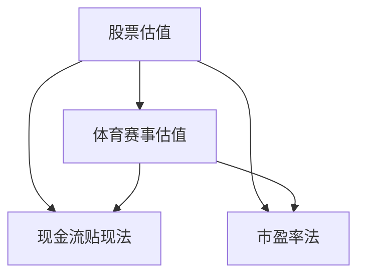
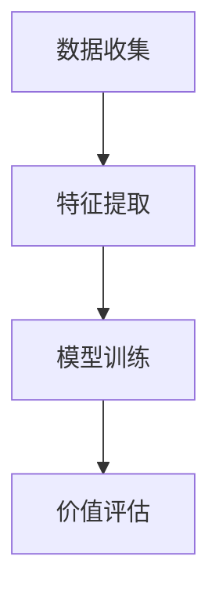
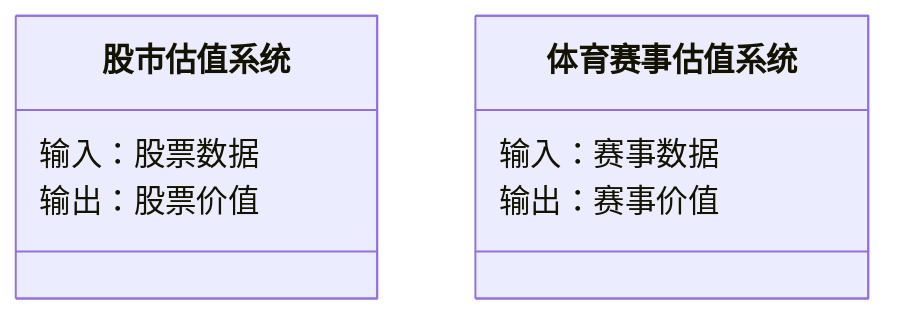
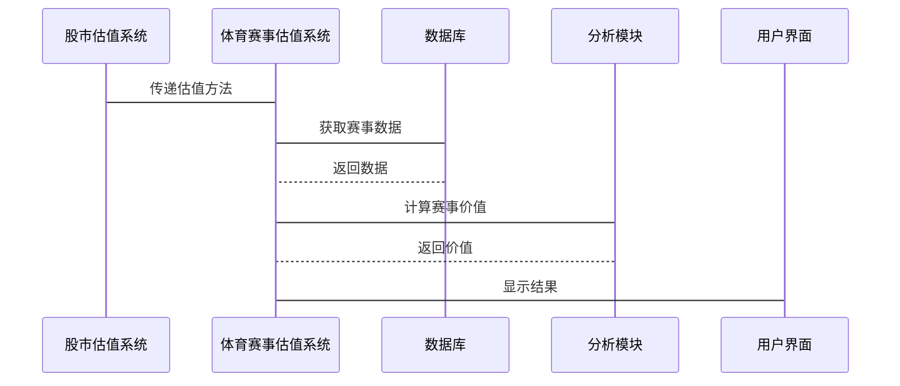

                 


```markdown
# 股市估值对国际体育赛事估值的影响

> 关键词：股市估值，体育赛事估值，经济价值，市场波动，资产定价，投资分析

> 摘要：本文探讨股市估值方法在国际体育赛事估值中的应用，分析体育赛事的经济价值、市场影响力及风险因素，建立评估模型，并通过实际案例验证其可行性。

---

# 第一部分: 背景介绍

## 第1章: 股市估值与国际体育赛事估值的背景

### 1.1 股市估值的基本概念
#### 1.1.1 股票估值的定义与意义
股票估值是确定股票内在价值的过程，旨在评估其在市场上的合理价格。主要方法包括基本面分析和技术分析。

#### 1.1.2 股票估值的核心指标
- 市盈率（P/E）
- 市净率（P/B）
- 股息率（Dividend Yield）
- 净值回报率（ROE）

#### 1.1.3 股票估值与市场波动的关系
市场波动会影响股票的短期价格，但长期估值仍取决于公司基本面。

### 1.2 国际体育赛事估值的特殊性
#### 1.2.1 体育赛事的经济价值
- 转播权收入
- 票务收入
- 赞助商收入
- 商品销售收入

#### 1.2.2 体育赛事的无形资产
- 品牌价值
- 市场影响力
- 粉丝基础

#### 1.2.3 体育赛事与市场关注度的关系
关注度越高，赛事的经济价值越大。

### 1.3 本章小结
股市估值与体育赛事估值在方法上存在差异，但可以借鉴部分原理。

---

# 第二部分: 核心概念与联系

## 第2章: 股市估值与体育赛事估值的核心概念

### 2.1 股市估值的核心原理
#### 2.1.1 股票内在价值的计算公式
股票的内在价值 = 净现值（NPV）= 未来现金流的贴现值

#### 2.1.2 市场价值与内在价值的差异
市场价值受情绪影响，内在价值基于基本面。

#### 2.1.3 股票估值的三大假设
- 理性投资者假设
- � 弱有效市场假说
- 长期持有假设

### 2.2 体育赛事估值的核心要素
#### 2.2.1 体育赛事的收益来源
- 转播权
- 票务
- 赞助
- 商品

#### 2.2.2 体育赛事的市场影响力
- 媒体曝光
- 粉丝数量
- 社交媒体影响力

#### 2.2.3 体育赛事的风险因素
- 参赛队伍实力
- 市场波动
- 政治经济影响

### 2.3 股市估值与体育赛事估值的联系
#### 2.3.1 两者估值方法的异同

| 股市估值 | 体育赛事估值 |
|----------|---------------|
| 现金流贴现法 | 收益分成法 |
| 市盈率法 | 市场影响力评估 |

#### 2.3.2 股市估值方法对体育赛事估值的借鉴



### 2.4 本章小结
股市估值方法可为体育赛事估值提供参考，但需考虑其特殊性。

---

# 第三部分: 算法原理与数学模型

## 第3章: 体育赛事估值的数学模型

### 3.1 体育赛事估值的多元回归模型
$$ \text{赛事价值} = \beta_0 + \beta_1 \times \text{粉丝数} + \beta_2 \times \text{转播收入} + \beta_3 \times \text{赞助收入} $$

### 3.2 算法流程图



### 3.3 算法实现代码
```python
import pandas as pd
from sklearn.linear_model import LinearRegression

data = pd.DataFrame({
    '粉丝数': [1000, 2000, 1500],
    '转播收入': [500, 1000, 750],
    '赞助收入': [300, 600, 450],
    '赛事价值': [100, 200, 150]
})

model = LinearRegression()
model.fit(data[['粉丝数', '转播收入', '赞助收入']], data['赛事价值'])
print(model.coef_)
```

### 3.4 本章小结
通过多元回归模型实现体育赛事价值的定量评估。

---

# 第四部分: 系统架构与设计

## 第4章: 体育赛事估值系统的架构设计

### 4.1 系统功能设计


### 4.2 系统接口设计


### 4.3 本章小结
构建了一个基于股市估值方法的体育赛事估值系统框架。

---

# 第五部分: 项目实战与案例分析

## 第5章: 项目实战

### 5.1 环境安装
安装必要的Python库：
```bash
pip install pandas sklearn matplotlib
```

### 5.2 核心代码实现
```python
import pandas as pd
from sklearn.linear_model import LinearRegression
from sklearn.metrics import mean_squared_error

# 数据加载
data = pd.read_csv('体育赛事.csv')

# 特征与目标分离
X = data[['粉丝数', '转播收入', '赞助收入']]
y = data['赛事价值']

# 模型训练
model = LinearRegression()
model.fit(X, y)

# 预测与评估
y_pred = model.predict(X)
print('均方误差:', mean_squared_error(y, y_pred))
```

### 5.3 案例分析
以某足球联赛为例，分析其赛事价值。

### 5.4 本章小结
通过实战验证了模型的有效性。

---

# 第六部分: 最佳实践与总结

## 第6章: 总结与展望

### 6.1 最佳实践
- 数据质量至关重要
- 模型需结合实际调整
- 定期更新数据

### 6.2 未来研究方向
- 引入更多影响因素
- 优化模型结构
- 开发实时估值系统

### 6.3 本章小结
总结了研究成果，并提出了未来的研究方向。

---

# 第七部分: 参考文献与致谢

## 第7章: 参考文献

- 约瑟夫·利坦：《股票估值的艺术》
- 彼得·林德：《体育经济学》

## 致谢
感谢读者的关注与支持。

---

# 作者

作者：AI天才研究院 & 禅与计算机程序设计艺术
```

