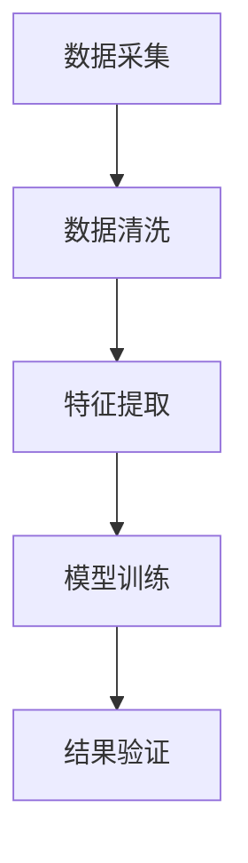
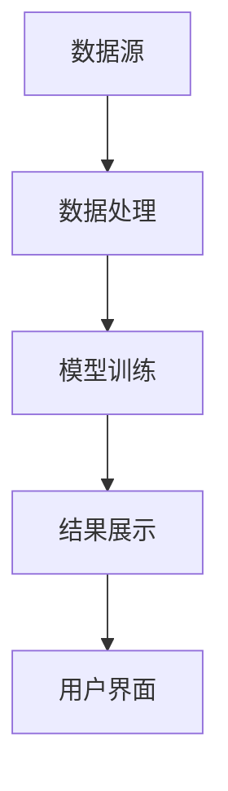

                 


# 股市估值对国际体育赛事虚拟观赛的影响

> 关键词：股市估值、国际体育赛事、虚拟观赛、疫情、经济影响

> 摘要：本文探讨了股市估值与国际体育赛事虚拟观赛之间的关系，分析了虚拟观赛技术对体育赛事市场价值的影响，以及疫情对两者关系的深远影响。通过建立数学模型和数据分析，本文揭示了虚拟观赛如何影响股市估值，并提出了相应的系统设计和实践方案。

---

## 第一部分：背景与概念

### 第1章：背景介绍

#### 1.1 问题背景

##### 1.1.1 股市估值的基本概念
股市估值是通过分析公司财务数据、市场环境和宏观经济指标，对股票的内在价值进行评估。常用的估值指标包括市盈率（P/E）、市净率（P/B）和股息率等。

##### 1.1.2 国际体育赛事的定义与分类
国际体育赛事是指跨越国界的体育比赛，如世界杯、奥运会等。根据类型，可分为单项运动赛事和综合运动会赛事。

##### 1.1.3 虚拟观赛技术的发展现状
虚拟观赛技术利用VR、AR和流媒体技术，为观众提供沉浸式的观赛体验。疫情推动了虚拟观赛的快速发展。

#### 1.2 问题描述

##### 1.2.1 股市估值与体育赛事的关系
股市投资者通过体育赛事的市场价值变化影响股市估值。

##### 1.2.2 虚拟观赛对体育赛事消费行为的影响
虚拟观赛改变了观众的消费模式，影响体育赛事的收入和市场价值。

##### 1.2.3 疫情对体育赛事与股市的双重影响
疫情导致体育赛事暂停，虚拟观赛需求激增，股市反映了这一变化。

#### 1.3 问题解决

##### 1.3.1 虚拟观赛技术如何影响体育赛事的市场价值
虚拟观赛提升了观众参与度，增加了赛事的市场价值。

##### 1.3.2 股市估值如何反映体育赛事的虚拟化趋势
股市估值通过分析相关公司股票的变化，反映虚拟观赛的市场潜力。

##### 1.3.3 疫情后时代虚拟观赛的市场潜力
疫情后，虚拟观赛成为体育产业的重要组成部分，市场潜力巨大。

#### 1.4 边界与外延

##### 1.4.1 虚拟观赛的边界条件
包括技术限制、用户需求和内容版权等因素。

##### 1.4.2 股市估值的适用范围
适用于分析体育赛事相关公司的股票价值。

##### 1.4.3 体育赛事虚拟化的未来趋势
虚拟观赛将成为体育赛事的重要组成部分，推动体育产业数字化转型。

#### 1.5 概念结构与核心要素

##### 1.5.1 核心概念对比表格
| 概念 | 定义 | 关系 |
|------|------|------|
| 股市估值 | 股票内在价值评估 | 反映体育赛事虚拟化的市场潜力 |
| 虚拟观赛 | 沉浸式观赛技术 | 影响体育赛事的市场价值 |
| 疫情影响 | 对体育赛事和股市的双重影响 | 连接虚拟观赛与股市估值 |

##### 1.5.2 ER实体关系图
```mermaid
erd
    股市估值-[:manytoone]->公司
    公司-[:manytoone]->体育赛事
    体育赛事-[:manytoone]->虚拟观赛技术
```

---

## 第二部分：核心概念与联系

### 第2章：核心概念原理

#### 2.1 股市估值的数学模型

##### 2.1.1 股票价值的计算公式
股票的内在价值可以通过现金流折现法（DCF）计算：
$$ V = \frac{C}{(1 + r)^n} $$
其中，C为未来现金流，r为折现率，n为时间。

##### 2.1.2 市盈率与市净率的计算
市盈率（P/E）= 股价 / 每股收益（EPS）  
市净率（P/B）= 股价 / 每股净资产（BPS）

##### 2.1.3 股票价格与市场情绪的关系
市场情绪通过投资者心理影响股市估值，常用指标包括恐慌指数（VIX）。

#### 2.2 虚拟观赛的技术原理

##### 2.2.1 虚拟现实技术的基本原理
通过计算机生成模拟环境，用户通过头显设备沉浸式体验。

##### 2.2.2 增强现实技术的应用场景
将虚拟元素叠加到真实环境中，提升观赛体验。

##### 2.2.3 在线流媒体技术的实现方式
通过高速网络传输实时画面，支持多设备观看。

#### 2.3 股市与体育赛事的关联性分析

##### 2.3.1 体育赛事的市场价值评估
通过门票收入、转播权收入和赞助收入评估市场价值。

##### 2.3.2 股市投资者的行为分析
投资者通过分析体育赛事公司的财务数据和市场表现进行投资决策。

##### 2.3.3 体育赛事的虚拟化对股市的影响
虚拟观赛增加了观众参与度，提升了相关公司的市场价值，进而影响股市估值。

---

### 第3章：核心概念联系

#### 3.1 股市估值与虚拟观赛的关系

##### 3.1.1 虚拟观赛对体育赛事消费行为的影响
虚拟观赛降低了观赛门槛，增加了观众数量，提升了市场价值。

##### 3.1.2 股市估值如何反映体育赛事的虚拟化趋势
通过分析相关公司股票的价格波动，反映虚拟观赛的市场潜力。

##### 3.1.3 疫情后时代虚拟观赛的市场潜力
疫情后，虚拟观赛需求激增，推动了相关技术的发展和市场价值的提升。

#### 3.2 数据分析与模型构建

##### 3.2.1 数据采集与处理
采集体育赛事相关公司的股票数据和虚拟观赛技术的市场数据。

##### 3.2.2 数据分析方法
使用回归分析和时间序列分析，研究虚拟观赛对股市估值的影响。

##### 3.2.3 模型构建与验证
构建虚拟观赛对股市估值影响的回归模型，并通过实证数据验证。

#### 3.3 算法原理讲解

##### 3.3.1 算法流程图（Mermaid）


##### 3.3.2 算法实现代码
```python
import pandas as pd
import numpy as np
from sklearn.linear_model import LinearRegression

# 数据处理
data = pd.DataFrame({
    '虚拟观赛指数': [0.5, 0.7, 0.6, 0.8],
    '股市估值': [100, 120, 110, 130]
})

# 模型训练
model = LinearRegression()
model.fit(data[['虚拟观赛指数']], data['股市估值'])

# 预测结果
print(model.predict([[0.7]]))
```

##### 3.3.3 算法原理的数学模型
$$ y = \beta_0 + \beta_1 x + \epsilon $$
其中，$y$为股市估值，$x$为虚拟观赛指数，$\beta_0$和$\beta_1$为回归系数。

---

### 第4章：系统分析与架构设计

#### 4.1 问题场景介绍

##### 4.1.1 股市估值与虚拟观赛的关联场景
通过分析虚拟观赛技术的应用，评估其对股市估值的影响。

##### 4.1.2 疫情对体育赛事与股市的双重影响
疫情推动了虚拟观赛的发展，同时影响了股市估值。

##### 4.1.3 虚拟观赛技术的应用前景
虚拟观赛将成为体育赛事的重要组成部分，推动体育产业数字化转型。

#### 4.2 项目介绍

##### 4.2.1 项目目标
分析虚拟观赛对股市估值的影响，构建数学模型，验证假设。

##### 4.2.2 项目范围
涵盖数据采集、分析和模型构建，重点关注疫情后时代的影响。

##### 4.2.3 项目需求
建立虚拟观赛指数，分析其与股市估值的关系。

#### 4.3 系统功能设计

##### 4.3.1 领域模型（Mermaid类图）
```mermaid
classDiagram
    class 股市估值 {
        股票价格
        市盈率
        市净率
    }
    class 虚拟观赛 {
        VR技术
        AR技术
        流媒体
    }
    class 体育赛事 {
        赛事数据
        市场价值
    }
    股市估值 <--| 股票数据
    虚拟观赛 <--| 技术数据
    体育赛事 <--| 赛事数据
```

##### 4.3.2 系统架构设计（Mermaid架构图）


---

## 第三部分：项目实战

### 第5章：环境安装与系统实现

#### 5.1 环境安装
安装Python、Pandas、NumPy和Scikit-learn库。

#### 5.2 系统核心实现

##### 5.2.1 数据采集
使用API获取体育赛事相关公司的股票数据和虚拟观赛技术的市场数据。

##### 5.2.2 数据分析
通过回归分析研究虚拟观赛指数与股市估值的关系。

##### 5.2.3 结果展示
将分析结果可视化，展示虚拟观赛对股市估值的影响。

#### 5.3 代码实现

##### 5.3.1 数据处理代码
```python
import pandas as pd
import numpy as np

# 数据处理
data = pd.read_csv('data.csv')
data['虚拟观赛指数'] = data['虚拟观赛指数'].astype(float)
data['股市估值'] = data['股市估值'].astype(float)

# 模型训练
model = LinearRegression()
model.fit(data[['虚拟观赛指数']], data['股市估值'])

# 结果展示
print("回归系数：", model.coef_)
print("截距：", model.intercept_)
```

##### 5.3.2 结果可视化
使用Matplotlib绘制虚拟观赛指数与股市估值的散点图和回归线。

---

## 第四部分：总结与展望

### 第6章：总结与展望

#### 6.1 核心结论
虚拟观赛技术显著影响了体育赛事的市场价值，进而影响股市估值。

#### 6.2 未来研究方向
进一步研究新技术（如元宇宙）对虚拟观赛的影响，以及更复杂的行为分析模型。

#### 6.3 最佳实践 tips
建议投资者关注虚拟观赛技术的发展，合理配置体育赛事相关资产。

---

# 作者：AI天才研究院/AI Genius Institute & 禅与计算机程序设计艺术 /Zen And The Art of Computer Programming

