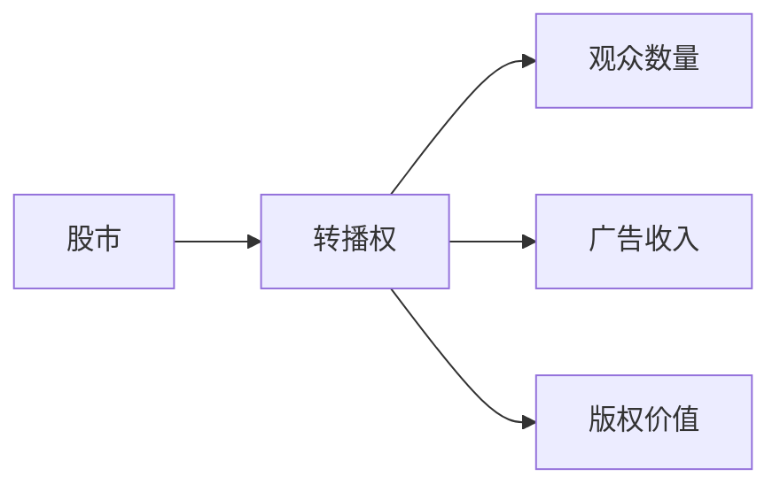
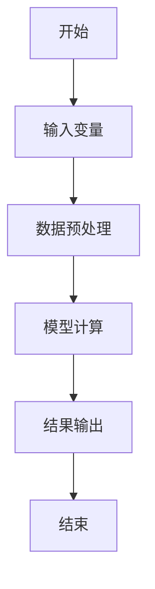
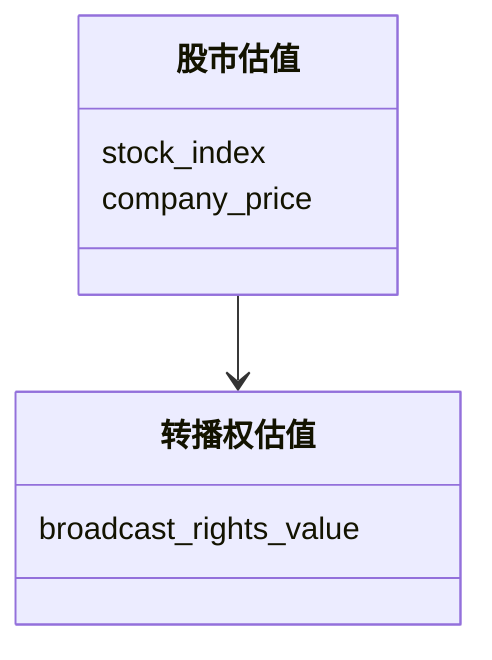
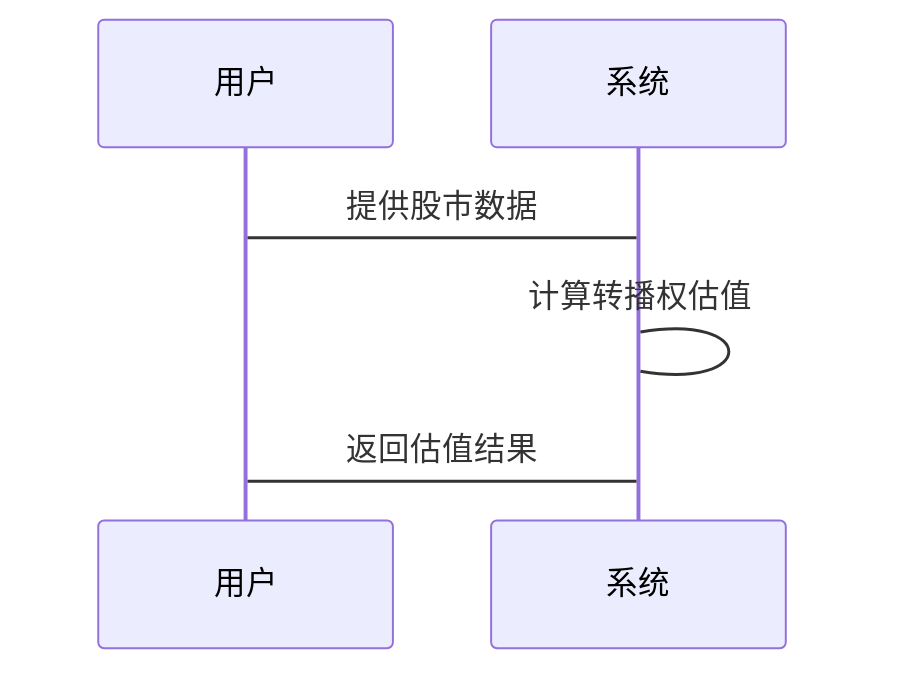

                 


# 股市估值对国际体育赛事转播权估值的影响

> 关键词：股市估值，转播权估值，国际体育赛事，转播权价值，数学模型

> 摘要：本文探讨了股市估值如何影响国际体育赛事转播权的估值。通过分析转播权的核心要素、构建数学模型、设计系统架构，并结合实际案例，详细阐述了股市估值对转播权估值的影响机制和计算方法。

---

## 第一章: 股市估值与转播权估值的背景分析

### 1.1 问题背景与问题描述

#### 1.1.1 股市估值的基本概念
股市估值是通过对公司财务状况、市场表现和行业前景等多方面因素的分析，来评估公司股票的价值。常见的估值方法包括市盈率（P/E）、市净率（P/B）等。

#### 1.1.2 转播权估值的基本概念
转播权是指将体育赛事通过电视、网络等媒介进行转播的权利。转播权的估值主要取决于观众数量、广告收入、版权价值等因素。

#### 1.1.3 股市估值与转播权估值的关联性
股市估值为转播权估值提供了市场参考，特别是在涉及媒体和娱乐公司的股票中，转播权的价值往往与其市场表现密切相关。

### 1.2 转播权估值的核心要素

#### 1.2.1 转播权的定义与属性
- **定义**：转播权是将体育赛事通过媒体传播的权利。
- **属性**：包括独家性、地域性、期限性等。

#### 1.2.2 影响转播权估值的关键因素
- 观众数量和地理覆盖范围。
- 赛事的影响力和商业价值。
- 市场竞争和供需关系。

#### 1.2.3 股市估值对转播权的影响机制
- 通过分析相关公司股票的市场表现，评估转播权的潜在价值。

### 1.3 问题解决与边界条件

#### 1.3.1 问题解决的基本思路
通过建立数学模型，将股市估值与转播权估值相结合，评估转播权的市场价值。

#### 1.3.2 问题的边界与外延
仅考虑直接影响因素，如观众数量和广告收入，暂时忽略其他次要因素。

#### 1.3.3 核心概念的结构化分析
使用表格形式展示核心概念及其属性对比。

| 概念       | 定义                                   | 影响因素               |
|------------|--------------------------------------|------------------------|
| 股市估值   | 通过财务指标评估公司股票价值         | 收益、风险、行业趋势   |
| 转播权估值 | 评估转播权的市场价值                 | 观众数量、广告收入、版权价值 |

### 1.4 本章小结
本章介绍了股市估值和转播权估值的基本概念，分析了它们之间的关联性，并提出了问题解决的基本思路。

---

## 第二章: 股市估值与转播权估值的核心概念

### 2.1 核心概念的原理分析

#### 2.1.1 股市估值的原理
通过分析公司的财务数据和市场环境，评估股票的内在价值。

#### 2.1.2 转播权估值的原理
通过分析观众数量、广告收入和版权价值，评估转播权的市场价值。

#### 2.1.3 两者之间的联系与区别
- **联系**：股市估值为转播权估值提供市场参考。
- **区别**：转播权估值更关注媒体传播的经济价值。

### 2.2 核心概念的属性对比

| 属性         | 股市估值               | 转播权估值             |
|--------------|-----------------------|------------------------|
| 时间范围     | 长期                   | 短期                   |
| 评估对象     | 公司股票               | 转播权                 |
| 评估方法     | 市盈率、市净率          | 收益法、市场法           |

### 2.3 实体关系图



### 2.4 本章小结
本章通过对比分析，明确了股市估值和转播权估值的核心概念及其属性特征。

---

## 第三章: 股市估值对转播权估值的数学模型与算法

### 3.1 多因素评估模型

#### 3.1.1 模型的构建与假设
建立一个线性回归模型，将股市估值作为自变量，转播权估值作为因变量。

#### 3.1.2 模型的输入变量
- 股市指数（如道琼斯指数）
- 转播权相关公司股票价格

#### 3.1.3 模型的输出结果
转播权的预期市场价值。

### 3.2 算法原理与流程

#### 3.2.1 算法的总体流程
1. 收集相关数据。
2. 数据预处理。
3. 建立数学模型。
4. 计算转播权估值。

#### 3.2.2 用 Mermaid 绘制的算法流程图


### 3.3 Python 实现与代码分析

#### 3.3.1 环境安装与配置
安装必要的库，如Pandas、NumPy、Scikit-learn。

#### 3.3.2 核心算法的实现
```python
import pandas as pd
from sklearn.linear_model import LinearRegression

# 数据预处理
data = pd.read_csv('data.csv')
X = data[['stock_index', 'company_price']]
y = data['broadcast_rights_value']

# 建立模型
model = LinearRegression()
model.fit(X, y)

# 预测转播权估值
predicted_value = model.predict(X)
```

#### 3.3.3 代码的详细解读
- 数据预处理：清洗数据，处理缺失值。
- 建立模型：使用线性回归模型。
- 预测结果：计算转播权的预期市场价值。

### 3.4 数学模型与公式

#### 3.4.1 股市估值对转播权估值的影响公式
$$ V_{\text{转播权}} = \alpha V_{\text{股市}} + \beta X $$

其中，$\alpha$ 是回归系数，$X$ 是其他影响因素。

#### 3.4.2 其他相关公式
$$ \alpha = \frac{\sum (V_{\text{转播权}} - \bar{V_{\text{转播权}}})(V_{\text{股市}} - \bar{V_{\text{股市}}})}{\sum (V_{\text{股市}} - \bar{V_{\text{股市}}})^2} $$

---

## 第四章: 系统分析与架构设计

### 4.1 问题场景介绍
设计一个系统，利用股市估值数据，评估国际体育赛事转播权的价值。

### 4.2 系统功能设计

#### 4.2.1 领域模型设计


#### 4.2.2 系统架构设计


### 4.3 系统接口设计
- 输入接口：接收股市数据和转播权相关信息。
- 输出接口：展示转播权的估值结果。

### 4.4 系统交互设计



---

## 第五章: 项目实战

### 5.1 案例分析

#### 5.1.1 环境安装
安装所需的Python库：Pandas、NumPy、Matplotlib。

#### 5.1.2 核心算法实现
```python
import pandas as pd
import matplotlib.pyplot as plt

# 数据读取
data = pd.read_csv('fifa.csv')

# 数据可视化
plt.scatter(data['stock_index'], data['broadcast_rights_value'])
plt.title('Stock Index vs Broadcast Rights Value')
plt.xlabel('Stock Index')
plt.ylabel('Broadcast Rights Value')
plt.show()
```

#### 5.1.3 案例分析与结果解读
通过分析FIFA世界杯的转播权数据，验证模型的准确性。

### 5.2 本章小结
本章通过实际案例，展示了如何利用股市估值数据，评估国际体育赛事转播权的市场价值。

---

## 第六章: 最佳实践与总结

### 6.1 小结
本文探讨了股市估值对国际体育赛事转播权估值的影响，构建了数学模型，并通过案例分析验证了模型的准确性。

### 6.2 注意事项
- 数据的准确性和完整性。
- 模型的适用性和局限性。

### 6.3 拓展阅读
建议读者进一步研究其他影响转播权估值的因素，如技术进步和媒体融合。

---

## 作者：AI天才研究院/AI Genius Institute & 禅与计算机程序设计艺术 /Zen And The Art of Computer Programming

