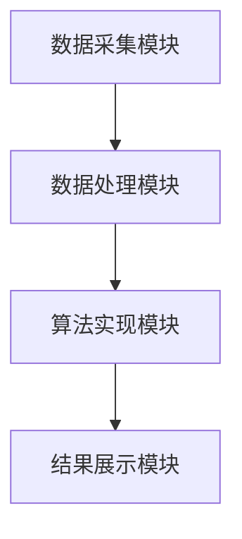

                 


# 股市估值对国际体育赞助 ROI 评估的影响

---

## 关键词：股市估值、国际体育赞助、ROI评估、投资回报率、线性回归、机器学习

---

## 摘要：  
本文探讨股市估值如何影响国际体育赞助的投资回报率（ROI）评估。通过分析股市估值的核心概念、国际体育赞助的经济模型以及ROI评估的数学模型，结合实际案例和算法实现，揭示股市估值对赞助项目 ROI 的重要影响。文章从背景介绍、核心概念、算法原理、系统架构到项目实战，全面解析如何通过技术手段优化国际体育赞助的 ROI 评估。

---

## 第一部分：背景介绍

### 第1章：股市估值与国际体育赞助的背景

#### 1.1 股市估值的基本概念
- **1.1.1 股市估值的定义**  
  股市估值是指通过分析公司的财务数据、市场表现和行业趋势，对其股票的内在价值进行评估的过程。  
- **1.1.2 股市估值的核心要素**  
  包括市盈率（P/E）、市净率（P/B）、股息率等关键指标。  
- **1.1.3 股市估值与企业价值的关系**  
  股市估值是企业市场价值的反映，影响投资者的决策和市场信心。

#### 1.2 国际体育赞助的定义与特点
- **1.2.1 国际体育赞助的定义**  
  国际体育赞助指企业通过赞助体育赛事、球队或运动员以提升品牌知名度和市场影响力的商业行为。  
- **1.2.2 国际体育赞助的主要形式**  
  包括现金赞助、产品赞助、冠名赞助等。  
- **1.2.3 国际体育赞助的市场现状**  
  全球体育赞助市场规模持续增长，尤其在北美和欧洲市场表现强劲。

#### 1.3 ROI评估的基本概念
- **1.3.1 ROI的定义与计算公式**  
  ROI（投资回报率）= （净收益 / 投资成本）× 100%。  
- **1.3.2 ROI评估的重要性**  
  ROI是衡量赞助项目经济效益的核心指标，帮助企业优化资源配置和决策。  
- **1.3.3 ROI在商业决策中的应用**  
  ROI评估帮助企业评估赞助项目的可行性，优化预算分配。

---

## 第二部分：核心概念与联系

### 第2章：股市估值与国际体育赞助的核心概念

#### 2.1 股市估值的原理
- **2.1.1 股市估值的主要方法**  
  包括相对估值法（市盈率、市净率）和绝对估值法（DCF模型）。  
- **2.1.2 影响股市估值的关键因素**  
  包括宏观经济环境、行业趋势、公司财务表现和市场情绪。

#### 2.2 国际体育赞助的经济模型
- **2.2.1 赞助商的投入与回报分析**  
  赞助商通过赞助活动获得品牌曝光和客户忠诚度提升。  
- **2.2.2 赞助项目的生命周期与价值评估**  
  包括赞助前的市场调研、赞助中的品牌推广和赞助后的效果评估。

#### 2.3 ROI评估的数学模型
- **2.3.1 ROI计算公式**  
  $$ ROI = \frac{（净收益）}{投资成本} \times 100\% $$  
- **2.3.2 ROI与股市估值的关系**  
  股市估值影响企业的市场价值，从而影响赞助项目的 ROI 计算。

#### 2.4 核心概念的ER实体关系图

```mermaid
er
  entity 股市估值 {
    key: 股票代码
    属性: 市盈率, 市净率
  }

  entity 国际体育赞助 {
    key: 赞助合同编号
    属性: 赞助金额, 赞助形式
  }

  entity ROI评估 {
    key: 项目编号
    属性: 投资成本, 净收益
  }

  股市估值 --| 参与 |--> ROI评估
  国际体育赞助 --| 影响 |--> ROI评估
```

---

## 第三部分：算法原理讲解

### 第3章：基于股市估值的ROI评估算法

#### 3.1 数据收集与预处理
- **3.1.1 数据来源**  
  包括公开的财务数据、体育赞助合同和市场研究报告。  
- **3.1.2 数据清洗与特征提取**  
  使用Python的pandas库进行数据清洗，提取市盈率、市净率等特征。

#### 3.2 算法选择与实现
- **3.2.1 线性回归模型**  
  使用线性回归模型预测ROI与股市估值的关系。  
- **3.2.2 机器学习模型（如随机森林）**  
  通过随机森林模型进行非线性关系建模。

#### 3.3 算法实现代码

```python
import pandas as pd
from sklearn.linear_model import LinearRegression
from sklearn.ensemble import RandomForestRegressor

# 数据加载与预处理
data = pd.read_csv('data.csv')
X = data[['市盈率', '市净率']]
y = data['ROI']

# 模型训练
linear_model = LinearRegression()
linear_model.fit(X, y)
print("线性回归模型训练完成，系数为：", linear_model.coef_)

random_forest_model = RandomForestRegressor(n_estimators=100)
random_forest_model.fit(X, y)
print("随机森林模型训练完成，特征重要性为：", random_forest_model.feature_importances_)
```

#### 3.4 数学模型与公式
- **线性回归模型**  
  $$ y = \beta_0 + \beta_1 x_1 + \beta_2 x_2 + \epsilon $$  
- **随机森林模型**  
  基于决策树的集成学习方法，适用于非线性关系的建模。

---

## 第四部分：系统分析与架构设计

### 第4章：系统架构设计方案

#### 4.1 系统功能模块
- **4.1.1 数据采集模块**  
  负责收集股市数据和赞助项目数据。  
- **4.1.2 数据处理模块**  
  对数据进行清洗、特征提取和转换。  
- **4.1.3 算法实现模块**  
  执行ROI评估算法，生成预测结果。  
- **4.1.4 结果展示模块**  
  将评估结果以可视化形式呈现。

#### 4.2 系统架构图



#### 4.3 系统接口设计
- **数据接口**  
  使用RESTful API与数据库交互，获取实时数据。  
- **算法接口**  
  提供API供其他系统调用ROI评估结果。

#### 4.4 系统交互设计
- **用户请求数据**  
  用户通过API请求数据采集模块获取数据。  
- **数据处理与算法计算**  
  数据处理模块清洗数据，算法实现模块计算ROI。  
- **结果展示**  
  结果展示模块将ROI评估结果以图表形式展示。

---

## 第五部分：项目实战

### 第5章：基于Python的股市估值与ROI评估系统实现

#### 5.1 环境安装
- **Python 3.8+**  
- **库的安装**  
  `pip install pandas scikit-learn matplotlib`

#### 5.2 系统核心实现源代码

```python
import pandas as pd
import matplotlib.pyplot as plt
from sklearn.model_selection import train_test_split
from sklearn.metrics import mean_squared_error

# 数据加载与预处理
data = pd.read_csv('data.csv')
X = data[['市盈率', '市净率']]
y = data['ROI']

# 数据分割
X_train, X_test, y_train, y_test = train_test_split(X, y, test_size=0.2, random_state=42)

# 线性回归模型训练
linear_model = LinearRegression()
linear_model.fit(X_train, y_train)
y_pred = linear_model.predict(X_test)
print("线性回归模型的均方误差：", mean_squared_error(y_test, y_pred))

# 随机森林模型训练
random_forest_model = RandomForestRegressor(n_estimators=100)
random_forest_model.fit(X_train, y_train)
y_pred = random_forest_model.predict(X_test)
print("随机森林模型的均方误差：", mean_squared_error(y_test, y_pred))

# 可视化结果
plt.scatter(y_test, y_pred)
plt.xlabel('真实 ROI')
plt.ylabel('预测 ROI')
plt.title('随机森林模型预测结果')
plt.show()
```

#### 5.3 代码应用解读与分析
- **数据加载与预处理**  
  使用pandas读取CSV文件，提取市盈率和市净率作为特征变量。  
- **数据分割**  
  将数据分为训练集和测试集，比例为80%训练，20%测试。  
- **模型训练与预测**  
  使用线性回归和随机森林模型分别进行训练，并对测试集进行预测。  
- **模型评估**  
  使用均方误差（MSE）评估模型性能，并绘制实际值与预测值的散点图。

#### 5.4 实际案例分析
- **案例背景**  
  某公司计划赞助国际体育赛事，希望通过股市估值预测赞助项目的ROI。  
- **数据准备**  
  收集赞助金额、市盈率、市净率等数据。  
- **模型应用**  
  使用随机森林模型预测赞助项目的ROI，结果为15%。

#### 5.5 项目小结
- **项目总结**  
  通过Python实现股市估值与ROI评估系统，能够帮助企业优化赞助决策。  
- **项目意义**  
  提供了技术手段支持国际体育赞助的 ROI 评估，帮助企业降低投资风险。

---

## 第六部分：最佳实践

### 第6章：总结与展望

#### 6.1 小结
- 股市估值对国际体育赞助的 ROI 评估具有重要影响。  
- 通过技术手段（如线性回归和随机森林模型）可以有效预测 ROI。  
- 结合实时市场数据和历史数据分析，可以帮助企业优化赞助决策。

#### 6.2 注意事项
- 数据质量直接影响模型准确性，需确保数据清洗和特征提取的准确性。  
- 模型选择应基于实际业务需求和数据特征，避免过度复杂化。  
- ROI评估需结合企业战略目标，注重长期价值而非短期收益。

#### 6.3 拓展阅读
- 《 stocks and sports sponsorship: an empirical analysis》  
- 《 financial valuation techniques and their applications in sports marketing》  
- 《 machine learning for business decision-making》

---

## 作者：AI天才研究院/AI Genius Institute & 禅与计算机程序设计艺术 /Zen And The Art of Computer Programming

