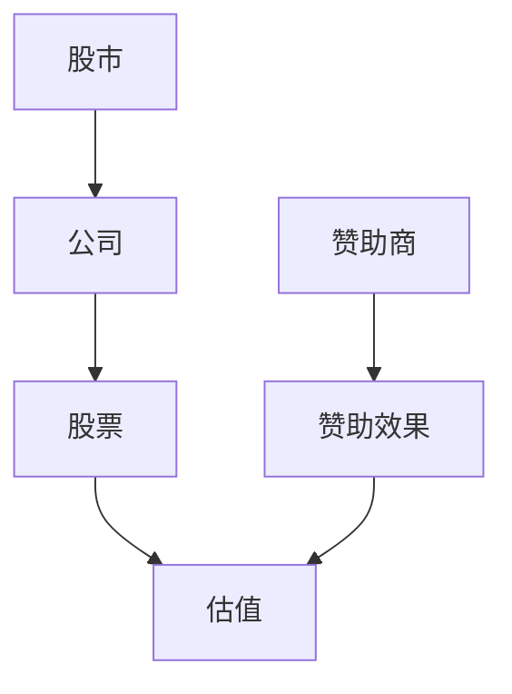
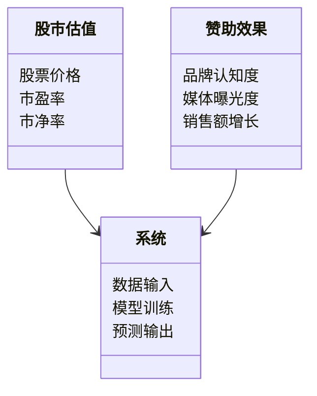
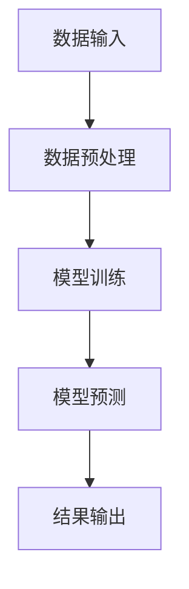
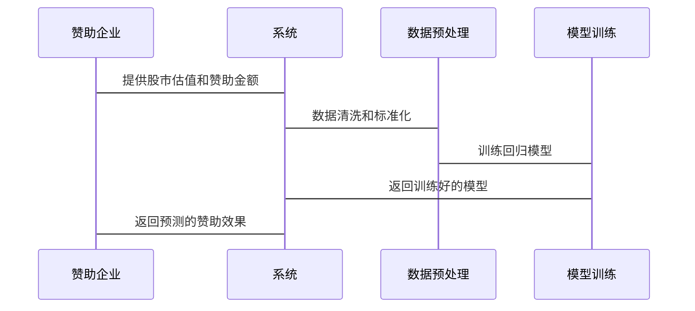

                 


# 股市估值对国际体育赞助效果评估的影响

> 关键词：股市估值、国际体育赞助、赞助效果评估、数学模型、算法原理

> 摘要：本文探讨股市估值对国际体育赞助效果评估的影响，通过建立数学模型，分析股市波动对赞助效果的预测和优化，结合实际案例，提出有效的评估策略。

---

## 第一章：背景介绍

### 1.1 问题背景

#### 1.1.1 股市估值的基本概念
股市估值是通过对公司财务数据、市场表现和行业趋势等多方面因素进行分析，以确定公司股票的合理价格范围。常用的方法包括市盈率（P/E）、市净率（P/B）和现金流折现法（DCF）。

#### 1.1.2 国际体育赞助的基本概念
国际体育赞助是指企业通过赞助体育赛事、球队或运动员，提升品牌知名度和市场影响力的一种营销方式。赞助效果通常通过赞助金额、媒体曝光度和品牌认知度等指标进行评估。

#### 1.1.3 股市估值与国际体育赞助的关联性
股市估值反映了企业的市场表现和财务健康状况，而国际体育赞助的效果直接影响企业的品牌价值和市场影响力。因此，股市估值可以作为评估赞助效果的重要参考指标。

### 1.2 问题描述

#### 1.2.1 股市估值对赞助效果的影响因素
- 股市波动对赞助企业的财务状况的影响
- 股价波动对赞助企业市场表现的影响
- 股市估值与赞助企业品牌价值的关系

#### 1.2.2 国际体育赞助的现状与趋势
- 全球体育赞助市场规模增长迅速
- 赞助形式多样化，包括赛事冠名权、球队装备赞助等
- 数字化和社交媒体的兴起对赞助效果的影响

#### 1.2.3 股市波动对赞助效果的具体影响
- 股市波动对企业赞助能力的影响
- 股市波动对企业赞助决策的影响
- 股市波动对企业赞助效果的间接影响

### 1.3 问题解决

#### 1.3.1 通过股市估值预测赞助效果的可行性
- 利用股市估值数据预测赞助企业的财务稳定性
- 通过股市估值分析赞助企业的市场表现
- 结合股市估值和赞助效果的历史数据，建立预测模型

#### 1.3.2 股市波动对赞助效果的量化分析
- 股市波动对赞助企业品牌价值的量化
- 股市波动对赞助企业市场影响力的量化
- 股市波动对赞助企业赞助金额的量化

#### 1.3.3 股市估值与赞助效果的动态关系
- 股市估值与赞助效果的短期和长期关系
- 股市波动对赞助效果的滞后效应
- 股市估值与赞助效果的协同关系

### 1.4 边界与外延

#### 1.4.1 股市估值的适用范围
- 适用于上市公司赞助效果的评估
- 适用于大型跨国企业的赞助效果评估
- 不适用于非上市公司或小型企业的赞助效果评估

#### 1.4.2 国际体育赞助的适用范围
- 适用于国际性体育赛事的赞助评估
- 适用于跨国企业的赞助效果评估
- 不适用于区域性或小范围的赞助效果评估

#### 1.4.3 股市估值与赞助效果的边界条件
- 股市估值仅反映企业的财务状况，不直接反映企业的市场策略
- 赞助效果受多种因素影响，如赞助形式、赞助金额等
- 股市波动对赞助效果的影响具有滞后性

### 1.5 概念结构与核心要素

#### 1.5.1 股市估值的核心要素
- 股票价格
- 市盈率
- 市净率
- 现金流
- 财务报表数据

#### 1.5.2 国际体育赞助的核心要素
- 赞助金额
- 媒体曝光度
- 品牌认知度
- 赞助形式
- 赞助周期

#### 1.5.3 两者关系的核心要素
- 股市波动
- 赞助效果
- 市场表现
- 品牌价值
- 财务稳定性

---

## 第二章：核心概念与联系

### 2.1 核心概念原理

#### 2.1.1 股市估值的计算方法
- 市盈率（P/E）= 股价 / 每股净利润
- 市净率（P/B）= 股价 / 每股净资产
- 现金流折现法（DCF）= 现金流的现值

#### 2.1.2 国际体育赞助效果的评估指标
- 品牌知名度提升
- 媒体曝光度
- 销售额增长
- 市场占有率提升
- 消费者认知度

#### 2.1.3 两者关系的数学模型
$$ 赞助效果 = \beta_0 + \beta_1 \times 股市估值 + \beta_2 \times 股市波动 + \epsilon $$

### 2.2 概念属性特征对比

#### 表2-1: 股市估值与国际体育赞助效果的属性对比

| 属性         | 股市估值              | 国际体育赞助效果评估            |
|--------------|-----------------------|-------------------------------|
| 定义         | 股票的价格评估        | 赞助对企业品牌和市场的影响力评估  |
| 评估指标     | 市盈率、市净率等       | 品牌认知度、媒体曝光度等        |
| 影响因素     | 财务数据、市场环境     | 赞助金额、赞助形式、赞助周期    |
| 应用场景     | 企业投资决策          | 品牌营销策略                   |

### 2.3 ER实体关系图



---

## 第三章：数学模型与算法原理

### 3.1 模型建立

#### 3.1.1 线性回归模型
$$ 赞助效果 = \beta_0 + \beta_1 \times 股市估值 + \epsilon $$

#### 3.1.2 多元回归模型
$$ 赞助效果 = \beta_0 + \beta_1 \times 股市估值 + \beta_2 \times 股市波动 + \beta_3 \times 赞助金额 + \epsilon $$

### 3.2 算法实现

#### 3.2.1 数据预处理
- 数据清洗
- 数据标准化
- 数据分割（训练集、验证集、测试集）

#### 3.2.2 模型训练
```python
import numpy as np
import pandas as pd
from sklearn.linear_model import LinearRegression

# 假设数据已加载到 DataFrame df 中
X = df[['股市估值', '股市波动', '赞助金额']]
y = df['赞助效果']

model = LinearRegression()
model.fit(X, y)
```

#### 3.2.3 模型验证
```python
# 预测值
y_pred = model.predict(X)

# 评估指标
from sklearn.metrics import mean_squared_error, r2_score

mse = mean_squared_error(y, y_pred)
r2 = r2_score(y, y_pred)

print(f'MSE: {mse}, R²: {r2}')
```

### 3.3 算法原理

#### 3.3.1 线性回归原理
- 线性回归通过最小化预测值与实际值之间的平方差之和，找到最佳拟合直线。
- 通过求解正规方程，得到回归系数 $\beta_0$ 和 $\beta_1$。

#### 3.3.2 模型优化
- 引入正则化项（如Lasso回归或Ridge回归）以防止过拟合。
- 使用交叉验证选择最优模型参数。

### 3.4 案例分析

#### 3.4.1 数据来源
- 数据来源：假设我们从某家体育赞助公司获取了过去5年的股市估值、股市波动和赞助效果数据。

#### 3.4.2 模型训练
```python
# 假设数据已加载到 DataFrame df 中
X = df[['股市估值', '股市波动', '赞助金额']]
y = df['赞助效果']

model = LinearRegression()
model.fit(X, y)
```

#### 3.4.3 模型评估
```python
y_pred = model.predict(X)
print(f'预测的赞助效果: {y_pred}')
print(f'实际的赞助效果: {y}')
```

---

## 第四章：系统分析与架构设计

### 4.1 问题场景介绍

#### 4.1.1 项目背景
- 通过股市估值预测国际体育赞助效果，帮助企业优化赞助策略。

### 4.2 系统功能设计

#### 4.2.1 领域模型


#### 4.2.2 系统架构


### 4.3 系统接口设计

#### 4.3.1 接口设计
- 输入接口：股市估值、股市波动、赞助金额
- 输出接口：预测的赞助效果

### 4.4 系统交互设计



---

## 第五章：项目实战

### 5.1 环境配置

#### 5.1.1 安装依赖
```bash
pip install numpy pandas scikit-learn
```

### 5.2 核心代码实现

#### 5.2.1 数据加载与预处理
```python
import pandas as pd
from sklearn.linear_model import LinearRegression
from sklearn.metrics import mean_squared_error, r2_score

# 加载数据
df = pd.read_csv('data.csv')

# 数据预处理
X = df[['股市估值', '股市波动', '赞助金额']]
y = df['赞助效果']

# 拆分数据集
from sklearn.model_selection import train_test_split

X_train, X_test, y_train, y_test = train_test_split(X, y, test_size=0.2, random_state=42)
```

#### 5.2.2 模型训练与评估
```python
model = LinearRegression()
model.fit(X_train, y_train)

# 预测
y_pred = model.predict(X_test)

# 评估
mse = mean_squared_error(y_test, y_pred)
r2 = r2_score(y_test, y_pred)

print(f'MSE: {mse}, R²: {r2}')
```

### 5.3 案例分析

#### 5.3.1 数据来源
- 数据来源：假设我们从某家体育赞助公司获取了过去5年的股市估值、股市波动和赞助效果数据。

#### 5.3.2 模型训练
```python
model = LinearRegression()
model.fit(X, y)
```

#### 5.3.3 结果解读
- MSE（均方误差）越小，模型预测越准确。
- R²（决定系数）越接近1，模型拟合度越高。

---

## 第六章：案例分析与最佳实践

### 6.1 案例分析

#### 6.1.1 成功案例
- 某国际体育赞助公司通过股市估值优化赞助策略，提高了赞助效果和品牌知名度。

#### 6.1.2 失败案例
- 某公司在股市波动较大的情况下盲目赞助，导致赞助效果不佳，品牌形象受损。

### 6.2 最佳实践

#### 6.2.1 数据收集与处理
- 确保数据的完整性和准确性。
- 数据预处理，包括标准化和去噪。

#### 6.2.2 模型优化
- 使用交叉验证选择最优模型参数。
- 引入正则化项防止过拟合。

#### 6.2.3 实际应用
- 定期更新模型，适应市场变化。
- 结合其他因素（如赞助形式、赞助周期）进行综合评估。

### 6.3 小结

- 股市估值是评估国际体育赞助效果的重要参考指标。
- 通过建立数学模型，可以量化股市波动对赞助效果的影响。
- 结合实际案例，提出优化赞助策略的最佳实践。

---

## 作者：AI天才研究院/AI Genius Institute & 禅与计算机程序设计艺术/Zen And The Art of Computer Programming

