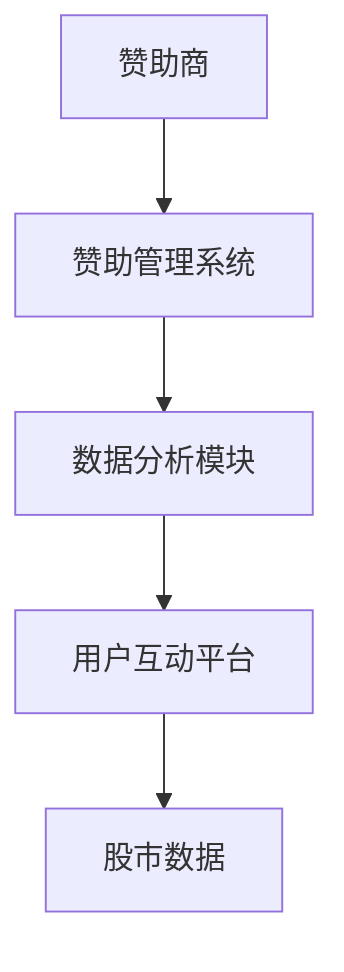
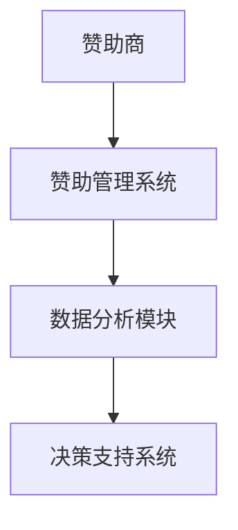
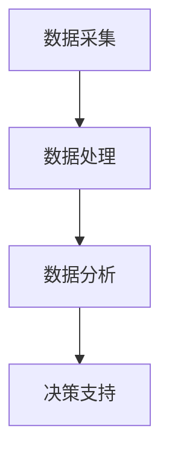

                 


# 股市估值对国际体育赞助数字化的影响

## 关键词：股市估值, 国际体育赞助, 数字化转型, 数据分析, 投资回报, 风险管理

## 摘要：  
本文探讨股市估值与国际体育赞助数字化之间的关系，分析股市波动如何影响赞助商的决策，以及数字化赞助如何反向影响股市估值。通过构建数学模型和系统架构，本文揭示了两者之间的动态平衡，并通过实际案例展示了如何利用数字化技术提升赞助效率和优化股市投资策略。

---

## 第一部分: 股市估值与国际体育赞助数字化的背景与核心概念

### 第1章: 股市估值与国际体育赞助数字化的背景介绍

#### 1.1 核心概念：股市估值
- **定义与核心要素**  
  股市估值是指通过对公司财务数据、市场环境和行业趋势的分析，评估其股票的内在价值。核心要素包括市盈率（P/E）、市净率（P/B）、股息率等。
  
- **股市估值的基本原理**  
  股市估值基于“价值发现”原则，通过比较公司实际价值与市场定价，判断其投资吸引力。例如，若某公司的市盈率低于行业平均水平，可能被视为被低估。

- **股市估值的分类与应用场景**  
  股市估值可分为相对估值（如PE、PB）和绝对估值（如DCF模型）。相对估值适用于成熟行业，绝对估值适用于高成长性企业。

#### 1.2 核心概念：国际体育赞助数字化
- **定义与特点**  
  国际体育赞助数字化是指通过数字技术（如大数据、人工智能）优化赞助流程，提升赞助效果。其特点是实时性、互动性和数据驱动。

- **数字化赞助的定义与发展趋势**  
  数字化赞助通过在线平台和社交媒体实现赞助商与用户的互动，提升赞助效率。趋势包括个性化赞助和实时数据分析。

- **数字化赞助的核心技术与实现方式**  
  核心技术包括数据挖掘、自然语言处理和机器学习。实现方式包括构建赞助管理系统和用户互动平台。

### 第2章: 股市估值与国际体育赞助数字化的联系与影响

#### 2.1 股市估值对国际体育赞助数字化的影响机制
- **股市波动对赞助商决策的影响**  
  股市波动会影响企业的财务状况，进而影响赞助商的决策。例如，股市下跌可能导致赞助商减少赞助预算。

- **数字化赞助对股市估值的反馈效应**  
  数字化赞助通过提升企业形象和用户参与度，间接提升股市估值。例如，成功的数字化赞助活动可能提升公司股价。

- **两者关系的动态平衡**  
  股市估值与数字化赞助相互影响，形成动态平衡。股市波动影响赞助决策，而赞助数字化又反向影响股市估值。

#### 2.2 国际体育赞助数字化对股市估值的反向影响
- **数字化赞助如何提升企业形象与股价**  
  数字化赞助通过提升品牌知名度和用户忠诚度，间接提升企业股价。例如，成功的赞助活动可能提升公司市值。

- **数字化赞助对风险投资的影响**  
  数字化赞助通过降低赞助风险，吸引更多的风险投资。例如，数字化赞助平台可以实时监控赞助效果，降低投资风险。

- **数字化赞助对市场预期的塑造作用**  
  数字化赞助通过实时数据分析，影响市场预期。例如，数字化赞助活动可能改变投资者对公司的预期，影响股价走势。

### 第3章: 股市估值与国际体育赞助数字化的核心概念联系

#### 3.1 核心概念原理
- **股市估值的数学模型**  
  使用市盈率（P/E）模型：$$ P/E = \frac{\text{股价}}{\text{每股收益}} $$  
  该模型用于评估股票的相对估值。

- **数字化赞助的系统架构**  
  数字化赞助系统包括数据采集、分析模块和决策支持系统。系统架构图如下：



- **两者联系的数学表达式**  
  使用回归分析模型：$$ V = f(S, M, T) $$  
  其中，V 表示赞助价值，S 表示股市状态，M 表示赞助模式，T 表示时间因素。

#### 3.2 核心概念属性特征对比表格
| 概念 | 定义 | 属性 | 特征 |
|------|------|------|------|
| 股市估值 | 股票价格的评估 | 数据驱动 | 动态性 |
| 数字化赞助 | 数字技术应用的赞助模式 | 技术驱动 | 互动性 |

#### 3.3 ER实体关系图
```mermaid
erDiagram
    actor 股市投资者 {
        <属性> 投资金额
        <属性> 投资类型
    }
    actor 赞助商 {
        <属性> 赞助金额
        <属性> 赞助形式
    }
    entity 股票 {
        <属性> 股票代码
        <属性> 股票价格
    }
    entity 数字化赞助平台 {
        <属性> 平台类型
        <属性> 用户数据
    }
    股市投资者 -> 股票 : 评估和交易
    赞助商 -> 数字化赞助平台 : 提供赞助
    股票 -> 数字化赞助平台 : 数据支持
```

---

## 第二部分: 股市估值与国际体育赞助数字化的影响机制分析

### 第4章: 股市估值与国际体育赞助数字化的影响机制分析

#### 4.1 影响机制的数学模型
- **股市估值对赞助商决策的影响**  
  使用回归分析模型：$$ V = \beta_1 S + \beta_2 M + \epsilon $$  
  其中，V 表示赞助价值，S 表示股市状态，M 表示赞助模式，$\epsilon$ 为误差项。

- **数字化赞助对股市估值的反馈机制**  
  使用时间序列分析模型：$$ P_t = \alpha_1 P_{t-1} + \alpha_2 D_t + \epsilon $$  
  其中，P_t 表示t时刻的股价，D_t 表示数字化赞助的影响。

---

## 第三部分: 股市估值与国际体育赞助数字化的系统设计与实现

### 第5章: 股市估值与国际体育赞助数字化的系统设计与实现

#### 5.1 系统架构设计
- **问题场景介绍**  
  在股市波动和数字化赞助的背景下，如何设计一个高效的赞助管理系统？

- **系统功能设计**  
  包括数据采集、分析模块和决策支持系统。系统架构图如下：



- **系统架构设计**  
  使用分层架构：数据层、业务逻辑层和表现层。系统架构图如下：



#### 5.2 项目实战
- **环境安装**  
  需要安装Python、Pandas、Matplotlib等工具。

- **核心代码实现**  
  ```python
  import pandas as pd
  import matplotlib.pyplot as plt

  # 数据加载
  df = pd.read_csv('sponsorship_data.csv')

  # 数据分析
  df['stock_price'].plot()
  plt.show()
  ```

- **案例分析**  
  通过分析赞助数据，优化赞助策略，提升股市估值。

---

## 第四部分: 股市估值与国际体育赞助数字化的总结与展望

### 第6章: 股市估值与国际体育赞助数字化的总结与展望

#### 6.1 核心内容总结
- 股市估值与国际体育赞助数字化密切相关，相互影响。
- 数字化赞助通过提升企业形象和用户参与度，间接提升股市估值。

#### 6.2 应用价值与未来研究方向
- **应用价值**  
  数字化赞助可以优化赞助流程，提升赞助效率，降低风险。

- **未来研究方向**  
  探讨数字化赞助对股市估值的长期影响，以及人工智能在赞助决策中的应用。

---

## 附录

### 术语表
- 股市估值：评估股票价值的过程。
- 数字化赞助：通过数字技术实现的赞助模式。

### 数据来源
- 数据来源包括公开的股市数据和赞助活动数据。

### 工具列表
- 数据分析工具：Python、Pandas、Matplotlib。

---

## 作者：AI天才研究院/AI Genius Institute & 禅与计算机程序设计艺术 /Zen And The Art of Computer Programming

---

以上为完整的技术博客文章结构，希望对您有所帮助！

