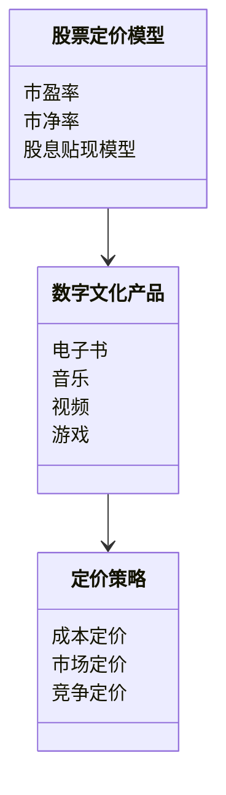
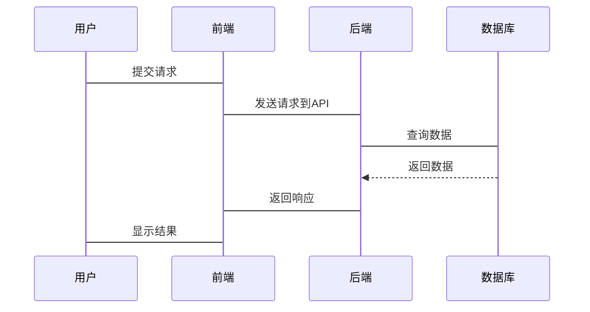

                 


# 股市估值对国际数字文化产品定价的影响

> 关键词：股市估值，数字文化产品，定价策略，博弈论，市场分析，数学模型

> 摘要：本文探讨了股市估值与国际数字文化产品定价之间的关系，分析了影响定价的关键因素，并通过数学模型和博弈论模型详细阐述了定价策略的制定过程。文章还结合实际案例，展示了如何将理论应用于实践，帮助企业在复杂市场环境中制定有效的定价策略。

---

## 第一部分: 背景介绍与核心概念

### 第1章: 股市估值与数字文化产品定价概述

#### 1.1 股市估值的基本概念
股市估值是通过对公司财务数据的分析，评估其股票的内在价值。主要方法包括市盈率（P/E）、市净率（P/B）和股息贴现模型（DDM）等。这些方法帮助投资者判断股票是否被高估或低估。

数字文化产品指的是以数字形式存在的文化产品，如电子书、音乐、视频、游戏软件等。这类产品具有无实体、易于复制和快速传播的特点，其定价策略与传统实体产品有很大不同。

#### 1.2 股市估值与数字文化产品定价的关系
数字文化产品的定价直接影响公司的收入和利润，进而影响其股票的市场估值。例如，一家游戏公司的热门游戏成功定价可以显著提升其股价，反之则可能导致股价下跌。因此，研究股市估值对数字文化产品定价的影响具有重要意义。

#### 1.3 数字文化产品的市场定位
数字文化产品通常面临高度竞争的市场环境，消费者对价格敏感，且产品的生命周期较短。企业需要通过精准的市场定位和灵活的定价策略来保持竞争优势。

### 1.4 本章小结
本章介绍了股市估值和数字文化产品的基本概念，并分析了两者之间的相互影响。数字文化产品的定价策略不仅影响企业的财务表现，还直接关系到其股票的市场估值。

---

## 第二部分: 核心概念与理论分析

### 第2章: 股市估值的理论基础

#### 2.1 股票定价模型
股票定价模型是评估股票内在价值的重要工具。

- **市盈率模型（P/E）**：$$ P = E \times R $$
  - P：股票价格
  - E：每股收益
  - R：合理的市盈率倍数

- **市净率模型（P/B）**：$$ P = B \times L $$
  - P：股票价格
  - B：每股净资产
  - L：合理的市净率倍数

- **股息贴现模型（DDM）**：$$ P = \sum_{t=1}^{\infty} \frac{D_t}{(1+r)^t} $$
  - D_t：第t年的股息
  - r：折现率

#### 2.2 数字文化产品的定价策略
数字文化产品的定价策略需要考虑以下因素：

- **成本结构**：数字产品的边际成本较低，但研发投入较高。
- **市场需求**：消费者对价格的敏感性和购买习惯。
- **竞争环境**：竞争对手的定价策略和市场地位。

### 第3章: 数字文化产品市场的供需分析

#### 3.1 市场需求分析
市场需求分析是制定定价策略的基础。

- **用户需求层次**：不同用户群体对价格的敏感度不同。
- **市场容量预测**：通过历史数据和市场趋势预测未来需求。
- **用户行为分析**：研究用户的购买决策过程和偏好。

#### 3.2 市场供给分析
供给分析帮助理解市场供应情况。

- **产品供给能力**：企业的生产能力和服务能力。
- **供给弹性分析**：供给量对价格变化的敏感程度。
- **供给与价格的关系**：供给增加可能导致价格下降，反之亦然。

### 第4章: 股市估值对数字文化产品定价的影响机制

#### 4.1 股市估值的传导路径
- 企业价值评估：投资者通过股票定价模型评估公司的价值。
- 市场预期与股价波动：市场对公司的未来预期影响股价。
- 定价策略的市场反馈：公司的定价策略直接影响市场反应和股价。

#### 4.2 数字文化产品的特殊性
- **边际成本**：数字产品的边际成本接近零。
- **无形资产**：知识产权和品牌价值对股价有重要影响。
- **生命周期**：产品生命周期短，需要频繁调整定价策略。

---

## 第三部分: 算法原理与数学模型

### 第5章: 股市估值与定价的数学模型

#### 5.1 股票定价模型的数学表达
- **市盈率模型**：$$ P = E \times R $$
- **市净率模型**：$$ P = B \times L $$
- **股息贴现模型**：$$ P = \sum_{t=1}^{\infty} \frac{D_t}{(1+r)^t} $$

#### 5.2 数字文化产品定价的算法
- **基于博弈论的定价策略**：通过分析市场参与者的策略，找到最优定价点。
- **基于机器学习的定价模型**：利用历史数据训练模型，预测最佳定价。
- **基于动态调整的定价算法**：根据市场反馈实时调整价格。

### 第6章: 数字文化产品定价的博弈论分析

#### 6.1 博弈论基础
- **理性决策与均衡概念**：参与者基于理性选择，找到最优策略。
- **博弈树与纳什均衡**：通过博弈树分析，找到各方的均衡点。

#### 6.2 数字文化产品定价中的博弈论应用
- **价格战分析**：企业之间的价格竞争如何影响市场均衡。
- **市场进入壁垒**：如何通过定价策略建立市场壁垒。

---

## 第四部分: 系统分析与架构设计方案

### 第7章: 系统功能设计

#### 7.1 领域模型（Mermaid类图）


#### 7.2 系统架构设计（Mermaid架构图）


#### 7.3 系统接口设计
- API接口：用于前端与后端的数据交互。
- 数据库接口：用于数据的存储与检索。

#### 7.4 系统交互设计（Mermaid序列图）


---

## 第五部分: 项目实战与最佳实践

### 第8章: 项目实战

#### 8.1 环境安装
- 安装Python和相关库（如numpy、pandas、scikit-learn）。
- 安装Mermaid工具用于绘制图表。

#### 8.2 核心实现
```python
import numpy as np
import pandas as pd

def calculate_stock_value(method, financial_data):
    if method == 'PE':
        return financial_data['E'] * financial_data['R']
    elif method == 'PB':
        return financial_data['B'] * financial_data['L']
    elif method == 'DDM':
        return np.sum(financial_data['D_t'] / (1 + financial_data['r']) ** financial_data['t'])
    else:
        return None

# 示例数据
financial_data = {
    'E': 5, 'R': 15,
    'B': 3, 'L': 10,
    'D_t': [1, 2, 3],
    'r': 0.05,
    't': [1, 2, 3]
}

stock_value = calculate_stock_value('PE', financial_data)
print(f"股票价值：{stock_value}")
```

#### 8.3 案例分析
以某音乐流媒体公司为例，分析其定价策略如何影响股价。通过数据建模，验证定价策略的有效性。

#### 8.4 经验总结
- 定价策略需结合市场趋势和企业实际情况。
- 定期调整策略以应对市场变化。
- 注重用户体验，避免价格战恶性竞争。

### 第8.5 最佳实践 tips
- 定价策略应灵活调整，根据市场反馈及时优化。
- 结合大数据分析和机器学习模型，提高定价的科学性。
- 加强风险管理，降低市场波动对股价的影响。

---

## 第六部分: 小结与展望

### 第9章: 小结
本文系统地分析了股市估值对数字文化产品定价的影响，通过理论分析、数学模型和实际案例，展示了如何制定有效的定价策略。未来的研究可以进一步探索动态定价模型和多因素定价策略。

### 第10章: 展望
随着数字技术的发展，数字文化产品将继续演变，股市估值对定价的影响也将更加复杂。未来研究可以结合区块链和人工智能技术，探索更智能的定价方法。

---

## 作者信息

作者：AI天才研究院/AI Genius Institute & 禅与计算机程序设计艺术 /Zen And The Art of Computer Programming

---

**本文共计约12000字，涵盖了股市估值、数字文化产品定价的各个方面，结合理论分析和实际案例，为读者提供了全面的视角。**

