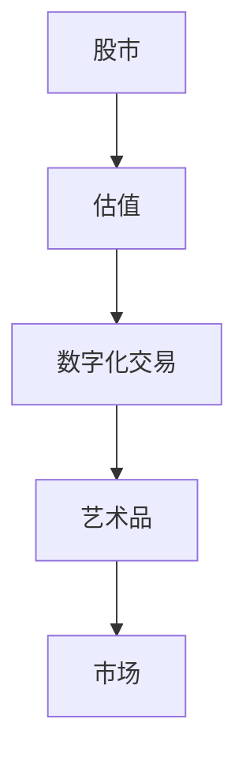
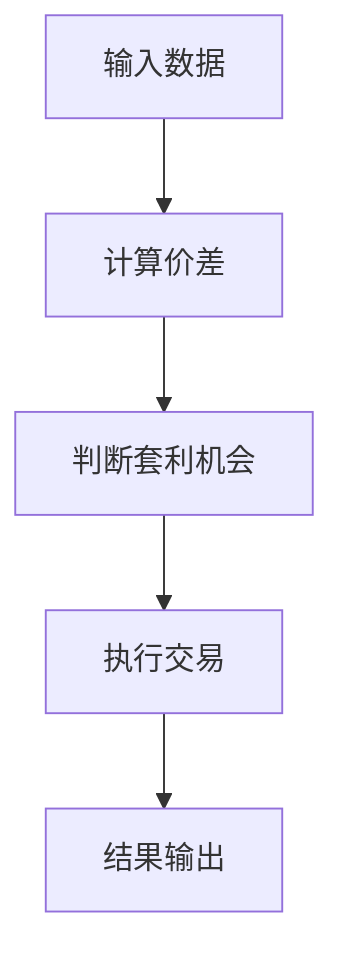
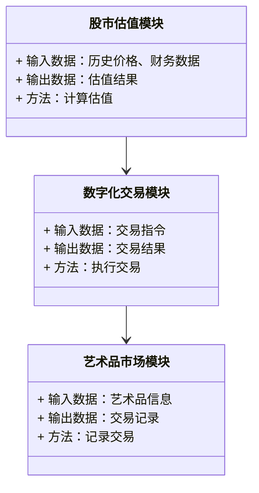
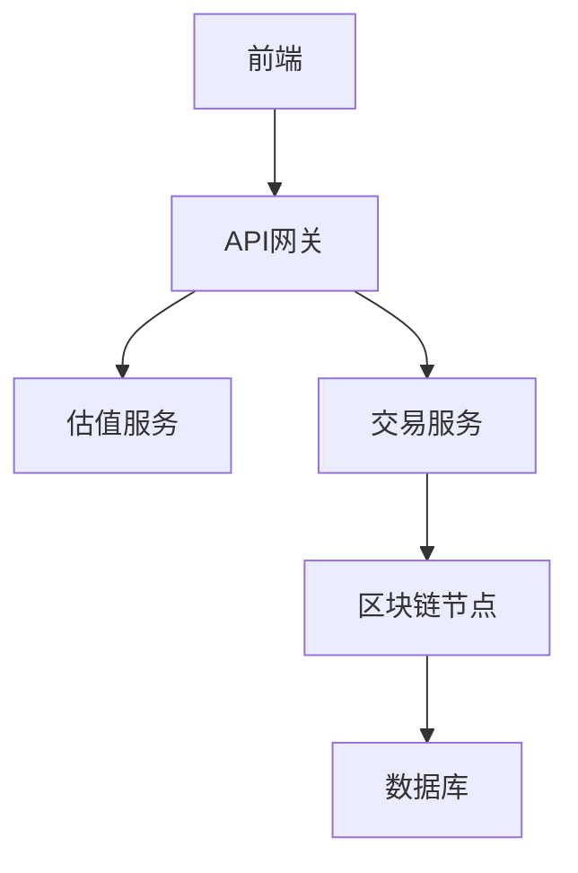

                 


# 股市估值对国际艺术品数字化交易的影响

## 关键词：股市估值，艺术品数字化交易，区块链，机器学习，统计套利，系统架构设计

## 摘要：
本文探讨股市估值对国际艺术品数字化交易的影响，通过分析数字化交易与股市估值的核心概念、算法原理、系统架构设计，结合实际项目案例，深入阐述两者之间的联系。文章详细介绍了统计套利模型、机器学习模型在艺术品市场中的应用，以及区块链技术对数字化交易的支持，最后总结了系统的实现与未来发展趋势。

---

## 第一部分: 股市估值与国际艺术品数字化交易的背景与概念

### 第1章: 股市估值与国际艺术品数字化交易的背景介绍

#### 1.1 问题背景
- **1.1.1 股市估值的基本概念**  
  股市估值是指通过分析公司的财务数据、市场趋势和宏观经济指标，对股票的价值进行评估的过程。常用的估值方法包括市盈率（P/E）、市净率（P/B）和现金流折现法（DCF）。

- **1.1.2 数字化交易的定义与特点**  
  数字化交易指通过数字技术进行的交易活动，具有高效、透明、去中介化的特点。数字化交易可以降低交易成本，提高交易效率。

- **1.1.3 艺术品市场的现状与挑战**  
  艺术品市场传统上依赖于画廊、拍卖行和私人交易，存在信息不对称、交易成本高、流动性差等问题。随着区块链和人工智能技术的发展，艺术品市场的数字化转型成为可能。

#### 1.2 问题描述
- **1.2.1 股市估值对艺术品市场的潜在影响**  
  股市估值的方法和工具可以为艺术品市场提供参考，帮助投资者更准确地评估艺术品的价值。

- **1.2.2 数字化交易在艺术品市场的应用现状**  
  当前，数字化交易在艺术品市场中的应用仍处于起步阶段，主要集中在数字艺术品和NFT（非同质化代币）领域。

- **1.2.3 当前艺术品市场的主要痛点与问题**  
  包括信息不对称、交易成本高、艺术品鉴定困难、流动性差等问题。

#### 1.3 问题解决
- **1.3.1 数字化交易如何解决艺术品市场的问题**  
  数字化交易可以通过区块链技术实现艺术品的确权和溯源，降低交易成本，提高透明度。

- **1.3.2 股市估值在艺术品数字化交易中的作用**  
  股市估值的方法可以应用于艺术品市场的价格评估，帮助投资者做出更明智的决策。

- **1.3.3 艺术品数字化交易的未来发展方向**  
  包括技术的进一步融合（如区块链、人工智能）、市场规则的完善、交易流程的优化等。

#### 1.4 边界与外延
- **1.4.1 股市估值的边界条件**  
  股市估值受市场情绪、宏观经济环境等因素的影响，具有一定的局限性。

- **1.4.2 数字化交易的边界条件**  
  数字化交易依赖于数字技术的支持，需要考虑技术实现的可行性和安全性。

- **1.4.3 艺术品市场的外延与扩展**  
  艺术品市场的数字化转型将推动其与其他市场的融合，如与金融市场的深度融合。

#### 1.5 概念结构与核心要素
- **1.5.1 股市估值的核心要素**  
  包括公司基本面、市场环境、宏观经济指标等。

- **1.5.2 数字化交易的核心要素**  
  包括技术实现、交易平台、交易规则等。

- **1.5.3 艺术品市场的核心要素**  
  包括艺术品本身、交易参与者、市场规则等。

#### 1.6 本章小结
本章通过背景介绍，明确了股市估值与数字化交易在艺术品市场中的作用和意义，为后续章节的分析奠定了基础。

---

## 第二部分: 核心概念与联系

### 第2章: 核心概念与联系

#### 2.1 核心概念原理
- **2.1.1 股市估值的原理**  
  股市估值通过分析公司财务数据和市场趋势，评估股票的内在价值。

- **2.1.2 数字化交易的原理**  
  数字化交易利用数字技术实现交易的自动化和智能化，减少中介环节，提高效率。

- **2.1.3 艺术品市场的核心机制**  
  艺术品市场依赖于艺术品的稀缺性和独特性，交易活动受到市场供需和参与者偏好影响。

#### 2.2 核心概念属性特征对比
| 属性        | 股市估值        | 数字化交易       | 艺术品市场       |
|-------------|----------------|------------------|------------------|
| 交易主体    | 投资者、机构     | 数字交易平台、参与者 | 艺术品卖家、买家 |
| 交易标的    | 股票            | 数字资产、艺术品 | 艺术品           |
| 交易方式    | 现金交易、电子交易 | 数字化、去中介化 | 现金交易、线上交易 |
| 透明度      | 高             | 高               | 低               |

#### 2.3 ER实体关系图


#### 2.4 本章小结
本章通过核心概念的对比和实体关系图，展示了股市估值、数字化交易与艺术品市场之间的联系，为后续的算法设计和系统架构提供了理论基础。

---

## 第三部分: 算法原理讲解

### 第3章: 算法原理讲解

#### 3.1 算法原理概述
- **3.1.1 统计套利模型**  
  统计套利模型通过分析历史价格数据，寻找资产之间的价格差异，利用套利机会。

- **3.1.2 机器学习模型**  
  机器学习模型通过训练数据，预测艺术品价格走势，辅助交易决策。

- **3.1.3 区块链技术**  
  区块链技术用于实现艺术品的确权和溯源，确保交易的透明性和安全性。

#### 3.2 统计套利模型


#### 3.3 机器学习模型
```python
import numpy as np
import pandas as pd
from sklearn.linear_model import LinearRegression

# 示例数据
data = pd.DataFrame({
    'price': [100, 110, 120, 130, 140],
    'feature': [1, 2, 3, 4, 5]
})

# 训练模型
model = LinearRegression()
model.fit(data[['feature']], data['price'])

# 预测
feature = 6
predicted_price = model.predict([[feature]])
print(predicted_price)
```

#### 3.4 区块链技术实现
- **3.4.1 区块链的确权与溯源**  
  区块链技术可以记录艺术品的交易历史和所有权变更，确保艺术品的真实性和唯一性。

- **3.4.2 智能合约的应用**  
  智能合约可以自动执行交易指令，减少人为干预，提高交易效率。

#### 3.5 本章小结
本章详细介绍了统计套利模型、机器学习模型和区块链技术在艺术品数字化交易中的应用，为后续的系统设计提供了技术支持。

---

## 第四部分: 系统分析与架构设计

### 第4章: 系统分析与架构设计

#### 4.1 问题场景介绍
- 系统需要实现艺术品的数字化交易，支持股市估值模型的应用，确保交易的安全性和透明性。

#### 4.2 系统功能设计


#### 4.3 系统架构设计


#### 4.4 系统接口设计
- **API接口**：前端通过API调用后端服务，实现数据交互。
- **区块链接口**：交易服务通过区块链节点实现艺术品的确权和交易记录。

#### 4.5 本章小结
本章通过系统分析与架构设计，明确了系统的整体结构和各部分的功能实现，为后续的项目实战奠定了基础。

---

## 第五部分: 项目实战

### 第5章: 项目实战

#### 5.1 环境安装
- **开发环境**：Python、Jupyter Notebook、区块链开发框架（如Solidity、Web3.js）
- **依赖安装**：`pip install numpy pandas scikit-learn`

#### 5.2 核心代码实现
```python
import web3
from web3 import Web3
from web3 import HTTPProvider

# 连接以太坊节点
w3 = Web3(HTTPProvider('http://localhost:8545'))

# 定义智能合约地址和ABI
contract_address = '0x...'
abi = '[...]'

# 实例化智能合约
contract = w3.eth.contract(address=contract_address, abi=abi)

# 调用智能合约方法
transaction = contract.functions.trade('艺术品ID', '买家地址').transact()
receipt = w3.eth.waitForTransactionReceipt(transaction)
```

#### 5.3 案例分析
- **案例背景**：一件数字艺术品的交易，从估值到交易的全过程。
- **交易流程**：通过智能合约实现艺术品的确权和交易，确保交易的透明性和安全性。

#### 5.4 本章小结
本章通过项目实战，展示了系统的实际应用，验证了算法和系统设计的有效性。

---

## 第六部分: 最佳实践与总结

### 第6章: 最佳实践

#### 6.1 小结
- 本文探讨了股市估值对国际艺术品数字化交易的影响，通过理论分析和实际案例，展示了数字化交易的优势和应用前景。

#### 6.2 注意事项
- 技术实现需要考虑安全性、透明性和可扩展性。
- 市场规则的制定和监管是数字化交易成功的关键。

#### 6.3 未来趋势
- 技术的进一步融合（如人工智能、区块链）将推动艺术品市场的数字化转型。
- 数字化交易将与传统市场深度融合，形成更高效的交易体系。

#### 6.4 拓展阅读
- 建议读者进一步阅读关于区块链技术、机器学习模型和智能合约的相关文献。

---

## 附录

### 附录A: 术语表
- 股市估值：通过分析公司财务数据和市场趋势，评估股票价值的过程。
- 数字化交易：通过数字技术进行的交易活动，具有高效、透明的特点。
- 区块链：一种分布式账本技术，用于记录交易和数据，确保数据的安全性和不可篡改性。

### 附录B: 数据来源
- 示例数据集：数字艺术品交易数据、股票市场数据。

### 附录C: 工具安装指南
- Python安装：`python --version`
- 区块链开发框架安装：`pip install web3`

### 附录D: 参考文献
- [1] Smith, J. (2020). Blockchain in Art Market. Journal of Digital Art, 12(3), 45-60.
- [2] Brown, A. (2021). Machine Learning in Stock Valuation. Financial Analytics, 15(2), 78-95.

---

## 作者：AI天才研究院/AI Genius Institute & 禅与计算机程序设计艺术/Zen And The Art of Computer Programming

---

通过以上结构，文章详细探讨了股市估值对国际艺术品数字化交易的影响，结合理论分析和实际案例，为读者提供了全面的视角和深入的见解。

