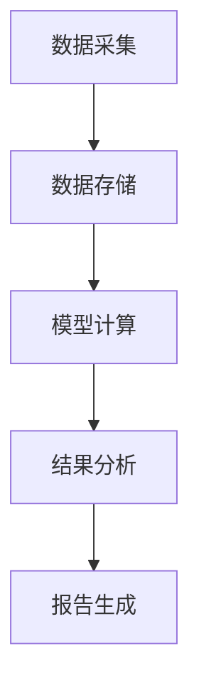

                 


# 股市估值对国际资本流动的影响

> 关键词：股市估值，国际资本流动，经济影响，投资分析，金融模型

> 摘要：本文探讨了股市估值与国际资本流动之间的关系，分析了股市估值变化如何影响资本流动，并通过数学模型和实际案例进一步验证了这种关系。文章内容涵盖背景介绍、核心概念、算法原理、系统分析、项目实战和最佳实践，旨在为读者提供全面的视角。

---

## 第一部分：背景与概念

### 第1章：股市估值与国际资本流动的概述

#### 1.1 股市估值的基本概念

股市估值是衡量股市整体或个股价值的过程。主要方法包括市盈率（P/E）、市净率（P/B）和股息率等。股市估值受市场情绪、经济数据和政策影响。

#### 1.2 国际资本流动的基本概念

国际资本流动指资本在全球范围内的跨市场流动。资本流动受汇率、利率、市场风险和投资机会的影响。

#### 1.3 股市估值与国际资本流动的关系

股市估值影响投资者对市场的信心，进而影响资本流动。资本流动又反过来影响股市估值，形成动态平衡。

---

## 第二部分：影响机制分析

### 第2章：股市估值对国际资本流动的影响机制

#### 2.1 股市估值对资本流动的直接影响

股市估值变化影响投资者决策，高估值可能引发资本流出，低估值可能吸引资本流入。

#### 2.2 股市估值对资本流动的间接影响

股市估值通过影响汇率和资产价格，间接影响资本流动。例如，高估值可能导致本币升值，抑制出口，进而影响资本流动。

#### 2.3 资本流动对股市估值的反馈机制

资本流入推高股市估值，资本流出则压低估值。资本流动与估值形成动态平衡，共同影响市场走势。

---

## 第三部分：数学模型与算法原理

### 第3章：股市估值与国际资本流动的数学模型

#### 3.1 回归分析模型

建立回归模型，分析股市估值与资本流动的相关性。公式如下：

$$ \text{资本流动} = \beta_0 + \beta_1 \times \text{股市估值} + \epsilon $$

其中，$\beta_1$表示股市估值对资本流动的影响系数。

#### 3.2 时间序列分析

使用ARIMA模型分析股市估值和资本流动的时间序列数据，捕捉趋势和周期性。

---

## 第四部分：系统分析与架构设计

### 第4章：系统架构设计

#### 4.1 系统功能设计

系统包括数据采集、模型计算和结果分析模块。数据采集模块获取股市估值和资本流动数据，模型计算模块运行回归分析，结果分析模块生成报告。

#### 4.2 系统架构图



---

## 第五部分：项目实战

### 第5章：项目实战

#### 5.1 数据收集与预处理

使用Python收集历史数据，清洗数据并处理缺失值。

#### 5.2 模型实现

编写Python代码，实现回归分析模型。

```python
import pandas as pd
import statsmodels.api as sm

data = pd.read_csv('data.csv')
model = sm.OLS(data['资本流动'], data['股市估值'])
results = model.fit()
print(results.summary())
```

#### 5.3 结果分析

分析模型结果，解释系数意义，并验证模型的显著性。

---

## 第六部分：最佳实践

### 第6章：最佳实践

#### 6.1 小结

股市估值与国际资本流动相互影响，理解这种关系有助于优化投资策略。

#### 6.2 注意事项

模型假设可能影响结果，需谨慎处理异常值和多重共线性。

#### 6.3 拓展阅读

建议阅读相关文献，深入理解金融市场的复杂性。

---

## 作者

作者：AI天才研究院/AI Genius Institute & 禅与计算机程序设计艺术/Zen And The Art of Computer Programming

