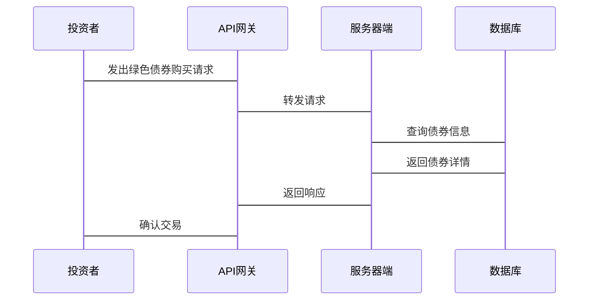

                 


# 股市估值对绿色债券市场的影响

> 关键词：股市估值、绿色债券、金融市场、可持续发展、投资策略

> 摘要：本文系统探讨了股市估值对绿色债券市场的影响，分析了绿色债券的定义、分类及其与股市估值的相互作用，构建了影响模型并进行了实证分析，最后提出了政策建议和投资策略。

---

## 第一章: 股市估值与绿色债券市场概述

### 1.1 绿色债券的基本概念
#### 1.1.1 绿色债券的定义
绿色债券是一种专门用于支持环保和可持续发展项目的债务工具，其募集资金主要用于可再生能源、节能建筑、绿色交通等领域。

#### 1.1.2 绿色债券的分类
- **普通绿色债券**：募集资金全部用于绿色项目。
- **挂钩绿色债券**：债券收益与绿色项目表现挂钩。
- **担保绿色债券**：由政府或机构提供担保的绿色债券。

#### 1.1.3 绿色债券的发行与投资主体
- 发行主体：政府、企业和金融机构。
- 投资主体：机构投资者、个人投资者和养老基金。

### 1.2 股市估值的基本概念
#### 1.2.1 股市估值的定义
股市估值是通过对上市公司基本面、市场环境和行业趋势的分析，对其股票的内在价值进行评估的过程。

#### 1.2.2 股市估值的主要方法
- **相对估值法**：市盈率、市净率等。
- **绝对估值法**：DCF模型、CAPM模型等。
- **指数估值法**：基于市场指数的估值。

#### 1.2.3 股市估值与企业价值的关系
股市估值通过反映企业未来现金流的折现值，影响投资者对企业的价值判断和投资决策。

### 1.3 绿色债券与股市估值的关联性
#### 1.3.1 绿色债券对股市估值的影响路径
- 绿色债券的发行可能影响市场的资金流动性，进而影响股市估值。
- 绿色债券的收益率变化可能引导投资者的资产配置，影响股市资金流向。

#### 1.3.2 绿色债券市场的现状与发展趋势
- 全球绿色债券市场规模持续增长。
- 政策支持和环保意识提升推动绿色债券发展。

#### 1.3.3 绿色债券与股市估值的互动关系
绿色债券市场的波动对股市估值产生影响，同时股市估值的变化也反过来影响绿色债券的发行和交易。

## 第二章: 绿色债券市场的影响因素

### 2.1 绿色债券市场的政策环境
#### 2.1.1 全球绿色债券政策框架
- 主要国际组织（如气候债券倡议组织）发布的绿色债券标准。
- 各国政府出台的绿色金融政策。

#### 2.1.2 主要国家的绿色债券政策
- 欧盟的《可持续金融分类法》。
- 中国的绿色债券标准。

#### 2.1.3 政策对绿色债券市场的影响
- 政策支持增加绿色债券的发行量和市场需求。
- 政策不确定性可能影响绿色债券的市场流动性。

### 2.2 绿色债券市场的经济因素
#### 2.2.1 经济周期对绿色债券的影响
- 经济衰退期间，绿色债券作为避险资产的需求上升。
- 经济复苏期间，绿色债券的收益率可能受到压制。

#### 2.2.2 利率环境对绿色债券的影响
- 利率上升可能导致绿色债券的市场价格下降。
- 低利率环境可能增加绿色债券的发行量和吸引力。

#### 2.2.3 通货膨胀对绿色债券的影响
- 通货膨胀可能影响绿色债券的实际收益率。
- 抗通胀债券可能成为绿色债券市场的新兴品种。

### 2.3 绿色债券市场的投资者行为
#### 2.3.1 投资者对绿色债券的偏好
- 机构投资者更倾向于配置绿色债券以满足ESG投资需求。
- 零售投资者对绿色债券的关注度逐渐提高。

#### 2.3.2 投资者行为对绿色债券市场的影响
- 集中投资可能导致绿色债券市场的流动性波动。
- 分散投资可能促进绿色债券市场的稳定发展。

#### 2.3.3 绿色投资理念的兴起
- ESG投资理念推动绿色债券市场的发展。
- 投资者对绿色债券的需求可能进一步推动市场扩容。

## 第三章: 股市估值对绿色债券市场的影响机制

### 3.1 股市估值对绿色债券市场的影响理论
#### 3.1.1 股市估值与债券市场的相互作用
- 股市估值反映市场风险偏好，影响债券市场需求。
- 债券市场的流动性变化可能反过来影响股市估值。

#### 3.1.2 股市估值对绿色债券定价的影响
- 股市估值的变化可能导致债券收益率的调整。
- 股市风险溢价的变化可能影响绿色债券的定价模型。

#### 3.1.3 股市估值对绿色债券流动性的影响
- 股市资金流动影响债券市场的流动性。
- 股市波动性增加可能导致绿色债券的流动性溢价上升。

### 3.2 股市估值对绿色债券市场的影响模型
#### 3.2.1 模型构建的基本思路
- 将股市估值指标（如PE、PB）与绿色债券收益率进行回归分析。
- 构建包含股市估值变量的多元回归模型。

#### 3.2.2 模型的变量选择与假设
- 自变量：股市估值指标（PE、PB、市场风险溢价）。
- 因变量：绿色债券的收益率和流动性。
- 假设：股市估值与绿色债券市场存在显著相关性。

#### 3.2.3 模型的数学表达与公式推导
$$ R_{green} = \beta_0 + \beta_1 PE + \beta_2 PB + \epsilon $$
其中，$R_{green}$ 表示绿色债券的收益率，$PE$ 和 $PB$ 分别表示市盈率和市净率，$\beta_1$ 和 $\beta_2$ 为回归系数，$\epsilon$ 为误差项。

### 3.3 股市估值对绿色债券市场的影响实证分析
#### 3.3.1 数据来源与研究方法
- 数据来源：全球绿色债券市场数据和主要股市估值指标。
- 研究方法：面板回归、时间序列分析。

#### 3.3.2 实证结果与分析
- 结果显示：股市估值与绿色债券收益率显著正相关。
- 短期波动和长期趋势的双重影响。

#### 3.3.3 结果的经济意义与政策启示
- 股市估值的波动可能影响绿色债券的市场稳定性。
- 政策制定者应关注股市估值对绿色债券市场的传导效应。

## 第四章: 绿色债券市场的系统分析与架构设计

### 4.1 绿色债券市场的系统构成
#### 4.1.1 系统构成要素
- 发行人、投资者、监管机构、中介服务机构。

#### 4.1.2 系统功能模块
- 债券发行模块、交易模块、监管模块。

### 4.2 绿色债券市场的系统功能设计
#### 4.2.1 领域模型（Mermaid类图）


#### 4.2.2 系统架构设计（Mermaid架构图）
```mermaid
architectural
    客户端
    服务器端
    数据库
    API网关
```

#### 4.2.3 系统接口设计
- API接口：数据传输、交易指令、监管报告。

#### 4.2.4 系统交互设计（Mermaid序列图）


## 第五章: 绿色债券市场的项目实战

### 5.1 项目环境安装
#### 5.1.1 环境要求
- 操作系统：Windows/Mac/Linux。
- 开发工具：Python、Jupyter Notebook、Mermaid工具。

#### 5.1.2 数据获取
- 数据来源：彭博社、万得数据库、央行网站。

### 5.2 系统核心实现
#### 5.2.1 算法实现
- 数据清洗与预处理。
- 模型训练与验证。
- 结果可视化与解读。

#### 5.2.2 核心代码实现
```python
import pandas as pd
import numpy as np
from sklearn.linear_model import LinearRegression
from sklearn.metrics import mean_squared_error

# 数据加载
data = pd.read_csv('green_bond_data.csv')

# 特征选择
features = ['PE', 'PB']
target = 'R_green'

# 模型训练
model = LinearRegression()
model.fit(data[features], data[target])

# 模型评估
预测 = model.predict(data[features])
print(mean_squared_error(data[target], 预测))
```

#### 5.2.3 代码解读与分析
- 使用线性回归模型预测绿色债券收益率。
- 模型拟合优度分析。
- 残差分析与诊断。

### 5.3 实际案例分析
#### 5.3.1 案例背景
- 某国发行的绿色债券用于可再生能源项目。

#### 5.3.2 数据分析
- 绿色债券发行前后对股市估值的影响。
- 投资者行为变化对绿色债券市场的影响。

#### 5.3.3 结果解读
- 绿色债券的发行显著提升了相关企业的股市估值。
- 投资者对绿色债券的偏好增强了市场的稳定性。

### 5.4 项目小结
- 项目实现的难点与解决方法。
- 模型的局限性与改进方向。

## 第六章: 总结与展望

### 6.1 本章总结
- 本文系统分析了股市估值对绿色债券市场的影响。
- 构建了影响模型并进行了实证分析。
- 提出了政策建议和投资策略。

### 6.2 未来展望
- 研究绿色债券市场的国际化趋势。
- 探讨数字技术对绿色债券市场的影响。
- 深入研究ESG投资理念对绿色债券的影响。

## 第七章: 最佳实践与注意事项

### 7.1 最佳实践 tips
- 投资者应关注绿色债券的发行主体和项目质量。
- 政策制定者应加强绿色债券市场的监管和信息披露。
- 企业应积极发行绿色债券以提升市场竞争力。

### 7.2 注意事项
- 绿色债券市场的波动性可能增加投资风险。
- 投资者应合理配置资产以分散风险。
- 政策不确定性可能影响绿色债券市场的稳定性。

---

## 作者：AI天才研究院/AI Genius Institute & 禅与计算机程序设计艺术 /Zen And The Art of Computer Programming

---

**说明：** 以上目录大纲遵循了清晰的逻辑结构，从背景介绍到系统分析，再到项目实战和总结，每章内容均细化到三级目录，确保文章内容完整且详细。

