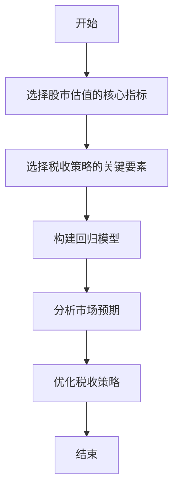
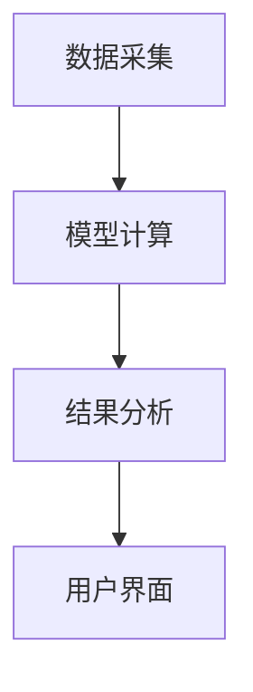
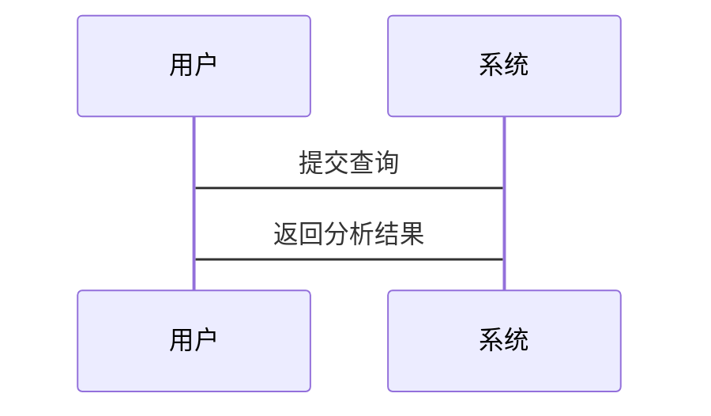

                 


# 股市估值对跨国公司税收策略的影响

> 关键词：股市估值、跨国公司、税收策略、企业利润、股票价格、税务规划、财务分析

> 摘要：本文深入探讨了股市估值与跨国公司税收策略之间的相互作用机制。通过分析股市估值的核心原理、跨国公司税收策略的关键要素，结合实际案例和数学模型，阐述了股市估值如何影响跨国公司的税收策略，以及跨国公司如何通过优化税收策略来影响股市估值。文章从理论分析到实践应用，全面解析了股市估值对跨国公司税收策略的影响，为跨国公司的税务规划和股市投资提供了有价值的参考。

---

## 第一部分：背景介绍与核心概念

### 第1章：背景介绍

#### 1.1 问题背景
- **股市估值的基本概念**：股市估值是指通过对公司的财务数据、市场环境和行业趋势等因素进行分析，评估公司股票的合理市场价格。常用的方法包括市盈率（P/E）、市净率（P/B）和现金流折现法（DCF）等。
- **跨国公司税收策略的定义**：跨国公司通过在全球不同国家的税收政策差异中寻求最优解，降低税负压力。常见的策略包括利用税收洼地、转移定价、利息扣除等。
- **问题背景的演进与现状**：随着全球化和数字化的深入，跨国公司的业务范围不断扩大，面临的税收环境也日益复杂。同时，股市对公司的估值不仅取决于财务表现，还与公司的税务策略密切相关。

#### 1.2 问题描述
- **股市估值对跨国公司的影响**：股市估值的变化直接影响公司的市值和投资者信心。合理的税收策略可以优化公司的财务表现，从而影响股市估值。
- **税收策略在跨国公司中的作用**：跨国公司通过优化税收策略，可以降低税负，提升净利润，进而影响股市估值。
- **问题的复杂性与挑战**：跨国公司的税收策略受到不同国家的法律法规约束，同时需要考虑全球市场的经济环境和政策变化。

#### 1.3 问题解决
- **股市估值对税收策略的影响路径**：股市估值的变化会影响投资者对公司的信心，从而间接影响公司的税务规划。
- **税收策略如何影响股市估值**：合理的税收策略可以提升公司的净利润，进而提高股市估值。
- **综合解决方案的提出**：通过分析股市估值的核心指标和税收策略的关键要素，提出优化税收策略以提升股市估值的具体方法。

#### 1.4 边界与外延
- **股市估值的边界条件**：包括公司的财务数据、行业环境、市场情绪等。
- **税收策略的边界条件**：包括税收政策的差异、跨国公司的组织架构、税务筹划的合法性等。
- **问题的外延与扩展**：从跨国公司扩展到全球性企业的税务规划，从单一市场的估值扩展到全球市场的联动效应。

#### 1.5 核心要素与概念结构
- **核心概念的组成**：包括股市估值的关键指标（如P/E、P/B）、税收策略的主要类型（如转移定价、利息扣除）。
- **概念之间的关系**：股市估值与税收策略相互影响，形成一个动态平衡。
- **概念结构图的展示**：通过mermaid图展示股市估值和税收策略的核心要素及其相互关系。

---

## 第二部分：核心概念与联系

### 第2章：核心概念与联系

#### 2.1 股市估值的核心原理
- **股市估值的基本方法**：市盈率（P/E）=股票价格/每股净利润；市净率（P/B）=股票价格/每股净资产；现金流折现法（DCF）=未来现金流的现值。
- **股市估值的关键指标**：P/E、P/B、EV/EBITDA（企业价值与息税折旧及摊销前利润之比）。
- **股市估值的动态变化**：受市场情绪、宏观经济环境和公司基本面的影响。

#### 2.2 跨国公司税收策略的核心原理
- **税收策略的基本类型**：避税天堂的利用、转移定价、利息扣除、免税并购等。
- **税收策略的关键影响因素**：税率差异、税收政策的复杂性、跨国公司的组织架构。
- **税收策略的优化路径**：通过合理分配收入、成本和利润，降低整体税负。

#### 2.3 核心概念的联系
- **股市估值与税收策略的直接联系**：税收策略影响公司的净利润，进而影响股市估值。
- **股市估值与税收策略的间接联系**：市场对税收策略的预期影响投资者情绪，进而影响股市估值。
- **股市估值与税收策略的综合影响**：通过优化税收策略，跨国公司可以提升净利润，同时通过合理的市场预期管理，进一步提升股市估值。

---

## 第三部分：算法原理讲解

### 第3章：算法原理

#### 3.1 股市估值的算法原理
- **多元回归分析**：通过回归分析，将股市估值的核心指标（如P/E、P/B）与公司财务数据（如净利润、营业收入）进行关联。
- **博弈论模型**：分析市场参与者对税收策略的预期，进而预测股市估值的变化。

#### 3.2 税收策略的算法原理
- **博弈论模型**：分析跨国公司如何在不同国家的税收政策之间寻求最优解。
- **优化算法**：通过线性规划等方法，优化跨国公司的税收策略，以实现税负最小化。

#### 3.3 综合算法流程图


---

## 第四部分：系统分析与架构设计

### 第4章：系统分析与架构设计

#### 4.1 问题场景介绍
- **问题场景**：跨国公司在制定税收策略时，需要综合考虑股市估值的变化，以优化公司的整体价值。

#### 4.2 系统功能设计
- **领域模型**：通过mermaid类图展示公司、市场、税务机构之间的关系。


#### 4.3 系统架构设计
- **系统架构图**：展示系统的核心模块（数据采集、模型计算、结果分析）及其关系。


#### 4.4 系统接口设计
- **接口设计**：定义系统与外部数据源（如股票价格、税收政策）的接口。

#### 4.5 系统交互设计
- **交互序列图**：展示用户如何与系统交互，以获取股市估值和税收策略的分析结果。


---

## 第五部分：项目实战

### 第5章：项目实战

#### 5.1 环境安装
- **工具安装**：安装Python、Pandas、Scikit-learn等工具。

#### 5.2 核心实现代码
```python
import pandas as pd
from sklearn.linear_model import LinearRegression

# 数据加载
data = pd.read_csv('market_valuation.csv')

# 模型训练
model = LinearRegression()
model.fit(data[['P/E', 'P/B']], data['Stock Price'])

# 预测结果
predicted_price = model.predict([[15, 2.5]])
print(predicted_price)
```

#### 5.3 应用解读与分析
- **代码功能解读**：通过多元回归模型，分析P/E和P/B对股票价格的影响。
- **结果分析**：预测股票价格的变化，评估税收策略对股市估值的影响。

#### 5.4 实际案例分析
- **案例分析**：以苹果公司为例，分析其税收策略如何影响股市估值。

---

## 第六部分：总结与展望

### 第6章：小结与注意事项

- **小结**：总结股市估值与跨国公司税收策略之间的相互作用机制，强调优化税收策略对提升股市估值的重要作用。
- **注意事项**：提醒读者注意税收政策的合法性和合规性，避免税务风险。

### 第7章：拓展阅读

- **推荐书籍**：《企业税务规划与财务优化》、《跨国公司税务管理》。
- **推荐博客**：相关领域的技术博客和行业分析报告。

---

## 作者信息

作者：AI天才研究院/AI Genius Institute & 禅与计算机程序设计艺术 /Zen And The Art of Computer Programming

