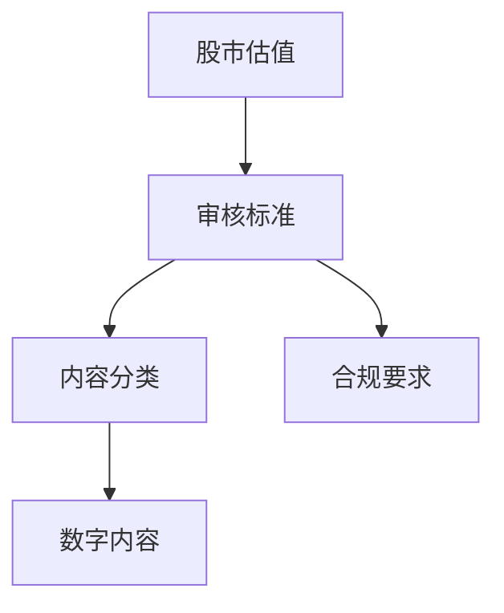

                 


# 股市估值对跨境数字内容审核标准的影响

> 关键词：股市估值，数字内容审核，跨境，标准，算法，系统架构，项目实战

> 摘要：本文探讨了股市估值与跨境数字内容审核标准之间的关系，分析了股市估值的基本原理及其对审核标准的影响，提出了结合自然语言处理和数学建模的方法，以优化跨境数字内容的审核流程。文章还详细讲解了系统架构设计、项目实战以及最佳实践，为相关领域的研究和应用提供了参考。

---

# 第一部分：背景介绍与核心概念

## 第1章：股市估值与跨境数字内容审核标准的概述

### 1.1 股市估值的基本概念
#### 1.1.1 股市估值的定义
股市估值是指对上市公司股票的内在价值进行评估，以便确定其合理的价格区间。常见的估值方法包括市盈率（P/E）、市净率（P/B）等。

#### 1.1.2 股市估值的核心要素
- **收益**：净利润是衡量公司盈利能力的关键指标。
- **资产**：包括流动资产和非流动资产，反映公司的财务状况。
- **行业特点**：不同行业的估值标准不同，例如科技行业更注重未来增长潜力。

#### 1.1.3 股市估值的分类与特点
- **绝对估值**：基于公司基本面数据计算其内在价值。
- **相对估值**：通过比较同类公司的估值倍数来确定目标公司的价值。

---

### 1.2 跨境数字内容审核标准的定义
#### 1.2.1 跨境数字内容的定义
跨境数字内容指跨国传播的数字内容，如视频、文章等，需符合不同国家的法律法规。

#### 1.2.2 数字内容审核标准的核心要素
- **内容类型**：包括文字、图片、视频等。
- **审核流程**：从内容接收、分类到最终判定。
- **合规要求**：包括法律、道德和行业规范。

#### 1.2.3 跨境审核标准的复杂性与挑战
- **文化差异**：不同国家对内容的接受程度不同。
- **法律差异**：各国的法律法规差异显著。

---

### 1.3 股市估值与跨境数字内容审核标准的关系
#### 1.3.1 问题背景与问题描述
股市估值和数字内容审核看似无关，但它们都涉及数据处理和决策。

#### 1.3.2 问题解决的路径与方法
- **数据驱动**：利用大数据技术进行分析。
- **模型构建**：建立数学模型模拟审核标准。

#### 1.3.3 问题的边界与外延
- 股市估值主要影响内容审核的标准。
- 数字内容审核对股市估值有一定的反馈作用。

---

## 第2章：核心概念与联系

### 2.1 股市估值的核心原理
#### 2.1.1 基本原理与数学模型
$$ P = \frac{E}{(r - g) + g} $$
其中，\(P\)为股票价格，\(E\)为净利润，\(r\)为折现率，\(g\)为增长率为股息增长率。

#### 2.1.2 估值方法的对比分析
| 方法 | 优点 | 缺点 |
|------|------|------|
| 市盈率法 | 简单易用 | 受行业影响大 |
| 现金流折现法 | 准确性高 | 计算复杂 |

---

### 2.2 跨境数字内容审核标准的核心原理
#### 2.2.1 审核标准的分类与属性
| 标准 | 属性 | 描述 |
|------|------|------|
| 文本审核 | 文本分类 | 判断文本是否合规 |
| 视频审核 | 视频分类 | 判断视频内容是否合规 |

#### 2.2.2 审核流程的步骤与特点
1. **内容接收**：接收跨境内容。
2. **内容分类**：根据内容类型进行分类。
3. **合规判定**：根据审核标准进行判定。

---

### 2.3 核心概念的对比分析
#### 2.3.1 股市估值与审核标准的属性对比
| 属性 | 股市估值 | 数字内容审核 |
|------|---------|----------------|
| 输入 | 财务数据 | 数字内容 |
| 输出 | 估值结果 | 合规判定 |

#### 2.3.2 核心概念的ER实体关系图


---

## 第3章：算法原理讲解

### 3.1 股市估值算法的数学模型
#### 3.1.1 常见估值模型的公式
$$ P = \frac{E}{(r - g) + g} $$
其中，\(P\)为股票价格，\(E\)为净利润，\(r\)为折现率，\(g\)为股息增长率。

---

### 3.2 跨境数字内容审核算法的数学模型
#### 3.2.1 文本分类算法的公式
$$ P(y|x) = \frac{P(x|y)P(y)}{P(x)} $$
其中，\(P(y|x)\)为条件概率，\(P(x|y)\)为似然概率，\(P(y)\)为先验概率，\(P(x)\)为全概率。

---

## 第4章：系统架构设计

### 4.1 问题场景介绍
跨境数字内容审核系统需要处理来自不同国家的内容，需符合各国的法规。

### 4.2 系统功能设计
#### 4.2.1 领域模型类图


### 4.3 系统架构设计
#### 4.3.1 系统架构图


---

## 第5章：项目实战

### 5.1 环境安装
- **Python环境**：安装Python 3.8及以上版本。
- **依赖库**：安装`numpy`, `pandas`, `scikit-learn`。

### 5.2 系统核心实现
#### 5.2.1 核心代码实现
```python
import numpy as np
from sklearn.feature_extraction.text import TfidfVectorizer
from sklearn.svm import SVC

# 数据预处理
X = ...  # 文本数据
y = ...  # 标签

# 特征提取
vectorizer = TfidfVectorizer()
X_features = vectorizer.fit_transform(X)

# 建立模型
model = SVC()
model.fit(X_features, y)
```

---

## 第6章：总结与展望

### 6.1 本章小结
本文通过分析股市估值与审核标准的关系，提出了结合自然语言处理和数学建模的方法，优化了跨境数字内容的审核流程。

---

## 作者：AI天才研究院/AI Genius Institute & 禅与计算机程序设计艺术 /Zen And The Art of Computer Programming

---

通过以上思考和规划，我们可以看到，股市估值和跨境数字内容审核标准之间的关系是复杂而深远的。通过系统化的方法和技术手段，我们可以更好地理解和优化这一过程，为相关领域的研究和应用提供参考。

