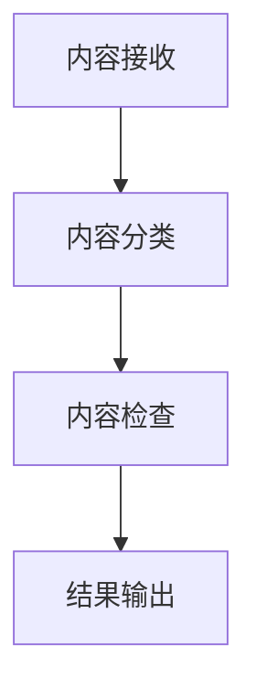
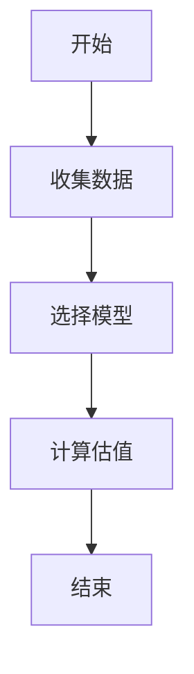
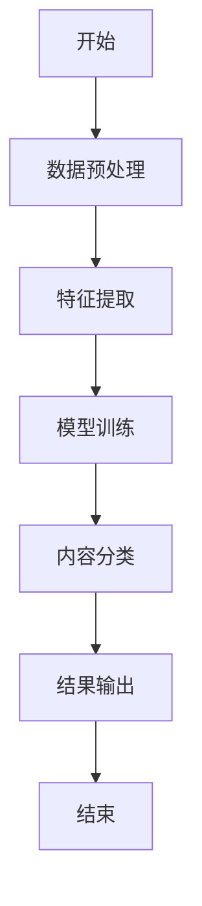
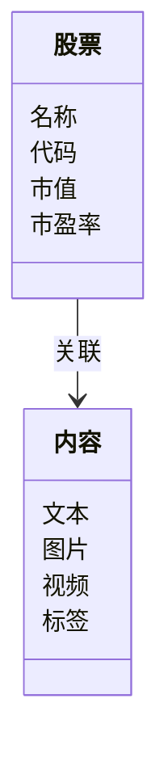
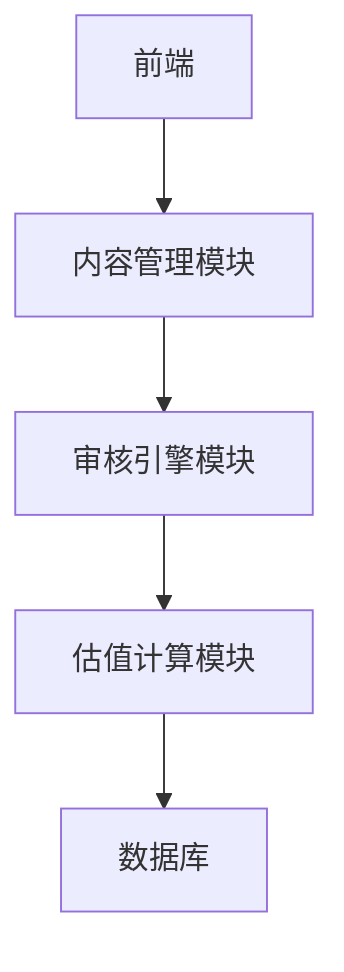
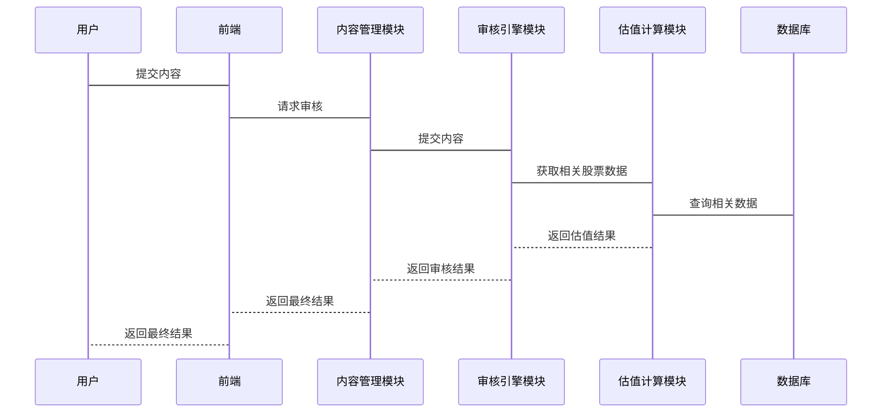

                 


# 股市估值对跨境数字内容审核的影响

## 关键词：股市估值，数字内容审核，跨境内容，算法模型，技术影响

## 摘要：本文探讨了股市估值与跨境数字内容审核之间的关系，分析了股市波动对内容审核效率的影响，以及内容审核对上市公司形象和股价的反向影响。通过详细讲解核心概念、算法原理和系统架构，结合实际案例，展示了如何在技术层面实现两者的结合与优化。

---

# 第1章: 股市估值基础

## 1.1 股市估值的基本概念

### 1.1.1 什么是股市估值
股市估值是通过对公司财务数据、市场环境等因素进行分析，以确定公司股票的合理价值的过程。常见的估值方法包括市盈率（P/E Ratio）、市净率（P/B Ratio）和股息率（Dividend Yield）等。

### 1.1.2 股市估值的常见方法
1. **相对估值法**：通过比较同类公司的估值指标来确定目标公司的价值。
2. **绝对估值法**：基于公司未来现金流的折现值来估算公司价值，如股利贴现模型（DDM）和现金流贴现模型（DCF）。
3. **指数估值法**：通过市场指数的波动来评估个股的估值水平。

### 1.1.3 股市估值的核心要素
1. **财务数据**：包括收入、利润、现金流等。
2. **市场环境**：如宏观经济状况、行业趋势等。
3. **公司基本面**：包括公司治理、管理团队等。

## 1.2 股市估值的关键指标

### 1.2.1 市盈率（P/E Ratio）
市盈率是股票价格与每股收益（EPS）的比率，用于衡量股票的估值是否合理。

公式：$$P/E = \frac{Price}{Earnings}$$

### 1.2.2 市净率（P/B Ratio）
市净率是股票价格与每股净资产的比率，常用于评估银行、房地产等资产密集型行业的公司价值。

### 1.2.3 股息率（Dividend Yield）
股息率是每股股息与股票价格的比率，用于衡量投资回报率。

---

# 第2章: 跨境数字内容审核的基础

## 2.1 跨境数字内容审核的定义

### 2.1.1 跨境数字内容的定义
跨境数字内容指的是在不同国家或地区之间流通的数字化内容，如网站、应用程序、视频、社交媒体等。

### 2.1.2 数字内容审核的必要性
- 遵守不同国家的法律法规。
- 防止传播违规或有害内容。
- 维护品牌形象和用户信任。

### 2.1.3 跨境审核的特点
- **多样性**：不同国家的法律法规差异大。
- **复杂性**：需要处理多种语言和文化背景。
- **实时性**：需要快速响应和处理。

## 2.2 跨境数字内容审核的关键环节

### 2.2.1 内容分类与标签
- 根据内容类型（如文本、图片、视频）进行分类。
- 为内容打上标签，便于后续处理。

### 2.2.2 内容合规性检查
- 检查内容是否符合目标市场的法律法规。
- 识别并过滤违规内容，如色情、暴力、仇恨言论等。

### 2.2.3 内容安全评估
- 评估内容的安全性，防止网络攻击、数据泄露等风险。

---

# 第3章: 股市估值与跨境数字内容审核的关系

## 3.1 股市估值对数字内容审核的影响

### 3.1.1 股市波动对数字内容审核的影响
- 股市波动可能导致公司市值变化，影响审核策略的调整。
- 在股市下跌时，公司可能需要更加严格地审核内容以维护品牌形象。

### 3.1.2 企业市值变化对审核策略的调整
- 当公司市值下降时，可能会增加内容审核的严格程度。
- 当公司市值上升时，可能会优化审核流程以提高效率。

### 3.1.3 股市估值对审核效率的潜在影响
- 高市值公司可能有更多资源投入内容审核技术。
- 低市值公司可能在审核技术上投入较少。

## 3.2 跨境数字内容审核对股市估值的反作用

### 3.2.1 数字内容审核对上市公司形象的影响
- 合规的数字内容有助于提升公司形象。
- 不合规内容可能导致股价下跌。

### 3.2.2 内容风险对股市估值的长期影响
- 长期来看，内容违规可能导致公司面临法律风险，影响估值。
- 正确的内容审核策略有助于提升投资者信心，提高估值。

### 3.2.3 跨境审核对股市监管的推动作用
- 跨境审核推动了更加严格的股市监管政策。
- 监管政策的变化会影响公司的估值模型。

---

# 第4章: 核心概念与联系

## 4.1 核心概念原理

### 4.1.1 股市估值的数学模型
- **DCF模型**：通过预测公司未来现金流并折现，确定其估值。

公式：$$DCF = \frac{CF}{(r - g)}$$

### 4.1.2 数字内容审核的流程模型
- **流程模型**：从内容接收、分类、检查到结果输出的完整流程。



### 4.1.3 两者关系的系统模型
- **系统模型**：将股市估值和内容审核整合到一个系统中，通过数据流进行交互。

## 4.2 核心概念对比分析

### 4.2.1 概念属性特征对比表格
| 属性         | 股市估值           | 数字内容审核         |
|--------------|------------------|--------------------|
| 目标         | 评估股票价值     | 确保内容合规       |
| 方法         | 数学模型、算法     | 自然语言处理、机器学习 |
| 输入         | 财务数据、市场数据 | 文本、图像、视频     |
| 输出         | 估值结果         | 审核结果           |

### 4.2.2 ER实体关系图架构
```mermaid
erd
    股票
    投资者
    内容
    审核人员
    公司
    市场监管机构
    股价
    内容违规记录
    审核结果
```

---

# 第5章: 算法原理讲解

## 5.1 股市估值算法

### 5.1.1 常见估值算法
- **DCF模型**：通过预测未来现金流并折现，确定股票的内在价值。
- **相对估值法**：基于同类公司的估值指标进行比较。

### 5.1.2 算法流程图


### 5.1.3 代码实现与解读
```python
def dcf_valuation(cash_flows, discount_rate, growth_rate):
    present_value = cash_flows / (discount_rate - growth_rate)
    return present_value

cash_flows = [100, 120, 140]
discount_rate = 0.08
growth_rate = 0.02

valuation = dcf_valuation(cash_flows, discount_rate, growth_rate)
print("DCF估值为:", valuation)
```

## 5.2 数字内容审核算法

### 5.2.1 基于机器学习的审核算法
- **朴素贝叶斯分类**：通过训练数据分类内容是否违规。

### 5.2.2 算法流程图


### 5.2.3 代码实现与解读
```python
from sklearn.naive_bayes import MultinomialNB
from sklearn.feature_extraction.text import TfidfVectorizer

# 训练数据
texts = ["This is a good product.", "This is a bad product."]
labels = [0, 1]

# 特征提取
vectorizer = TfidfVectorizer()
X = vectorizer.fit_transform(texts)

# 模型训练
model = MultinomialNB()
model.fit(X, labels)

# 预测
new_text = "This is an excellent product."
new_X = vectorizer.transform([new_text])
prediction = model.predict(new_X)
print("预测结果为:", prediction)
```

---

# 第6章: 数学模型与公式

## 6.1 股市估值模型

### 6.1.1 DCF模型公式
$$DCF = \frac{CF}{(r - g)}$$

## 6.2 数字内容审核模型

### 6.2.1 朴素贝叶斯分类公式
$$P(c|x) = P(x|c)P(c)$$

---

# 第7章: 系统分析与架构设计方案

## 7.1 系统功能设计

### 7.1.1 领域模型


### 7.1.2 系统架构设计


### 7.1.3 系统接口设计
- API接口：
  - `/api/valuation`：接收股票数据，返回估值结果。
  - `/api/review`：接收内容数据，返回审核结果。

### 7.1.4 系统交互图


---

# 第8章: 项目实战

## 8.1 环境安装

### 8.1.1 安装Python和相关库
```bash
pip install numpy pandas scikit-learn
```

## 8.2 系统核心实现源代码

### 8.2.1 股市估值代码
```python
import numpy as np

def calculate_valuation(cash_flows, discount_rate, growth_rate):
    present_value = cash_flows / (discount_rate - growth_rate)
    return present_value

cash_flows = np.array([100, 120, 140])
discount_rate = 0.08
growth_rate = 0.02

valuation = calculate_valuation(cash_flows, discount_rate, growth_rate)
print("DCF估值为:", valuation)
```

### 8.2.2 数字内容审核代码
```python
from sklearn.naive_bayes import MultinomialNB
from sklearn.feature_extraction.text import TfidfVectorizer

# 训练数据
texts = ["This is a good product.", "This is a bad product."]
labels = [0, 1]

# 特征提取
vectorizer = TfidfVectorizer()
X = vectorizer.fit_transform(texts)

# 模型训练
model = MultinomialNB()
model.fit(X, labels)

# 预测
new_text = "This is an excellent product."
new_X = vectorizer.transform([new_text])
prediction = model.predict(new_X)
print("预测结果为:", prediction)
```

## 8.3 案例分析与详细解读
假设我们有一个跨国公司，其股价近期波动较大。通过股市估值模型，我们可以预测其未来股价走势，并根据审核引擎的结果，调整内容审核策略，以确保在股价波动时保持内容的合规性。

---

# 第9章: 最佳实践

## 9.1 小结
- 股市估值和数字内容审核在技术层面有深刻的联系。
- 通过算法和系统架构的优化，可以实现两者的高效结合。

## 9.2 注意事项
- 数据隐私和安全问题需要特别注意。
- 算法模型需要不断优化和更新，以适应市场变化。

## 9.3 拓展阅读
- 推荐阅读《算法导论》和《股票估值实战》。

---

作者：AI天才研究院/AI Genius Institute & 禅与计算机程序设计艺术 /Zen And The Art of Computer Programming

