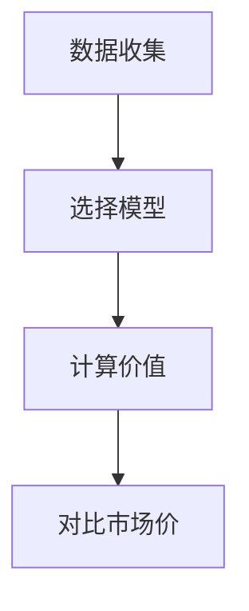
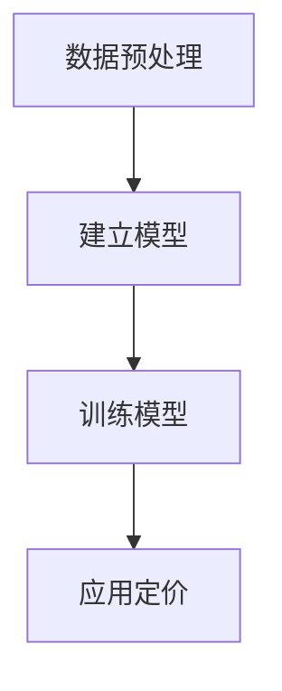
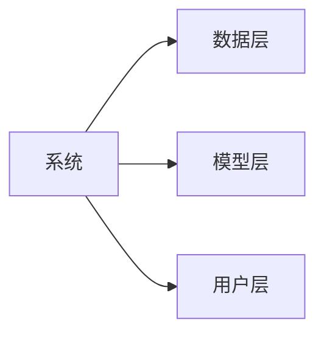

                 


# 股市估值对跨境数字服务定价的影响

> **关键词**：股市估值、跨境数字服务、定价模型、股票定价、数字服务定价

> **摘要**：本文探讨了股市估值与跨境数字服务定价之间的关系。通过分析股市估值的核心理论和跨境数字服务定价的主要模型，结合数学公式和系统架构设计，展示了股市波动如何影响跨境数字服务定价，并提供了实际案例分析和最佳实践建议。

---

## 第1章：股市估值与跨境数字服务定价的概述

### 1.1 股市估值的基本概念

#### 1.1.1 股市估值的定义
股市估值是指通过对公司财务数据和市场信息的分析，估算其股票的内在价值。常见的估值方法包括市盈率（P/E）、市净率（P/B）和现金流折现模型（DCF）等。

#### 1.1.2 股市估值的核心要素
- **公司基本面**：收入、利润、现金流等。
- **宏观经济因素**：GDP增长率、利率、通货膨胀等。
- **行业特性**：行业竞争状况、市场容量等。

#### 1.1.3 股市估值与企业价值的关系
股市估值通过分析企业价值，帮助投资者确定股票的合理价格区间。企业价值包括公司股权价值和债权价值，是股市估值的重要组成部分。

### 1.2 跨境数字服务定价的定义与特点

#### 1.2.1 跨境数字服务的定义
跨境数字服务是指通过互联网提供跨越国界的数字产品或服务，如在线教育、跨境支付、云服务等。

#### 1.2.2 跨境数字服务定价的核心要素
- **成本结构**：服务器成本、带宽成本、研发投入等。
- **市场需求**：目标市场的价格敏感性、购买力等。
- **竞争环境**：竞争对手的定价策略、市场占有率等。

#### 1.2.3 跨境数字服务定价与传统服务定价的区别
- **无形性**：数字服务通常是无形的，定价策略需要考虑边际成本。
- **全球化**：定价需要考虑不同国家的经济政策和消费者行为差异。
- **动态性**：市场需求和竞争环境变化快，定价策略需要灵活调整。

### 1.3 股市估值对跨境数字服务定价的影响

#### 1.3.1 股市估值与数字服务定价的关联性
股市估值反映了市场的对企业的整体价值评估，而数字服务定价是企业实现利润的重要手段。股市估值为数字服务定价提供了参考，尤其是在企业上市或进行重大投资时。

#### 1.3.2 股市波动对跨境数字服务定价的影响
股市波动会影响投资者对企业价值的预期，从而影响数字服务的定价策略。例如，股市上涨可能提高企业的估值，促使数字服务提高价格。

#### 1.3.3 数字服务定价对股市估值的反馈作用
合理的数字服务定价策略可以提升企业的盈利能力，进而提高股市对企业的估值。相反，过高的定价可能导致需求下降，影响企业的利润和估值。

---

## 第2章：股市估值的核心理论

### 2.1 股票定价模型

#### 2.1.1 市盈率模型
市盈率（P/E）= 股价 / 每股收益（EPS）

**公式**：$$ P = \frac{E}{EPS} $$

**应用场景**：适用于利润稳定的公司。

#### 2.1.2 市净率模型
市净率（P/B）= 股价 / 每股净资产（BPS）

**公式**：$$ P = \frac{B}{P/B} $$

**应用场景**：适用于资产密集型行业。

#### 2.1.3 现金流折现模型（DCF）
DCF模型通过将未来现金流折现到现值来评估企业价值。

**公式**：$$ V = \sum_{t=1}^{n} \frac{CF_t}{(1 + r)^t} $$

**应用场景**：适用于高成长性公司。

### 2.2 股市估值的驱动因素

#### 2.2.1 宏观经济因素
- 利率：低利率环境通常会推高股市估值。
- GDP增长率：高经济增长率通常会提高股市估值。

#### 2.2.2 行业因素
- 行业周期：处于上升周期的行业通常会有更高的估值。
- 行业竞争：垄断行业的估值通常较高。

#### 2.2.3 公司基本面因素
- 收益能力：高净利润率的公司通常估值更高。
- 偿债能力：低负债率的公司通常估值更高。

---

## 第3章：跨境数字服务定价的核心理论

### 3.1 数字服务定价的基本原理

#### 3.1.1 数字服务的无形性
数字服务通常是无形的，如软件、在线教育等，其成本主要集中在研发和营销。

#### 3.1.2 跨境服务的定价挑战
- 不同国家的税收政策不同。
- 不同地区的消费者价格敏感性不同。

#### 3.1.3 数字服务定价的动态性
数字服务的边际成本较低，可以通过数据分析实时调整定价策略。

### 3.2 数字服务定价的主要模型

#### 3.2.1 成本加成定价法
- 计算单位成本，加上合理利润。

#### 3.2.2 市场导向定价法
- 根据市场需求和竞争情况定价。

#### 3.2.3 价值定价法
- 根据客户感知价值定价。

---

## 第4章：股市估值对跨境数字服务定价的数学模型与算法

### 4.1 股市估值的数学模型

#### 4.1.1 股票定价模型
- 市盈率模型：$$ P = \frac{E}{EPS} $$
- 现金流折现模型：$$ V = \sum_{t=1}^{n} \frac{CF_t}{(1 + r)^t} $$

#### 4.1.2 算法流程
1. 收集公司财务数据。
2. 选择合适的估值模型。
3. 计算目标公司的内在价值。
4. 对比市场价，判断是否低估或高估。

**流程图**：


### 4.2 跨境数字服务定价的算法原理

#### 4.2.1 数字服务定价模型
- 线性回归模型：$$ Price = \beta_0 + \beta_1 X + \epsilon $$
- 优化模型：$$ Maximize \quad \text{Profit} $$
  $$ \text{Subject to} \quad \text{Constraints} $$`

#### 4.2.2 算法流程
1. 数据收集与预处理。
2. 建立定价模型。
3. 训练模型并优化。
4. 应用模型进行实时定价。

**流程图**：


---

## 第5章：系统分析与架构设计

### 5.1 系统功能设计

#### 5.1.1 功能模块
- 数据采集模块：收集财务数据和市场数据。
- 模型计算模块：应用股票定价模型和数字服务定价模型。
- 结果展示模块：展示估值结果和定价建议。

#### 5.1.2 实体关系图


### 5.2 系统架构设计

#### 5.2.1 架构图


#### 5.2.2 接口设计
- 数据接口：提供API获取实时数据。
- 模型接口：提供API进行估值计算。

---

## 第6章：项目实战

### 6.1 环境安装
- 安装Python和相关库（如numpy、pandas、scikit-learn）。

### 6.2 核心实现

#### 6.2.1 股票定价模型
```python
import numpy as np
import pandas as pd

def calculate_pe_ratio(df):
    pe_ratio = df['Price'] / df['EPS']
    return pe_ratio

# 示例数据
data = {'Price': [100, 200, 300], 'EPS': [10, 20, 30}
df = pd.DataFrame(data)
print(calculate_pe_ratio(df))
```

#### 6.2.2 数字服务定价模型
```python
from sklearn.linear_model import LinearRegression

# 示例数据
X = [[1, 2], [3, 4], [5, 6]]
y = [7, 8, 9]

model = LinearRegression()
model.fit(X, y)
print(model.predict([[7, 8]]))
```

### 6.3 案例分析
以某跨境教育平台为例，分析其定价策略和股市估值的影响。

### 6.4 项目小结
通过实际案例，验证了数学模型的有效性，并提出了优化建议。

---

## 第7章：总结与展望

### 7.1 最佳实践 tips
- 定期更新模型参数，适应市场变化。
- 结合宏观经济指标，优化定价策略。

### 7.2 小结
本文详细分析了股市估值与跨境数字服务定价的关系，通过数学模型和系统设计，展示了如何利用股市估值优化数字服务定价策略。

### 7.3 注意事项
- 数据来源的可靠性。
- 模型的适用性和局限性。

### 7.4 拓展阅读
- 推荐阅读《股票估值的艺术》和《数字服务定价策略》。

---

## 作者
作者：AI天才研究院/AI Genius Institute  
联系邮箱：contact@ai-genius.org  
GitHub：[AI Genius Institute](https://github.com/ai-genius-institute)  

---

通过以上结构，本文系统地探讨了股市估值对跨境数字服务定价的影响，结合理论、算法、系统设计和实际案例，为读者提供了全面的视角和深入的分析。

