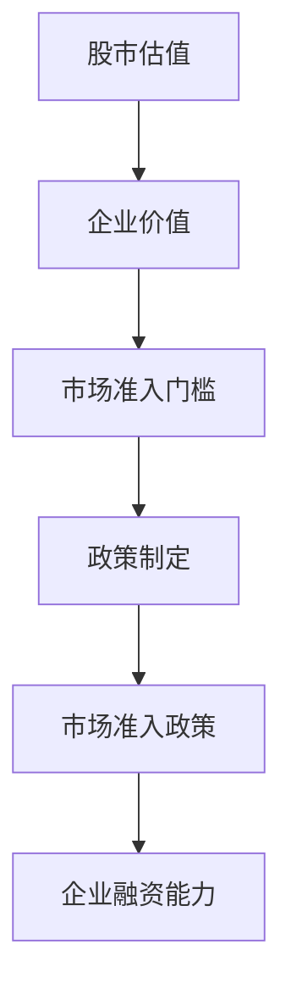

                 

# 股市估值对跨境数字服务市场准入政策的影响

---

## 关键词：
- 股市估值
- 跨界数字服务市场
- 市场准入政策
- 经济影响
- 政策制定
- 数字化转型

---

## 摘要：
本文探讨了股市估值如何影响跨境数字服务市场的准入政策。通过分析股市估值的核心原理、市场准入政策的制定机制以及两者之间的相互作用，本文揭示了股市估值在政策制定中的关键作用。结合实际案例和系统分析，本文提出了政策制定的挑战与解决方案，并展望了未来的发展趋势。

---

## 目录：

1. **股市估值与跨境数字服务市场准入政策的背景与概念**  
   - 1.1 股市估值的定义与作用  
   - 1.2 跨界数字服务市场的定义与特点  
   - 1.3 市场准入政策的定义与作用  
   - 1.4 股市估值对市场准入政策的影响背景  

2. **股市估值与市场准入政策的核心概念与联系**  
   - 2.1 股市估值的核心原理  
   - 2.2 市场准入政策的核心要素  
   - 2.3 股市估值与市场准入政策的相互作用  
   - 2.4 核心概念的对比分析  

3. **股市估值对市场准入政策的影响机制**  
   - 3.1 股市估值影响市场准入政策的直接机制  
   - 3.2 股市估值影响市场准入政策的间接机制  
   - 3.3 影响机制的综合分析  

4. **典型市场案例分析**  
   - 4.1 欧盟的数字服务市场准入政策与股市估值分析  
   - 4.2 美国的数字服务市场准入政策与股市估值分析  
   - 4.3 中国的数字服务市场准入政策与股市估值分析  

5. **政策制定与实施的挑战与解决方案**  
   - 5.1 政策制定的复杂性与博弈论模型  
   - 5.2 市场准入政策的实施挑战  
   - 5.3 解决方案：平衡企业利益与公共政策  

6. **法律与监管框架的优化**  
   - 6.1 相关法律框架的分析  
   - 6.2 法律框架对市场准入政策的影响  
   - 6.3 如何通过法律优化政策制定  

7. **总结与展望**  
   - 7.1 全文总结  
   - 7.2 对未来发展的展望  

---

## 正文：

### 第1章: 股市估值与跨境数字服务市场准入政策的背景与概念

#### 1.1 股市估值的定义与作用
股市估值是指对上市公司股权价值的评估，通常通过市盈率（P/E ratio）和市净率（P/B ratio）等指标进行衡量。股市估值不仅是企业价值的体现，也是投资者决策的重要依据。例如，市盈率公式为：

$$\text{市盈率} = \frac{\text{股票价格}}{\text{每股收益}}$$

股市估值的波动直接影响市场的资源配置和企业融资能力。

#### 1.2 跨界数字服务市场的定义与特点
跨界数字服务市场是指跨越国界的数字服务交易市场，其核心特点包括：

1. **数字化**：服务以数字形式提供，如云服务、在线教育等。
2. **跨-border**：服务提供者和消费者可能位于不同国家。
3. **快速变化**：技术进步和市场需求的变化推动市场的动态调整。

#### 1.3 市场准入政策的定义与作用
市场准入政策是指政府为规范市场进入而制定的法规和措施。其作用包括：

1. **保护消费者权益**：确保市场公平竞争。
2. **维护国家安全**：防止外部势力的市场操控。
3. **促进经济发展**：通过合理的市场准入门槛推动产业升级。

#### 1.4 股市估值对市场准入政策的影响背景
随着全球经济的数字化转型，股市估值与市场准入政策的关联性日益增强。例如，一家高估值的科技公司在申请市场准入时，可能更容易获得政策支持，因为其高估值反映了市场对其潜力的认可。

---

### 第2章: 股市估值与市场准入政策的核心概念与联系

#### 2.1 股市估值的核心原理
股市估值的核心原理包括：

1. **基本面分析**：通过企业的财务数据（如收入、利润）评估其价值。
2. **市场情绪分析**：投资者情绪影响股市估值的波动。

例如，市净率公式为：

$$\text{市净率} = \frac{\text{股票价格}}{\text{每股净资产}}$$

#### 2.2 市场准入政策的核心要素
市场准入政策的核心要素包括：

1. **准入门槛**：如注册资本、技术标准等。
2. **政策制定主体**：如政府、行业协会等。
3. **监管机制**：如审批流程、执法机构等。

#### 2.3 股市估值与市场准入政策的相互作用
股市估值与市场准入政策的相互作用可以通过以下流程图表示：

股市估值通过影响企业价值，间接影响市场准入政策的制定。

---

### 第3章: 股市估值对市场准入政策的影响机制

#### 3.1 股市估值影响市场准入政策的直接机制
1. **企业估值与市场准入门槛的关系**：高估值企业更容易通过市场准入审查。
2. **股票价格波动对政策调整的触发作用**：股市波动可能迫使政策制定者调整市场准入政策。
3. **投资者信心与政策制定的关联**：投资者信心影响股市估值，进而影响政策制定者的决策。

#### 3.2 股市估值影响市场准入政策的间接机制
1. **企业融资能力与市场准入条件的相互作用**：高估值企业更易获得融资，从而降低市场准入门槛。
2. **股市表现对经济环境的影响**：股市表现影响整体经济环境，间接影响市场准入政策。
3. **经济环境变化对政策调整的压力**：经济下行压力可能迫使政策制定者放松市场准入。

---

### 第4章: 典型市场案例分析

#### 4.1 欧盟的数字服务市场准入政策与股市估值分析
欧盟的《数字服务法》（DSA）要求数字服务提供商遵守严格的市场准入规则。例如，高估值的科技公司如亚马逊和谷歌需要满足更高的合规要求。

#### 4.2 美国的数字服务市场准入政策与股市估值分析
美国市场准入政策相对宽松，但高估值企业如苹果和Meta需要通过反垄断审查，这可能影响其市场准入。

#### 4.3 中国的数字服务市场准入政策与股市估值分析
中国对跨境电商实施严格的市场准入政策，但高估值的国内科技企业如阿里巴巴和腾讯通常能够通过政策审查。

---

### 第5章: 政策制定与实施的挑战与解决方案

#### 5.1 政策制定的复杂性与博弈论模型
政策制定涉及多方利益的博弈，可以用博弈论模型分析。例如，政府、企业和投资者之间的纳什均衡可以通过以下模型表示：

$$\text{Nash Equilibrium} = (x, y, z)$$

其中，x、y、z分别代表政府、企业和投资者的策略选择。

#### 5.2 市场准入政策的实施挑战
市场准入政策的实施面临以下挑战：

1. **政策执行的难度**：如何确保政策公平执行。
2. **政策的灵活性**：如何应对市场的快速变化。

#### 5.3 解决方案：平衡企业利益与公共政策
解决方案包括：

1. **动态调整政策**：根据股市估值的变化调整市场准入门槛。
2. **加强监管合作**：跨国市场准入政策需要国际合作。

---

### 第6章: 法律与监管框架的优化

#### 6.1 相关法律框架的分析
相关法律框架包括《反垄断法》、《网络安全法》等。例如，高估值企业可能需要遵守更严格的反垄断法规。

#### 6.2 法律框架对市场准入政策的影响
法律框架通过规范市场行为影响市场准入政策。例如，严格的反垄断法规可能限制高估值企业的市场准入。

#### 6.3 如何通过法律优化政策制定
优化措施包括：

1. **制定灵活的法律框架**：适应数字化转型的需求。
2. **加强国际合作**：推动跨国市场准入政策的协调。

---

### 第7章: 总结与展望

#### 7.1 全文总结
本文分析了股市估值与市场准入政策的相互作用，探讨了其在跨境数字服务市场中的影响。通过案例分析和系统设计，提出了政策优化的解决方案。

#### 7.2 对未来发展的展望
未来，随着数字化转型的深入，股市估值与市场准入政策的关系将更加复杂。政策制定者需要更加灵活和创新，以应对市场的变化。

---

## 作者：
AI天才研究院/AI Genius Institute  
禅与计算机程序设计艺术 /Zen And The Art of Computer Programming

