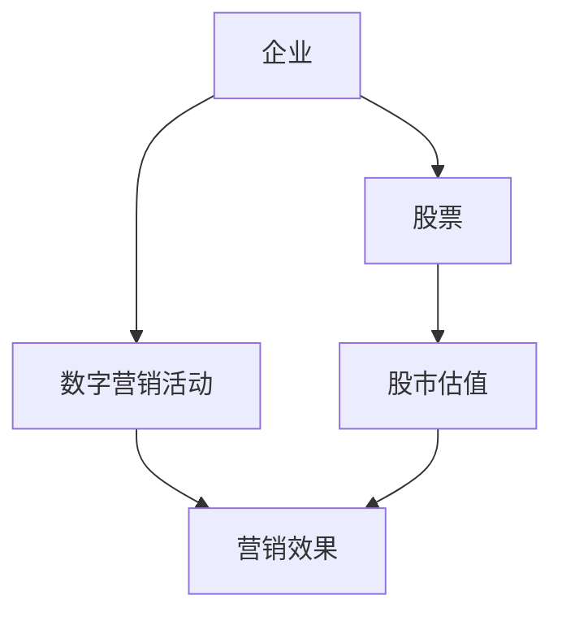
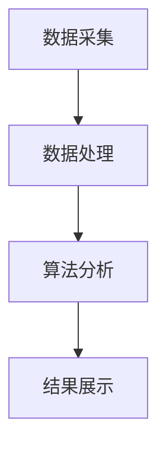

                 


# 股市估值对跨境数字营销效果评估的影响

---

## 关键词：
股市估值、跨境数字营销、营销效果评估、数据驱动、算法模型

---

## 摘要：
本文探讨股市估值对跨境数字营销效果评估的影响，分析股市波动如何通过数据驱动的方式影响营销策略和效果。通过理论分析、算法模型和实际案例，揭示股市估值与数字营销之间的协同关系，为企业提供优化营销效果的策略建议。

---

## 第一部分: 背景介绍

### 第1章: 股市估值与跨境数字营销概述

#### 1.1 股市估值的基本概念
- **定义与原理**：股市估值是通过对企业财务数据的分析，评估其股票的内在价值。主要指标包括市盈率（P/E）、市净率（P/B）、市销率（P/S）等。
- **核心指标**：市盈率反映市场对企业的盈利能力预期，市净率衡量资产价值，市销率则关注收入与股价的关系。
- **影响因素**：宏观经济环境、行业趋势、企业业绩、市场情绪等。

#### 1.2 跨境数字营销的基本概念
- **定义与特点**：跨境数字营销是指通过数字渠道（如社交媒体、搜索引擎、电商平台等）进行跨国营销活动，具有实时性、数据驱动性和全球化的特点。
- **主要模式**：包括搜索引擎营销（SEM）、社交媒体营销（SMM）、内容营销、电子邮件营销等。
- **与传统营销的区别**：数字营销更加精准、可衡量，且能够实时调整策略。

#### 1.3 股市估值对跨境数字营销的影响
- **关联性**：股市波动影响企业的营销预算和投资决策，进而影响数字营销活动的效果。
- **影响机制**：股市估值通过影响企业的资金流动、广告支出和市场信心，间接影响数字营销的策略和效果。

---

### 第2章: 股市估值与跨境数字营销的核心概念与联系

#### 2.1 股市估值的核心概念
- **市盈率（P/E Ratio）**：公式为 $P/E = \text{股价} / \text{每股收益}$，反映市场对企业的盈利预期。
- **市净率（P/B Ratio）**：公式为 $P/B = \text{股价} / \text{每股净资产}$，衡量企业资产的价值。
- **市销率（P/S Ratio）**：公式为 $P/S = \text{股价} / \text{每股收入}$，适用于收入驱动型企业。

#### 2.2 跨境数字营销的核心概念
- **营销效果评估指标**：包括点击率（CTR）、转化率（CR）、投资回报率（ROI）等。
- **数据驱动的营销策略**：通过分析用户行为数据，优化广告投放和内容策略。
- **数字营销技术**：包括AI推荐算法、大数据分析、自然语言处理（NLP）等。

#### 2.3 股市估值与数字营销的联系
- **股市波动对营销预算的影响**：股市上涨可能增加企业的营销支出，而股市下跌可能导致预算缩减。
- **股市估值对营销效果评估的参考价值**：通过分析股市估值的变化，可以预测企业营销活动的效果。
- **协同效应**：数字营销可以提升企业的品牌价值和市场地位，进而影响股市估值。

---

## 第三部分: 核心概念与联系

### 第3章: 股市估值与数字营销的核心概念对比

#### 3.1 对比分析
| 指标 | 股市估值 | 数字营销 |
|------|----------|----------|
| 核心目标 | 评估企业价值 | 提升品牌知名度和销售额 |
| 数据驱动 | 财务数据 | 用户行为数据 |
| 影响因素 | 宏观经济、行业趋势 | 用户需求、市场竞争 |

#### 3.2 实体关系图


---

## 第四部分: 算法原理

### 第4章: 股市估值与数字营销的算法模型

#### 4.1 回归分析模型
- **模型公式**：$y = \beta_0 + \beta_1 x + \epsilon$
  - $y$：营销效果（如转化率）
  - $x$：股市估值指标（如P/E）
  - $\beta$：回归系数
- **应用场景**：通过回归分析，预测股市估值变化对营销效果的影响。

#### 4.2 时间序列分析
- **模型公式**：$y_t = \alpha + \beta y_{t-1} + \gamma x_t + \epsilon_t$
  - $y_t$：当前营销效果
  - $y_{t-1}$：上一期营销效果
  - $x_t$：当前股市估值
- **应用场景**：分析股市估值与营销效果的时序关系。

#### 4.3 代码实现
```python
import pandas as pd
from sklearn.linear_model import LinearRegression

# 数据准备
data = pd.DataFrame({
    'PE': [15, 20, 18, 22],
    'CTR': [2.5, 3.0, 2.8, 3.2]
})

# 模型训练
model = LinearRegression()
model.fit(data[['PE']], data['CTR'])

# 预测
predicted_CTR = model.predict([[17]])
print(predicted_CTR)
```

---

## 第五部分: 系统分析与架构设计

### 第5章: 股市估值与数字营销的系统架构

#### 5.1 系统功能模块
- **数据采集模块**：收集股市估值数据和数字营销数据。
- **数据处理模块**：清洗和预处理数据。
- **算法分析模块**：应用回归分析和时间序列分析模型。
- **结果展示模块**：可视化分析结果。

#### 5.2 系统架构图


---

## 第六部分: 项目实战

### 第6章: 股市估值对数字营销效果的实战分析

#### 6.1 实战环境
- **工具**：Python、Pandas、Scikit-learn
- **数据来源**：A股市场和美股市场的历史数据

#### 6.2 核心代码实现
```python
import pandas as pd
import numpy as np
from sklearn.metrics import mean_squared_error

# 数据加载
a股_data = pd.read_csv('a_stocks.csv')
us_data = pd.read_csv('us_stocks.csv')

# 数据处理
a股_data['PE'] = a股_data['收盘价'] / a股_data['每股收益']
us_data['PE'] = us_data['收盘价'] / us_data['每股收益']

# 回归分析
from sklearn.linear_model import LinearRegression

model = LinearRegression()
model.fit(a股_data[['PE']], a股_data['CTR'])

# 预测与评估
predicted_CTR = model.predict(us_data[['PE']])
mse = mean_squared_error(us_data['CTR'], predicted_CTR)
print(f"均方误差: {mse}")
```

---

## 第七部分: 最佳实践与总结

### 第7章: 最佳实践与总结

#### 7.1 最佳实践
- **数据驱动决策**：定期分析股市估值变化，优化数字营销策略。
- **技术应用**：利用AI和大数据技术，提高营销效果预测的准确性。
- **动态调整**：根据股市波动，灵活调整营销预算和策略。

#### 7.2 总结
股市估值与跨境数字营销的结合为企业提供了新的视角和工具，通过数据驱动的方式，企业可以更好地应对市场波动，优化营销效果。

---

## 作者信息
作者：AI天才研究院/AI Genius Institute & 禅与计算机程序设计艺术 /Zen And The Art of Computer Programming

