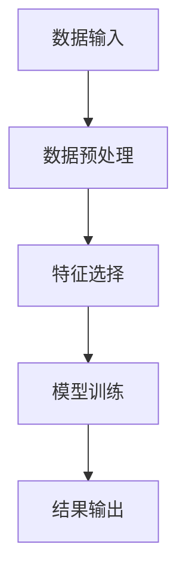
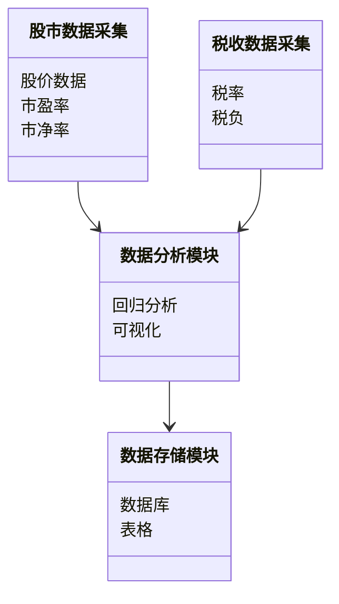
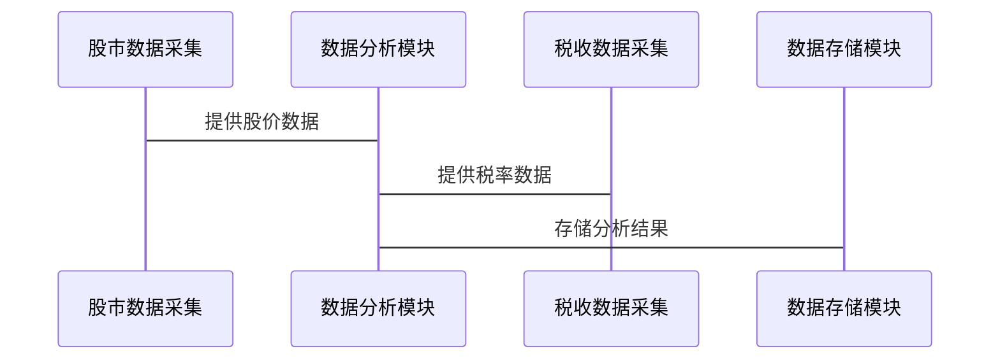

                 


# 股市估值对跨境电子商务税收的影响

> 关键词：股市估值、跨境电子商务、税收影响、相互作用、政策优化

> 摘要：本文系统地分析了股市估值对跨境电子商务税收的具体影响路径，探讨了两者之间的相互作用机制，并提出了优化跨境电商税收政策的建议。通过结合股市估值的核心原理与跨境电商税收的主要形式，本文深入剖析了股市波动对跨境电商企业税负的具体影响，以及税收政策对股市估值的反向影响。最后，本文从系统设计与实战案例的角度，提供了基于Python的分析方法，为政策制定者和企业提供实践指导。

---

## 第一部分：背景介绍

### 第1章：股市估值与跨境电子商务税收概述

#### 1.1 问题背景

股市估值是衡量企业价值的重要指标，而跨境电子商务作为新兴的商业模式，其税收问题备受关注。随着全球贸易的数字化，跨境电商企业的估值和税收政策之间的关系日益紧密。股市波动可能直接影响跨境电商企业的税负，而税收政策的变化也可能反过来影响企业的估值。

#### 1.2 问题描述

1. 股市波动如何影响跨境电商企业的税负？  
2. 税收政策变化如何影响企业的估值？  
3. 两者之间的相互作用机制是什么？  
4. 如何优化跨境电商税收政策以应对股市波动的影响？

#### 1.3 问题解决

通过分析股市估值的核心指标（如市盈率、市净率等）与跨境电商税收的主要形式（如增值税、关税等），本文提出以下解决方案：  
- 建立股市估值与跨境电商税收的数学模型，量化两者之间的关系。  
- 提出基于股市波动的税收政策优化建议，以降低企业税负并稳定股市估值。

#### 1.4 边界与外延

- 本研究仅关注股市估值与跨境电商税收的直接关系，不涉及其他间接因素（如汇率波动）。  
- 研究范围限定在主要跨境电商平台（如亚马逊、 eBay、Shopify）及其相关税收政策。

#### 1.5 概念结构与核心要素

- 股市估值：市盈率、市净率、股息率等核心指标。  
- 跨境电子商务税收：增值税、关税、所得税等主要形式。  
- 两者关系：股市波动→企业税负变化→企业估值调整。

---

## 第二部分：核心概念与联系

### 第2章：股市估值的核心原理

#### 2.1 股市估值的原理

- **市盈率（P/E Ratio）**：公式为 $$ \text{市盈率} = \frac{\text{股价}}{\text{每股净利润}} $$。市盈率反映了市场对公司未来盈利的预期，是衡量企业估值的重要指标。  
- **市净率（P/B Ratio）**：公式为 $$ \text{市净率} = \frac{\text{股价}}{\text{每股净资产}} $$。市净率适用于重资产行业的估值，如金融、制造等。  
- **股息率（Dividend Yield）**：公式为 $$ \text{股息率} = \frac{\text{每股股息}}{\text{股价}} $$。股息率反映了企业分红能力，是投资者关注的重要指标。

#### 2.2 股市估值的关键因素

- **宏观经济因素**：GDP增长率、利率水平、通货膨胀等。  
- **行业因素**：行业竞争格局、政策变化等。  
- **公司基本面因素**：收入、利润、资产负债表等。

#### 2.3 股市估值与企业价值的关系

- 股市估值是市场对企业价值的反映，但两者并不完全一致。  
- 企业价值公式：$$ \text{企业价值} = \text{股权价值} + \text{债务价值} $$。  
- 股市估值偏差的原因：市场情绪、信息不对称等。

### 第3章：跨境电商税收的核心原理

#### 3.1 跨境电子商务税收的定义

- 跨境电子商务：通过互联网进行的商品或服务跨国交易。  
- 跨境电子商务税收：针对跨境电商交易的增值税、关税、所得税等。

#### 3.2 跨境电子商务税收的主要形式

- **增值税（VAT）**：跨境电商商品在进口时需缴纳增值税，税率因国家而异。  
- **关税**：根据商品类别和价格征收不同税率的关税。  
- **所得税**：跨境电商企业的利润需缴纳企业所得税。

#### 3.3 跨境电子商务税收的征收难点

- **税收管辖权**：跨境电商涉及多个司法管辖区，如何确定税收管辖权是难点。  
- **信息不对称**：平台交易数据难以获取，导致税务机关难以准确征税。  
- **政策差异**：不同国家的税收政策差异大，增加了企业的合规难度。

---

## 第三部分：股市估值与跨境电商税收的相互影响

### 第4章：股市波动对跨境电商税收的影响

#### 4.1 股市波动如何影响跨境电商企业的税负

- 股市波动可能导致企业收入下降，进而影响其税务负担。  
- 股价下跌可能引发企业裁员或缩减业务，进一步减少税基。

#### 4.2 税收政策对股市估值的反向影响

- 税收优惠政策可以提升企业的净利润，从而提高市盈率和市净率。  
- 税率上升可能导致企业估值下降，股价下跌。

---

## 第四部分：算法原理讲解

### 第5章：股市估值与跨境电商税收的数学模型

#### 5.1 算法原理

- 使用回归分析模型，量化股市波动对跨境电商税收的影响。  
- 模型公式：$$ \text{税负变化} = \beta_1 \times \text{股价波动} + \beta_2 \times \text{税率变化} + \epsilon $$。

#### 5.2 算法实现

```python
import pandas as pd
import numpy as np
from sklearn.linear_model import LinearRegression

# 假设data为包含股价波动和税率变化的数据框
# 标签为税负变化
model = LinearRegression()
model.fit(data[['股价波动', '税率变化']], data['税负变化'])
print(model.coef_)
```

#### 5.3 算法流程图



---

## 第五部分：系统分析与架构设计

### 第6章：系统功能设计

#### 6.1 系统架构



#### 6.2 系统接口设计



---

## 第六部分：项目实战

### 第7章：实战案例分析

#### 7.1 环境安装

```bash
pip install pandas numpy matplotlib
```

#### 7.2 核心代码实现

```python
import pandas as pd
import matplotlib.pyplot as plt

# 数据加载
data = pd.read_csv('cross_border_tax.csv')

# 数据分析
model = LinearRegression()
model.fit(data[['股价波动', '税率变化']], data['税负变化'])
print(f"系数为：{model.coef_}")

# 可视化
plt.scatter(data['股价波动'], data['税负变化'])
plt.plot(data['股价波动'], model.predict(data[['股价波动', '税率变化']]), color='red')
plt.xlabel('股价波动')
plt.ylabel('税负变化')
plt.show()
```

---

## 第七部分：总结与展望

### 第8章：总结

#### 8.1 小结

- 股市波动与跨境电商税收相互影响，构建数学模型是关键。  
- 税收政策的优化可以降低企业税负，稳定股市估值。

#### 8.2 注意事项

- 数据采集的准确性和完整性至关重要。  
- 模型需要根据实际数据不断调整和优化。

#### 8.3 拓展阅读

- 《税收政策与企业估值》  
- 《跨境电商税收优化策略》

---

作者：AI天才研究院 & 禅与计算机程序设计艺术

