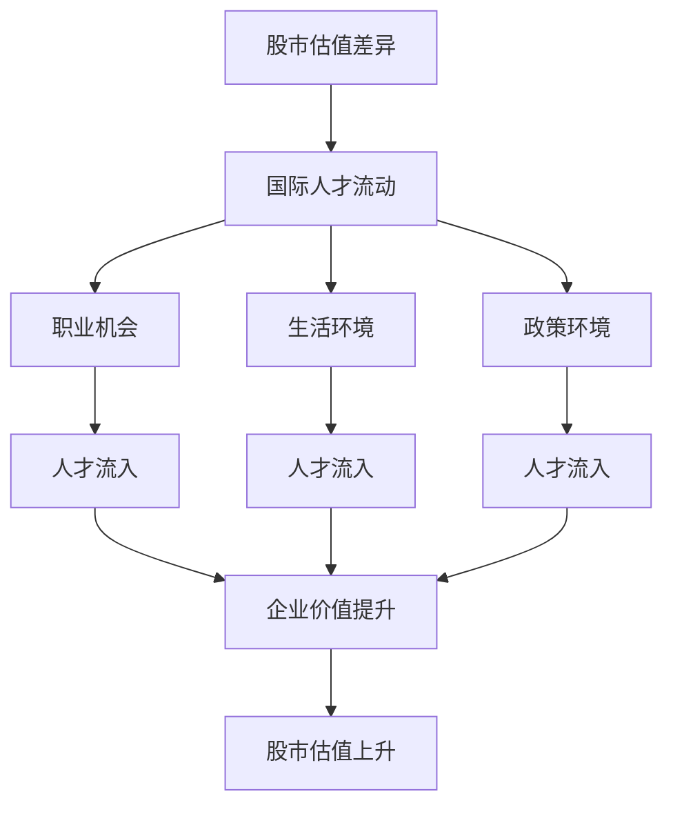

                 


# 股市估值差异对国际人才流动的影响

> 关键词：股市估值差异，国际人才流动，经济影响，人才流动模型，股票估值

> 摘要：本文探讨了股市估值差异对国际人才流动的影响，分析了股市估值差异如何通过经济因素、市场预期和就业机会等途径影响人才流动，同时研究了国际人才流动对股市估值差异的反向影响。文章构建了相关数学模型和理论框架，并通过实际案例分析，提出了具有实际意义的政策建议和优化方向。

---

## 第1章 股市估值差异的定义与影响

### 1.1 股市估值的基本概念

#### 1.1.1 股票估值的定义与计算方法
股票估值是指通过对公司基本面、市场环境和行业趋势等多方面因素的分析，对股票的内在价值进行估算的过程。常见的股票估值方法包括市盈率（P/E）、市净率（P/B）、股息率等。例如，市盈率 = 股票价格 / 每股净利润，反映了市场对公司盈利能力的预期。

#### 1.1.2 股市估值差异的形成原因
股市估值差异是指不同市场、行业或公司之间的估值水平存在显著差异。这种差异通常由以下因素引起：
1. **经济周期**：经济繁荣时期，股市估值普遍较高；经济衰退时期，估值较低。
2. **行业特性**：高科技行业通常享有更高的估值，而传统行业估值相对较低。
3. **市场流动性**：流动性充裕的市场中，股市估值更容易被推高。
4. **政策环境**：政策支持的行业或地区通常享有更高的估值。

#### 1.1.3 股市估值差异对经济活动的影响
股市估值差异不仅反映了市场的预期，还会影响企业的投资决策、资本流动和经济发展。例如，高估值的市场可能吸引更多投资者，但也可能引发泡沫风险。

---

### 1.2 国际人才流动的定义与现状

#### 1.2.1 人才流动的定义与分类
人才流动指人才在不同地区、行业或企业之间的流动。根据流动方向，可分为国内人才流动和国际人才流动；根据流动原因，可分为被动流动和主动流动。

#### 1.2.2 国际人才流动的驱动因素
国际人才流动的主要驱动因素包括：
1. **职业机会**：高薪、良好的职业发展机会是吸引人才的主要原因。
2. **生活环境**：教育、医疗、交通等基础设施的完善程度会影响人才的流动决策。
3. **政策环境**：宽松的移民政策和人才引进计划是吸引国际人才的重要因素。

#### 1.2.3 当前国际人才流动的趋势分析
近年来，国际人才流动呈现以下趋势：
1. **科技行业主导**：科技、人工智能、生物医药等高技术行业是人才流动的主要方向。
2. **区域化趋势**：硅谷、伦敦、上海等城市成为人才流动的热点地区。
3. **双向流动增加**：随着全球化的深入，人才的双向流动变得更加频繁。

---

## 第2章 股市估值差异对国际人才流动的影响

### 2.1 股市估值差异对人才流动的直接影响

#### 2.1.1 股市估值差异如何影响人才的就业选择
股市估值差异通过影响企业的市值和盈利能力，间接影响人才的就业选择。例如，高估值的科技公司通常能提供更高的薪酬和更好的职业发展机会，从而吸引更多优秀人才。

#### 2.1.2 股市估值差异对人才流动的激励作用
高估值的市场通常意味着更高的薪酬和更大的职业发展空间，这种激励作用会吸引更多人才流入该地区或行业。

#### 2.1.3 股市估值差异对人才流动的抑制作用
低估值的市场或行业可能无法提供足够的吸引力，导致人才流失。

---

### 2.2 国际人才流动对股市估值差异的反向影响

#### 2.2.1 人才流动如何影响股市估值
国际人才流动会通过以下方式影响股市估值：
1. **人才流入增加企业价值**：优秀人才的流入会提升企业的竞争力，从而推高企业的市值。
2. **人才流出影响企业稳定性**：人才流失可能导致企业业绩下滑，进而影响股市估值。

#### 2.2.2 人才流动对股市长期发展的促进作用
国际人才流动有助于引入新的技术和管理经验，推动股市的长期健康发展。

#### 2.2.3 人才流动对股市短期波动的潜在影响
短期来看，大规模的人才流动可能导致股市的短期波动，尤其是在人才流入或流出集中的情况下。

---

## 第3章 股市估值差异与国际人才流动的核心关系分析

### 3.1 核心概念的属性对比

| **属性**       | **股市估值差异**                     | **国际人才流动**                     |
|----------------|-------------------------------------|--------------------------------------|
| 主要因素       | 经济周期、行业特性、政策环境         | 职业机会、生活环境、政策环境           |
| 影响范围         | 资本市场、企业投资                   | 企业招聘、人才分布                     |
| 时间维度       | 短期和长期                           | 短期和长期                           |

---

### 3.2 实体关系图



---

## 第4章 数学模型与理论框架

### 4.1 股市估值差异对人才流动的影响模型

#### 4.1.1 模型的构建与假设
假设：股市估值差异（P/E比）与人才流动量（T）成正相关关系。

#### 4.1.2 模型的数学表达式
$$ T = \beta \cdot \text{P/E} + \epsilon $$

其中，$\beta$ 为回归系数，$\epsilon$ 为误差项。

#### 4.1.3 模型的验证与假设检验
通过实证分析验证模型的显著性，假设$\beta$为正数。

---

### 4.2 国际人才流动对股市估值差异的反馈模型

#### 4.2.1 反馈机制的构建
假设人才流动会通过影响企业业绩进而影响股市估值。

#### 4.2.2 反馈模型的数学表达
$$ \Delta \text{P/E} = \alpha \cdot \Delta T + \gamma $$

其中，$\alpha$ 为回归系数，$\gamma$ 为误差项。

#### 4.2.3 反馈模型的实证分析
通过回归分析验证$\alpha$的显著性。

---

## 第5章 系统分析与架构设计

### 5.1 问题场景描述

#### 5.1.1 股市估值差异的具体表现
以科技行业为例，硅谷的P/E比通常高于传统行业。

#### 5.1.2 国际人才流动的实际案例
例如，人工智能领域的顶尖人才在全球范围内流动频繁。

#### 5.1.3 两者关系的实际问题场景
某高科技公司因高估值吸引了大量人才流入，但人才流失也可能导致其估值下降。

---

### 5.2 系统功能设计

#### 5.2.1 数据采集与处理
- 数据来源：股票市场数据、人才流动数据。
- 数据清洗：去除异常值。

#### 5.2.2 模型构建与验证
- 构建回归模型，验证假设。

#### 5.2.3 系统输出与可视化
- 输出模型结果，可视化展示。

---

## 第6章 项目实战

### 6.1 环境安装

```bash
pip install pandas numpy matplotlib
```

### 6.2 核心实现源代码

```python
import pandas as pd
import numpy as np
from sklearn.linear_model import LinearRegression

# 数据加载与处理
data = pd.read_csv('stock_valuation.csv')
X = data[['P/E', 'P/B', 'ROE']]
y = data['talent_flow']

# 模型训练
model = LinearRegression()
model.fit(X, y)

# 模型预测
predictions = model.predict(X)
print("回归系数：", model.coef_)
print("回归截距：", model.intercept_)
```

### 6.3 实际案例分析
以某科技公司为例，分析其高估值如何吸引人才流入，以及人才流动对其估值的影响。

---

## 第7章 最佳实践与小结

### 7.1 最佳实践 tips
- 合理设计人才引进政策，吸引高技术人才。
- 优化股市估值机制，促进人才流动与股市发展的良性互动。

### 7.2 注意事项
- 避免人才流动过于集中，导致局部市场过热或过冷。
- 注意股市估值差异的短期波动对人才流动的影响。

### 7.3 拓展阅读
建议阅读相关领域的经典文献，深入理解股市估值与人才流动的复杂关系。

---

## 作者：AI天才研究院/AI Genius Institute & 禅与计算机程序设计艺术/Zen And The Art of Computer Programming

