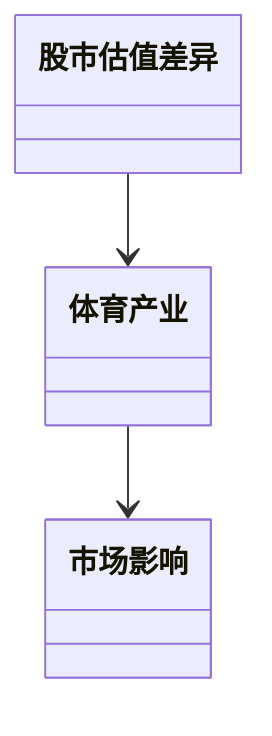
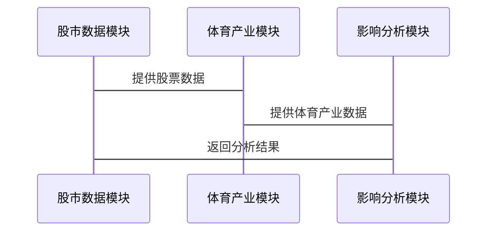

                 


# 股市估值差异对国际体育产业的影响

## 关键词：股市估值差异，国际体育产业，金融市场影响，球队价值，体育经济

## 摘要：  
股市估值差异对国际体育产业的影响是一个复杂而重要的问题。随着体育产业的全球化和金融化，球队、运动员和赛事的市场价值受到股市估值差异的显著影响。本文通过分析股市估值差异的形成机制、对体育产业的具体影响以及实际案例，探讨如何理解和应对这种影响，为体育产业的投资者和管理者提供参考。

---

## 第一部分：背景介绍

### 第1章：股市估值差异的背景与定义

#### 1.1 股市估值的基本概念
- 股票估值的定义与方法：股票估值是通过对企业财务状况、行业地位、盈利能力等多方面因素进行分析，确定其市场价值的过程。常见的估值方法包括市盈率（P/E）、市净率（P/B）、现金流折现法（DCF）等。
- 股市估值差异的形成原因：由于信息不对称、市场情绪、投资者预期等因素，不同投资者对同一资产的估值可能存在差异。
- 股市估值差异对市场的实际影响：估值差异可能导致资产价格波动，影响市场的资源配置效率。

#### 1.2 国际体育产业的现状与特点
- 体育产业的全球化发展：国际体育产业涵盖球队、运动员、赛事等多个方面，全球化使得体育经济更加复杂。
- 体育产业的主要参与者与市场结构：包括职业联赛、俱乐部、运动员、赛事转播商、赞助商等。
- 体育产业的经济价值与增长潜力：体育产业的市场规模庞大，且持续增长，吸引了大量投资者的关注。

---

### 第2章：股市估值差异对体育产业的影响背景

#### 2.1 股市估值差异的经济意义
- 估值差异对投资者决策的影响：投资者根据估值差异做出买入、卖出或持观望的决策。
- 估值差异对市场资源配置的作用：高估或低估可能导致资源错配，影响企业的实际运营。
- 估值差异与企业价值的关系：合理估值有助于企业融资和扩张，而估值差异可能导致企业价值的误判。

#### 2.2 体育产业与金融市场的关联性
- 体育产业的金融化趋势：越来越多的体育企业和运动员选择上市融资，吸引了资本市场的关注。
- 体育企业上市的现状与特点：部分球队或体育公司选择在股市上市，利用资本市场的资金支持发展。
- 体育产业与股市的互动关系：股市估值差异直接影响体育企业的市场表现，而体育产业的动态也反过来影响股市。

---

## 第二部分：核心概念与联系

### 第3章：股市估值差异的核心概念与原理

#### 3.1 估值差异的形成机制
- 市场情绪与投资者预期的作用：投资者情绪波动可能导致估值差异的扩大或缩小。
- 企业基本面与财务表现的影响：企业的盈利能力、资产负债情况等基本面因素直接影响估值。
- 行业周期与宏观经济环境的关联：宏观经济环境和行业周期的变化会影响整个体育产业的估值。

#### 3.2 体育产业的特殊性与估值差异
- 体育产业的无形资产特性：球队品牌价值、运动员影响力等无形资产难以量化，导致估值差异。
- 体育明星与球队的市场价值：明星运动员的转会费和球队整体估值往往受到市场情绪和品牌效应的影响。
- 体育赛事的经济杠杆效应：重大赛事的举办可能显著影响相关企业的估值。

---

### 第4章：核心概念的对比分析与ER实体关系图

#### 4.1 估值差异的核心概念对比
- 股市估值与企业价值的对比：股市估值是市场对企业的定价，而企业价值是其实际的经济价值。
- 体育产业与传统制造业的估值差异：体育产业的无形资产和高波动性导致估值差异更大。
- 不同市场环境下的估值差异：牛市和熊市环境下，估值差异的表现方式不同。

#### 4.2 ER实体关系图
```mermaid
er
  acto
```

---

## 第三部分：系统分析与架构设计方案

### 第5章：系统功能设计与架构图

#### 5.1 问题场景介绍
- 通过分析股市数据和体育产业的市场动态，构建一个模型，量化估值差异对体育产业的影响。

#### 5.2 项目介绍
- 项目名称：股市估值差异对国际体育产业的影响分析
- 项目目标：量化估值差异对体育产业的具体影响，提出应对策略。

#### 5.3 系统功能设计（领域模型）


#### 5.4 系统架构设计


#### 5.5 系统接口设计
- 接口1：股市数据接口，用于获取相关股票数据。
- 接口2：体育产业数据接口，用于获取球队和运动员的市场估值。

#### 5.6 系统交互设计


---

## 第四部分：项目实战

### 第6章：环境安装与核心实现

#### 6.1 环境安装
- 安装Python和相关库（如pandas、numpy、matplotlib）。
- 数据获取：从公开数据源获取股市和体育产业的相关数据。

#### 6.2 核心实现代码
```python
import pandas as pd
import numpy as np
import matplotlib.pyplot as plt

# 示例：计算球队的估值差异
def calculate_valuation_difference(team_data):
    market_valuation = team_data['market_value']
    book_value = team_data['book_value']
    valuation_diff = market_valuation - book_value
    return valuation_diff

# 数据加载与处理
data = pd.read_csv('sports_market_data.csv')
valuation_diff = calculate_valuation_difference(data)
plt.hist(valuation_diff, bins=10)
plt.title('Valuation Difference Distribution')
plt.xlabel('Valuation Difference')
plt.ylabel('Frequency')
plt.show()
```

---

### 第7章：案例分析与结果解读

#### 7.1 案例分析
- 案例：某国际足球俱乐部的上市与股价波动。
- 数据分析：分析该俱乐部上市后的股价走势与球队表现的相关性。

#### 7.2 结果解读
- 股价波动与球队表现的高度相关性。
- 市场情绪对球队估值的影响显著。

---

## 第五部分：结论与展望

### 第8章：结论与展望

#### 8.1 研究结论
- 股市估值差异显著影响国际体育产业的市场表现。
- 体育产业的特殊性导致估值差异更加明显。

#### 8.2 研究的局限性
- 数据获取的限制：部分体育产业数据不公开或难以量化。
- 模型的简化：实际市场中影响估值差异的因素更多，模型需要进一步优化。

#### 8.3 未来研究方向
- 探讨更多影响估值差异的因素，如政策变化、技术进步等。
- 提出更精准的估值模型，帮助投资者做出更好的决策。

---

## 作者：AI天才研究院/AI Genius Institute & 禅与计算机程序设计艺术 /Zen And The Art of Computer Programming

---

以上是《股市估值差异对国际体育产业的影响》的技术博客大纲和内容。通过逐步分析和详细阐述，本文旨在为读者提供一个全面的视角，理解股市估值差异对国际体育产业的具体影响，并为相关领域的研究和实践提供参考。

