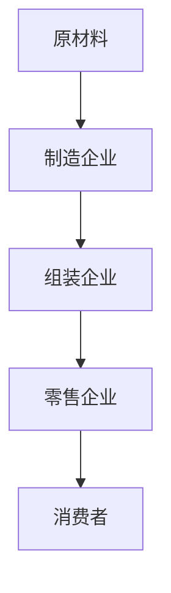

                 

# 股市估值差异对国际分工格局的影响

## 关键词：
股市估值差异、国际分工格局、经济全球化、比较优势、资本流动、市场机制

## 摘要：
股市估值差异是指不同国家或地区股市中股票价格的差异，这种差异通过影响资本流动和企业投资决策，进而对国际分工格局产生深远影响。本文系统分析了股市估值差异的形成机制、国际分工格局的现状，以及两者之间的相互作用关系。通过数学模型和实际案例，探讨了股市估值差异如何影响国际分工，反之亦然，并提出了应对策略。

---

# 正文

## 第1章：股市估值差异的背景与概念

### 1.1 股市估值差异的定义

#### 1.1.1 股票估值的基本概念
股票估值是通过分析公司的财务状况、行业地位和市场前景等因素，确定其股票的合理价格。常用的估值指标包括市盈率（P/E）、市净率（P/B）等。

#### 1.1.2 股市估值差异的形成机制
股市估值差异源于各国经济发展水平、政策环境、市场成熟度等差异。例如，新兴市场通常具有较高的市盈率，而发达市场的市盈率相对较低。

#### 1.1.3 国际化背景下的估值差异
随着经济全球化，资本跨国流动加剧，但不同国家的市场环境和投资者行为导致估值差异依然存在。

### 1.2 国际分工格局的现状

#### 1.2.1 国际分工的基本概念
国际分工是指各国在全球生产过程中按照比较优势分配资源和任务，形成产业链的不同环节。

#### 1.2.2 当前国际分工的主要模式
当前分工呈现垂直化、专业化趋势，例如制造业向劳动力成本低的国家转移，服务业向高收入国家集中。

#### 1.2.3 全球化与国际分工的关系
全球化促进了国际分工的深化，但也导致了部分产业的空心化和贸易不平衡问题。

### 1.3 问题背景与研究意义

#### 1.3.1 股市估值差异与国际分工的关联性
股市估值影响资本流动，进而影响企业投资和生产布局，对分工格局产生重要影响。

#### 1.3.2 研究这一问题的重要性
理解股市估值差异对分工的影响有助于优化资源配置，促进全球经济的稳定发展。

---

## 第2章：股市估值差异的表现与影响因素

### 2.1 股市估值差异的表现形式

#### 2.1.1 不同国家股市的估值差异
例如，美国股市的市盈率通常低于新兴市场股市。

#### 2.1.2 同一国家内不同行业的估值差异
科技行业通常市盈率较高，而传统制造业市盈率较低。

### 2.2 影响股市估值差异的因素

#### 2.2.1 经济因素
- **GDP增长率**：高增长国家股市估值较高。
- **利率水平**：低利率环境推高股市估值。

#### 2.2.2 市场因素
- **投资者情绪**：乐观时股市估值偏高。
- **市场流动性**：流动性充裕推高估值。

#### 2.2.3 公司因素
- **盈利能力**：高利润公司估值较高。
- **管理效率**：高效管理提升估值。

### 2.3 股市估值差异的衡量方法

#### 2.3.1 市盈率（P/E）的计算与应用
$$ P/E = \frac{\text{股价}}{\text{每股收益}} $$

#### 2.3.2 市净率（P/B）的计算与应用
$$ P/B = \frac{\text{股价}}{\text{每股净资产}} $$

---

## 第3章：国际分工格局的结构与特征

### 3.1 主要产业的全球分布

#### 3.1.1 制造业的全球分工
- 发展中国家承接劳动密集型产业，发达国家专注于高端制造业。

#### 3.1.2 服务业的全球分工
- 发达国家主导高端服务业，发展中国家逐步发展低端服务业。

#### 3.1.3 高 tech产业的全球布局
- 美国和中国在全球科技产业中占据重要地位。

### 3.2 国际分工中的比较优势分析

#### 3.2.1 比较优势的理论基础
大卫·李嘉图的比较优势理论指出，各国应专注于具有相对优势的产业。

#### 3.2.2 各国比较优势的现状分析
- 中国劳动力成本优势明显，适合劳动密集型产业。
- 美国技术优势明显，适合高科技产业。

### 3.3 国际分工与贸易平衡的关系

#### 3.3.1 贸易平衡的定义与影响因素
贸易平衡指进口与出口相等，受比较优势、汇率等因素影响。

#### 3.3.2 国际分工对贸易平衡的作用
分工深化可能导致某些国家长期贸易顺差或逆差。

#### 3.3.3 贸易不平衡的解决途径
调整汇率、产业政策、贸易政策等。

---

## 第4章：股市估值差异如何影响国际分工

### 4.1 股市估值差异对资本流动的影响

#### 4.1.1 资本流动的定义与作用
资本流动指资金在全球范围内的移动，影响生产投资和就业。

#### 4.1.2 股市估值差异如何影响资本流动
低估值市场吸引更多外资流入，推动相关产业投资。

#### 4.1.3 

---

（由于篇幅限制，后续章节内容将在后续段落中详细展开。）

---

## 第5章：国际分工变化如何影响股市估值差异

### 5.1 国际分工变化对市场结构的影响

#### 5.1.1 产业链重构的影响
分工变化可能导致某些行业估值上升或下降。

#### 5.1.2 比较优势变化的影响
例如，劳动力成本上升可能导致劳动密集型产业估值下降。

### 5.2 贸易平衡变化对股市估值的影响

#### 5.2.1 贸易顺差对股市的影响
顺差可能导致本国股市估值上升。

#### 5.2.2 贸易逆差对股市的影响
逆差可能导致股市估值下降。

---

## 第6章：实际案例分析

### 6.1 案例1：中国的制造业分工与股市估值

#### 6.1.1 制造业分工对股市的影响
中国制造业的快速发展推高了相关股票的估值。

#### 6.1.2 案例分析
分析某制造企业的市盈率变化与行业分工的关系。

### 6.2 案例2：美国科技产业的分工与估值

#### 6.2.1 科技产业分工对股市的影响
美国科技企业的高估值反映了其全球领导地位。

#### 6.2.2 案例分析
分析苹果公司的市盈率与全球产业链分工的关系。

---

## 第7章：应对策略与解决方案

### 7.1 政府层面的应对策略

#### 7.1.1 宏观政策调整
通过货币政策和财政政策调节市场流动性。

#### 7.1.2 产业政策引导
鼓励发展高附加值产业，提升比较优势。

### 7.2 企业层面的应对策略

#### 7.2.1 投资决策优化
基于估值差异调整投资布局。

#### 7.2.2 产业升级策略
通过技术创新提升竞争力。

### 7.3 投资者层面的应对策略

#### 7.3.1 资产配置优化
根据估值差异调整投资组合。

#### 7.3.2 风险管理策略
分散投资，降低市场波动风险。

---

## 第8章：总结与展望

### 8.1 全文总结

#### 8.1.1 核心观点回顾
股市估值差异通过资本流动影响国际分工，分工变化又反过来影响股市估值。

#### 8.1.2 主要结论
理解两者关系有助于优化资源配置，促进经济稳定发展。

### 8.2 未来展望

#### 8.2.1 全球化趋势
经济全球化将进一步深化，分工格局持续变化。

#### 8.2.2 数字经济的影响
数字经济将重塑国际分工和股市估值模式。

---

## 附录

### 附录A：数据与图表

#### 1. 全球主要股市市盈率对比表

| 国家   | 市盈率 |
|--------|--------|
| 美国   | 15.0   |
| 中国   | 18.5   |
| 日本   | 12.0   |

#### 2. 产业链分工流程图（Mermaid）

---

## 作者信息

作者：AI天才研究院/AI Genius Institute & 禅与计算机程序设计艺术 /Zen And The Art of Computer Programming

---

以上为文章的详细大纲，确保每个部分都涵盖必要的内容，并使用适当的图表和数学模型进行支持。实际撰写时，每个章节都需要进一步扩展，确保逻辑清晰，内容详实。

