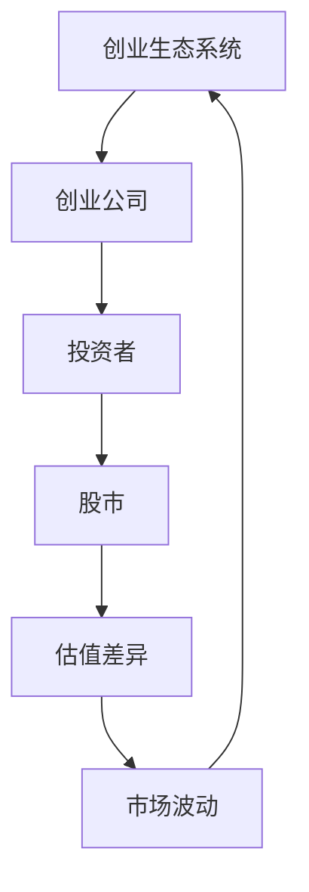

                 

# 股市估值差异对国际创业生态系统的影响

> 关键词：股市估值差异、国际创业生态系统、投资分析、市场波动、创业融资、企业价值评估

> 摘要：本文探讨了股市估值差异对国际创业生态系统的影响，从定义、背景、影响机制、案例分析到解决方案，系统性地分析了股市估值差异如何影响创业公司的融资、市场扩展和整体生态系统的稳定性。文章结合理论与实际案例，深入剖析了创业生态系统与股市之间的复杂关系，并提出了优化建议。

---

## 第一部分：背景与核心概念

### 第1章：股市估值差异与国际创业生态系统概述

#### 1.1 股市估值差异的定义与特征
- **1.1.1 股市估值的基本概念**  
  股市估值是衡量企业价值的重要指标，常用的估值方法包括市盈率（P/E）、市净率（P/B）和市销率（P/S）。  
  $$ P/E = \frac{\text{股票价格}}{\text{每股收益}} $$
  
- **1.1.2 估值差异的形成机制**  
  估值差异源于市场信息不对称、投资者情绪波动和宏观经济环境变化。例如，科技初创企业在早期阶段由于未来盈利的不确定性，往往面临较高的估值差异。

- **1.1.3 创业生态系统的核心要素**  
  创业生态系统由创业者、投资者、孵化器、政府政策和市场环境等多个要素构成，其中资金流动是连接股市估值差异与创业生态系统的重要纽带。

#### 1.2 国际创业生态系统的构成
- **1.2.1 创业生态系统的定义**  
  创业生态系统是指支持创业活动的所有内外部因素的集合，包括资源、网络、文化和政策环境。

- **1.2.2 创业生态系统的多维度特征**  
  创业生态系统具有多层次性（如初创期、成长期、成熟期）、多区域性和多样性（如科技、医疗、金融等领域）。

- **1.2.3 创业生态系统与股市的关联性**  
  创业生态系统的健康运行依赖于股市的流动性和估值合理性，而股市则通过融资功能支持创业生态的发展。

#### 1.3 问题背景与研究意义
- **1.3.1 股市估值差异的现状分析**  
  近年来，科技行业的高估值现象频发，特别是在独角兽企业和初创公司中，估值差异显著。

- **1.3.2 创业生态系统面临的挑战**  
  创业公司面临融资难、估值不公、市场波动大等问题，尤其是在全球经济下行压力下，这些问题更加凸显。

- **1.3.3 研究的理论与实践价值**  
  本研究从理论和实践两个层面探讨股市估值差异对创业生态系统的影响，旨在为政策制定者和投资者提供参考。

---

## 第2章：股市估值差异的核心概念

#### 2.1 股市估值的主要指标
- **2.1.1 市盈率（P/E）**  
  P/E = 股票价格 / 每股收益，反映了市场对公司的盈利能力预期。例如，若某公司股价为50元，每股收益为5元，则P/E为10。

- **2.1.2 市净率（P/B）**  
  P/B = 股票价格 / 每股净资产，适用于重资产行业，如银行和房地产。

- **2.1.3 市销率（P/S）**  
  P/S = 股票价格 / 每股收入，适用于高增长、高负债行业，如互联网公司。

#### 2.2 创业生态系统中的资金流动
- **2.2.1 创业融资的主要渠道**  
  创业融资包括风险投资（VC）、天使投资、 crowdfunding 和政府补贴等。

- **2.2.2 风险投资与创业公司的关系**  
  风险投资通过股权融资支持创业公司，但在高估值市场中，投资回报周期可能延长。

- **2.2.3 创业板与主板市场的差异**  
  创业板主要服务于高成长性企业，而主板市场更倾向于成熟企业，两者在估值标准和流动性上存在显著差异。

#### 2.3 股市估值差异的成因分析
- **2.3.1 市场供需关系**  
  在科技行业，高增长预期导致投资者抬高估值，尤其是在IPO前的私募轮融资中。

- **2.3.2 信息不对称问题**  
  初创公司由于缺乏公开财务数据，投资者难以准确评估其真实价值，导致估值偏差。

- **2.3.3 宏观经济环境的影响**  
  经济下行可能导致股市整体估值下降，进而影响创业公司的融资能力。

---

## 第3章：股市估值差异与创业生态系统的核心联系

#### 3.1 创业公司上市的估值挑战
- **3.1.1 初创期企业的估值难题**  
  初创企业通常没有稳定的收入来源，导致估值难以准确衡量。

- **3.1.2 成熟期企业的估值变化**  
  随着企业进入成熟期，市场对企业的估值可能从高增长导向向稳健收益导向转变。

- **3.1.3 不同行业估值差异的特殊性**  
  例如，科技行业普遍采用“故事”驱动的高估值，而传统制造行业更注重资产价值。

#### 3.2 股市波动对创业生态系统的影响
- **3.2.1 股市熊市对创业公司的影响**  
  在熊市中，创业公司的融资难度增加，投资者可能推迟或取消投资计划。

- **3.2.2 股市牛市对创业公司的推动作用**  
  在牛市中，高估值吸引更多的风险投资，推动创业公司快速扩张。

- **3.2.3 创业板市场的特殊性**  
  创业板市场的高波动性使得创业公司的估值容易受到短期市场情绪影响。

#### 3.3 创业生态系统中的资金流动与估值差异
- **3.3.1 风险投资的双重角色**  
  风险投资既是创业公司的资金来源，也是股市估值差异的推动者。

- **3.3.2 创业公司上市的估值溢价**  
  高估值的创业公司上市后可能面临股价波动，影响投资者的回报预期。

- **3.3.3 创业生态系统与股市的相互作用**  
  创业生态系统的健康发展依赖于股市的合理估值，而股市的流动性又受到创业公司融资需求的影响。

---

## 第4章：股市估值差异对国际创业生态系统的影响机制

#### 4.1 估值差异对创业公司融资的影响
- **4.1.1 高估值市场的融资优势**  
  高估值市场中，创业公司更容易获得溢价融资，但可能面临未来上市的压力。

- **4.1.2 低估值市场的融资劣势**  
  低估值市场中，创业公司可能因估值过低而难以吸引投资者，影响后续发展。

#### 4.2 估值差异对创业公司扩张的影响
- **4.2.1 高估值市场的扩张动力**  
  高估值市场中，创业公司可能通过快速扩张实现更高的市场估值。

- **4.2.2 低估值市场的扩张限制**  
  低估值市场中，创业公司可能因融资困难而限制扩张步伐。

#### 4.3 估值差异对创业生态系统稳定性的影响
- **4.3.1 高估值市场的泡沫风险**  
  过高的估值可能导致市场泡沫，一旦破裂，会影响整个创业生态系统的稳定性。

- **4.3.2 低估值市场的信心危机**  
  低估值市场可能削弱投资者对创业公司的信心，进而影响整个生态系统的活跃度。

---

## 第5章：国际创业生态系统中的估值差异案例分析

#### 5.1 美国硅谷的科技创业与高估值现象
- **5.1.1 硅谷创业生态的特点**  
  硅谷是全球科技创新的中心，吸引了大量的风险投资和高估值初创公司。

- **5.1.2 美国科技股的高估值现象**  
  以特斯拉为例，其市盈率远高于行业平均水平，反映了市场的高估值预期。

#### 5.2 中国创业生态中的估值差异
- **5.2.1 中国科技企业的高估值现状**  
  如字节跳动、滴滴等独角兽企业的高估值现象。

- **5.2.2 中国股市的结构性差异**  
  主板市场与创业板市场的估值差异显著，反映了不同板块的市场定位差异。

#### 5.3 欧洲创业生态中的估值挑战
- **5.3.1 欧洲创业生态的特点**  
  欧洲的创业生态系统相对分散，缺乏像硅谷那样的集中区域。

- **5.3.2 欧洲科技企业的估值现状**  
  与美国相比，欧洲科技企业的估值普遍较低，但近年来有所改善。

---

## 第6章：系统分析与架构设计

#### 6.1 创业生态系统与股市估值差异的系统模型
- **6.1.1 系统模型的构建**  
  使用Mermaid图展示创业生态系统与股市估值差异的相互作用关系。

---

## 第7章：解决方案与优化建议

#### 7.1 创业生态系统与股市估值差异的平衡策略
- **7.1.1 完善估值机制**  
  推动更加透明的估值方法，减少信息不对称。

- **7.1.2 优化融资渠道**  
  鼓励多元化的融资方式，降低对股市估值的过度依赖。

#### 7.2 政策与市场的协同作用
- **7.2.1 政府政策支持**  
  通过税收优惠和补贴政策，支持创业生态系统的发展。

- **7.2.2 市场机制的完善**  
  建立更加成熟的退市机制，避免高估值泡沫。

#### 7.3 创业者的应对策略
- **7.3.1 提升企业核心竞争力**  
  创业者应专注于产品创新和市场拓展，减少对估值波动的依赖。

- **7.3.2 合理规划融资节奏**  
  在高估值市场中，创业者应审慎选择融资时机和金额。

---

## 第8章：结论与展望

#### 8.1 研究总结
- 本文系统分析了股市估值差异对国际创业生态系统的影响，揭示了两者之间的复杂关系。

#### 8.2 未来研究方向
- 进一步研究不同区域市场的估值差异对创业生态系统的影响。
- 探讨数字技术对估值机制和创业生态系统的影响。

---

## 作者：AI天才研究院/AI Genius Institute & 禅与计算机程序设计艺术 /Zen And The Art of Computer Programming

---

通过以上目录结构，我们可以看到，文章从背景、核心概念、影响机制、案例分析、系统设计到解决方案，全面探讨了股市估值差异对国际创业生态系统的影响，既注重理论分析，又结合实际案例，为读者提供了深入的视角。

