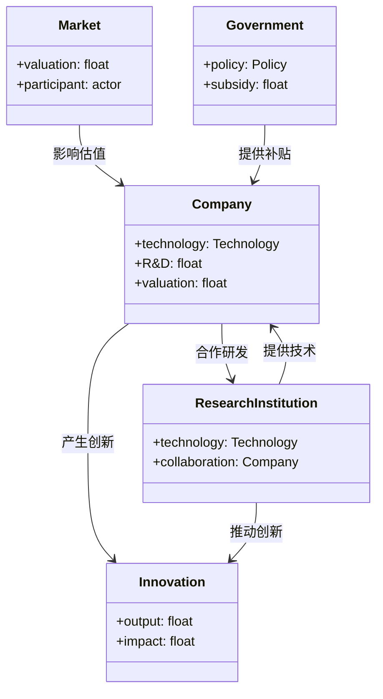
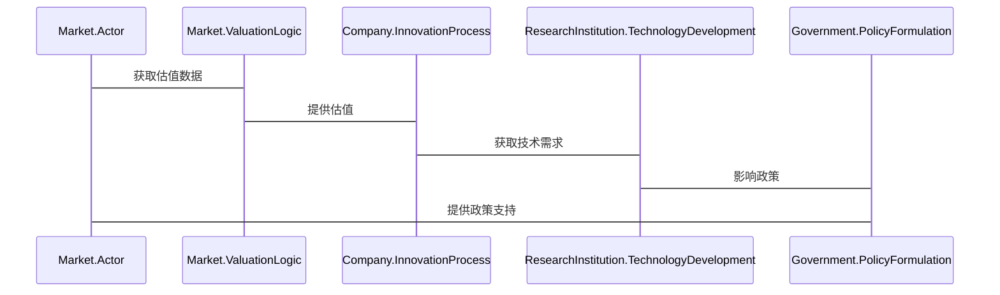

                 


---

# 股市估值差异对国际创新生态系统的影响

> 关键词：股市估值差异、国际创新生态系统、创新主体、资源配置、市场机制

> 摘要：本文探讨了股市估值差异对国际创新生态系统的影响，分析了估值差异的形成机制及其对创新资源分配、创新主体行为和创新环境的影响。通过理论分析、案例研究和系统设计，本文提出了一种量化分析的方法，并展示了如何通过系统优化来应对估值差异带来的挑战。

---

## 第1章 背景介绍

### 1.1 股市估值差异与国际创新生态系统概述

#### 1.1.1 股市估值的基本概念
股市估值是投资者对上市公司未来价值的评估，常用的指标包括市盈率（P/E）、市净率（P/B）等。这些指标反映了市场对公司的未来预期和风险偏好。

#### 1.1.2 估值差异的形成机制
估值差异源于市场信息不对称、投资者情绪波动和市场结构差异。例如，不同市场的投资者对科技公司的估值可能因技术创新预期不同而产生差异。

#### 1.1.3 国际创新生态系统的核心概念
国际创新生态系统由企业、研究机构、政府、投资者等多个主体构成，共同推动技术创新和知识共享。

### 1.2 问题背景与研究意义
#### 1.2.1 股市估值差异的现状分析
近年来，科技股的估值波动较大，尤其是在新兴市场与成熟市场的估值差异显著。这种差异影响了创新资源的分配。

#### 1.2.2 创新生态系统的重要性
创新生态系统是推动技术进步和社会经济发展的关键。创新主体之间的互动决定了创新的效率和方向。

#### 1.2.3 研究的必要性与意义
理解股市估值差异对创新生态系统的影响，有助于优化资源配置，促进技术创新。

### 1.3 问题描述与解决路径
#### 1.3.1 估值差异对创新的影响
估值差异可能导致创新资源向估值较高的地区集中，影响创新活动的均衡发展。

#### 1.3.2 创新生态系统中的关键问题
创新主体的行为、资源配置的效率、创新环境的稳定性是影响创新生态系统的重要因素。

#### 1.3.3 解决问题的初步思路
通过量化分析和系统优化，提出应对估值差异的策略，促进创新生态的健康发展。

---

## 第2章 核心概念与联系

### 2.1 股市估值差异的原理

#### 2.1.1 估值差异的经济学解释
市场信息不对称导致投资者对同一公司的估值不同。例如，科技公司的未来收益难以准确预测，导致估值差异。

#### 2.1.2 市场机制与信息不对称
市场的价格发现机制需要克服信息不对称，但估值差异反映了这种不对称的存在。

### 2.2 创新生态系统的核心要素

#### 2.2.1 创新主体：企业、研究机构、政府
企业是创新的主要驱动力，研究机构提供技术支持，政府通过政策引导创新方向。

#### 2.2.2 创新资源：资金、人才、技术
资金是推动创新的关键，人才是创新的核心力量，技术是创新的成果。

#### 2.2.3 创新环境：政策、文化、基础设施
良好的政策环境和基础设施是创新生态系统的重要支撑。

### 2.3 估值差异与创新生态的关系

#### 2.3.1 估值差异对创新主体的影响
高估值可能导致过度投资，低估值可能导致资源分配不足。例如，新兴市场的科技公司可能因估值过低而难以获得足够的研发资金。

#### 2.3.2 创新资源的分配机制
估值差异影响资本流向，高估值的公司可能吸引更多的资金，而低估值的公司可能被忽视。

#### 2.3.3 创新环境的调节作用
政府政策可以调节估值差异，通过税收优惠和补贴引导创新资源的合理分配。

### 2.4 概念属性对比表

| 概念       | 属性             | 详细描述                                |
|------------|------------------|----------------------------------------|
| 股市估值差异 | 形成原因         | 信息不对称、投资者情绪、市场结构差异    |
| 创新生态系统 | 核心要素         | 企业、研究机构、政府、资金、人才、技术、政策环境 |
| 影响机制     | 直接影响         | 资源分配、创新主体行为                  |
| 间接影响     | 创新环境稳定性     | 政策调整、市场信心                      |

### 2.5 ER实体关系图

```mermaid
erDiagram
    investor <-> company : 持股关系
    company --> innovation : 产生创新
    government --> policy : 制定政策
    research_institution --> technology : 开发技术
    market --> valuation : 形成估值
    innovation --> economic_growth : 推动经济增长
```

---

## 第3章 估值差异的量化分析

### 3.1 估值差异的计算方法

#### 3.1.1 市盈率计算
$$ \text{市盈率} = \frac{\text{股价}}{\text{每股收益}} $$

#### 3.1.2 市净率计算
$$ \text{市净率} = \frac{\text{股价}}{\text{每股净资产}} $$

### 3.2 创新能力的评估模型

#### 3.2.1 创新能力评估维度
- 技术研发能力
- 市场竞争力
- 创新成果数量

#### 3.2.2 基于估值差异的创新能力指数
$$ IC = \alpha \cdot VD + \beta \cdot TR + \gamma \cdot MC $$
其中，IC为创新能力指数，VD为估值差异，TR为技术研发投入，MC为市场竞争力，$\alpha, \beta, \gamma$为权重系数。

### 3.3 数学模型与公式

#### 3.3.1 估值差异对创新产出的影响
$$ VD = \beta \cdot IC + \epsilon $$
其中，VD为估值差异，IC为创新能力，$\epsilon$为误差项。

#### 3.3.2 创新能力对经济增长的促进作用
$$ GDP = \delta \cdot IC + \gamma \cdot VD + \zeta $$

### 3.4 举例说明

#### 3.4.1 科技公司A的估值差异分析
假设科技公司A的市盈率为30，行业平均市盈率为20，其估值差异为10。这种差异可能反映了市场对其技术创新的高度认可。

#### 3.4.2 创新能力提升的具体案例
通过提升技术研发能力，科技公司B的创新能力指数提高了15%，带动了估值差异的缩小和创新产出的增加。

---

## 第4章 系统分析与架构设计

### 4.1 问题场景介绍

#### 4.1.1 当前问题
股市估值差异可能导致创新资源分配不均，影响创新生态系统的健康发展。

#### 4.1.2 系统目标
构建一个量化分析模型，优化创新资源的配置，降低估值差异对创新的负面影响。

### 4.2 系统功能设计

#### 4.2.1 领域模型
使用Mermaid绘制创新生态系统的类图，展示各主体之间的关系。



### 4.3 系统架构设计

#### 4.3.1 系统架构图


### 4.4 系统接口设计

#### 4.4.1 主要接口
- Market API：提供估值数据
- Company API：提供创新数据
- ResearchInstitution API：提供技术数据

### 4.5 系统交互设计

#### 4.5.1 序列图



---

## 第5章 项目实战

### 5.1 环境安装

#### 5.1.1 安装Python和相关库
```bash
pip install numpy pandas matplotlib
```

### 5.2 核心实现

#### 5.2.1 估值差异计算代码
```python
import numpy as np
import pandas as pd

def calculate_valuation_difference(stock_data):
    pe = stock_data['PE']
    industry_pe = np.mean(stock_data['Industry_PE'])
    return pe - industry_pe

# 示例数据
data = {
    'PE': [30, 25, 20],
    'Industry_PE': [20, 20, 20]
}
df = pd.DataFrame(data)
vd = calculate_valuation_difference(df)
print(vd)
```

#### 5.2.2 创新能力评估模型
```python
def calculate创新能力_index(companies):
    ic_index = []
    for company in companies:
        vd = company['valuation_difference']
        tr = company['R&D投入']
        mc = company['市场竞争力']
        ic = 0.4 * vd + 0.3 * tr + 0.3 * mc
        ic_index.append(ic)
    return ic_index

companies = [
    {'valuation_difference': 5, 'R&D投入': 10, '市场竞争力': 8},
    {'valuation_difference': 3, 'R&D投入': 12, '市场竞争力': 6}
]
ic_index = calculate_创新能力_index(companies)
print(ic_index)
```

### 5.3 案例分析

#### 5.3.1 科技公司估值差异分析
分析科技公司A和B的估值差异，评估其创新能力，并提出优化建议。

### 5.4 分析与解读

#### 5.4.1 代码功能分析
代码展示了如何量化计算估值差异和创新能力指数，帮助识别高潜力的创新主体。

#### 5.4.2 案例分析结果
通过案例分析，得出估值差异对创新产出的具体影响，并提出应对策略。

### 5.5 项目小结

#### 5.5.1 核心成果
- 量化分析模型
- 系统优化建议

#### 5.5.2 实践意义
帮助投资者和政策制定者优化资源配置，促进创新生态系统的健康发展。

---

## 第6章 最佳实践与总结

### 6.1 最佳实践 tips

#### 6.1.1 量化分析的重要性
定期进行估值差异分析，优化创新资源配置。

#### 6.1.2 系统优化建议
通过政策引导和技术手段，降低估值差异对创新的负面影响。

### 6.2 小结

#### 6.2.1 核心观点回顾
股市估值差异显著影响国际创新生态系统，需通过量化分析和系统优化应对挑战。

### 6.3 注意事项

#### 6.3.1 数据质量
确保数据准确，避免信息不对称带来的偏差。

#### 6.3.2 模型局限性
量化模型需结合实际情况，避免过度简化。

### 6.4 拓展阅读

#### 6.4.1 相关文献
推荐阅读《创新生态系统的构建与优化》和《金融市场与技术创新》。

---

## 作者：AI天才研究院 & 禅与计算机程序设计艺术

---

本文通过系统分析和案例研究，深入探讨了股市估值差异对国际创新生态系统的影响，提出了量化分析的方法和系统优化的建议。希望本文能为投资者、政策制定者和创新主体提供有价值的参考，促进国际创新生态系统的健康发展。

