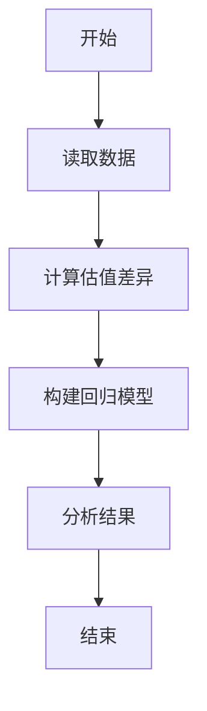

                 


# 股市估值差异对国际医疗旅游的影响

> **关键词**：股市估值差异、国际医疗旅游、经济波动、医疗服务供给、消费者行为  
> **摘要**：本文探讨了股市估值差异对国际医疗旅游的影响，从经济波动、消费者行为、市场供给等角度分析了股市估值差异如何影响国际医疗旅游市场的供需关系。通过数学模型和系统架构设计，本文提出了应对策略，并展望了未来趋势。

---

## 第1章: 股市估值差异与国际医疗旅游的背景与概念

### 1.1 股市估值差异的基本概念

#### 1.1.1 股票市场的基本概念
股票市场是投资者交易公司股份的场所，股票价格反映了市场对公司的估值。股市估值差异指同一资产在不同时间、不同市场或不同投资者之间的价格差异。

#### 1.1.2 估值差异的定义与特征
估值差异是由于市场信息不对称、投资者情绪波动和市场结构差异导致的同一资产在不同市场或不同时间的定价差异。

#### 1.1.3 国际医疗旅游的定义与范围
国际医疗旅游指患者跨国寻求医疗服务的行为，涵盖体检、治疗、康复等多种形式。

### 1.2 股市估值差异的影响因素

#### 1.2.1 经济周期与市场波动
经济周期波动直接影响股市估值，进而影响医疗旅游的需求和供给。

#### 1.2.2 公司基本面与市场情绪
公司基本面（如盈利能力）和市场情绪（如投资者信心）共同决定股票估值，影响医疗服务的成本和可及性。

#### 1.2.3 宏观经济政策与市场预期
政府政策和宏观经济指标（如GDP、利率）影响股市估值，间接影响医疗旅游市场。

### 1.3 国际医疗旅游的发展现状

#### 1.3.1 全球医疗旅游市场的规模与趋势
全球医疗旅游市场年增长率为8%~10%，主要驱动力包括医疗技术进步和医疗费用差异。

#### 1.3.2 主要医疗旅游目的地国家分析
泰国、印度、瑞士、美国等国家因医疗技术先进、费用合理而成为主要目的地。

#### 1.3.3 医疗旅游的主要驱动因素
医疗费用差异、医疗技术优势和旅游便利性是推动国际医疗旅游的主要因素。

---

## 第2章: 股市估值差异对国际医疗旅游的影响机制

### 2.1 股市估值差异对医疗旅游供给的影响

#### 2.1.1 医疗服务价格的波动性
股市估值差异导致医疗服务成本波动，影响医院定价策略。

#### 2.1.2 医疗服务质量和供给能力
估值差异影响医院投资意愿，进而影响服务质量和服务能力。

#### 2.1.3 医疗旅游市场的竞争格局
股市波动可能导致部分医院因资金不足退出市场，影响市场供给结构。

### 2.2 股市估值差异对医疗旅游需求的影响

#### 2.2.1 消费者行为与价格敏感性
股市波动影响消费者收入和风险偏好，进而影响医疗旅游需求。

#### 2.2.2 投资者对医疗旅游的影响
投资者通过股市投资影响医疗服务供给，间接影响医疗旅游市场。

#### 2.2.3 经济不确定性与医疗旅游需求
经济不确定性增加时，消费者可能减少非必要的医疗旅游支出。

### 2.3 股市估值差异对医疗旅游市场结构的综合影响

#### 2.3.1 价格弹性与市场均衡
价格弹性影响医疗旅游市场的供需匹配，股市估值差异影响市场均衡点。

#### 2.3.2 供需匹配与市场效率
股市估值差异可能导致市场信息不对称，影响供需匹配效率。

#### 2.3.3 风险偏好与市场参与度
投资者风险偏好影响股市估值，进而影响医疗旅游市场的参与度。

---

## 第3章: 国际医疗旅游市场的系统分析与架构设计

### 3.1 医疗旅游市场的系统构成

#### 3.1.1 服务提供者（医院、诊所）
医院和诊所提供医疗服务，其定价和供给能力受股市估值影响。

#### 3.1.2 消费者（患者）
患者的医疗需求受收入、价格和健康状况影响。

#### 3.1.3 中介机构（旅行社、保险）
旅行社和保险公司协调医疗服务和患者需求，受股市估值影响。

### 3.2 医疗旅游市场的功能需求

#### 3.2.1 信息匹配功能
系统需匹配患者需求与医疗服务供给，考虑价格和质量因素。

#### 3.2.2 价格比较功能
患者需比较不同医疗机构的价格，受股市估值差异影响。

#### 3.2.3 风险评估功能
系统需评估医疗旅游的风险，包括经济和健康风险。

### 3.3 医疗旅游市场的架构设计

#### 3.3.1 服务提供者的角色与责任
医院和诊所需根据股市估值调整服务价格和供给能力。

#### 3.3.2 消费者的决策过程
患者根据股市估值差异选择医疗旅游目的地。

#### 3.3.3 中介机构的协调作用
旅行社和保险公司需协调供需，受股市波动影响。

### 3.4 系统接口与交互设计

#### 3.4.1 服务提供者与消费者之间的接口
包括价格查询、服务预订等功能。

#### 3.4.2 中介机构与消费者之间的接口
包括旅游套餐推荐、保险购买等功能。

#### 3.4.3 系统的交互流程
患者通过系统查询医院信息，预订服务，支付费用。

---

## 第4章: 股市估值差异对国际医疗旅游的数学模型分析

### 4.1 股市估值差异的数学模型

#### 4.1.1 估值差异的计算公式
$$ \text{估值差异} = \text{市场价} - \text{内在价值} $$

#### 4.1.2 市场波动对估值差异的影响
使用回归模型分析市场波动对估值差异的影响。

### 4.2 国际医疗旅游需求的数学模型

#### 4.2.1 需求函数
$$ D = \alpha + \beta \cdot V + \gamma \cdot P + \epsilon $$
其中，$D$为需求量，$V$为估值差异，$P$为价格。

#### 4.2.2 供给函数
$$ S = \beta + \gamma \cdot C + \delta \cdot V + \epsilon $$
其中，$S$为供给量，$C$为成本。

### 4.3 算法原理

#### 4.3.1 算法流程图


#### 4.3.2 Python代码实现
```python
import pandas as pd
import statsmodels.api as sm

# 读取数据
data = pd.read_csv('medical_tourism.csv')

# 计算估值差异
data['valuation_diff'] = data['market_price'] - data['intrinsic_value']

# 构建回归模型
model = sm.OLS(data['demand'], sm.add_constant(data[['valuation_diff', 'price']]))
result = model.fit()

# 输出结果
print(result.summary())
```

---

## 第5章: 应对策略与未来趋势

### 5.1 应对策略

#### 5.1.1 政府政策
政府需通过政策调控稳定股市，降低估值差异对医疗旅游的影响。

#### 5.1.2 医疗机构的应对措施
医疗机构需灵活调整价格和供给策略，应对股市波动。

#### 5.1.3 投资者的应对策略
投资者需理性投资，分散风险，降低股市波动对医疗旅游市场的影响。

### 5.2 未来趋势

#### 5.2.1 技术驱动的医疗旅游
人工智能和大数据技术将改变医疗旅游的供需匹配方式。

#### 5.2.2 可持续发展
绿色医疗和可持续旅游将成为未来医疗旅游的重要趋势。

#### 5.2.3 全球化与本地化结合
医疗旅游将更加注重本地化服务，同时利用全球化资源。

---

## 结语

股市估值差异对国际医疗旅游的影响是一个复杂的系统问题。通过数学模型和系统架构设计，我们可以更好地理解这一现象，并制定有效的应对策略。未来，随着技术进步和政策优化，医疗旅游市场将更加高效和可持续。

---

**作者：AI天才研究院/AI Genius Institute & 禅与计算机程序设计艺术 /Zen And The Art of Computer Programming**

