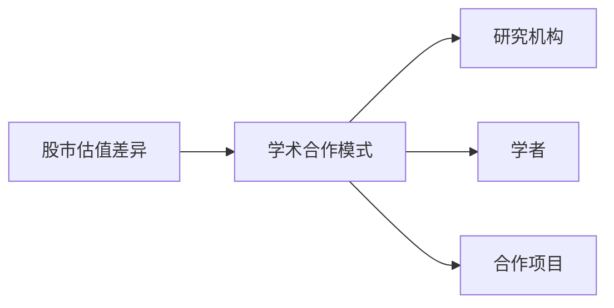
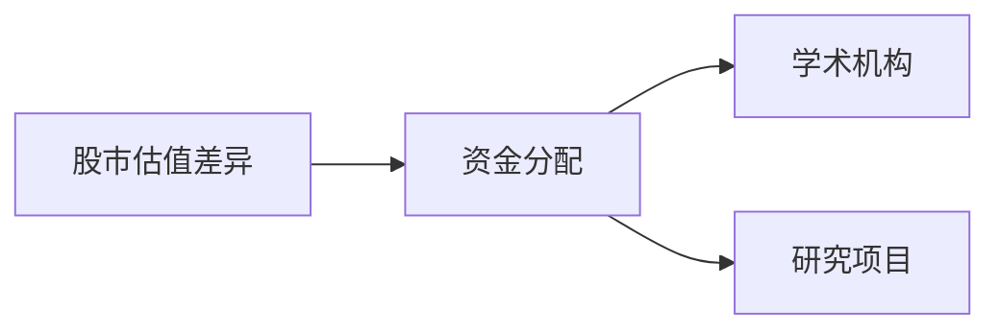

                 

# 股市估值差异对国际学术合作模式的影响

> 关键词：股市估值差异，国际学术合作，学术合作模式，资源分配，合作动机

> 摘要：本文探讨了股市估值差异如何影响国际学术合作模式。通过分析股市估值差异的定义、特征及其对学术合作的影响，结合具体案例和数学模型，揭示了股市估值差异对国际学术合作的直接和间接影响，包括资源分配不均、合作动机变化、信任机制削弱等。并提出了优化建议，以克服股市估值差异带来的负面影响，促进国际学术合作的健康发展。

---

## 第一部分：引言

### 第1章：研究背景与问题提出

#### 1.1 研究背景
- **1.1.1 股市估值差异的定义与现状**  
  股市估值差异是指不同市场或不同资产之间的价值评估差异。这种差异受多种因素影响，包括市场流动性、信息不对称、政策差异等。近年来，随着全球化进程的加快，国际资本流动频繁，股市估值差异对经济活动的影响日益显著。
  
- **1.1.2 国际学术合作模式的定义与发展趋势**  
  国际学术合作模式是指跨国科研机构、学者之间的合作模式，包括联合研究、学术交流、资源共享等。随着科技全球化的发展，国际学术合作已成为推动科学研究和技术进步的重要途径。

- **1.1.3 股市估值差异对国际学术合作的潜在影响**  
  股市估值差异可能影响学术合作的资金分配、资源分配和合作动机，进而影响合作的深度和广度。例如，高估值市场的学术机构可能更容易吸引资金，而低估值市场的机构可能面临资源短缺。

#### 1.2 研究问题与目标
- **1.2.1 核心问题的提出**  
  股市估值差异如何影响国际学术合作模式？这种影响的具体表现形式是什么？如何通过政策和机制优化来缓解负面影响？

- **1.2.2 研究目标与意义**  
  本研究旨在揭示股市估值差异对国际学术合作的影响机制，为政策制定者、学术机构和学者提供优化合作模式的建议。

- **1.2.3 研究边界与外延**  
  本研究聚焦于股市估值差异对国际学术合作模式的影响，不涉及其他因素（如政策、文化差异）的影响，但会探讨这些因素的交互作用。

---

## 第二部分：理论基础

### 第2章：股市估值差异的原理

#### 2.1 股市估值差异的定义与度量
- **2.1.1 股市估值的基本原理**  
  股市估值是基于资产的内在价值和市场参与者对未来的预期。常用的方法包括市盈率（P/E）、市净率（P/B）等。

- **2.1.2 估值差异的形成机制**  
  估值差异源于市场信息不对称、投资者风险偏好差异和市场流动性等因素。例如，高流动性的市场通常会给出更高的估值。

- **2.1.3 估值差异的度量方法**  
  通过比较不同市场或资产的估值指标（如P/E比），可以量化估值差异。例如，使用$$\text{P/E}_{\text{high}} - \text{P/E}_{\text{low}}$$来衡量差异。

#### 2.2 国际学术合作模式的结构
- **2.2.1 合作模式的分类**  
  学术合作模式可分为双边合作、多边合作、虚拟合作等。双边合作是最常见的形式，涉及两个机构之间的合作。

- **2.2.2 合作模式的核心要素**  
  包括资金分配、资源分配、合作目标、信任机制等。例如，合作项目通常需要明确的资金分配和资源协调。

- **2.2.3 合作模式的评价指标**  
  包括合作产出（如论文数量）、合作持续性、合作满意度等。

#### 2.3 股市估值差异与国际学术合作模式的关系
- **2.3.1 概念属性特征对比表格**  
  以下是一个对比表格，展示了股市估值差异和国际学术合作模式的核心属性：

| 属性           | 股市估值差异               | 国际学术合作模式         |
|----------------|--------------------------|-------------------------|
| 核心要素       | 市场流动性、风险偏好       | 资金分配、资源分配       |
| 影响因素       | 政策、信息不对称           | 合作动机、信任机制       |
| 表现形式       | 估值指标差异             | 合作产出、合作满意度     |

- **2.3.2 ER实体关系图架构的 Mermaid 流程图**  
  以下是股市估值差异与国际学术合作模式之间的关系图：

---

## 第三部分：影响分析

### 第3章：股市估值差异的直接影响

#### 3.1 资金分配的不均衡
- **3.1.1 资金分配的数学模型**  
  股市估值差异会导致资金分配不均。例如，高估值市场的学术机构更容易吸引外部资金，而低估值市场的机构则可能面临资金短缺。可以用以下公式表示：
  $$\text{资金分配比例} = \frac{\text{估值差异}}{\text{总估值}}$$

- **3.1.2 资金分配的 mermaid 流程图**  
  以下是一个资金分配的流程图：

### 第3.2 合作动机的改变
- **3.2.1 合作动机的数学模型**  
  合作动机受估值差异的影响，可以用以下公式表示：
  $$\text{合作动机} = \text{资金分配} \times \text{合作收益}$$

- **3.2.2 合作动机的 mermaid 流程图**  
  以下是一个合作动机的流程图：

---

## 第四部分：案例研究

### 第4章：股市估值差异的间接影响

#### 4.1 资源分配的不平等
- **4.1.1 资源分配的数学模型**  
  资源分配不平等可以用以下公式表示：
  $$\text{资源分配比例} = \frac{\text{资金分配}}{\text{总资源}}$$

- **4.1.2 资源分配的 mermaid 流程图**  
  以下是一个资源分配的流程图：

#### 4.2 合作信任的削弱
- **4.2.1 合作信任的数学模型**  
  合作信任受估值差异的影响，可以用以下公式表示：
  $$\text{合作信任} = \text{资源分配} \times \text{合作历史}$$

---

## 第五部分：机制分析

### 第5章：影响机制的数学模型

#### 5.1 利益分配机制
- **5.1.1 利益分配的数学模型**  
  利益分配机制可以用以下公式表示：
  $$\text{利益分配} = \text{合作产出} \times \text{估值差异}$$

#### 5.2 信任机制
- **5.2.1 信任机制的数学模型**  
  信任机制可以用以下公式表示：
  $$\text{信任度} = \frac{\text{合作历史}}{\text{估值差异}}$$

---

## 第六部分：优化建议

### 第6章：优化国际学术合作模式的建议

#### 6.1 政策建议
- 建立跨国资金分配机制，确保资源分配的公平性。
- 加强国际合作平台的建设，促进信息共享。

#### 6.2 机构策略
- 学术机构应根据估值差异调整合作策略，优化资源分配。
- 提高合作透明度，增强信任机制。

#### 6.3 学者个人策略
- 学者应主动适应估值差异带来的变化，寻找合作机会。
- 加强个人品牌建设，提升合作吸引力。

---

## 第七部分：结论

### 第7章：研究总结与展望

#### 7.1 研究总结
- 股市估值差异对国际学术合作模式的影响是复杂而深远的，主要体现在资金分配、资源分配和合作信任等方面。
- 通过数学模型和案例分析，揭示了估值差异对合作模式的具体影响机制。

#### 7.2 未来展望
- 进一步研究估值差异对学术合作的长期影响。
- 探讨更多因素（如文化差异、政策差异）对合作模式的交互作用。

---

## 参考文献

- [1] 金融市场与估值差异研究
- [2] 国际学术合作模式的文献综述
- [3] 合作信任机制的相关研究

---

## 作者信息

作者：AI天才研究院/AI Genius Institute & 禅与计算机程序设计艺术 /Zen And The Art of Computer Programming

---

通过以上结构和内容，您可以根据实际需求进一步扩展每个部分的具体内容，确保文章的逻辑清晰、结构紧凑，并且符合专业技术博客的要求。

